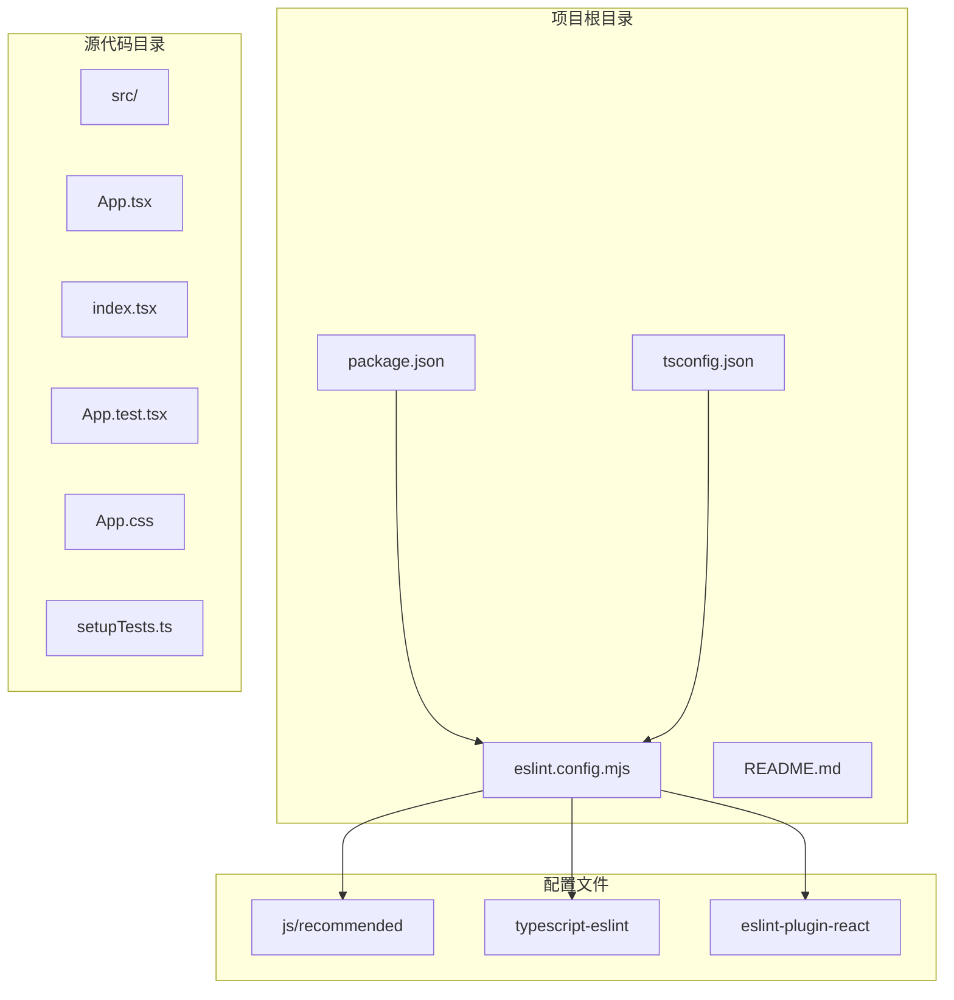
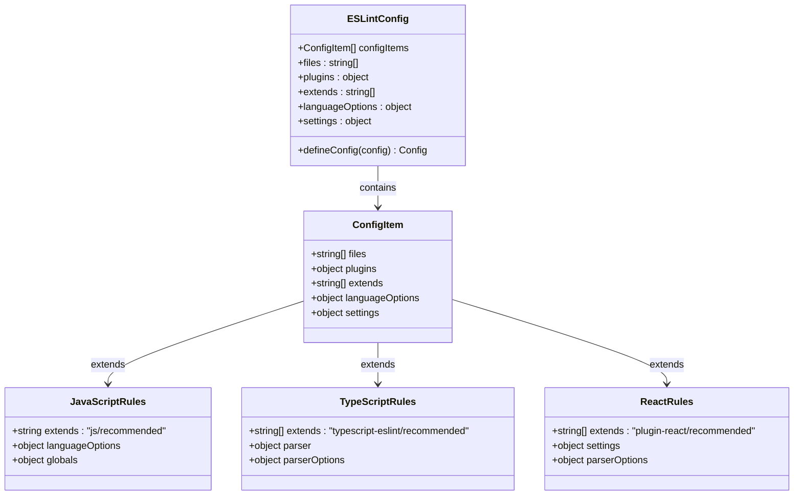
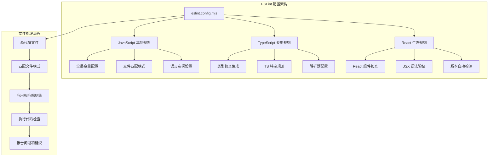
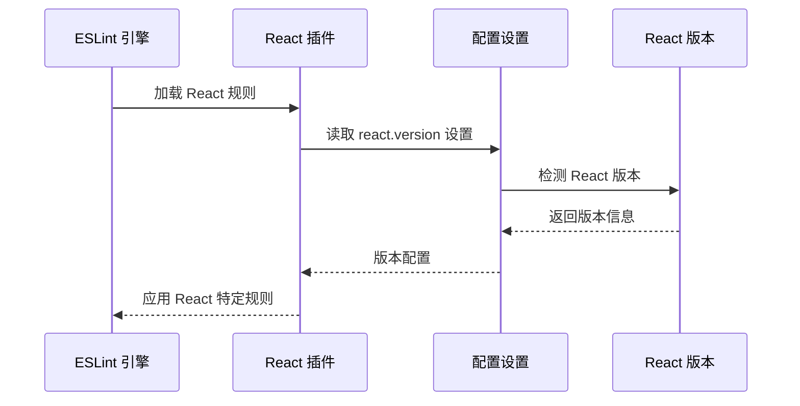
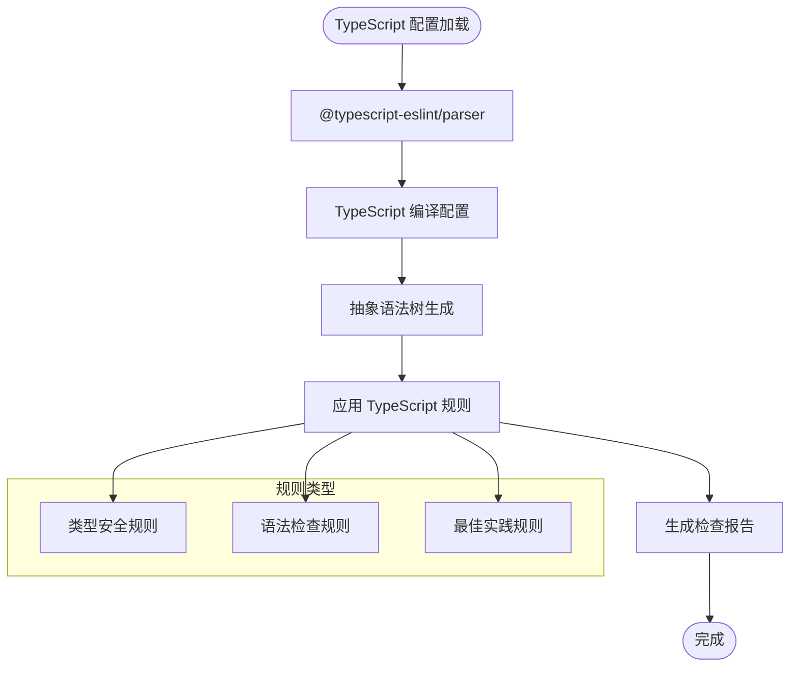

# ESLint 代码质量检查

<cite>
**本文档引用的文件**
- [eslint.config.mjs](file://eslint.config.mjs)
- [package.json](file://package.json)
- [README.md](file://README.md)
- [tsconfig.json](file://tsconfig.json)
- [src/App.tsx](file://src/App.tsx)
- [src/index.tsx](file://src/index.tsx)
- [src/App.test.tsx](file://src/App.test.tsx)
</cite>

## 目录
1. [简介](#简介)
2. [项目结构](#项目结构)
3. [核心组件](#核心组件)
4. [架构概览](#架构概览)
5. [详细组件分析](#详细组件分析)
6. [依赖关系分析](#依赖关系分析)
7. [性能考虑](#性能考虑)
8. [故障排除指南](#故障排除指南)
9. [结论](#结论)
10. [附录](#附录)

## 简介

本项目采用现代化的 ESLint 配置系统，通过 flat config 格式实现统一的代码质量检查。该配置文件 `eslint.config.mjs` 集成了 JavaScript、TypeScript 和 React 生态系统的最佳实践，为 React Next.js 应用提供了全面的代码质量保障。

ESLint 配置的核心目标是：
- 统一团队代码风格和质量标准
- 提前发现潜在的代码问题
- 提供智能的代码修复建议
- 支持 TypeScript 和 React 的特殊语法检查

## 项目结构

该项目采用标准的 React Next.js 项目结构，ESLint 配置位于项目根目录，与主要开发工具配置文件并列：



**图表来源**
- [eslint.config.mjs:1-23](file://eslint.config.mjs#L1-L23)
- [package.json:1-55](file://package.json#L1-L55)

**章节来源**
- [eslint.config.mjs:1-23](file://eslint.config.mjs#L1-L23)
- [package.json:1-55](file://package.json#L1-L55)

## 核心组件

### ESLint 配置文件结构

ESLint 配置文件采用现代的 flat config 格式，通过 `defineConfig` 函数组织多个配置段落：



**图表来源**
- [eslint.config.mjs:7-22](file://eslint.config.mjs#L7-L22)

### 主要配置段落

配置文件包含三个主要配置段落，每个都有特定的职责范围：

1. **JavaScript/TypeScript 基础规则** (`js/recommended`)
2. **TypeScript 专用规则** (`typescript-eslint/recommended`)
3. **React 生态系统规则** (`eslint-plugin-react/recommended`)

**章节来源**
- [eslint.config.mjs:7-22](file://eslint.config.mjs#L7-L22)

## 架构概览

ESLint 配置的整体架构体现了分层设计原则，确保不同类型文件得到适当的规则覆盖：



**图表来源**
- [eslint.config.mjs:8-22](file://eslint.config.mjs#L8-L22)

## 详细组件分析

### 文件匹配和全局变量配置

配置文件的核心特性之一是精确的文件匹配模式和全局变量设置：

#### 文件匹配模式

配置使用通配符模式匹配多种文件类型：
- JavaScript: `.js`, `.mjs`, `.cjs`
- TypeScript: `.ts`, `.mts`, `.cts`
- JSX: `.jsx`, `.tsx`

这种设计确保了所有前端代码都能得到适当的检查，包括传统的 JavaScript 文件和现代的 TypeScript 文件。

#### 全局变量配置

通过 `globals.browser` 配置，ESLint 能够识别浏览器环境中的全局变量：
- DOM API (如 `window`, `document`)
- Web API (如 `fetch`, `localStorage`)
- 浏览器事件对象

**章节来源**
- [eslint.config.mjs:9-12](file://eslint.config.mjs#L9-L12)

### React 插件配置

React 插件的配置包含了关键的版本检测机制：



**图表来源**
- [eslint.config.mjs:14-18](file://eslint.config.mjs#L14-L18)

**章节来源**
- [eslint.config.mjs:14-18](file://eslint.config.mjs#L14-L18)

### TypeScript 集成配置

TypeScript 配置通过 `typescript-eslint` 包提供的推荐规则集实现：



**图表来源**
- [eslint.config.mjs:20](file://eslint.config.mjs#L20)

**章节来源**
- [eslint.config.mjs:20](file://eslint.config.mjs#L20)

### 开发依赖和工具链

项目使用现代的开发工具链，确保 ESLint 配置的有效性：

```mermaid
graph LR
subgraph "ESLint 生态系统"
ESL[ESLint 核心]
JS[@eslint/js]
TS[typescript-eslint]
REACT[eslint-plugin-react]
GL[globals]
end
subgraph "项目集成"
PKG[package.json]
CFG[eslint.config.mjs]
TSJ[tsconfig.json]
end
PKG --> ESL
PKG --> JS
PKG --> TS
PKG --> REACT
PKG --> GL
ESL --> CFG
JS --> CFG
TS --> CFG
REACT --> CFG
GL --> CFG
TSJ --> TS
```

**图表来源**
- [package.json:45-53](file://package.json#L45-L53)

**章节来源**
- [package.json:45-53](file://package.json#L45-L53)

## 依赖关系分析

ESLint 配置的依赖关系体现了现代前端开发的最佳实践：

```mermaid
graph TB
subgraph "核心依赖"
ESL[eslint ^10.4.0]
JS[@eslint/js ^10.0.1]
TS[typescript-eslint ^8.59.3]
REACT[eslint-plugin-react ^7.37.5]
end
subgraph "辅助依赖"
GL[globals ^17.6.0]
TSP[@typescript-eslint/parser ^8.59.3]
TSE[@typescript-eslint/eslint-plugin ^8.59.3]
end
subgraph "项目集成"
EC[eslint.config.mjs]
PJ[package.json]
TC[tsconfig.json]
end
ESL --> EC
JS --> EC
TS --> EC
REACT --> EC
GL --> EC
TSP --> EC
TSE --> EC
PJ --> ESL
PJ --> TS
PJ --> REACT
PJ --> GL
TC --> TSP
```

**图表来源**
- [package.json:45-53](file://package.json#L45-L53)
- [eslint.config.mjs:1-5](file://eslint.config.mjs#L1-L5)

**章节来源**
- [package.json:45-53](file://package.json#L45-L53)

## 性能考虑

ESLint 配置在性能方面的优化策略：

### 配置加载优化
- 使用 flat config 格式减少配置解析时间
- 合理的文件匹配模式避免不必要的文件扫描
- 按需加载插件和规则集

### 缓存机制
- 利用 ESLint 内置缓存功能
- 避免重复检查已修改的文件
- 合理设置缓存失效策略

### 并行处理
- 支持多进程并行检查
- 优化大型项目的检查速度
- 合理配置检查队列长度

## 故障排除指南

### 常见问题和解决方案

#### React 版本检测问题
**问题症状**: React 相关规则不生效或产生误报
**解决方案**: 
- 确保 `react.version` 设置为 `"detect"`
- 检查 React 依赖版本是否正确安装
- 验证 `eslint-plugin-react` 版本兼容性

#### TypeScript 类型检查失败
**问题症状**: TypeScript 相关规则报错但实际编译正常
**解决方案**:
- 检查 `tsconfig.json` 配置是否正确
- 确认 `@typescript-eslint/parser` 版本与 TypeScript 匹配
- 验证 TypeScript 依赖版本兼容性

#### 全局变量未识别
**问题症状**: 浏览器 API 被标记为未定义错误
**解决方案**:
- 确认 `globals.browser` 已正确配置
- 检查 `globals` 包版本是否最新
- 验证运行环境配置

#### 文件匹配问题
**问题症状**: 某些文件类型未被 ESLint 检查
**解决方案**:
- 检查文件扩展名是否包含在匹配模式中
- 验证文件路径是否在正确的目录结构下
- 确认没有 `.eslintignore` 文件排除了相关文件

**章节来源**
- [eslint.config.mjs:14-18](file://eslint.config.mjs#L14-L18)
- [package.json:45-53](file://package.json#L45-L53)

## 结论

本项目的 ESLint 配置展现了现代前端开发的最佳实践，通过合理的配置分层和工具链集成，实现了对 JavaScript、TypeScript 和 React 代码的全面质量保障。

### 主要优势
- **统一的配置格式**: 使用 flat config 格式提供更好的可维护性
- **完整的生态系统支持**: 覆盖 JavaScript、TypeScript 和 React 的所有方面
- **智能化的版本检测**: 自动适应不同版本的 React 应用
- **严格的类型安全**: 通过 TypeScript 集成确保类型级别的代码质量

### 最佳实践建议
- 定期更新 ESLint 及其插件版本
- 在团队中保持一致的配置标准
- 结合自动化工具实现持续的质量监控
- 根据项目需求调整规则严格程度

## 附录

### 配置文件完整结构参考

```mermaid
flowchart TD
Root[eslint.config.mjs] --> Export[export default]
Export --> Array[defineConfig([])]
Array --> Item1[配置项 1]
Array --> Item2[配置项 2]
Array --> Item3[配置项 3]
Item1 --> Files1["files: ['**/*.{js,mjs,cjs,ts,mts,cts,jsx,tsx}']"]
Item1 --> Plugins1["plugins: { js }"]
Item1 --> Extends1["extends: ['js/recommended']"]
Item1 --> Globals1["languageOptions: { globals: globals.browser }"]
Item1 --> Settings1["settings: { react: { version: 'detect' } }"]
Item2 --> TSCfg["tseslint.configs.recommended"]
Item3 --> ReactCfg["pluginReact.configs.flat.recommended"]
```

**图表来源**
- [eslint.config.mjs:7-22](file://eslint.config.mjs#L7-L22)

### 团队实施建议

#### 配置标准化
- 在团队项目中使用相同的 ESLint 配置文件
- 建立统一的规则集和严格程度
- 定期审查和更新配置以适应技术发展

#### 开发流程集成
- 将 ESLint 检查集成到 CI/CD 流程
- 配置 IDE 自动格式化和修复
- 建立代码审查中的质量检查标准

#### 教育和培训
- 为新成员提供 ESLint 使用指南
- 解释规则背后的设计原理
- 建立常见问题的快速解决流程