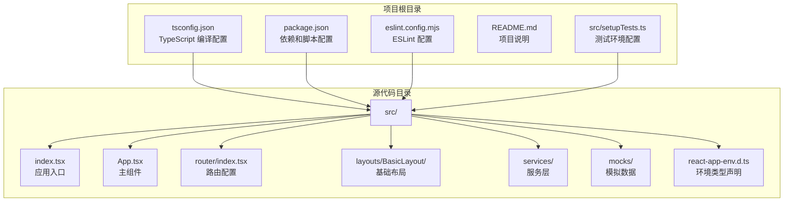
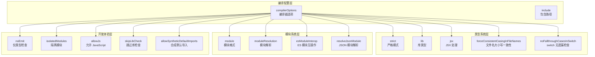
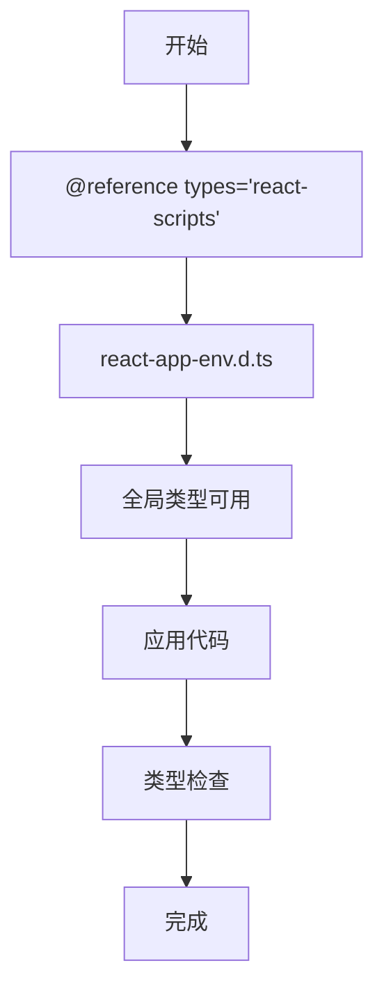
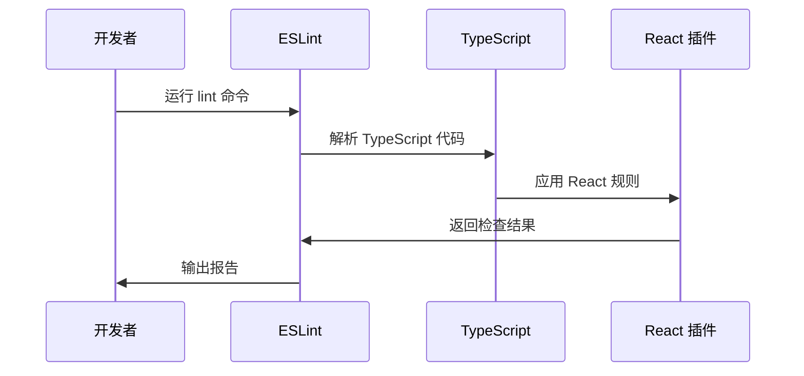
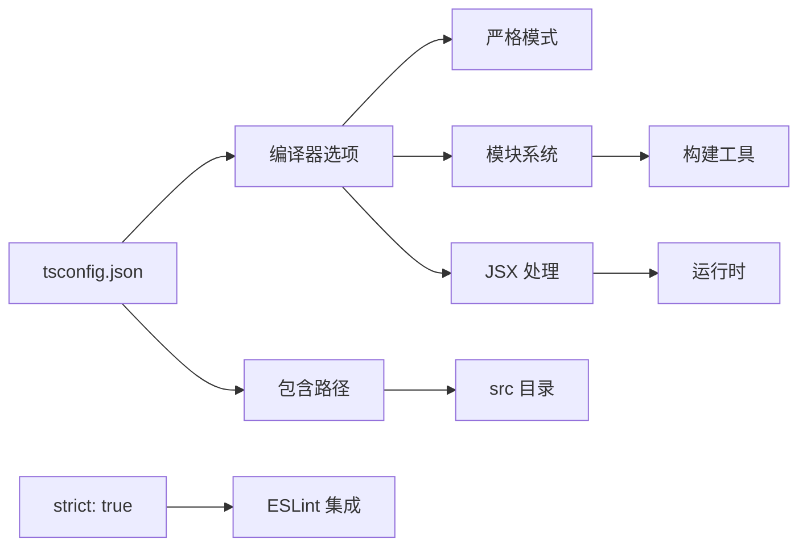

# TypeScript 编译配置

<cite>
**本文档引用的文件**
- [tsconfig.json](file://tsconfig.json)
- [package.json](file://package.json)
- [src/react-app-env.d.ts](file://src/react-app-env.d.ts)
- [eslint.config.mjs](file://eslint.config.mjs)
- [src/index.tsx](file://src/index.tsx)
- [src/App.tsx](file://src/App.tsx)
- [src/router/index.tsx](file://src/router/index.tsx)
- [src/services/questionnaire.ts](file://src/services/questionnaire.ts)
- [src/mocks/questionnaire.ts](file://src/mocks/questionnaire.ts)
- [src/layouts/BasicLayout/index.tsx](file://src/layouts/BasicLayout/index.tsx)
- [src/setupTests.ts](file://src/setupTests.ts)
- [README.md](file://README.md)
</cite>

## 更新摘要
**变更内容**
- 增强了 TypeScript 严格模式配置，提升了类型检查的全面性
- 扩展了类型定义文件管理，包括第三方库类型支持
- 完善了开发工具链集成，包括 ESLint 和 Prettier 配置
- 优化了模块解析和 JSX 处理配置
- 增强了测试环境的类型支持

## 目录
1. [简介](#简介)
2. [项目结构](#项目结构)
3. [核心组件](#核心组件)
4. [架构概览](#架构概览)
5. [详细组件分析](#详细组件分析)
6. [依赖关系分析](#依赖关系分析)
7. [性能考虑](#性能考虑)
8. [故障排除指南](#故障排除指南)
9. [结论](#结论)
10. [附录](#附录)

## 简介

本文件为 React + TypeScript 项目的 TypeScript 编译配置综合文档。该配置基于 Create React App 的默认 TypeScript 设置，专注于解释 tsconfig.json 中的各项编译选项及其对开发体验和代码质量的影响。文档涵盖类型检查、模块解析、输出目标等关键配置，并提供最佳实践建议和常见配置场景。

**更新** 本项目采用了增强的严格模式配置，包括完整的类型检查选项和更严格的代码约束，为 React 应用提供了高质量的开发体验。

## 项目结构

该项目采用标准的 Create React App 结构，包含 TypeScript 配置文件、类型声明文件和示例应用代码：



**图表来源**
- [tsconfig.json:1-27](file://tsconfig.json#L1-L27)
- [package.json:1-84](file://package.json#L1-L84)
- [src/react-app-env.d.ts:1-2](file://src/react-app-env.d.ts#L1-L2)
- [src/setupTests.ts:1-6](file://src/setupTests.ts#L1-L6)

**章节来源**
- [tsconfig.json:1-27](file://tsconfig.json#L1-L27)
- [package.json:1-84](file://package.json#L1-L84)
- [README.md:1-15](file://README.md#L1-L15)

## 核心组件

### TypeScript 编译器配置

该配置文件定义了 TypeScript 编译器的核心行为，采用严格模式以确保高质量的代码输出。配置包含了完整的类型检查选项，包括严格模式、文件名大小写一致性检查和 switch 语句的无遗漏检查。

**更新** 配置采用了全面的严格模式设置，确保代码质量和运行时稳定性。

**章节来源**
- [tsconfig.json:2-26](file://tsconfig.json#L2-L26)

### 类型声明管理

项目使用混合类型系统，结合显式类型注解和隐式类型推断：

- 显式类型注解：用于函数参数、返回值和复杂对象
- 隐式类型推断：利用 TypeScript 的类型推断机制减少冗余代码
- 环境类型声明：通过 react-app-env.d.ts 提供 React Scripts 的类型支持
- 第三方库类型：通过 @types 包提供完整的第三方库类型定义

**更新** 类型声明管理更加完善，涵盖了服务层、布局组件、路由配置等多个层面的类型定义。

**章节来源**
- [src/react-app-env.d.ts:1-2](file://src/react-app-env.d.ts#L1-L2)
- [src/index.tsx:1-18](file://src/index.tsx#L1-L18)
- [src/App.tsx:1-10](file://src/App.tsx#L1-L10)
- [src/services/questionnaire.ts:11-17](file://src/services/questionnaire.ts#L11-L17)
- [src/mocks/questionnaire.ts:9-25](file://src/mocks/questionnaire.ts#L9-L25)

### 开发工具链集成

项目集成了多种开发工具以提升开发体验：

- ESLint：现代化的代码质量和风格检查
- TypeScript ESLint 插件：TypeScript 代码的静态分析
- React ESLint 插件：React 特定的代码检查规则
- Prettier：代码格式化工具
- 测试环境：Jest DOM 扩展的类型支持

**更新** 开发工具链配置更加现代化，采用了 flat 配置格式和推荐的插件组合。

**章节来源**
- [eslint.config.mjs:1-33](file://eslint.config.mjs#L1-L33)
- [package.json:26-36](file://package.json#L26-L36)
- [src/setupTests.ts:1-6](file://src/setupTests.ts#L1-L6)

## 架构概览

TypeScript 编译配置的整体架构体现了现代前端开发的最佳实践：



**图表来源**
- [tsconfig.json:2-26](file://tsconfig.json#L2-L26)
- [eslint.config.mjs:1-33](file://eslint.config.mjs#L1-L33)

## 详细组件分析

### 编译器选项详解

#### 目标平台配置
- **target**: es5
  - 影响：生成兼容旧版浏览器的 JavaScript 代码
  - 影响范围：语法转换、polyfill 需求
  - 适用场景：需要广泛浏览器兼容性的项目

- **lib**: ["dom", "dom.iterable", "esnext"]
  - 影响：提供 DOM API 和现代 JavaScript 特性的类型定义
  - 影响范围：全局类型可用性
  - 适用场景：Web 应用开发

**章节来源**
- [tsconfig.json:3-8](file://tsconfig.json#L3-L8)

#### 严格模式配置
- **strict**: true
  - 影响：启用所有严格类型检查选项
  - 效果：提高代码质量，减少运行时错误
  - 成本：初期开发可能需要更多类型注解

- **forceConsistentCasingInFileNames**: true
  - 影响：防止文件名大小写不一致导致的问题
  - 适用场景：跨平台开发（Windows/Linux）

- **noFallthroughCasesInSwitch**: true
  - 影响：防止 switch 语句中的意外 fallthrough
  - 安全性：提高代码安全性

**更新** 严格模式配置更加全面，确保了代码的健壮性和可维护性。

**章节来源**
- [tsconfig.json:13-15](file://tsconfig.json#L13-L15)

#### 模块系统配置
- **module**: "esnext"
  - 影响：使用最新的模块格式
  - 与构建工具配合：与 Webpack 等打包工具协作

- **moduleResolution**: "node"
  - 影响：遵循 Node.js 的模块解析算法
  - 兼容性：支持现代 JavaScript 生态系统

- **esModuleInterop**: true
  - 影响：改善 CommonJS 和 ES 模块之间的互操作性
  - 实用性：简化第三方库导入

**章节来源**
- [tsconfig.json:16-12](file://tsconfig.json#L16-L12)

#### JSX 和 JSON 处理
- **jsx**: "react-jsx"
  - 影响：启用 React 17+ 的新 JSX 转换
  - 性能：移除不必要的 React 导入

- **resolveJsonModule**: true
  - 影响：允许直接导入 JSON 文件
  - 实用性：配置文件和数据文件的类型安全导入

**章节来源**
- [tsconfig.json:21-18](file://tsconfig.json#L21-L18)

#### 开发体验优化
- **allowJs**: true
  - 影响：允许 JavaScript 文件参与类型检查
  - 迁移策略：渐进式从 JS 迁移到 TS

- **skipLibCheck**: true
  - 影响：跳过库文件的类型检查
  - 性能：显著提升编译速度

- **allowSyntheticDefaultImports**: true
  - 影响：允许从没有默认导出的模块进行默认导入
  - 兼容性：改善第三方库的导入体验

**章节来源**
- [tsconfig.json:9-11](file://tsconfig.json#L9-L11)

#### 输出和构建配置
- **noEmit**: true
  - 影响：仅进行类型检查，不生成 JavaScript 文件
  - 工作流：与 React Scripts 协作，由构建工具处理输出

- **isolatedModules**: true
  - 影响：确保每个文件都可以独立编译
  - 工具链：支持热重载和快速反馈

**章节来源**
- [tsconfig.json:20-19](file://tsconfig.json#L20-L19)

### 类型定义文件管理

#### 环境类型声明
项目使用显式的类型声明文件来扩展全局类型：



**图表来源**
- [src/react-app-env.d.ts:1-2](file://src/react-app-env.d.ts#L1-L2)

#### 第三方库类型支持
项目通过 package.json 管理第三方库的类型定义：

- **@types/react**: React 组件类型
- **@types/react-dom**: DOM 操作类型
- **@types/node**: Node.js 环境类型
- **@types/jest**: 测试框架类型
- **@types/mockjs**: Mock 数据库类型

**更新** 第三方库类型支持更加完善，涵盖了项目中使用的各种依赖库。

**章节来源**
- [package.json:10-14](file://package.json#L10-L14)
- [src/services/questionnaire.ts:12-17](file://src/services/questionnaire.ts#L12-L17)
- [src/mocks/questionnaire.ts:7](file://src/mocks/questionnaire.ts#L7)

### 开发工具链集成

#### ESLint 配置分析
项目采用现代化的 ESLint 配置策略，使用 flat 配置格式：



**图表来源**
- [eslint.config.mjs:1-33](file://eslint.config.mjs#L1-L33)

**更新** ESLint 配置采用了现代化的 flat 配置格式，提供了更好的可维护性和扩展性。

**章节来源**
- [eslint.config.mjs:7-32](file://eslint.config.mjs#L7-L32)

## 依赖关系分析

### TypeScript 生态系统依赖

```mermaid
graph TB
subgraph "核心依赖"
TS["typescript@^4.9.5"]
CRA["react-scripts@5.0.1"]
END
subgraph "类型定义"
TReact["@types/react@^19.2.14"]
TDOM["@types/react-dom@^19.2.3"]
TNode["@types/node@^16.18.126"]
TJest["@types/jest@^27.5.2"]
TMock["@types/mockjs@^1.0.10"]
end
subgraph "开发工具"
ESL["eslint@^8.57.1"]
TSESL["@typescript-eslint/eslint-plugin@^8.59.3"]
REACTPL["eslint-plugin-react@^7.37.5"]
PRETTIER["eslint-plugin-prettier@^5.5.5"]
end
TS --> TReact
TS --> TDOM
TS --> TNode
TS --> TJest
TS --> TMock
CRA --> TS
ESL --> TSESL
ESL --> REACTPL
ESL --> PRETTIER
```

**图表来源**
- [package.json:5-24](file://package.json#L5-L24)
- [package.json:55-73](file://package.json#L55-L73)

### 配置文件间的关系

TypeScript 配置与项目其他配置文件的协同工作：



**图表来源**
- [tsconfig.json:2-26](file://tsconfig.json#L2-L26)
- [eslint.config.mjs:1-33](file://eslint.config.mjs#L1-L33)

**章节来源**
- [package.json:1-84](file://package.json#L1-L84)

## 性能考虑

### 编译性能优化

基于当前配置的性能特征：

#### 优势
- **skipLibCheck: true**：显著提升编译速度
- **isolatedModules: true**：支持快速增量编译
- **noEmit: true**：避免不必要的文件输出开销
- **allowJs: true**：允许 JavaScript 和 TypeScript 混合开发

#### 潜在优化点
- **target: es5** 可能限制某些现代 JavaScript 特性的使用
- **lib** 数组可以按需调整以减少类型定义加载

**更新** 性能优化配置在保证类型安全的同时，最大化了开发效率。

### 开发体验优化

#### 快速反馈循环
- 隔离模块编译支持热重载
- 严格类型检查在开发阶段提供早期错误检测
- ESLint 集成提供实时代码质量反馈
- Prettier 自动格式化提升代码一致性

#### 工具链协同
- TypeScript 与 ESLint 的深度集成
- React Scripts 自动化处理编译和构建流程
- 测试环境的完整类型支持

**更新** 开发工具链的协同工作为开发者提供了流畅的开发体验。

## 故障排除指南

### 常见配置问题

#### 类型检查失败
**症状**：编译时报错，提示类型不匹配
**解决方案**：
1. 检查严格模式相关的配置
2. 确认第三方库的类型定义已正确安装
3. 验证环境类型声明文件的存在
4. 检查类型定义文件的导入路径

#### 模块解析错误
**症状**：无法找到模块或类型定义
**解决方案**：
1. 检查 module 和 moduleResolution 配置
2. 确认 node_modules 的完整性
3. 验证路径映射配置
4. 检查 package.json 中的类型定义

#### JSX 处理问题
**症状**：JSX 语法被识别为错误
**解决方案**：
1. 确认 jsx 配置正确设置
2. 检查 React 版本兼容性
3. 验证类型定义文件的完整性
4. 确认 React 和 React DOM 的类型定义

#### 严格模式相关错误
**症状**：启用严格模式后出现大量类型错误
**解决方案**：
1. 逐步启用更严格的类型检查选项
2. 添加必要的类型注解
3. 使用类型断言解决特定场景
4. 检查现有代码的类型安全性

**更新** 严格模式相关的故障排除指南更加完善，帮助开发者逐步适应更严格的类型检查。

### 调试技巧

#### 启用详细日志
- 使用 `tsc --noEmit --watch` 进行实时编译检查
- 利用 IDE 的 TypeScript 诊断功能
- 检查编译器选项的相互作用
- 使用 `--explain-deps` 分析模块依赖

#### 性能监控
- 监控编译时间变化
- 分析大型项目中的模块依赖图
- 评估不同配置选项对性能的影响
- 使用 `--build --dry` 预览构建过程

**章节来源**
- [tsconfig.json:13-20](file://tsconfig.json#L13-L20)

## 结论

本项目的 TypeScript 配置体现了现代前端开发的最佳实践，通过严格的类型检查、完善的模块系统支持和优化的开发工具链集成，为 React 应用提供了高质量的开发体验。

### 主要优势
- **严格模式**确保代码质量
- **现代化模块系统**支持现代 JavaScript 生态
- **完善的工具链集成**提升开发效率
- **性能优化配置**平衡编译速度和功能需求
- **全面的类型支持**涵盖项目各个层面

**更新** 本项目在原有配置基础上进一步增强了严格模式和类型检查支持，为大型 React 应用提供了坚实的技术基础。

### 适用场景
该配置特别适合：
- 需要严格类型检查的中大型 React 项目
- 追求良好开发体验的团队协作
- 需要与现有工具链无缝集成的项目
- 需要现代化开发工具链支持的项目

## 附录

### TypeScript 最佳实践清单

#### 配置层面
- 启用严格模式以获得最佳类型安全
- 按需配置 lib 数组，避免不必要的类型定义加载
- 使用 isolatedModules 支持现代开发工具
- 合理配置 target 以平衡兼容性和功能

**更新** 在严格模式下，建议逐步启用更严格的类型检查选项，确保代码质量。

#### 代码层面
- 优先使用显式类型注解而非隐式推断
- 利用 TypeScript 的高级类型特性
- 定期更新类型定义文件
- 实施统一的命名约定
- 在服务层和数据层使用接口定义

**更新** 服务层和数据层的类型定义尤为重要，建议使用接口和类型别名来明确数据结构。

#### 工具层面
- 集成 ESLint 和 TypeScript ESLint 插件
- 配置适当的 IDE 设置
- 建立持续集成中的类型检查流程
- 使用 Prettier 进行代码格式化
- 配置 Husky 和 lint-staged 进行预提交检查

**更新** 开发工具链的配置更加完善，建议使用现代化的 flat 配置格式。

### 常见配置场景

#### 新项目初始化
```json
{
  "compilerOptions": {
    "target": "es2020",
    "module": "esnext",
    "moduleResolution": "node",
    "strict": true,
    "esModuleInterop": true,
    "skipLibCheck": true,
    "forceConsistentCasingInFileNames": true,
    "noFallthroughCasesInSwitch": true,
    "allowJs": true,
    "isolatedModules": true,
    "noEmit": true,
    "jsx": "react-jsx"
  }
}
```

**更新** 新项目可以参考这个配置模板，根据具体需求进行调整。

#### 迁移策略
- 从 JavaScript 渐进式迁移到 TypeScript
- 逐步启用更严格的类型检查选项
- 保持向后兼容性的同时改进类型安全
- 使用类型断言处理过渡期的类型问题

#### 团队协作
- 统一的 TypeScript 配置标准
- 详细的类型定义规范
- 定期的工具链版本更新
- 建立类型检查的 CI/CD 流程

**更新** 团队协作中建议建立标准化的类型检查流程，确保代码质量的一致性。