# 开发工具链

<cite>
**本文引用的文件**
- [eslint.config.mjs](file://eslint.config.mjs)
- [tsconfig.json](file://tsconfig.json)
- [package.json](file://package.json)
- [.prettierrc](file://.prettierrc)
- [commitlint.config.js](file://commitlint.config.js)
- [src/reportWebVitals.ts](file://src/reportWebVitals.ts)
- [src/setupTests.ts](file://src/setupTests.ts)
- [src/App.test.tsx](file://src/App.test.tsx)
- [README.md](file://README.md)
- [src/index.tsx](file://src/index.tsx)
</cite>

## 更新摘要
**变更内容**
- 新增 Prettier 代码格式化配置与集成
- 新增 CommitLint 提交信息规范配置
- 新增 Husky Git hooks 自动化检查
- 新增 lint-staged 提交前代码质量检查
- 完善 ESLint 配置以支持 Prettier 格式化规则
- 扩展开发工具链的代码质量保证体系

## 目录
1. [简介](#简介)
2. [项目结构](#项目结构)
3. [核心组件](#核心组件)
4. [架构总览](#架构总览)
5. [详细组件分析](#详细组件分析)
6. [依赖关系分析](#依赖关系分析)
7. [性能考量](#性能考量)
8. [故障排查指南](#故障排查指南)
9. [结论](#结论)
10. [附录](#附录)

## 简介
本文件系统化梳理该项目的开发工具链，覆盖以下方面：
- ESLint 配置与代码质量保障策略
- TypeScript 编译与类型检查设置
- 测试环境与测试框架配置
- Web Vitals 性能监控集成
- **Prettier 代码格式化与规范化**
- **CommitLint 提交信息规范与 Git hooks**
- **lint-staged 提交前质量检查**
- 代码质量检查、类型检查与性能监控的最佳实践
- 自定义工具配置与团队协作标准化建议

该仓库基于 Create React App（react-scripts）脚手架，同时引入了现代 ESLint 平面配置、TypeScript 支持、Prettier 格式化、CommitLint 规范化以及 Husky Git hooks，构建了完整的代码质量保证体系。

## 项目结构
项目采用标准的 Create React App 结构，关键工具链配置集中在根目录与 src 目录中：
- 根目录：包管理与构建脚本、ESLint 平面配置、TypeScript 编译配置、Prettier 格式化配置、CommitLint 规范配置
- src 目录：应用入口、Web Vitals 采集、测试初始化与示例测试用例

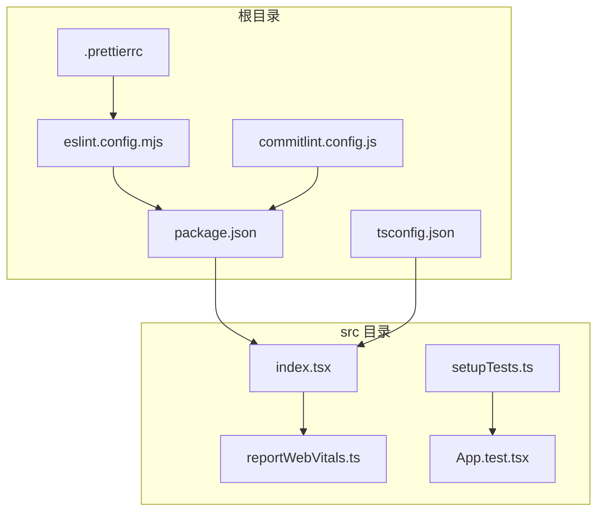

**图表来源**
- [package.json:1-84](file://package.json#L1-L84)
- [eslint.config.mjs:1-33](file://eslint.config.mjs#L1-L33)
- [tsconfig.json:1-27](file://tsconfig.json#L1-L27)
- [.prettierrc:1-9](file://.prettierrc#L1-L9)
- [commitlint.config.js:1-3](file://commitlint.config.js#L1-L3)
- [src/index.tsx:1-20](file://src/index.tsx#L1-L20)
- [src/reportWebVitals.ts:1-16](file://src/reportWebVitals.ts#L1-L16)
- [src/setupTests.ts:1-6](file://src/setupTests.ts#L1-L6)
- [src/App.test.tsx:1-10](file://src/App.test.tsx#L1-L10)

**章节来源**
- [package.json:1-84](file://package.json#L1-L84)
- [eslint.config.mjs:1-33](file://eslint.config.mjs#L1-L33)
- [tsconfig.json:1-27](file://tsconfig.json#L1-L27)
- [.prettierrc:1-9](file://.prettierrc#L1-L9)
- [commitlint.config.js:1-3](file://commitlint.config.js#L1-L3)
- [src/index.tsx:1-20](file://src/index.tsx#L1-L20)
- [src/reportWebVitals.ts:1-16](file://src/reportWebVitals.ts#L1-L16)
- [src/setupTests.ts:1-6](file://src/setupTests.ts#L1-L6)
- [src/App.test.tsx:1-10](file://src/App.test.tsx#L1-L10)

## 核心组件
- ESLint 平面配置：统一管理 JS/TS/JSX/TSX 文件的规则扩展与语言环境，集成 Prettier 格式化检查
- TypeScript 编译配置：严格模式、模块解析、JSX 处理等编译选项
- 测试环境：Jest DOM 扩展、Testing Library 集成、测试入口初始化
- Web Vitals：按需动态导入性能指标采集函数，支持回调上报
- **Prettier 格式化：统一代码风格，包括分号、引号、缩进、行宽等格式化规则**
- **CommitLint 规范：基于 Conventional Commits 规范，确保提交信息的一致性和可读性**
- **Husky Git hooks：在提交前自动执行代码检查，防止不规范代码进入版本控制**
- **lint-staged 提交前检查：只对暂存区文件执行检查，提高开发效率**
- 构建与脚本：通过 react-scripts 提供的 npm scripts 运行开发、测试、构建

**章节来源**
- [eslint.config.mjs:1-33](file://eslint.config.mjs#L1-L33)
- [tsconfig.json:1-27](file://tsconfig.json#L1-L27)
- [package.json:26-36](file://package.json#L26-L36)
- [src/reportWebVitals.ts:1-16](file://src/reportWebVitals.ts#L1-L16)
- [src/setupTests.ts:1-6](file://src/setupTests.ts#L1-L6)
- [.prettierrc:1-9](file://.prettierrc#L1-L9)
- [commitlint.config.js:1-3](file://commitlint.config.js#L1-L3)
- [package.json:75-83](file://package.json#L75-L83)

## 架构总览
下图展示了从开发到运行时的关键流程：编辑器触发 ESLint 检查与 TypeScript 类型检查；Prettier 自动格式化代码；Git 提交时通过 Husky 和 lint-staged 执行代码质量检查；测试阶段由 react-scripts 调用 Jest 与 Testing Library；生产构建由 react-scripts 完成；运行时通过 Web Vitals 采集性能指标。

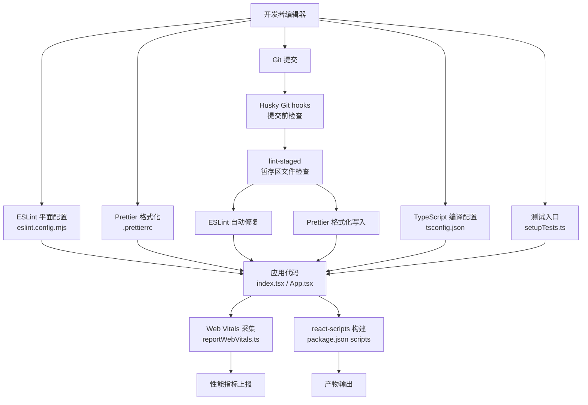

**图表来源**
- [eslint.config.mjs:1-33](file://eslint.config.mjs#L1-L33)
- [.prettierrc:1-9](file://.prettierrc#L1-L9)
- [package.json:26-36](file://package.json#L26-L36)
- [package.json:75-83](file://package.json#L75-L83)
- [tsconfig.json:1-27](file://tsconfig.json#L1-L27)
- [src/setupTests.ts:1-6](file://src/setupTests.ts#L1-L6)
- [src/index.tsx:1-20](file://src/index.tsx#L1-L20)
- [src/reportWebVitals.ts:1-16](file://src/reportWebVitals.ts#L1-L16)

## 详细组件分析

### ESLint 配置与代码质量
- 配置文件采用平面数组式结构，对所有 JS/TS/JSX/TSX 文件生效
- 统一扩展：基础 JS 推荐规则、TypeScript 推荐规则、React 推荐规则
- **Prettier 集成：通过 eslint-plugin-prettier 插件，强制执行 Prettier 格式化规则**
- 语言环境：浏览器全局变量启用，便于 React 应用开发
- **规则配置：'prettier/prettier': 'error' 强制格式化一致性**
- 建议：在团队内保持配置稳定，避免过度定制导致规则漂移；如需扩展，优先通过插件或自定义规则补充而非破坏现有推荐集

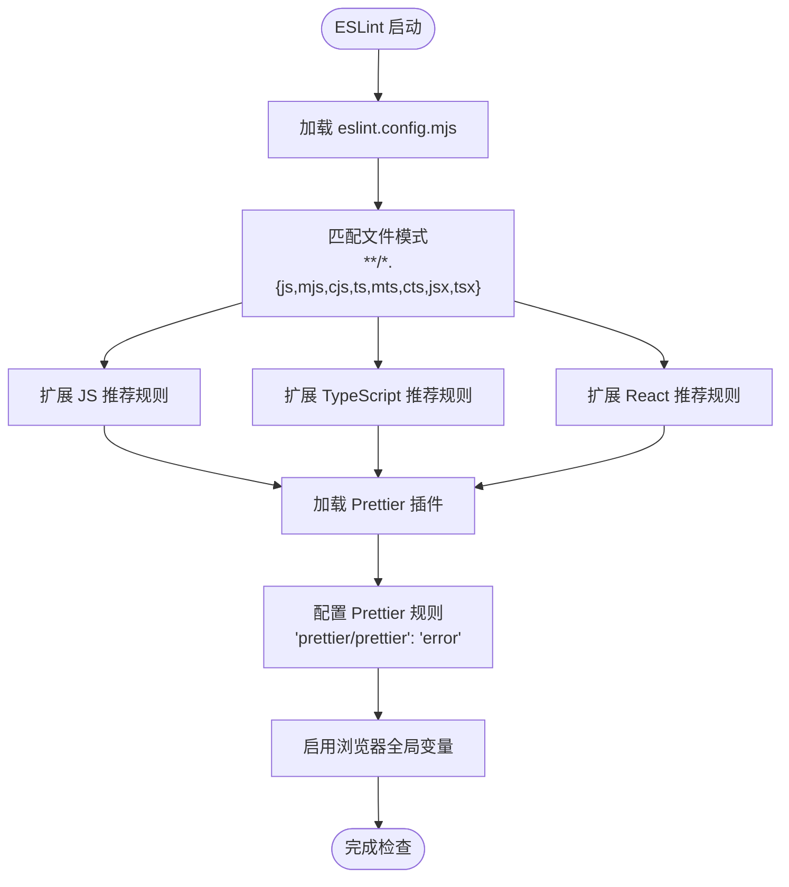

**图表来源**
- [eslint.config.mjs:15-24](file://eslint.config.mjs#L15-L24)

**章节来源**
- [eslint.config.mjs:1-33](file://eslint.config.mjs#L1-L33)

**最佳实践**
- 在 CI 中强制执行 ESLint，确保提交前发现风格与潜在问题
- 与编辑器集成自动修复（fix-on-save），减少重复劳动
- 团队约定：禁止关闭核心规则；新增规则需经评审
- **利用 Prettier 插件确保代码风格一致性，避免格式化争议**

### TypeScript 配置与类型检查
- 编译目标与库：兼容性目标与 DOM/迭代器/ESNext 库组合
- 严格模式：开启严格检查、强制文件名大小写一致、禁止 switch 漏掉分支
- 模块与解析：ESNext 模块、Node 解析策略、JSON 模块解析
- JSX：使用 React JSX 转换
- 无输出：仅进行类型检查，不生成 JS 输出，适合与 react-scripts 协作

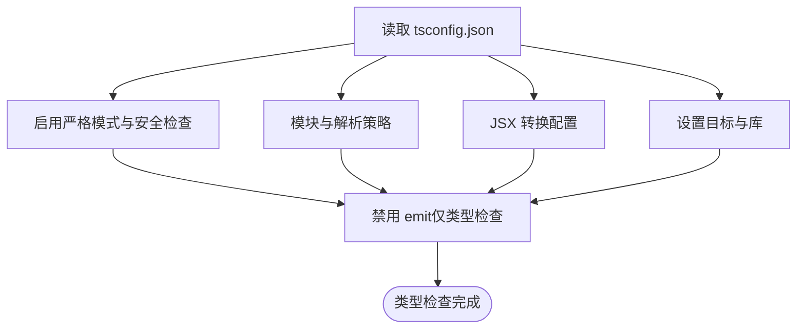

**图表来源**
- [tsconfig.json:2-22](file://tsconfig.json#L2-L22)

**章节来源**
- [tsconfig.json:1-27](file://tsconfig.json#L1-L27)

**最佳实践**
- 将严格模式视为默认开关，逐步放宽到非关键模块
- 使用 noImplicitAny 与 strictNullChecks 提升类型安全性
- 对第三方库补充缺失的类型声明时，集中放置在项目类型声明文件中

### Prettier 代码格式化
- **格式化规则：统一使用分号、单引号、2空格缩进、100字符行长、尾随逗号等规则**
- **JSX 支持：启用 JSX 单引号格式化**
- **集成方式：通过 ESLint 插件与 Prettier 配置文件配合使用**
- **自动修复：在 lint-staged 中自动格式化不符合规范的代码**
- **配置文件：.prettierrc 提供统一的格式化标准**

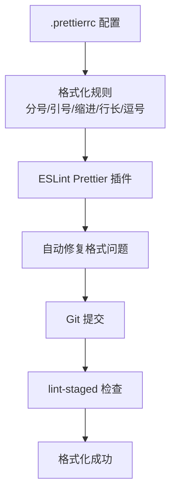

**图表来源**
- [.prettierrc:1-9](file://.prettierrc#L1-L9)
- [eslint.config.mjs:15-24](file://eslint.config.mjs#L15-L24)

**章节来源**
- [.prettierrc:1-9](file://.prettierrc#L1-L9)
- [eslint.config.mjs:15-24](file://eslint.config.mjs#L15-L24)

**最佳实践**
- **在团队内统一 Prettier 配置，避免个人偏好影响代码风格**
- **使用编辑器的 Prettier 插件实现保存时自动格式化**
- **定期更新 Prettier 版本，保持格式化规则的现代化**

### CommitLint 提交信息规范
- **规范标准：基于 Conventional Commits 规范，确保提交信息的结构化和可读性**
- **配置方式：commitlint.config.js 扩展 @commitlint/config-conventional**
- **提交类型：feat、fix、docs、style、refactor、test、chore 等标准类型**
- **信息格式：type(scope): description 的标准格式**
- **自动化检查：通过 Husky 在提交前自动验证提交信息格式**

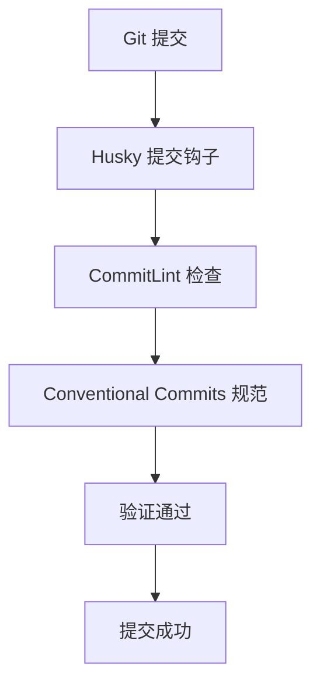

**图表来源**
- [commitlint.config.js:1-3](file://commitlint.config.js#L1-L3)

**章节来源**
- [commitlint.config.js:1-3](file://commitlint.config.js#L1-L3)

**最佳实践**
- **遵循 Conventional Commits 规范，确保提交历史的可读性**
- **使用简洁明了的描述，避免冗长和模糊的提交信息**
- **合理使用提交类型，准确反映代码变更的性质**

### Husky Git hooks 自动化
- **安装方式：通过 package.json 的 postinstall 和 prepare 脚本自动安装**
- **钩子类型：支持 pre-commit、commit-msg、pre-push 等多种钩子**
- **执行时机：在 Git 操作发生前自动执行预设的检查任务**
- **集成工具：与 lint-staged 配合，实现提交前的代码质量检查**
- **版本兼容：支持 Husky v9+ 的新语法和配置方式**

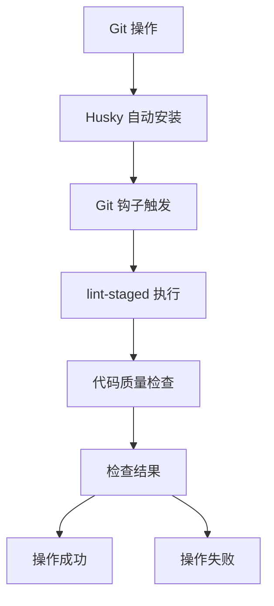

**章节来源**
- [package.json:34-35](file://package.json#L34-L35)

**最佳实践**
- **确保 Husky 正确安装，避免跳过代码质量检查**
- **合理配置钩子脚本，避免影响正常的 Git 操作效率**
- **定期更新 Husky 版本，保持与最新 Git 功能的兼容性**

### lint-staged 提交前检查
- **检查范围：只对暂存区（staged）文件执行检查，提高效率**
- **文件类型：支持 TS/TSX/JS/JSX 文件的 ESLint 自动修复**
- **格式化：支持 JSON/MD/YML 文件的 Prettier 格式化**
- **执行顺序：先执行 ESLint 自动修复，再执行 Prettier 格式化**
- **配置方式：在 package.json 中定义检查规则和执行命令**

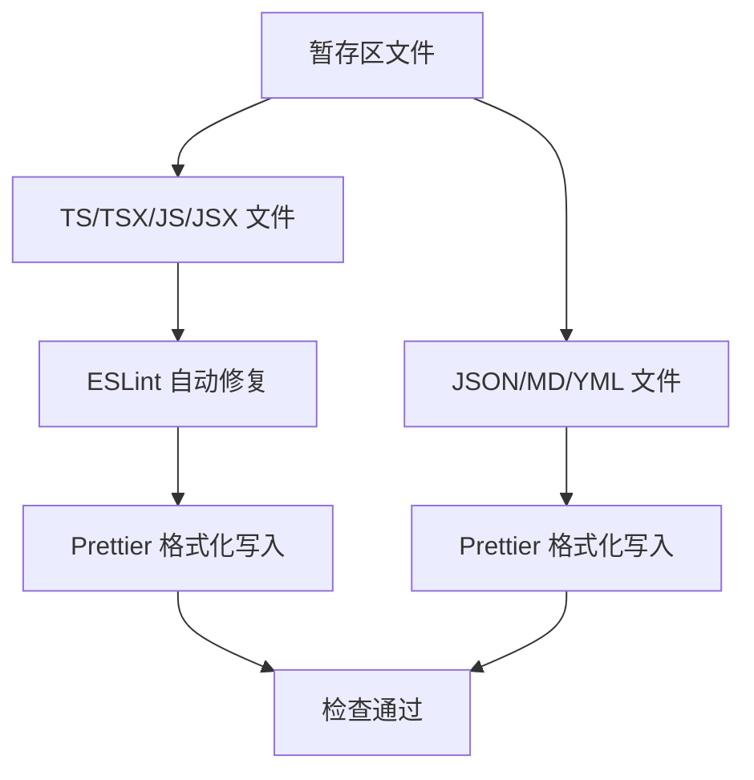

**图表来源**
- [package.json:75-83](file://package.json#L75-L83)

**章节来源**
- [package.json:75-83](file://package.json#L75-L83)

**最佳实践**
- **合理配置检查规则，避免不必要的检查开销**
- **定期清理和优化检查规则，保持开发效率**
- **确保团队成员使用相同的 lint-staged 配置**

### 测试环境与测试框架
- 测试入口：导入 jest-dom 扩展，增强 DOM 断言能力
- 示例测试：使用 @testing-library/react 渲染组件并断言文本内容
- 脚本：通过 react-scripts 的 test 脚本运行 Jest 与测试套件

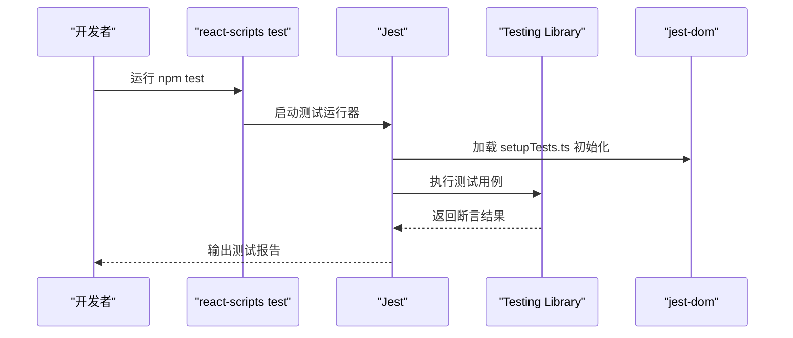

**图表来源**
- [package.json:29](file://package.json#L29)
- [src/setupTests.ts:1-6](file://src/setupTests.ts#L1-L6)
- [src/App.test.tsx:1-10](file://src/App.test.tsx#L1-L10)

**章节来源**
- [package.json:26-36](file://package.json#L26-L36)
- [src/setupTests.ts:1-6](file://src/setupTests.ts#L1-L6)
- [src/App.test.tsx:1-10](file://src/App.test.tsx#L1-L10)

**最佳实践**
- 以用户行为为中心编写测试，优先断言可观察的 UI 行为
- 使用 Testing Library 的语义查询，避免脆弱的选择器
- 为每个功能模块配套单元测试与集成测试

### Web Vitals 性能监控
- 动态导入：在运行时按需加载性能指标采集函数，降低首屏开销
- 指标集合：支持 CLS、FID、FCP、LCP、TTFB 等核心指标
- 入口调用：在应用启动时调用采集函数，传入回调处理指标数据

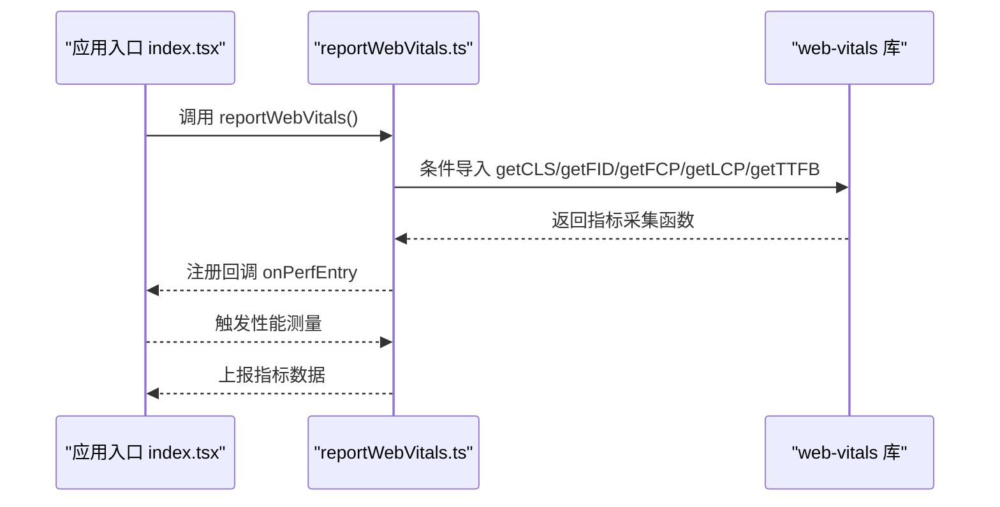

**图表来源**
- [src/index.tsx:16-19](file://src/index.tsx#L16-L19)
- [src/reportWebVitals.ts:1-16](file://src/reportWebVitals.ts#L1-L16)

**章节来源**
- [src/index.tsx:1-20](file://src/index.tsx#L1-L20)
- [src/reportWebVitals.ts:1-16](file://src/reportWebVitals.ts#L1-L16)

**最佳实践**
- 将性能指标接入可观测平台，建立阈值告警
- 在开发环境与生产环境分别配置采样率与上报地址
- 结合 LCP/CLS 等关键指标优化首屏与交互体验

## 依赖关系分析
- 包管理与脚本：通过 react-scripts 提供统一的开发、测试、构建体验
- **工具链版本：ESLint 10.x、TypeScript 4.x、Testing Library 生态、web-vitals、Prettier 3.x、CommitLint 21.x、Husky 9.x、lint-staged 17.x**
- **开发工具链：ESLint Prettier 插件、CommitLint Conventional 配置、Husky Git hooks、lint-staged 提交前检查**
- 浏览器兼容：browserslist 针对生产与开发环境分别设定目标

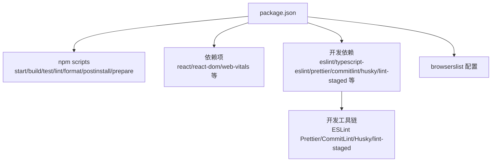

**图表来源**
- [package.json:26-84](file://package.json#L26-L84)

**章节来源**
- [package.json:1-84](file://package.json#L1-L84)

## 性能考量
- Web Vitals 采用按需导入，避免阻塞主线程
- TypeScript 严格模式与 noEmit 配置，确保类型检查高效且不产生额外构建负担
- 测试入口仅做 DOM 断言扩展，不引入重型依赖
- **Prettier 格式化在 lint-staged 中异步执行，避免影响主要开发流程**
- **Husky 钩子只在本地执行，不影响远程仓库的操作**
- **lint-staged 只检查暂存区文件，提高检查效率**
- 建议：在大型项目中考虑将 Web Vitals 采集逻辑拆分为独立模块，便于复用与测试

## 故障排查指南
- **ESLint 报错**
  - 症状：编辑器或命令行提示规则冲突或未识别
  - 排查：确认 eslint.config.mjs 的文件匹配模式与插件扩展是否正确；检查 Prettier 插件配置
  - 参考路径：[eslint.config.mjs:15-24](file://eslint.config.mjs#L15-L24)
- **TypeScript 类型错误**
  - 症状：编译失败或类型断言频繁
  - 排查：检查 tsconfig.json 的严格模式与 JSX 设置；逐步放宽规则定位问题
  - 参考路径：[tsconfig.json:2-22](file://tsconfig.json#L2-L22)
- **Prettier 格式化问题**
  - 症状：代码格式化不符合预期或出现格式化冲突
  - 排查：检查 .prettierrc 配置文件；确认 ESLint Prettier 插件正常工作
  - 参考路径：[.prettierrc:1-9](file://.prettierrc#L1-L9)，[eslint.config.mjs:15-24](file://eslint.config.mjs#L15-L24)
- **CommitLint 提交失败**
  - 症状：Git 提交被拒绝，提示提交信息格式错误
  - 排查：检查提交信息是否符合 Conventional Commits 规范；确认 CommitLint 配置正确
  - 参考路径：[commitlint.config.js:1-3](file://commitlint.config.js#L1-L3)
- **Husky 钩子失效**
  - 症状：Git 钩子未执行或执行失败
  - 排查：确认 Husky 正确安装；检查 package.json 中的 postinstall/prepare 脚本
  - 参考路径：[package.json:34-35](file://package.json#L34-L35)
- **lint-staged 检查失败**
  - 症状：提交被阻止，提示代码质量检查失败
  - 排查：检查暂存区文件是否符合 ESLint 和 Prettier 规范；确认 lint-staged 配置正确
  - 参考路径：[package.json:75-83](file://package.json#L75-L83)
- **测试失败**
  - 症状：断言失败或渲染异常
  - 排查：核对 setupTests.ts 是否正确初始化 jest-dom；检查测试用例中的选择器与断言
  - 参考路径：[src/setupTests.ts:1-6](file://src/setupTests.ts#L1-L6)，[src/App.test.tsx:1-10](file://src/App.test.tsx#L1-L10)
- **Web Vitals 未上报**
  - 症状：页面加载后无性能指标输出
  - 排查：确认 index.tsx 中已调用 reportWebVitals；检查回调参数是否传递
  - 参考路径：[src/index.tsx:16-19](file://src/index.tsx#L16-L19)，[src/reportWebVitals.ts:1-16](file://src/reportWebVitals.ts#L1-L16)

**章节来源**
- [eslint.config.mjs:15-24](file://eslint.config.mjs#L15-L24)
- [tsconfig.json:2-22](file://tsconfig.json#L2-L22)
- [.prettierrc:1-9](file://.prettierrc#L1-L9)
- [commitlint.config.js:1-3](file://commitlint.config.js#L1-L3)
- [package.json:34-35](file://package.json#L34-L35)
- [package.json:75-83](file://package.json#L75-L83)
- [src/setupTests.ts:1-6](file://src/setupTests.ts#L1-L6)
- [src/App.test.tsx:1-10](file://src/App.test.tsx#L1-L10)
- [src/index.tsx:16-19](file://src/index.tsx#L16-L19)
- [src/reportWebVitals.ts:1-16](file://src/reportWebVitals.ts#L1-L16)

## 结论
本项目通过 ESLint 平面配置、TypeScript 严格模式、Testing Library 测试生态、Web Vitals 性能监控，以及新增的 Prettier 格式化、CommitLint 规范化、Husky Git hooks 和 lint-staged 提交前检查，构建了完整的开发工具链。建议团队在此基础上：
- 统一工具链版本与配置，减少环境差异
- 在 CI 中强制执行 ESLint 与类型检查
- **严格执行 Prettier 格式化规范，确保代码风格一致性**
- **规范提交信息，建立清晰的版本历史**
- **利用 Husky 和 lint-staged 提高代码质量检查效率**
- 将性能监控纳入发布流程的基线指标
- 逐步引入自动化格式化与提交前检查，提升协作效率

## 附录
- **自定义 ESLint 配置指引**
  - 参考路径：[README.md:10-13](file://README.md#L10-L13)
  - 建议：在团队内形成"最小必要定制"的共识，优先复用推荐规则集
- **Prettier 格式化配置**
  - 参考路径：[.prettierrc:1-9](file://.prettierrc#L1-L9)
  - 建议：根据团队偏好调整格式化规则，但保持与其他文件一致
- **CommitLint 规范配置**
  - 参考路径：[commitlint.config.js:1-3](file://commitlint.config.js#L1-L3)
  - 建议：遵循 Conventional Commits 规范，确保提交信息的结构化
- **Husky Git hooks 配置**
  - 参考路径：[package.json:34-35](file://package.json#L34-L35)
  - 建议：确保 Husky 正确安装，避免跳过代码质量检查
- **lint-staged 提交前检查**
  - 参考路径：[package.json:75-83](file://package.json#L75-L83)
  - 建议：合理配置检查规则，避免影响开发效率
- **版本信息**
  - Node、npm、pnpm 版本参考：[README.md:1-3](file://README.md#L1-L3)
- **浏览器兼容**
  - 参考路径：[package.json:43-53](file://package.json#L43-L53)