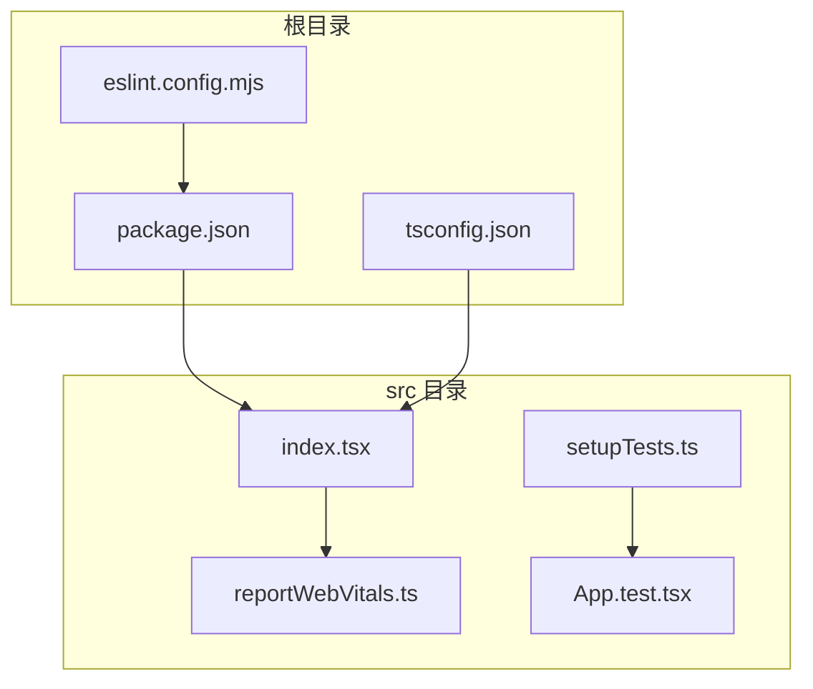
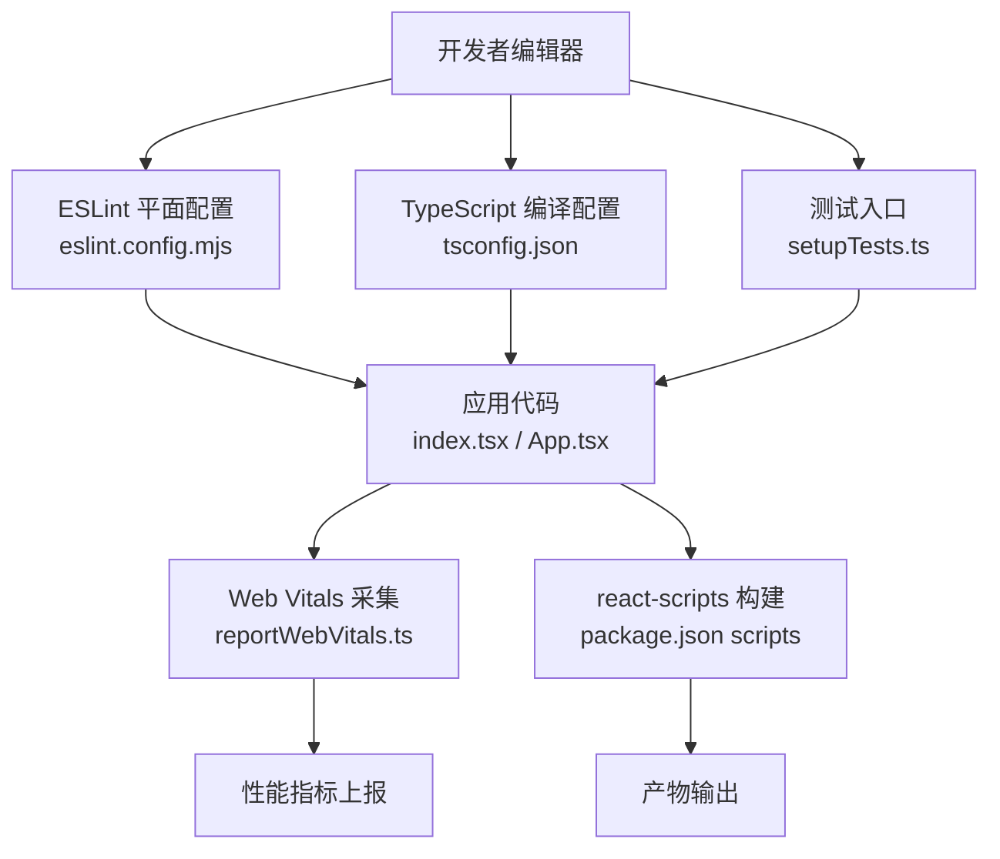
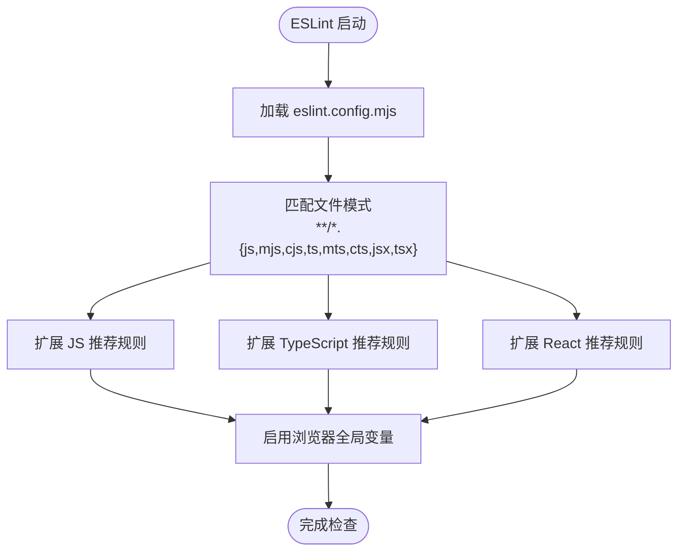
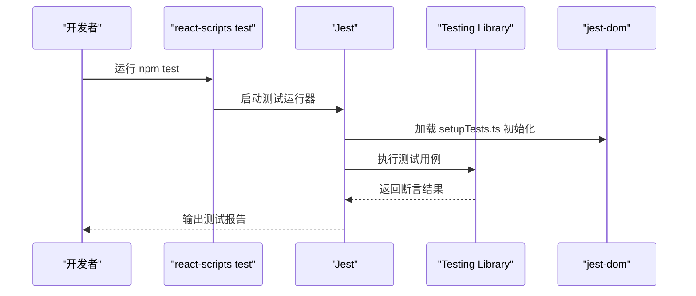
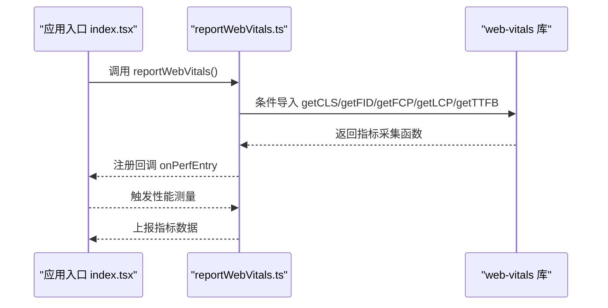
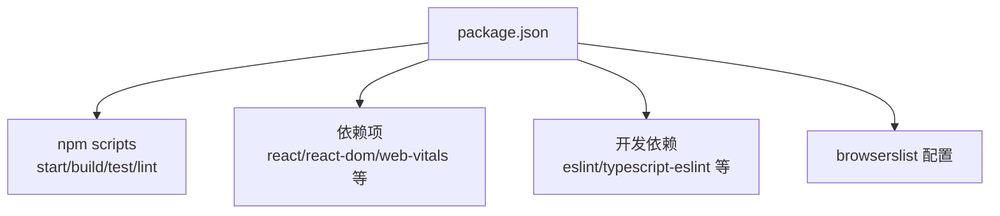

# 开发工具链

<cite>
**本文引用的文件**
- [eslint.config.mjs](file://eslint.config.mjs)
- [tsconfig.json](file://tsconfig.json)
- [package.json](file://package.json)
- [src/reportWebVitals.ts](file://src/reportWebVitals.ts)
- [src/setupTests.ts](file://src/setupTests.ts)
- [src/App.test.tsx](file://src/App.test.tsx)
- [README.md](file://README.md)
- [src/index.tsx](file://src/index.tsx)
</cite>

## 目录
1. [简介](#简介)
2. [项目结构](#项目结构)
3. [核心组件](#核心组件)
4. [架构总览](#架构总览)
5. [详细组件分析](#详细组件分析)
6. [依赖关系分析](#依赖关系分析)
7. [性能考量](#性能考量)
8. [故障排查指南](#故障排查指南)
9. [结论](#结论)
10. [附录](#附录)

## 简介
本文件系统化梳理该项目的开发工具链，覆盖以下方面：
- ESLint 配置与代码质量保障策略
- TypeScript 编译与类型检查设置
- 测试环境与测试框架配置
- Web Vitals 性能监控集成
- 代码质量检查、类型检查与性能监控的最佳实践
- 自定义工具配置与团队协作标准化建议

该仓库基于 Create React App（react-scripts）脚手架，同时引入了现代 ESLint 平面配置与 TypeScript 支持，并集成了 Web Vitals 性能指标采集。

## 项目结构
项目采用标准的 Create React App 结构，关键工具链配置集中在根目录与 src 目录中：
- 根目录：包管理与构建脚本、ESLint 平面配置、TypeScript 编译配置
- src 目录：应用入口、Web Vitals 采集、测试初始化与示例测试用例

图表来源
- [package.json:1-55](file://package.json#L1-L55)
- [eslint.config.mjs:1-17](file://eslint.config.mjs#L1-L17)
- [tsconfig.json:1-27](file://tsconfig.json#L1-L27)
- [src/index.tsx:1-20](file://src/index.tsx#L1-L20)
- [src/reportWebVitals.ts:1-16](file://src/reportWebVitals.ts#L1-L16)
- [src/setupTests.ts:1-6](file://src/setupTests.ts#L1-L6)
- [src/App.test.tsx:1-10](file://src/App.test.tsx#L1-L10)

章节来源
- [package.json:1-55](file://package.json#L1-L55)
- [eslint.config.mjs:1-17](file://eslint.config.mjs#L1-L17)
- [tsconfig.json:1-27](file://tsconfig.json#L1-L27)
- [src/index.tsx:1-20](file://src/index.tsx#L1-L20)
- [src/reportWebVitals.ts:1-16](file://src/reportWebVitals.ts#L1-L16)
- [src/setupTests.ts:1-6](file://src/setupTests.ts#L1-L6)
- [src/App.test.tsx:1-10](file://src/App.test.tsx#L1-L10)

## 核心组件
- ESLint 平面配置：统一管理 JS/TS/JSX/TSX 文件的规则扩展与语言环境
- TypeScript 编译配置：严格模式、模块解析、JSX 处理等编译选项
- 测试环境：Jest DOM 扩展、Testing Library 集成、测试入口初始化
- Web Vitals：按需动态导入性能指标采集函数，支持回调上报
- 构建与脚本：通过 react-scripts 提供的 npm scripts 运行开发、测试、构建

章节来源
- [eslint.config.mjs:1-17](file://eslint.config.mjs#L1-L17)
- [tsconfig.json:1-27](file://tsconfig.json#L1-L27)
- [package.json:20-26](file://package.json#L20-L26)
- [src/reportWebVitals.ts:1-16](file://src/reportWebVitals.ts#L1-L16)
- [src/setupTests.ts:1-6](file://src/setupTests.ts#L1-L6)

## 架构总览
下图展示了从开发到运行时的关键流程：编辑器触发 ESLint 检查与 TypeScript 类型检查；测试阶段由 react-scripts 调用 Jest 与 Testing Library；生产构建由 react-scripts 完成；运行时通过 Web Vitals 采集性能指标。

图表来源
- [eslint.config.mjs:1-17](file://eslint.config.mjs#L1-L17)
- [tsconfig.json:1-27](file://tsconfig.json#L1-L27)
- [package.json:20-26](file://package.json#L20-L26)
- [src/setupTests.ts:1-6](file://src/setupTests.ts#L1-L6)
- [src/index.tsx:1-20](file://src/index.tsx#L1-L20)
- [src/reportWebVitals.ts:1-16](file://src/reportWebVitals.ts#L1-L16)

## 详细组件分析

### ESLint 配置与代码质量
- 配置文件采用平面数组式结构，对所有 JS/TS/JSX/TSX 文件生效
- 统一扩展：基础 JS 推荐规则、TypeScript 推荐规则、React 推荐规则
- 语言环境：浏览器全局变量启用，便于 React 应用开发
- 建议：在团队内保持配置稳定，避免过度定制导致规则漂移；如需扩展，优先通过插件或自定义规则补充而非破坏现有推荐集

图表来源
- [eslint.config.mjs:7-16](file://eslint.config.mjs#L7-L16)

章节来源
- [eslint.config.mjs:1-17](file://eslint.config.mjs#L1-L17)

最佳实践
- 在 CI 中强制执行 ESLint，确保提交前发现风格与潜在问题
- 与编辑器集成自动修复（fix-on-save），减少重复劳动
- 团队约定：禁止关闭核心规则；新增规则需经评审

### TypeScript 配置与类型检查
- 编译目标与库：兼容性目标与 DOM/迭代器/ESNext 库组合
- 严格模式：开启严格检查、强制文件名大小写一致、禁止 switch 漏掉分支
- 模块与解析：ESNext 模块、Node 解析策略、JSON 模块解析
- JSX：使用 React JSX 转换
- 无输出：仅进行类型检查，不生成 JS 输出，适合与 react-scripts 协作

图表来源
- [tsconfig.json:2-22](file://tsconfig.json#L2-L22)

章节来源
- [tsconfig.json:1-27](file://tsconfig.json#L1-L27)

最佳实践
- 将严格模式视为默认开关，逐步放宽到非关键模块
- 使用 noImplicitAny 与 strictNullChecks 提升类型安全性
- 对第三方库补充缺失的类型声明时，集中放置在项目类型声明文件中

### 测试环境与测试框架
- 测试入口：导入 jest-dom 扩展，增强 DOM 断言能力
- 示例测试：使用 @testing-library/react 渲染组件并断言文本内容
- 脚本：通过 react-scripts 的 test 脚本运行 Jest 与测试套件

图表来源
- [package.json:23](file://package.json#L23)
- [src/setupTests.ts:1-6](file://src/setupTests.ts#L1-L6)
- [src/App.test.tsx:1-10](file://src/App.test.tsx#L1-L10)

章节来源
- [package.json:20-26](file://package.json#L20-L26)
- [src/setupTests.ts:1-6](file://src/setupTests.ts#L1-L6)
- [src/App.test.tsx:1-10](file://src/App.test.tsx#L1-L10)

最佳实践
- 以用户行为为中心编写测试，优先断言可观察的 UI 行为
- 使用 Testing Library 的语义查询，避免脆弱的选择器
- 为每个功能模块配套单元测试与集成测试

### Web Vitals 性能监控
- 动态导入：在运行时按需加载性能指标采集函数，降低首屏开销
- 指标集合：支持 CLS、FID、FCP、LCP、TTFB 等核心指标
- 入口调用：在应用启动时调用采集函数，传入回调处理指标数据

图表来源
- [src/index.tsx:16-19](file://src/index.tsx#L16-L19)
- [src/reportWebVitals.ts:1-16](file://src/reportWebVitals.ts#L1-L16)

章节来源
- [src/index.tsx:1-20](file://src/index.tsx#L1-L20)
- [src/reportWebVitals.ts:1-16](file://src/reportWebVitals.ts#L1-L16)

最佳实践
- 将性能指标接入可观测平台，建立阈值告警
- 在开发环境与生产环境分别配置采样率与上报地址
- 结合 LCP/CLS 等关键指标优化首屏与交互体验

## 依赖关系分析
- 包管理与脚本：通过 react-scripts 提供统一的开发、测试、构建体验
- 工具链版本：ESLint 10.x、TypeScript 4.x、Testing Library 生态、web-vitals
- 浏览器兼容：browserslist 针对生产与开发环境分别设定目标

图表来源
- [package.json:20-53](file://package.json#L20-L53)

章节来源
- [package.json:1-55](file://package.json#L1-L55)

## 性能考量
- Web Vitals 采用按需导入，避免阻塞主线程
- TypeScript 严格模式与 noEmit 配置，确保类型检查高效且不产生额外构建负担
- 测试入口仅做 DOM 断言扩展，不引入重型依赖
- 建议：在大型项目中考虑将 Web Vitals 采集逻辑拆分为独立模块，便于复用与测试

## 故障排查指南
- ESLint 报错
  - 症状：编辑器或命令行提示规则冲突或未识别
  - 排查：确认 eslint.config.mjs 的文件匹配模式与插件扩展是否正确
  - 参考路径：[eslint.config.mjs:7-16](file://eslint.config.mjs#L7-L16)
- TypeScript 类型错误
  - 症状：编译失败或类型断言频繁
  - 排查：检查 tsconfig.json 的严格模式与 JSX 设置；逐步放宽规则定位问题
  - 参考路径：[tsconfig.json:2-22](file://tsconfig.json#L2-L22)
- 测试失败
  - 症状：断言失败或渲染异常
  - 排查：核对 setupTests.ts 是否正确初始化 jest-dom；检查测试用例中的选择器与断言
  - 参考路径：[src/setupTests.ts:1-6](file://src/setupTests.ts#L1-L6)，[src/App.test.tsx:1-10](file://src/App.test.tsx#L1-L10)
- Web Vitals 未上报
  - 症状：页面加载后无性能指标输出
  - 排查：确认 index.tsx 中已调用 reportWebVitals；检查回调参数是否传递
  - 参考路径：[src/index.tsx:16-19](file://src/index.tsx#L16-L19)，[src/reportWebVitals.ts:1-16](file://src/reportWebVitals.ts#L1-L16)

章节来源
- [eslint.config.mjs:7-16](file://eslint.config.mjs#L7-L16)
- [tsconfig.json:2-22](file://tsconfig.json#L2-L22)
- [src/setupTests.ts:1-6](file://src/setupTests.ts#L1-L6)
- [src/App.test.tsx:1-10](file://src/App.test.tsx#L1-L10)
- [src/index.tsx:16-19](file://src/index.tsx#L16-L19)
- [src/reportWebVitals.ts:1-16](file://src/reportWebVitals.ts#L1-L16)

## 结论
本项目通过 ESLint 平面配置、TypeScript 严格模式、Testing Library 测试生态与 Web Vitals 性能监控，构建了完整的开发工具链。建议团队在此基础上：
- 统一工具链版本与配置，减少环境差异
- 在 CI 中强制执行 ESLint 与类型检查
- 将性能监控纳入发布流程的基线指标
- 逐步引入自动化格式化与提交前检查，提升协作效率

## 附录
- 自定义 ESLint 配置指引
  - 参考路径：[README.md:12-14](file://README.md#L12-L14)
  - 建议：在团队内形成“最小必要定制”的共识，优先复用推荐规则集
- 版本信息
  - Node、npm、pnpm 版本参考：[README.md:1-3](file://README.md#L1-L3)
- 浏览器兼容
  - 参考路径：[package.json:33-44](file://package.json#L33-L44)