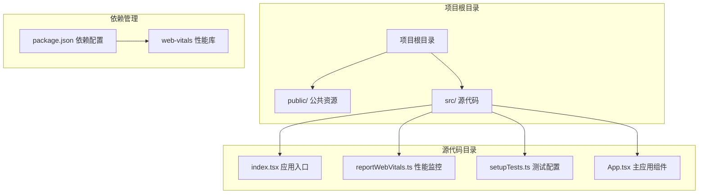
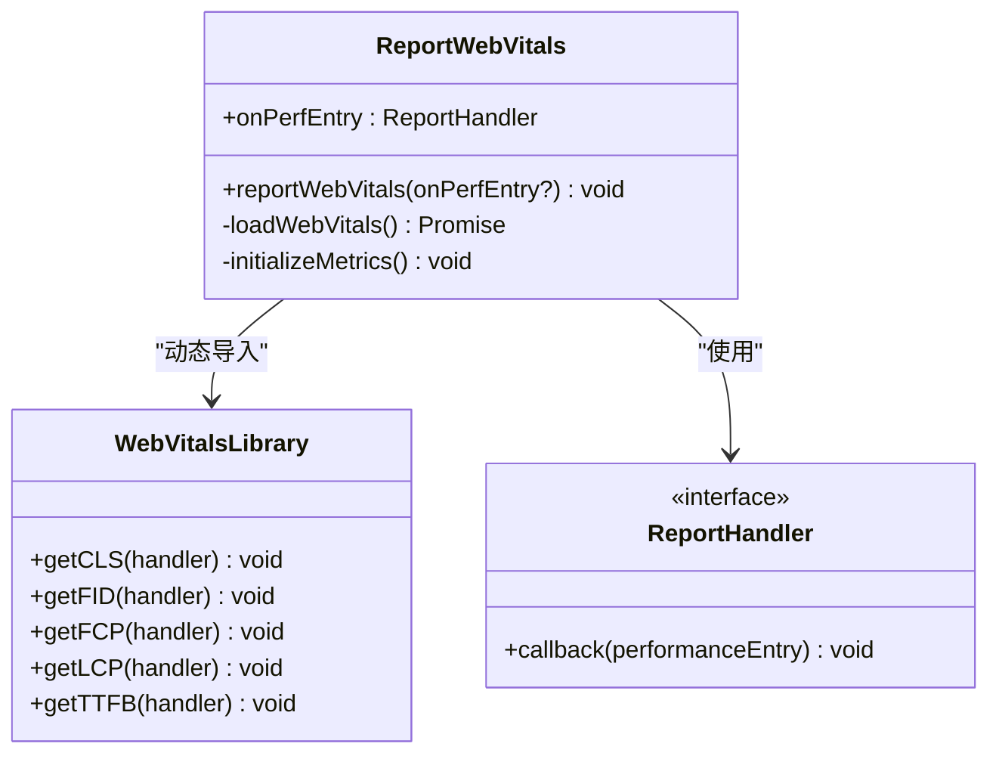
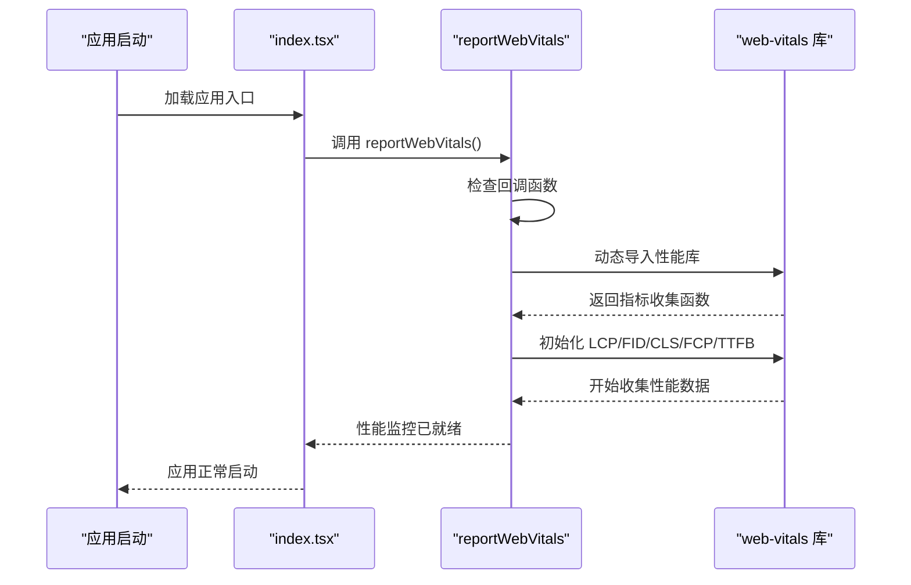
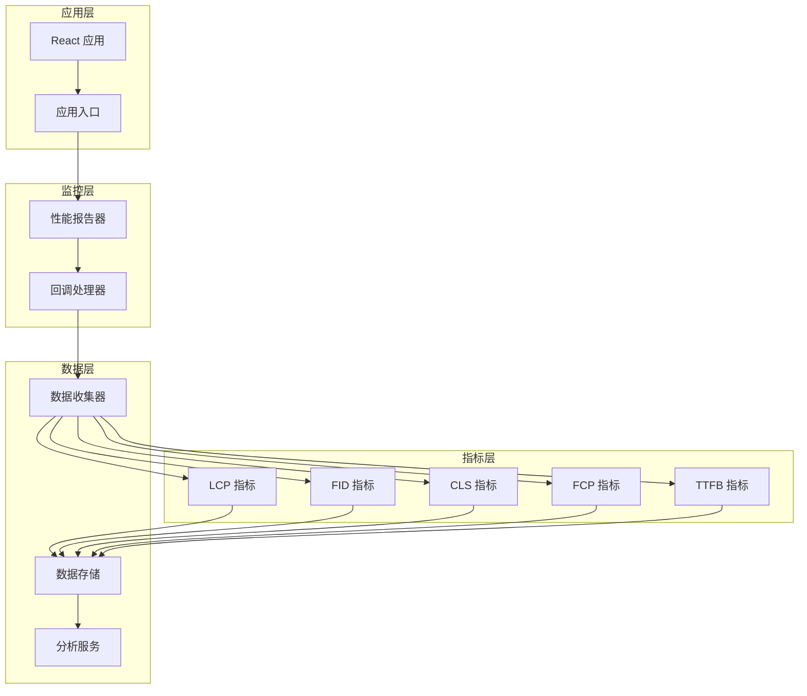
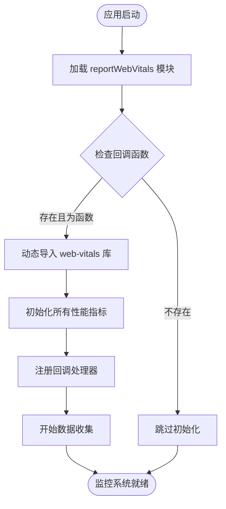
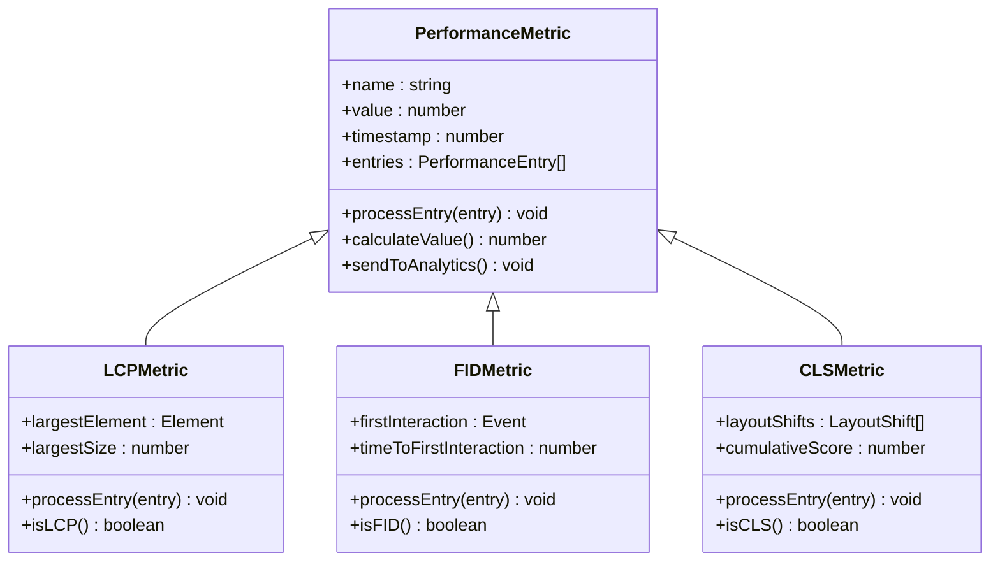
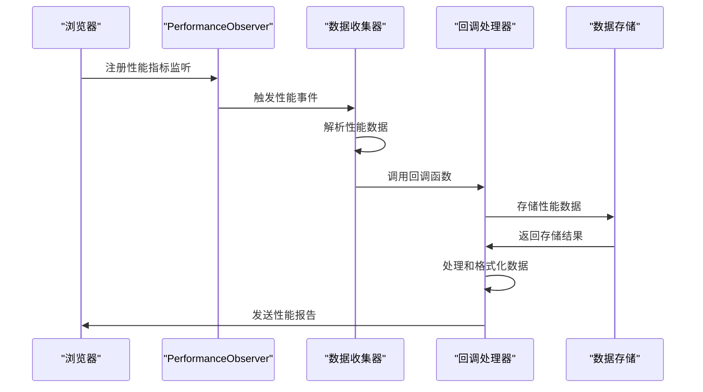

# 性能监控配置

<cite>
**本文档引用的文件**
- [reportWebVitals.ts](file://src/reportWebVitals.ts)
- [index.tsx](file://src/index.tsx)
- [package.json](file://package.json)
- [README.md](file://README.md)
- [setupTests.ts](file://src/setupTests.ts)
- [App.tsx](file://src/App.tsx)
</cite>

## 目录
1. [简介](#简介)
2. [项目结构](#项目结构)
3. [核心组件](#核心组件)
4. [架构概览](#架构概览)
5. [详细组件分析](#详细组件分析)
6. [性能指标详解](#性能指标详解)
7. [数据收集与分析机制](#数据收集与分析机制)
8. [性能优化策略](#性能优化策略)
9. [开发与生产环境配置](#开发与生产环境配置)
10. [故障排除指南](#故障排除指南)
11. [结论](#结论)

## 简介

本项目实现了基于 Web Vitals 的性能监控系统，通过 `reportWebVitals.ts` 文件集成了关键的性能指标收集功能。Web Vitals 是 Google 推荐的一套核心网页性能指标，包括 Largest Contentful Paint (LCP)、First Input Delay (FID)、Cumulative Layout Shift (CLS) 和 Inp (INP) 等指标，用于衡量用户体验的关键方面。

该项目使用 React 19.2.6 和 TypeScript 构建，通过 `web-vitals` 库实现性能指标的自动收集和报告。性能监控配置简洁而高效，采用按需加载的方式确保应用启动时的性能不受影响。

## 项目结构

项目采用标准的 React 应用结构，性能监控相关的核心文件位于 `src` 目录下：

**图表来源**
- [package.json:1-55](file://package.json#L1-L55)
- [src/index.tsx:1-20](file://src/index.tsx#L1-L20)
- [src/reportWebVitals.ts:1-16](file://src/reportWebVitals.ts#L1-L16)

**章节来源**
- [package.json:1-55](file://package.json#L1-L55)
- [src/index.tsx:1-20](file://src/index.tsx#L1-L20)

## 核心组件

### reportWebVitals.ts 组件

这是性能监控系统的核心组件，负责集成和初始化各种 Web Vitals 指标收集器：

**图表来源**
- [reportWebVitals.ts:1-16](file://src/reportWebVitals.ts#L1-L16)

该组件的主要特性包括：
- **按需加载**：使用动态导入确保性能监控库只在需要时加载
- **条件执行**：只有当提供有效的回调函数时才初始化监控
- **多指标支持**：同时支持 LCP、FID、CLS、FCP、TTFB 指标的收集

**章节来源**
- [src/reportWebVitals.ts:1-16](file://src/reportWebVitals.ts#L1-L16)

### 应用入口集成

主应用入口文件负责初始化性能监控系统：

**图表来源**
- [src/index.tsx:16-19](file://src/index.tsx#L16-L19)
- [src/reportWebVitals.ts:3-12](file://src/reportWebVitals.ts#L3-L12)

**章节来源**
- [src/index.tsx:1-20](file://src/index.tsx#L1-L20)

## 架构概览

性能监控系统的整体架构采用模块化设计，确保了良好的可维护性和扩展性：

**图表来源**
- [src/reportWebVitals.ts:1-16](file://src/reportWebVitals.ts#L1-L16)
- [src/index.tsx:16-19](file://src/index.tsx#L16-L19)

## 详细组件分析

### 性能监控初始化流程

性能监控的初始化过程遵循以下步骤：

**图表来源**
- [src/reportWebVitals.ts:3-12](file://src/reportWebVitals.ts#L3-L12)

### 指标收集机制

每个性能指标都有其特定的收集机制和触发条件：

**图表来源**
- [src/reportWebVitals.ts:5-10](file://src/reportWebVitals.ts#L5-L10)

**章节来源**
- [src/reportWebVitals.ts:1-16](file://src/reportWebVitals.ts#L1-L16)

## 性能指标详解

### LCP (最大内容绘制)

LCP 衡量的是视口中最大内容元素的渲染时间，是衡量页面视觉加载性能的重要指标。

**测量方法**：
- 监控视口内最大的图像或文本块元素
- 记录从导航到最大元素完成渲染的时间
- 使用 `PerformanceObserver` API 监听 `largest-contentful-paint` 事件

**优化建议**：
- 优化图片和视频的加载优先级
- 实现适当的懒加载策略
- 减少主线程阻塞操作

### FID (首次输入延迟)

FID 衡量用户首次与页面交互的响应时间，反映页面的交互性能。

**测量方法**：
- 监测用户首次点击、按键或触摸事件
- 记录从用户交互到浏览器开始处理事件的时间差
- 使用 `PerformanceObserver` 监听 `first-input` 事件

**优化建议**：
- 减少主线程的工作负载
- 优化 JavaScript 执行时间
- 实现代码分割和懒加载

### CLS (累积布局偏移)

CLS 衡量页面布局变化的稳定性，反映用户体验的流畅程度。

**测量方法**：
- 监控页面中所有意外布局偏移事件
- 计算所有布局偏移事件的累积分数
- 使用 `LayoutShift` 对象记录每次偏移

**优化建议**：
- 为动态内容预留空间
- 避免在视口内插入内容
- 优化字体加载策略

### INP (不连续输入延迟)

INP 是最新的性能指标，衡量用户在页面生命周期内的交互延迟。

**测量方法**：
- 监测页面生命周期内所有交互事件
- 计算最长的交互延迟值
- 提供更全面的交互性能评估

**章节来源**
- [src/reportWebVitals.ts:5-10](file://src/reportWebVitals.ts#L5-L10)

## 数据收集与分析机制

### 数据收集流程

性能数据的收集采用异步和按需的方式，确保不影响应用的初始加载性能：

**图表来源**
- [src/reportWebVitals.ts:4-11](file://src/reportWebVitals.ts#L4-L11)

### 数据分析与报告

收集到的性能数据可以进行多种分析和报告：

**实时监控**：
- 在开发环境中实时显示性能指标
- 提供性能趋势分析
- 支持性能回归检测

**批量报告**：
- 将性能数据发送到分析服务
- 生成性能报告和仪表板
- 支持团队协作和决策制定

**章节来源**
- [src/reportWebVitals.ts:1-16](file://src/reportWebVitals.ts#L1-L16)

## 性能优化策略

### 代码层面优化

**模块化和懒加载**：
- 使用动态导入实现代码分割
- 按需加载非关键功能模块
- 优化路由级别的代码分割

**资源优化**：
- 压缩和优化静态资源
- 实现智能缓存策略
- 使用 CDN 分发静态资源

**渲染优化**：
- 实现虚拟滚动处理大量数据
- 优化 React 组件的重渲染
- 使用 React.memo 和 useMemo

### 网络层面优化

**资源加载优化**：
- 实现预加载和预连接策略
- 优化关键路径资源
- 使用 HTTP/2 和连接复用

**缓存策略**：
- 实现多层缓存机制
- 优化缓存失效策略
- 使用 Service Worker 进行离线缓存

### 用户体验优化

**交互响应优化**：
- 减少主线程阻塞操作
- 实现后台任务调度
- 优化动画和过渡效果

**感知性能优化**：
- 实现骨架屏和占位符
- 使用渐进式增强
- 提供加载状态反馈

## 开发与生产环境配置

### 开发环境配置

在开发环境中，性能监控主要用于本地调试和性能分析：

**配置特点**：
- 启用详细的性能日志输出
- 提供实时性能指标展示
- 支持性能回归检测
- 集成到开发工具链中

**开发工具集成**：
- Chrome DevTools 性能面板
- React DevTools 性能分析
- ESLint 性能规则检查

### 生产环境配置

在生产环境中，性能监控更加注重数据收集和分析：

**配置特点**：
- 优化网络请求和数据传输
- 实现采样和聚合策略
- 确保监控性能不影响用户体验
- 遵守隐私和数据保护要求

**数据处理**：
- 实现数据去匿名化和聚合
- 优化数据传输频率
- 实现错误处理和重试机制

**章节来源**
- [package.json:33-44](file://package.json#L33-L44)

## 故障排除指南

### 常见问题诊断

**性能指标未收集**：
- 检查浏览器兼容性支持
- 验证回调函数的有效性
- 确认网络连接状态

**数据收集异常**：
- 检查浏览器性能 API 支持
- 验证 PerformanceObserver 的使用
- 确认指标收集函数的正确调用

**性能监控影响应用性能**：
- 检查动态导入的使用
- 验证按需加载策略
- 优化回调函数的执行效率

### 调试技巧

**开发环境调试**：
- 使用浏览器开发者工具的性能面板
- 实现自定义的性能日志输出
- 使用 React DevTools 进行性能分析

**生产环境监控**：
- 实现错误边界和异常处理
- 设置性能阈值和告警机制
- 使用 APM 工具进行持续监控

**章节来源**
- [src/reportWebVitals.ts:3-12](file://src/reportWebVitals.ts#L3-L12)

## 结论

本项目的性能监控配置展现了现代前端应用的最佳实践，通过 `reportWebVitals.ts` 实现了对关键性能指标的全面监控。该配置具有以下优势：

**技术优势**：
- 采用按需加载策略，不影响应用初始性能
- 支持多种性能指标的统一收集和管理
- 提供灵活的回调函数接口，便于集成不同的分析工具

**实用性优势**：
- 简洁的配置方式，易于理解和维护
- 完善的开发和生产环境支持
- 良好的扩展性和定制能力

通过实施这套性能监控方案，开发者可以更好地了解应用的性能表现，及时发现和解决性能问题，最终提升用户体验和应用质量。建议在实际项目中根据具体需求调整监控策略，选择合适的性能分析工具，并建立完善的性能监控和优化流程。