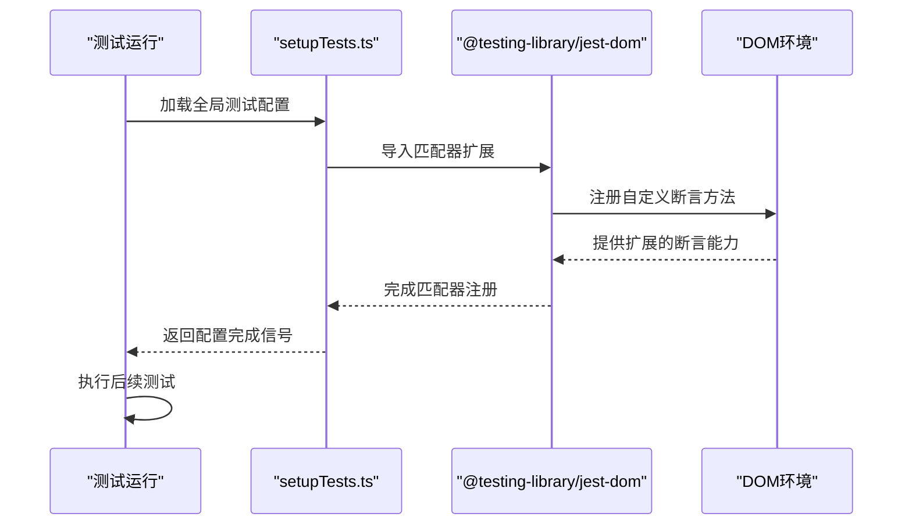
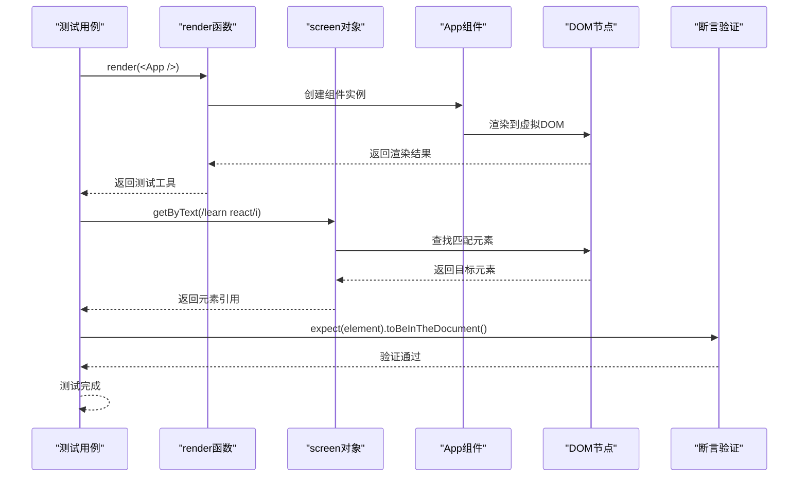

# 测试环境配置

<cite>
**本文档引用的文件**
- [setupTests.ts](file://src/setupTests.ts)
- [App.test.tsx](file://src/App.test.tsx)
- [App.tsx](file://src/App.tsx)
- [package.json](file://package.json)
- [tsconfig.json](file://tsconfig.json)
- [README.md](file://README.md)
</cite>

## 目录
1. [简介](#简介)
2. [项目结构](#项目结构)
3. [核心组件](#核心组件)
4. [架构概览](#架构概览)
5. [详细组件分析](#详细组件分析)
6. [依赖关系分析](#依赖关系分析)
7. [性能考虑](#性能考虑)
8. [故障排除指南](#故障排除指南)
9. [结论](#结论)

## 简介

本项目是一个基于 React 和 TypeScript 的前端应用，采用了现代的测试框架配置。本文档专注于测试环境配置的详细说明，包括 setupTests.ts 如何配置测试运行环境和全局测试设置，@testing-library/react 的使用方法和测试最佳实践，以及 App.test.tsx 中的测试示例和测试模式。

该项目使用了 Create React App 提供的测试基础设施，集成了 Jest 测试框架和 Testing Library 工具库，为 React 组件提供了完整的测试支持。

## 项目结构

该项目采用标准的 Create React App 项目结构，重点关注测试相关的文件组织：

```mermaid
graph TB
subgraph "源代码目录 (src)"
A[setupTests.ts<br/>全局测试配置]
B[App.test.tsx<br/>组件测试示例]
C[App.tsx<br/>被测组件]
D[index.tsx<br/>应用入口]
E[reportWebVitals.ts<br/>性能监控]
end
subgraph "配置文件"
F[package.json<br/>依赖管理]
G[tsconfig.json<br/>TypeScript配置]
H[README.md<br/>项目说明]
end
subgraph "测试工具"
I[Jest<br/>测试运行器]
J[@testing-library/react<br/>React测试库]
K[@testing-library/jest-dom<br/>DOM匹配器]
L[@testing-library/user-event<br/>用户事件模拟]
end
A --> I
B --> J
C --> J
F --> I
F --> J
F --> K
F --> L
```

**图表来源**
- [setupTests.ts:1-6](file://src/setupTests.ts#L1-L6)
- [App.test.tsx:1-10](file://src/App.test.tsx#L1-L10)
- [package.json:1-55](file://package.json#L1-L55)

**章节来源**
- [setupTests.ts:1-6](file://src/setupTests.ts#L1-L6)
- [App.test.tsx:1-10](file://src/App.test.tsx#L1-L10)
- [package.json:1-55](file://package.json#L1-L55)

## 核心组件

### 测试环境配置 (setupTests.ts)

setupTests.ts 是整个测试套件的全局配置文件，负责为所有测试提供统一的环境设置。

**主要功能：**
- 导入 @testing-library/jest-dom 匹配器扩展
- 为 DOM 元素添加自定义断言能力
- 提供更语义化的测试断言语法

**配置特点：**
- 轻量级配置，仅导入必要的测试工具
- 全局生效，无需在每个测试文件中重复导入
- 支持丰富的 DOM 断言方法

**章节来源**
- [setupTests.ts:1-6](file://src/setupTests.ts#L1-L6)

### 应用组件测试 (App.test.tsx)

App.test.tsx 展示了基本的 React 组件测试模式，包含完整的测试生命周期。

**测试结构：**
- 使用 @testing-library/react 的 render 函数渲染组件
- 通过 screen.getByText 获取 DOM 元素
- 使用 @testing-library/jest-dom 的断言方法验证元素状态

**测试模式：**
- 渲染测试：验证组件正确渲染
- 内容测试：检查特定文本内容是否存在
- 可访问性测试：确保组件符合可访问性标准

**章节来源**
- [App.test.tsx:1-10](file://src/App.test.tsx#L1-L10)

### 被测组件 (App.tsx)

App.tsx 是一个简单的 React 组件，包含基本的 UI 结构和交互元素。

**组件特性：**
- 使用 React 函数式组件
- 包含图片、文本和链接元素
- 符合 React 最佳实践

**测试价值：**
- 简单的组件结构便于理解测试概念
- 包含多种类型的 DOM 元素，适合演示不同测试场景

**章节来源**
- [App.tsx:1-27](file://src/App.tsx#L1-L27)

## 架构概览

测试环境的整体架构基于 Create React App 的标准化配置，集成了多个测试工具库：

```mermaid
graph TB
subgraph "测试执行层"
A[Jest 测试运行器]
B[测试脚本包装器]
end
subgraph "测试库层"
C[@testing-library/react]
D[@testing-library/jest-dom]
E[@testing-library/user-event]
end
subgraph "应用层"
F[setupTests.ts]
G[App.test.tsx]
H[App.tsx]
end
subgraph "配置层"
I[package.json]
J[tsconfig.json]
end
A --> C
A --> D
A --> E
F --> D
G --> C
G --> D
H --> C
I --> A
I --> C
I --> D
I --> E
J --> C
J --> D
```

**图表来源**
- [package.json:20-26](file://package.json#L20-L26)
- [setupTests.ts:5](file://src/setupTests.ts#L5)
- [App.test.tsx:2](file://src/App.test.tsx#L2)

## 详细组件分析

### 测试环境配置分析

#### setupTests.ts 深入解析



**图表来源**
- [setupTests.ts:1-6](file://src/setupTests.ts#L1-L6)

**配置要点：**
- 自动导入机制：无需在单个测试文件中重复导入
- 匹配器扩展：提供 toHaveTextContent、toBeInTheDocument 等断言方法
- 全局可用性：所有测试文件共享相同的断言能力

**章节来源**
- [setupTests.ts:1-6](file://src/setupTests.ts#L1-L6)

### 组件测试分析

#### App.test.tsx 测试流程



**图表来源**
- [App.test.tsx:5-9](file://src/App.test.tsx#L5-L9)

**测试模式详解：**
- **渲染模式**：验证组件能够成功渲染
- **查询模式**：使用语义化选择器查找元素
- **断言模式**：验证元素状态和属性

**章节来源**
- [App.test.tsx:1-10](file://src/App.test.tsx#L1-L10)

### 依赖关系分析

#### 测试工具链依赖

```mermaid
graph TB
subgraph "核心测试依赖"
A[Jest 27.5.1<br/>测试运行器]
B[@testing-library/react 16.3.2<br/>React测试库]
C[@testing-library/jest-dom 6.9.1<br/>DOM匹配器]
D[@testing-library/user-event 13.5.0<br/>用户事件模拟]
end
subgraph "开发依赖"
E[react-scripts 5.0.1<br/>构建工具链]
F[TypeScript 4.9.5<br/>类型系统]
G[ESLint 10.4.0<br/>代码质量]
end
subgraph "应用依赖"
H[React 19.2.6<br/>UI框架]
I[React DOM 19.2.6<br/>DOM渲染]
J[Web Vitals 2.1.4<br/>性能监控]
end
A --> B
A --> C
A --> D
B --> H
C --> H
D --> H
E --> A
E --> B
E --> C
E --> D
F --> H
G --> E
```

**图表来源**
- [package.json:5-18](file://package.json#L5-L18)
- [package.json:20-26](file://package.json#L20-L26)

**依赖关系特点：**
- **版本兼容性**：所有依赖版本经过精心选择以确保兼容性
- **测试专用**：主要集中在测试相关的工具库
- **开发友好**：提供良好的开发体验和错误提示

**章节来源**
- [package.json:1-55](file://package.json#L1-L55)

## 性能考虑

### 测试性能优化建议

虽然当前项目配置相对简单，但仍有一些性能优化可以考虑：

**测试执行优化：**
- 使用 `--watchAll` 进行增量测试
- 合理使用 `test.only` 进行针对性测试
- 避免不必要的组件重渲染

**内存管理：**
- 在测试结束后清理 DOM 节点
- 避免在测试中创建大量全局状态

**并发测试：**
- 利用 Jest 的并行测试能力
- 合理组织测试文件避免相互依赖

## 故障排除指南

### 常见问题及解决方案

**问题1：测试无法找到元素**
- 检查组件是否正确渲染
- 验证选择器的正则表达式是否正确
- 确认元素文本内容与预期一致

**问题2：断言失败**
- 检查 @testing-library/jest-dom 是否正确导入
- 验证断言语法是否符合要求
- 确认元素状态与预期相符

**问题3：测试环境配置问题**
- 确认 setupTests.ts 正确导入
- 检查 TypeScript 配置是否正确
- 验证 package.json 中的测试脚本

**章节来源**
- [setupTests.ts:1-6](file://src/setupTests.ts#L1-L6)
- [App.test.tsx:5-9](file://src/App.test.tsx#L5-L9)

## 结论

本项目展示了现代 React 应用的测试环境配置最佳实践。通过简洁而强大的 setupTests.ts 配置，结合 @testing-library/react 的语义化测试方法，为组件测试提供了清晰、易维护的测试框架。

**关键优势：**
- **简单易用**：最小化的配置提供了完整的测试功能
- **语义化测试**：使用用户视角的断言方法
- **类型安全**：完整的 TypeScript 支持
- **工具丰富**：集成了多个专业的测试工具库

**未来发展方向：**
- 可以添加更多的测试工具如 React Hook 测试库
- 考虑集成测试覆盖率报告
- 添加异步测试的最佳实践示例
- 实现更复杂的组件测试场景

这个测试环境配置为开发者提供了一个坚实的基础，可以在此基础上扩展更全面的测试策略和最佳实践。