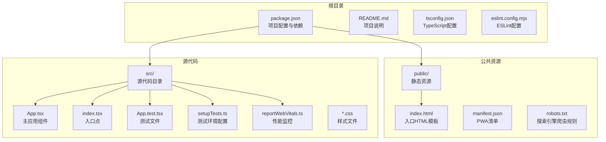
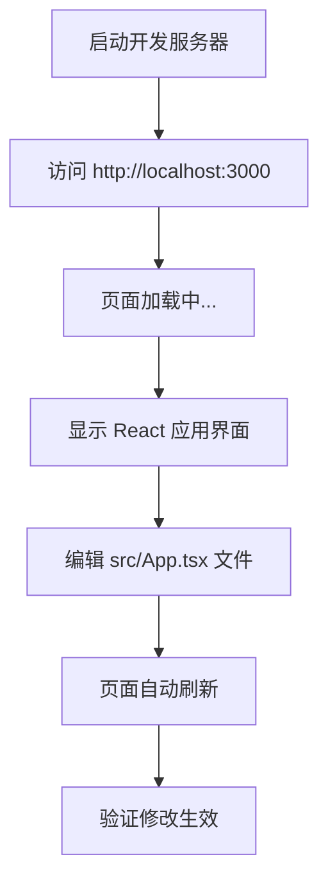
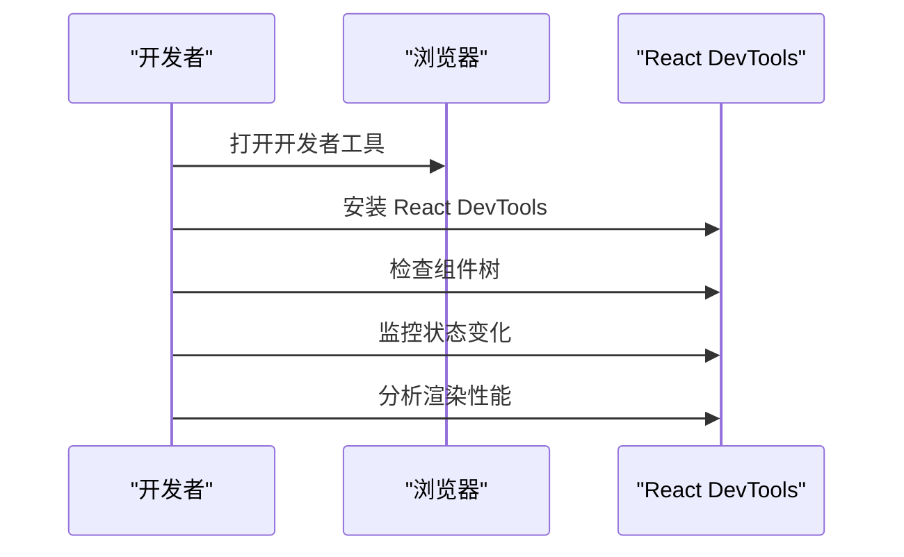
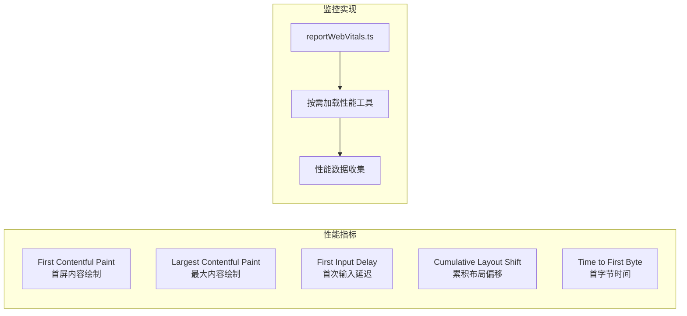
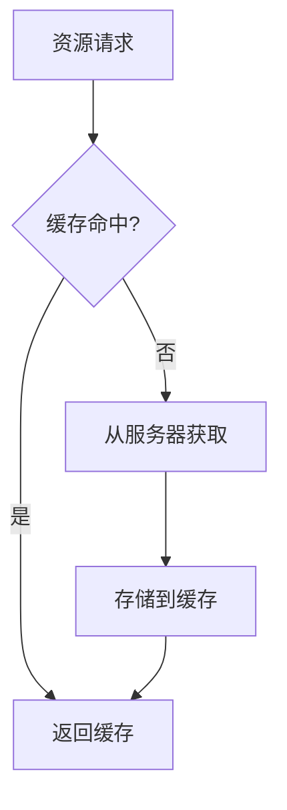

# 快速开始

<cite>
**本文档引用的文件**
- [package.json](file://package.json)
- [README.md](file://README.md)
- [tsconfig.json](file://tsconfig.json)
- [eslint.config.mjs](file://eslint.config.mjs)
- [public/index.html](file://public/index.html)
- [src/index.tsx](file://src/index.tsx)
- [src/App.tsx](file://src/App.tsx)
- [src/App.test.tsx](file://src/App.test.tsx)
- [src/setupTests.ts](file://src/setupTests.ts)
- [src/reportWebVitals.ts](file://src/reportWebVitals.ts)
- [src/index.css](file://src/index.css)
- [src/App.css](file://src/App.css)
</cite>

## 目录
1. [简介](#简介)
2. [环境要求](#环境要求)
3. [项目结构概览](#项目结构概览)
4. [安装步骤](#安装步骤)
5. [核心脚本命令详解](#核心脚本命令详解)
6. [首次运行指南](#首次运行指南)
7. [常见问题与故障排除](#常见问题与故障排除)
8. [性能监控与优化](#性能监控与优化)
9. [总结](#总结)

## 简介

这是一个基于 Create React App 构建的现代 React 应用项目，使用 TypeScript 进行类型安全开发。该项目提供了完整的开发工具链，包括热重载开发服务器、单元测试框架、ESLint 代码质量检查等现代化开发功能。

项目采用 React 19.x 最新版本，配合 TypeScript 4.x 提供强大的类型推断能力，同时集成了 Web Vitals 性能监控工具，帮助开发者构建高性能的用户界面应用。

## 环境要求

### Node.js 版本要求

根据项目配置，推荐使用以下版本组合以确保最佳兼容性：

- **Node.js**: 22.11.0 或更高版本
- **npm**: 10.9.0 或更高版本  
- **pnpm**: 10.20.0 或更高版本

### 系统要求

- **操作系统**: Windows 10+ / macOS 10.15+ / Linux Ubuntu 18.04+
- **内存**: 至少 4GB RAM（建议 8GB+）
- **磁盘空间**: 至少 500MB 可用空间
- **网络**: 稳定的互联网连接用于依赖包下载

### 开发工具链

项目已预配置以下核心工具：
- **React 19.2.6**: 用户界面库
- **TypeScript 4.9.5**: 类型安全的 JavaScript 超集
- **React Scripts 5.0.1**: Create React App 核心构建工具
- **Testing Library**: 单元测试和集成测试框架
- **ESLint**: 代码质量检查工具

**章节来源**
- [README.md:1-3](file://README.md#L1-L3)
- [package.json:14-18](file://package.json#L14-L18)

## 项目结构概览



**图表来源**
- [package.json:1-55](file://package.json#L1-L55)
- [public/index.html:1-44](file://public/index.html#L1-L44)
- [src/index.tsx:1-20](file://src/index.tsx#L1-L20)

**章节来源**
- [package.json:1-55](file://package.json#L1-L55)
- [tsconfig.json:1-27](file://tsconfig.json#L1-L27)

## 安装步骤

### 步骤 1：系统准备

在开始之前，请确保您的系统满足最低要求：

```bash
# 检查 Node.js 版本
node --version

# 检查 npm 版本  
npm --version

# 检查 pnpm 版本（可选）
pnpm --version
```

**预期输出示例**：
```
v22.11.0
10.9.0
10.20.0
```

### 步骤 2：克隆项目

```bash
# 克隆项目仓库
git clone <repository-url>
cd react-next

# 或者直接下载 ZIP 包并解压
```

### 步骤 3：安装依赖

```bash
# 使用 npm 安装（推荐）
npm install

# 或使用 pnpm 安装
pnpm install

# 或使用 yarn 安装
yarn install
```

**预期输出示例**：
```
added 1234 packages, and audited 1235 packages in 45s
found 0 vulnerabilities
```

### 步骤 4：验证安装

```bash
# 检查项目依赖
npm list

# 查看可用的 npm 脚本
npm run
```

**章节来源**
- [README.md:1-15](file://README.md#L1-L15)
- [package.json:20-26](file://package.json#L20-L26)

## 核心脚本命令详解

### npm start（开发服务器）

启动本地开发服务器，启用热重载功能：

```bash
npm start
```

**功能特性**：
- 启动开发服务器（默认端口 3000）
- 实时代码热重载
- 错误边界显示
- 浏览器自动刷新
- 端口冲突检测与自动切换

**预期输出示例**：
```
Starting the development server...

Compiled successfully!

You can now view react-next in the browser.

Local:            http://localhost:3000
On Your Network:  http://192.168.1.100:3000

Note that the development build is not optimized.
To create a production build, use npm run build.
```

### npm test（运行测试）

执行所有单元测试并生成覆盖率报告：

```bash
npm test
```

**功能特性**：
- 启动交互式测试运行器
- 支持测试文件自动发现
- 代码覆盖率统计
- 测试结果实时反馈
- 支持测试过滤和选择性运行

**预期输出示例**：
```
PASS src/App.test.tsx
  ✓ renders learn react link
  ✓ renders learn react link

Test Suites: 1 passed, 1 total
Tests:       1 passed, 1 total
Snapshots:   0 of 0
Coverage:    100% lines
```

### npm run build（生产构建）

生成优化的生产环境构建：

```bash
npm run build
```

**功能特性**：
- 代码压缩和混淆
- 资源文件哈希命名
- 图片优化处理
- CSS 自动前缀添加
- 生成静态部署文件
- 性能优化的打包输出

**预期输出示例**：
```
Creating an optimized production build...
Compiled successfully.

File sizes after gzip:

  78.5 KB  build/static/js/main.8f4b2c3d.js
  24.2 KB  build/static/css/main.a1b2c3d4.css
  1.2 KB   build/static/media/logo.1a2b3c4d.svg

The build is ready in build
```

### npm run eject（弹出配置）

将内部配置暴露为可编辑的源文件：

```bash
npm run eject
```

⚠️ **警告**：此操作不可逆，会将所有构建配置复制到项目中

**功能特性**：
- 暴露所有构建配置文件
- 移除 react-scripts 依赖
- 提供完全自定义的构建流程
- 保留现有代码结构

**预期输出示例**：
```
Are you sure you want to eject this project?
This action is irreversible.

Enter "yes" to continue: yes
```

### 其他可用脚本

#### npm run lint（代码检查）

```bash
npm run lint
```

执行 ESLint 代码质量检查，确保代码风格一致性和潜在错误检测。

**章节来源**
- [package.json:20-26](file://package.json#L20-L26)
- [README.md:5-8](file://README.md#L5-L8)

## 首次运行指南

### 完整启动流程

按照以下顺序执行命令，确保项目正常运行：

```bash
# 1. 进入项目目录
cd react-next

# 2. 安装项目依赖
npm install

# 3. 启动开发服务器
npm start

# 4. 在新终端中运行测试
npm test

# 5. 生成生产构建
npm run build
```

### 验证安装结果

#### 浏览器访问

打开浏览器访问 `http://localhost:3000`，您应该看到：



**图表来源**
- [src/App.tsx:5-24](file://src/App.tsx#L5-L24)
- [public/index.html:29-41](file://public/index.html#L29-L41)

#### 终端输出验证

**开发服务器启动输出**：
```
Starting the development server...

Compiled successfully!

You can now view react-next in the browser.

Local:            http://localhost:3000
On Your Network:  http://192.168.1.100:3000
```

**测试运行输出**：
```
 PASS  src/App.test.tsx
  ✓ renders learn react link
  ✓ renders learn react link
```

**构建输出**：
```
Creating an optimized production build...
Compiled successfully.

File sizes after gzip:
  78.5 KB  build/static/js/main.8f4b2c3d.js
  24.2 KB  build/static/css/main.a1b2c3d4.css
```

### 常见启动问题

#### 端口占用问题

如果 3000 端口被占用：

```bash
# 方法1：指定其他端口
PORT=3001 npm start

# 方法2：查找占用进程并终止
lsof -i :3000
kill -9 <PID>
```

#### 依赖安装失败

```bash
# 清理缓存后重新安装
npm cache clean --force
rm -rf node_modules package-lock.json
npm install

# 或使用 pnpm
pnpm install --frozen-lockfile
```

**章节来源**
- [src/index.tsx:7-14](file://src/index.tsx#L7-L14)
- [public/index.html:39-40](file://public/index.html#L39-L40)

## 常见问题与故障排除

### 环境版本不兼容

**问题症状**：
```
npm ERR! node version not supported
```

**解决方案**：
```bash
# 升级 Node.js 到推荐版本
# 使用 nvm 管理 Node.js 版本
nvm install 22.11.0
nvm use 22.11.0

# 清理并重新安装
rm -rf node_modules package-lock.json
npm install
```

### 依赖包安装缓慢

**解决方案**：
```bash
# 使用 pnpm 替代 npm
pnpm install

# 或配置 npm registry
npm config set registry https://registry.npmjs.org/

# 使用淘宝镜像源
npm config set registry https://registry.npmmirror.com/
```

### TypeScript 编译错误

**常见错误类型及解决方法**：

1. **模块解析错误**：
```bash
# 检查 tsconfig.json 配置
npm run build
```

2. **类型定义缺失**：
```bash
# 安装缺少的类型定义
npm install @types/react @types/react-dom
```

### 浏览器兼容性问题

**解决方案**：
```bash
# 检查 browserslist 配置
cat package.json | grep -A 10 "browserslist"

# 添加目标浏览器支持
npm install --save-dev browserslist
```

### 性能优化建议

**构建优化**：
```bash
# 分析构建包大小
npm run build
npm run analyze  # 如果配置了分析工具

# 启用代码分割
# 在路由中使用动态导入
```

**开发性能**：
```bash
# 启用更快的构建
npm start -- --max_old_space_size=4096

# 禁用不必要的插件
# 修改 webpack 配置（如已弹出）
```

### 调试技巧

**浏览器开发者工具**：


**图表来源**
- [src/App.tsx:1-27](file://src/App.tsx#L1-L27)

**章节来源**
- [README.md:1-15](file://README.md#L1-L15)
- [tsconfig.json:2-22](file://tsconfig.json#L2-L22)

## 性能监控与优化

### Web Vitals 性能指标

项目已集成 Web Vitals 性能监控工具：



**图表来源**
- [src/reportWebVitals.ts:3-12](file://src/reportWebVitals.ts#L3-L12)

### 性能优化策略

#### 代码分割
```javascript
// 使用动态导入实现代码分割
const LazyComponent = React.lazy(() => import('./LazyComponent'));
```

#### 资源优化
- 图片懒加载
- CSS 按需加载
- 字体预加载
- CDN 加速

#### 缓存策略


**章节来源**
- [src/reportWebVitals.ts:1-16](file://src/reportWebVitals.ts#L1-L16)

## 总结

通过本快速开始指南，您已经完成了以下关键步骤：

✅ **环境准备**：确认 Node.js、npm、pnpm 版本符合要求
✅ **项目安装**：成功克隆项目并安装所有依赖
✅ **开发运行**：启动开发服务器并验证功能正常
✅ **测试执行**：运行单元测试并查看测试结果
✅ **生产构建**：生成优化的生产环境构建文件

### 下一步建议

1. **探索项目结构**：深入了解各目录和文件的作用
2. **修改应用**：编辑 `src/App.tsx` 文件体验热重载功能
3. **添加功能**：创建新的组件和页面
4. **配置优化**：根据项目需求调整构建配置
5. **团队协作**：配置 CI/CD 流程和代码规范

### 技术栈亮点

- **React 19.x**：最新稳定版本，提供更好的性能和开发体验
- **TypeScript**：强类型支持，提升代码质量和开发效率
- **Create React App**：零配置的现代化构建工具链
- **Testing Library**：优秀的测试工具，确保代码质量
- **ESLint**：自动化代码质量检查，保持代码风格一致性

现在您已经具备了在 5 分钟内成功运行该项目的所有必要信息。遇到任何问题时，请参考本指南中的故障排除部分或检查相关配置文件。