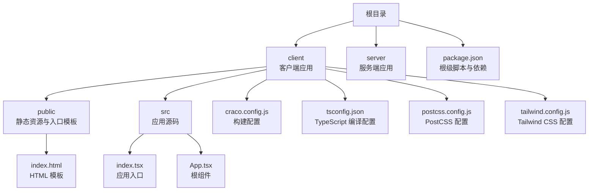
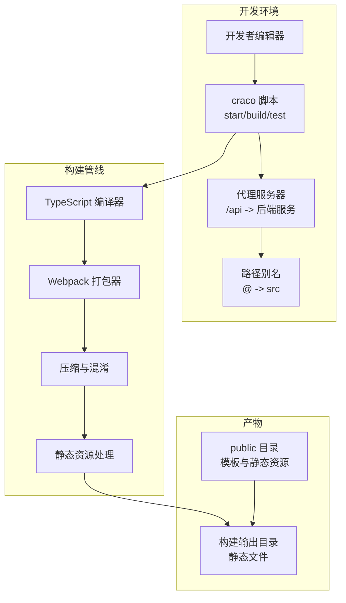
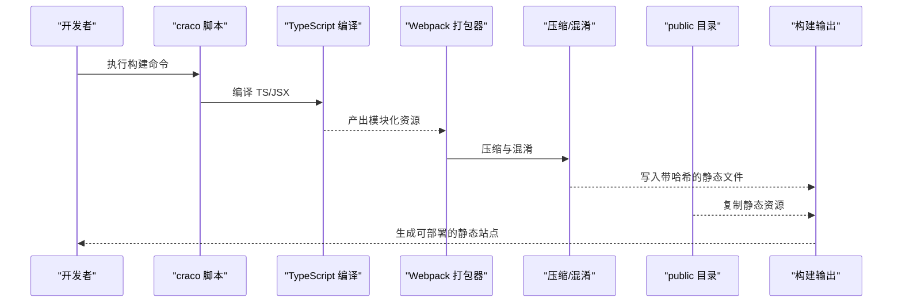
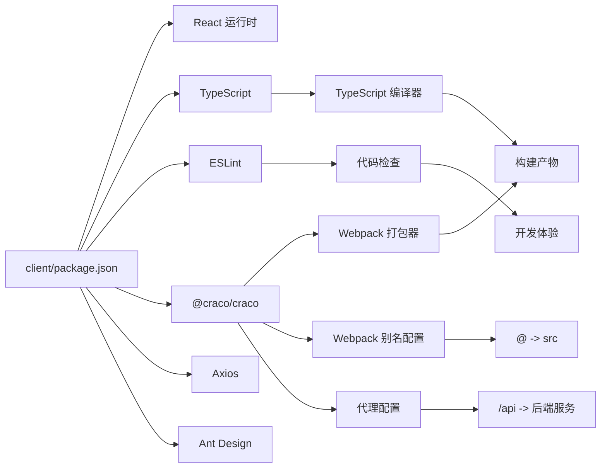

# 构建与部署

<cite>
**本文引用的文件**
- [client/package.json](file://client/package.json)
- [client/craco.config.js](file://client/craco.config.js)
- [client/postcss.config.js](file://client/postcss.config.js)
- [client/tailwind.config.js](file://client/tailwind.config.js)
- [client/tsconfig.json](file://client/tsconfig.json)
- [client/public/index.html](file://client/public/index.html)
- [client/src/index.tsx](file://client/src/index.tsx)
- [client/src/App.tsx](file://client/src/App.tsx)
- [client/src/utils/request.ts](file://client/src/utils/request.ts)
- [client/src/router/index.tsx](file://client/src/router/index.tsx)
- [package.json](file://package.json)
- [README.md](file://README.md)
</cite>

## 更新摘要
**变更内容**
- 更新构建系统从 react-scripts 迁移到 @craco/craco
- 新增 craco build 命令和代理配置说明
- 添加路径别名配置和 Jest 配置
- 更新开发服务器代理功能说明
- 更新构建脚本和依赖关系

## 目录
1. [简介](#简介)
2. [项目结构](#项目结构)
3. [核心组件](#核心组件)
4. [架构总览](#架构总览)
5. [详细组件分析](#详细组件分析)
6. [依赖分析](#依赖分析)
7. [性能考虑](#性能考虑)
8. [故障排查指南](#故障排查指南)
9. [结论](#结论)
10. [附录](#附录)

## 简介
本指南面向使用 Create React App (CRA) 技术栈并采用 @craco/craco 扩展配置的 React 项目，提供从本地开发到生产构建、优化与部署的完整流程说明。内容涵盖：
- 生产构建过程与输出文件结构
- package.json 中构建脚本的作用与可选配置
- 静态资源处理与缓存策略
- 不同部署平台（GitHub Pages、Netlify、Vercel 等）的配置要点
- CI/CD 集成最佳实践
- 版本管理与发布流程
- 性能优化建议与部署后监控方案
- 面向不同规模项目的部署策略建议

## 项目结构
该仓库采用标准 CRA 结构，但通过 @craco/craco 提供了增强的构建配置能力。核心目录与文件如下：
- client/public：静态资源与入口模板
- client/src：应用源码（入口、组件、样式等）
- client：craco 配置文件，提供 webpack 别名、代理和 Jest 配置
- 根目录配置：包管理、类型检查、代码质量工具等

**图表来源**
- [client/package.json](file://client/package.json)
- [client/craco.config.js](file://client/craco.config.js)
- [client/public/index.html](file://client/public/index.html)
- [client/src/index.tsx](file://client/src/index.tsx)
- [client/src/App.tsx](file://client/src/App.tsx)
- [client/tsconfig.json](file://client/tsconfig.json)
- [client/postcss.config.js](file://client/postcss.config.js)
- [client/tailwind.config.js](file://client/tailwind.config.js)

**章节来源**
- [client/package.json](file://client/package.json)
- [client/craco.config.js](file://client/craco.config.js)
- [client/public/index.html](file://client/public/index.html)
- [client/src/index.tsx](file://client/src/index.tsx)
- [client/src/App.tsx](file://client/src/App.tsx)
- [client/tsconfig.json](file://client/tsconfig.json)
- [client/postcss.config.js](file://client/postcss.config.js)
- [client/tailwind.config.js](file://client/tailwind.config.js)

## 核心组件
- 构建脚本与命令
  - 开发启动：通过 craco start 启动本地开发服务器，支持代理和路径别名
  - 生产构建：通过 craco build 生成优化后的静态产物
  - 测试：通过 craco test 运行单元测试，支持路径别名映射
  - 代码质量：执行 ESLint 检查
  - 升级/移除封装：暴露底层构建配置（谨慎使用）

- Craco 配置系统
  - Webpack 别名：@ 指向 src 目录，支持绝对路径导入
  - 开发服务器代理：将 /api 请求代理到后端服务
  - Jest 配置：同步路径别名映射到测试环境

- TypeScript 配置
  - 编译目标、模块系统、严格模式、JSX 处理等
  - 仅在编译阶段使用，不参与运行时

- PostCSS 和 Tailwind CSS
  - PostCSS 插件链：Tailwind CSS + Autoprefixer
  - Tailwind CSS 配置：禁用 preflight 避免与 Ant Design 冲突

**章节来源**
- [client/package.json:27-35](file://client/package.json#L27-L35)
- [client/craco.config.js:9-36](file://client/craco.config.js#L9-L36)
- [client/tsconfig.json:1-31](file://client/tsconfig.json#L1-L31)
- [client/postcss.config.js:1-7](file://client/postcss.config.js#L1-L7)
- [client/tailwind.config.js:1-20](file://client/tailwind.config.js#L1-L20)

## 架构总览
下图展示从源码到生产产物的关键路径与职责分工，重点体现 @craco/craco 的增强功能。

**图表来源**
- [client/package.json:27-35](file://client/package.json#L27-L35)
- [client/craco.config.js:17-26](file://client/craco.config.js#L17-L26)
- [client/craco.config.js:10-15](file://client/craco.config.js#L10-L15)
- [client/public/index.html](file://client/public/index.html)

## 详细组件分析

### 构建脚本与命令详解
- 启动开发服务器：通过 craco start 启动本地开发服务器，支持代理和路径别名
- 生产构建：通过 craco build 生成可在任意静态服务器托管的产物
- 运行测试：通过 craco test 基于 Jest 的测试框架，支持路径别名映射
- 升级封装：暴露底层构建配置，适合需要深度定制的场景
- 代码质量：ESLint 扁平配置，支持多语言文件

**更新** 从 react-scripts 迁移到 @craco/craco，提供更灵活的构建配置能力

**章节来源**
- [client/package.json:27-35](file://client/package.json#L27-L35)
- [client/craco.config.js:9-36](file://client/craco.config.js#L9-L36)

### Craco 配置系统详解
- Webpack 别名配置：将 @ 映射到 src 目录，支持绝对路径导入，如 `import Component from '@/components/Component'`
- 开发服务器代理：将 /api 请求代理到后端服务，默认目标为 http://localhost:3001，可通过 PROXY_TARGET 环境变量配置
- Jest 配置：同步路径别名映射到测试环境，确保测试中的绝对路径导入正常工作

**新增** Craco 配置系统提供了比原生 CRA 更强大的定制能力

**章节来源**
- [client/craco.config.js:9-36](file://client/craco.config.js#L9-L36)

### 生产构建流程与输出结构
- 入口模板：HTML 模板中通过占位符引用静态资源，构建时会被替换为带哈希的文件名
- 输出产物：包含已打包的 JS/CSS、图片等静态资源；入口 HTML 由模板生成
- 资源命名：构建后资源名包含哈希，便于浏览器缓存与失效控制
- public 目录：直接复制到构建输出，作为静态资源根目录

**图表来源**
- [client/package.json:27-35](file://client/package.json#L27-L35)
- [client/public/index.html](file://client/public/index.html)

**章节来源**
- [client/public/index.html](file://client/public/index.html)
- [client/package.json:27-35](file://client/package.json#L27-L35)

### 静态资源处理与缓存策略
- 资源定位：HTML 模板中的占位符会在构建时解析为最终路径
- 哈希命名：产物文件名包含哈希，实现强缓存与按需更新
- 缓存策略建议：
  - 静态资源：设置较长的缓存时间（如一年），结合文件名哈希实现失效
  - HTML：短缓存或不缓存，确保用户始终获取最新入口
  - Manifest 与图标：单独设置合理的缓存头
- 服务端配置：根据部署平台要求设置 Cache-Control 与 ETag/Last-Modified

**章节来源**
- [client/public/index.html](file://client/public/index.html)

### 部署平台配置指南
- GitHub Pages
  - 使用静态站点托管，将构建输出目录作为发布根目录
  - 注意子路径部署时的公共路径配置（如仓库名）
  - 参考：构建脚本与 public 目录的配合
- Netlify/Vercel
  - 选择静态站点部署，上传构建输出目录
  - 设置函数/边缘网关（如需 API 或 SSR）时，遵循平台规范
  - 利用平台提供的缓存与 CDN 加速
- 自托管
  - 将构建输出目录部署至 Nginx/Apache 等静态服务器
  - 配置 Gzip/Brotli 压缩与 HTTPS
  - 设置合适的缓存头与安全响应头

**章节来源**
- [client/package.json:27-35](file://client/package.json#L27-L35)
- [client/public/index.html](file://client/public/index.html)

### CI/CD 集成最佳实践
- 触发条件：主分支推送、标签推送、PR 合并
- 步骤建议：
  - 安装依赖（使用锁文件）
  - 运行测试与 ESLint
  - 执行生产构建
  - 产物上传（Artifacts/S3/对象存储）
  - 部署到目标平台（调用平台提供的 CLI 或 API）
- 安全与缓存：
  - 缓存依赖目录以提升速度
  - 保护敏感变量（如部署令牌）
- 质量门禁：失败即阻断发布

**章节来源**
- [client/package.json:27-35](file://client/package.json#L27-L35)
- [client/craco.config.js:17-26](file://client/craco.config.js#L17-L26)

### 版本管理与发布流程
- 版本号：遵循语义化版本（MAJOR.MINOR.PATCH）
- 发布步骤：
  - 在主分支上打标签（如 v0.1.0）
  - 触发 CI 构建与部署流水线
  - 产物发布至目标平台
- 回滚策略：保留最近几个版本的产物，必要时回滚到上一个稳定版本

**章节来源**
- [client/package.json:2-4](file://client/package.json#L2-L4)

### 性能优化建议
- 资源体积
  - 分析包体构成，拆分第三方库与业务代码
  - 启用按需加载与懒加载
- 静态资源
  - 图片与字体进行压缩与格式优化（WebP/WOFF2）
  - 启用 Gzip/Brotli 压缩
- 缓存与网络
  - 对静态资源设置长缓存，HTML 短缓存
  - 使用 CDN 与边缘节点加速
- 运行时
  - 移除未使用的依赖与代码
  - 使用严格模式与最小化副作用

**章节来源**
- [client/package.json:27-35](file://client/package.json#L27-L35)
- [client/tsconfig.json:1-31](file://client/tsconfig.json#L1-L31)

### 部署后监控方案
- 关键指标
  - 首屏渲染时间（FCP/LCP）、交互时间（LH）
  - 静态资源加载时间与错误率
  - 用户行为与转化路径
- 工具建议
  - Web Vitals 采集与告警
  - APM/日志平台（如 Sentry/DataDog）
  - CDN/平台自带监控面板
- 响应机制
  - 建立变更评审与灰度发布
  - 快速回滚与应急预案

**章节来源**
- [client/src/index.tsx:16-18](file://client/src/index.tsx#L16-L18)

### 不同规模项目的部署策略建议
- 小型项目（个人/小团队）
  - 直接使用静态托管（Vercel/Netlify/GitHub Pages）
  - 无需复杂 CI，手动触发即可
- 中型项目（团队协作）
  - 引入 CI/CD，自动化测试与构建
  - 多环境（开发/预发/生产）分离
- 大型项目（企业级）
  - 边缘网关与微前端架构
  - 多区域部署与蓝绿/金丝雀发布
  - 强化监控与可观测性

## 依赖分析
- 运行时依赖
  - React 生态与测试工具链
  - Ant Design UI 组件库
  - Axios HTTP 客户端
- 构建与开发依赖
  - @craco/craco 提供增强的 CRA 配置能力
  - TypeScript 与 ESLint 保障类型安全与代码质量
  - PostCSS + Tailwind CSS 提供现代化样式解决方案
- 浏览器兼容性
  - 通过 browserslist 配置目标浏览器范围

**图表来源**
- [client/package.json:5-26](file://client/package.json#L5-L26)
- [client/package.json:54-71](file://client/package.json#L54-L71)
- [client/craco.config.js:9-36](file://client/craco.config.js#L9-L36)
- [client/tsconfig.json:1-31](file://client/tsconfig.json#L1-L31)
- [client/postcss.config.js:1-7](file://client/postcss.config.js#L1-L7)
- [client/tailwind.config.js:1-20](file://client/tailwind.config.js#L1-L20)

**章节来源**
- [client/package.json:5-26](file://client/package.json#L5-L26)
- [client/package.json:54-71](file://client/package.json#L54-L71)
- [client/craco.config.js:9-36](file://client/craco.config.js#L9-L36)
- [client/tsconfig.json:1-31](file://client/tsconfig.json#L1-L31)
- [client/postcss.config.js:1-7](file://client/postcss.config.js#L1-L7)
- [client/tailwind.config.js:1-20](file://client/tailwind.config.js#L1-L20)

## 性能考虑
- 构建优化
  - 合理的模块拆分与代码分割
  - 压缩与去重策略
  - 路径别名减少模块解析开销
- 运行时优化
  - 减少不必要的重渲染
  - 合理使用 memo 与懒加载
- 资源优化
  - 图片与字体的格式与尺寸优化
  - 启用压缩与缓存策略

## 故障排查指南
- 构建失败
  - 检查依赖安装与 Node 版本
  - 查看构建日志中的具体报错信息
- 开发服务器问题
  - 确认代理配置正确，PROXY_TARGET 环境变量设置
  - 检查路径别名配置是否生效
- 运行异常
  - 确认 public 目录下的静态资源是否正确复制
  - 校验 HTML 模板中的占位符是否被正确替换
- 测试问题
  - 确保测试环境的路径别名映射正确
  - 在 CI 中统一执行测试与 lint

**更新** 新增 Craco 配置相关的故障排查指南

**章节来源**
- [client/package.json:27-35](file://client/package.json#L27-L35)
- [client/craco.config.js:17-26](file://client/craco.config.js#L17-L26)
- [client/craco.config.js:28-35](file://client/craco.config.js#L28-L35)
- [client/public/index.html](file://client/public/index.html)

## 结论
本指南围绕采用 @craco/craco 扩展的 CRA 项目提供了从构建到部署的完整方法论，强调了静态资源处理、缓存策略、CI/CD 集成与版本管理的重要性。@craco/craco 的引入为项目提供了更灵活的构建配置能力，包括路径别名、代理配置和 Jest 集成等功能。针对不同规模的项目，建议采用渐进式的部署与监控策略，持续优化性能与稳定性。

## 附录
- 快速参考
  - 开发：执行 craco start 启动本地开发服务器
  - 构建：执行 craco build 生成生产静态产物
  - 测试：执行 craco test 运行测试套件
  - 质量：执行 ESLint 检查
- 平台差异
  - 子路径部署、公共路径、边缘计算等差异需在各平台文档中确认
- Craco 配置
  - 路径别名：@ 指向 src 目录
  - 代理配置：/api 请求转发到后端服务
  - Jest 配置：同步路径别名映射

**章节来源**
- [README.md:5-8](file://README.md#L5-L8)
- [client/package.json:27-35](file://client/package.json#L27-L35)
- [client/craco.config.js:9-36](file://client/craco.config.js#L9-L36)