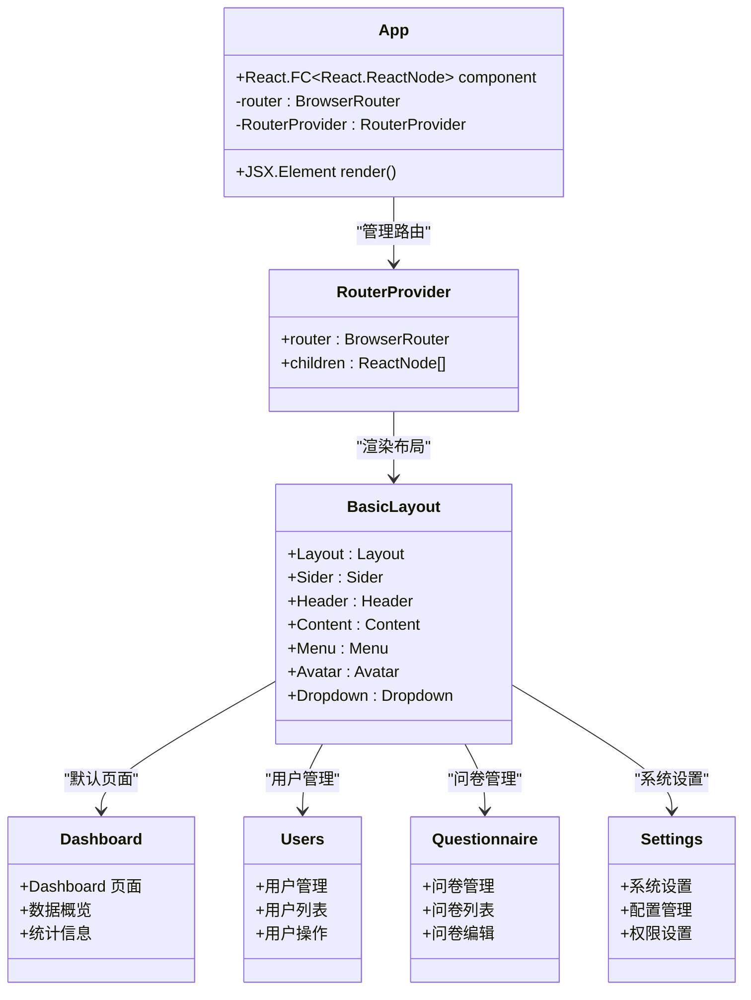
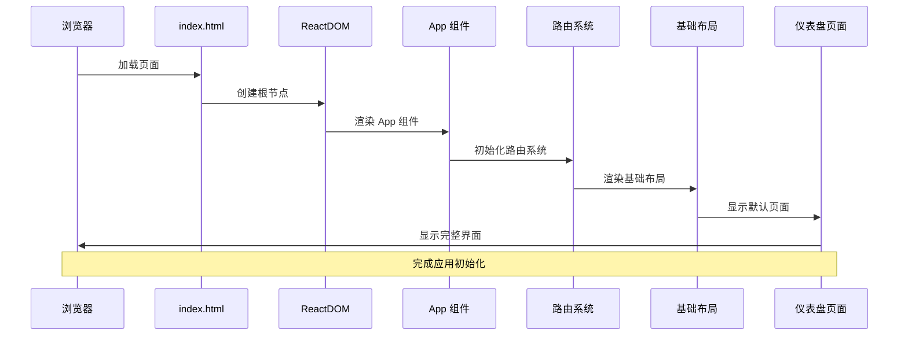
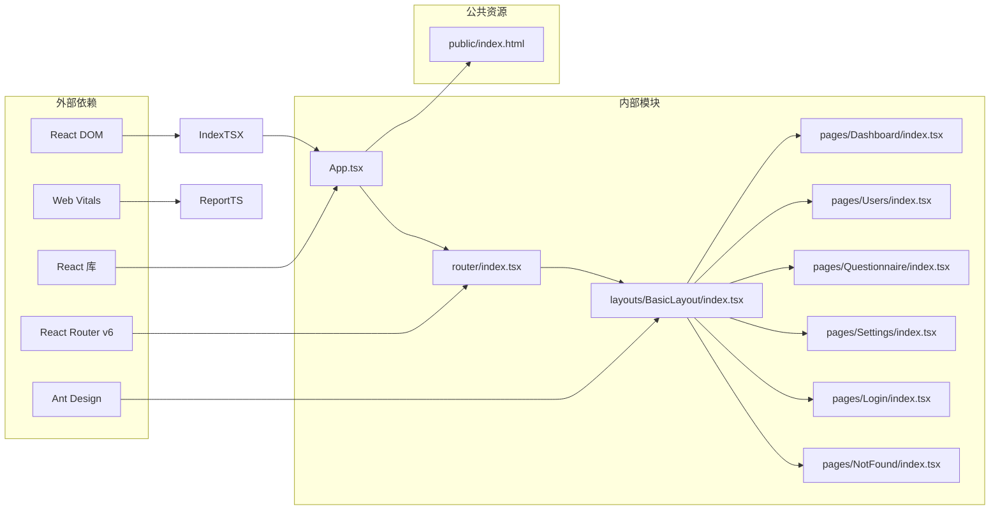
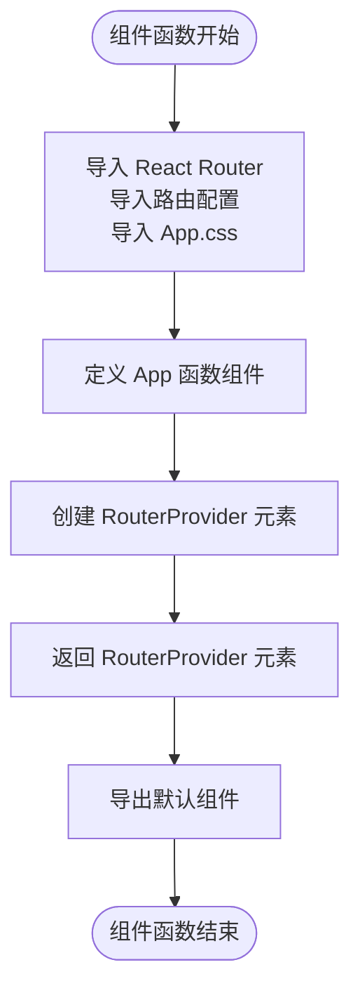
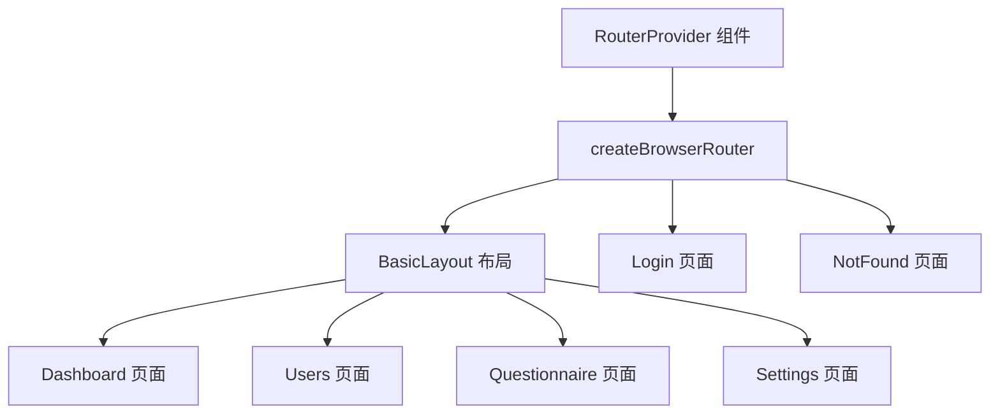
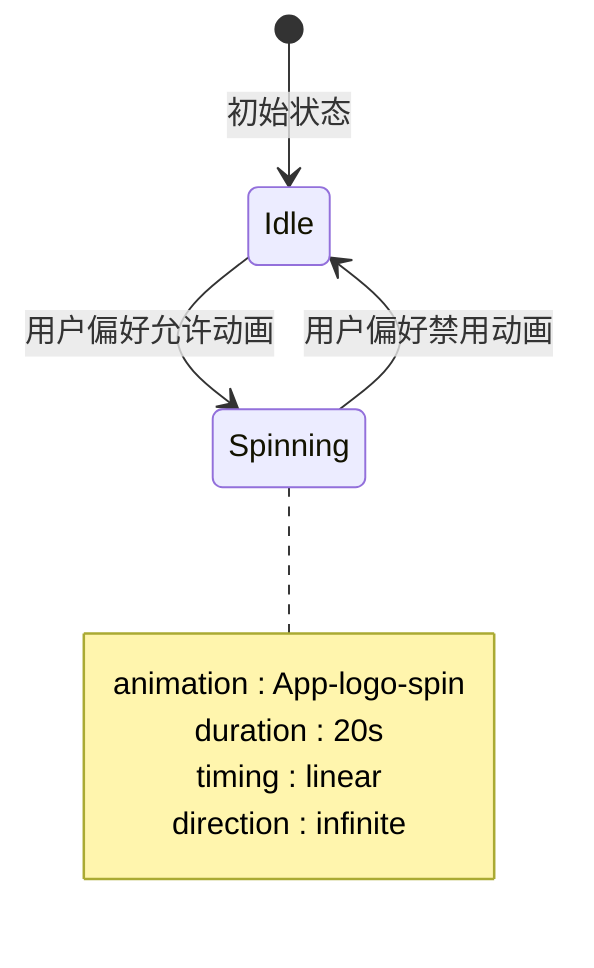
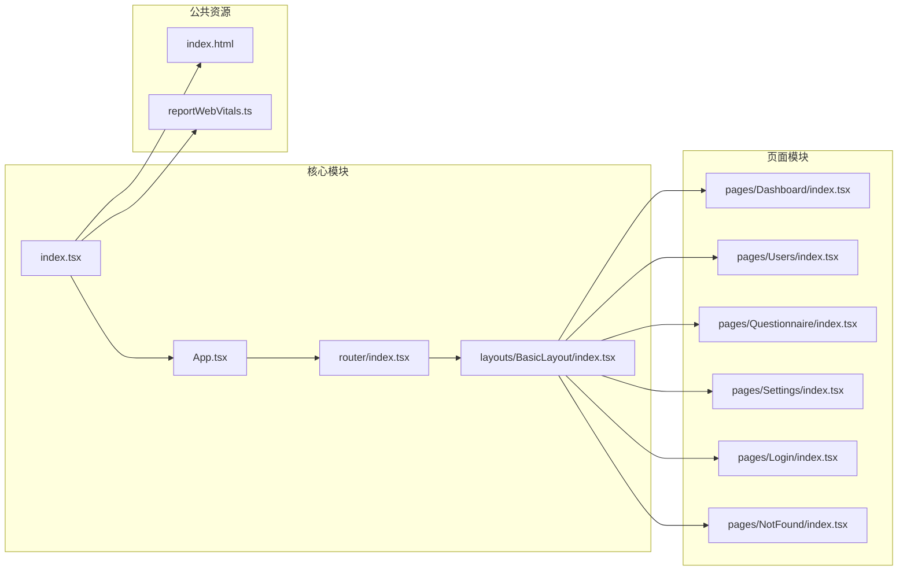

# App 组件

<cite>
**本文档引用的文件**
- [client/src/App.tsx](file://client/src/App.tsx)
- [client/src/App.css](file://client/src/App.css)
- [client/src/index.tsx](file://client/src/index.tsx)
- [client/public/index.html](file://client/public/index.html)
- [client/src/router/index.tsx](file://client/src/router/index.tsx)
- [client/src/layouts/BasicLayout/index.tsx](file://client/src/layouts/BasicLayout/index.tsx)
- [client/src/pages/Dashboard/index.tsx](file://client/src/pages/Dashboard/index.tsx)
- [client/src/reportWebVitals.ts](file://client/src/reportWebVitals.ts)
- [package.json](file://package.json)
</cite>

## 更新摘要
**变更内容**
- 更新应用入口点路径从 `src/App.tsx` 到 `client/src/App.tsx`
- 重构组件架构以支持现代 React 路由系统
- 新增完整的后台管理系统结构
- 集成 Ant Design UI 组件库
- 添加多页面路由和布局系统

## 目录
1. [简介](#简介)
2. [项目结构](#项目结构)
3. [核心组件](#核心组件)
4. [架构概览](#架构概览)
5. [详细组件分析](#详细组件分析)
6. [依赖关系分析](#依赖关系分析)
7. [性能考虑](#性能考虑)
8. [故障排除指南](#故障排除指南)
9. [结论](#结论)
10. [附录](#附录)

## 简介

App 组件是基于 Create React App 模板构建的现代化 React 应用程序的核心入口点组件。经过重构后，该组件不再是简单的静态页面，而是演变为一个功能完整的后台管理系统入口，负责管理整个应用的路由和页面渲染。

该组件采用函数式组件模式，使用现代 React 特性和 React Router v6 进行页面导航管理。通过引入 Ant Design UI 组件库，App.tsx 为开发者提供了一个功能丰富的企业级应用起点，展示了如何在 React 应用中组织复杂的路由系统、布局管理和组件架构。

## 项目结构

React Next 项目现已演进为一个完整的后台管理系统，采用 Monorepo 架构，具有清晰的功能模块化组织：

```mermaid
graph TB
subgraph "项目根目录"
Root[项目根目录]
subgraph "客户端应用 (client)"
Client[client/]
subgraph "源代码目录 (client/src)"
AppTSX[client/src/App.tsx]
AppCSS[client/src/App.css]
IndexTSX[client/src/index.tsx]
RouterTSX[client/src/router/index.tsx]
ReportTS[client/src/reportWebVitals.ts]
BasicLayout[client/src/layouts/BasicLayout/index.tsx]
Dashboard[client/src/pages/Dashboard/index.tsx]
Users[client/src/pages/Users/index.tsx]
Questionnaire[client/src/pages/Questionnaire/index.tsx]
Settings[client/src/pages/Settings/index.tsx]
Login[client/src/pages/Login/index.tsx]
NotFound[client/src/pages/NotFound/index.tsx]
end
subgraph "公共资源目录 (client/public)"
IndexHTML[client/public/index.html]
end
subgraph "配置文件"
PackageJSON[package.json]
ClientPackage[client/package.json]
CracoConfig[client/craco.config.js]
TailwindConfig[client/tailwind.config.js]
End
end
Root --> Client
Client --> AppTSX
Client --> AppCSS
Client --> IndexTSX
Client --> RouterTSX
Client --> ReportTS
Client --> BasicLayout
Client --> Dashboard
Client --> Users
Client --> Questionnaire
Client --> Settings
Client --> Login
Client --> NotFound
Client --> IndexHTML
Client --> PackageJSON
Client --> CracoConfig
Client --> TailwindConfig
```

**图表来源**
- [client/src/App.tsx:1-10](file://client/src/App.tsx#L1-L10)
- [client/src/index.tsx:1-18](file://client/src/index.tsx#L1-L18)
- [client/public/index.html:1-45](file://client/public/index.html#L1-L45)

**章节来源**
- [package.json:1-24](file://package.json#L1-L24)

## 核心组件

### 组件结构概述

App 组件经过重构后，采用了全新的架构模式：



**图表来源**
- [client/src/App.tsx:5-7](file://client/src/App.tsx#L5-L7)
- [client/src/router/index.tsx:1-28](file://client/src/router/index.tsx#L1-L28)
- [client/src/layouts/BasicLayout/index.tsx:1-100](file://client/src/layouts/BasicLayout/index.tsx#L1-L100)

### JSX 结构分析

组件的 JSX 结构体现了现代化的路由管理理念：

1. **路由提供者**: `<RouterProvider router={router} />` 管理整个应用的路由
2. **布局容器**: 通过 BasicLayout 组件实现统一的页面布局
3. **页面渲染**: 使用 `<Outlet />` 实现嵌套路由的动态渲染
4. **导航系统**: 集成 Ant Design 的菜单和导航组件

**章节来源**
- [client/src/App.tsx:5-7](file://client/src/App.tsx#L5-L7)
- [client/src/router/index.tsx:9-25](file://client/src/router/index.tsx#L9-L25)

## 架构概览

### 应用启动流程



**图表来源**
- [client/src/index.tsx:7-12](file://client/src/index.tsx#L7-L12)
- [client/public/index.html:32](file://client/public/index.html#L32)

### 组件依赖关系



**图表来源**
- [client/src/App.tsx:1-3](file://client/src/App.tsx#L1-L3)
- [client/src/index.tsx:1-5](file://client/src/index.tsx#L1-L5)

**章节来源**
- [client/src/index.tsx:1-18](file://client/src/index.tsx#L1-L18)
- [package.json:18-22](file://package.json#L18-L22)

## 详细组件分析

### App.tsx 组件实现

#### 导入模块分析

组件通过 ES6 模块系统导入了现代化的依赖：

- **React Router**: 提供路由管理功能
- **路由配置**: 引入完整的路由配置文件
- **样式文件**: 集成 CSS 样式表以控制视觉外观

#### 组件函数结构



**图表来源**
- [client/src/App.tsx:1-9](file://client/src/App.tsx#L1-L9)

#### 路由系统集成

组件的核心功能是集成 React Router v6 的路由系统：



**图表来源**
- [client/src/App.tsx:5-7](file://client/src/App.tsx#L5-L7)
- [client/src/router/index.tsx:9-25](file://client/src/router/index.tsx#L9-L25)

**章节来源**
- [client/src/App.tsx:1-10](file://client/src/App.tsx#L1-L10)

### App.css 样式系统

#### 样式分类与作用

样式系统保持了原有的简洁设计，专注于基础的布局和动画效果：

| 样式类 | 作用域 | 主要属性 |
|--------|--------|----------|
| `.App` | 全局应用容器 | 文本居中对齐 |
| `.App-logo` | Logo 图像 | 尺寸、动画、事件处理 |
| `.App-header` | 头部区域 | 背景颜色、Flex 布局、高度设置 |
| `.App-link` | 外部链接 | 颜色、视觉样式 |

#### 动画系统实现

组件继续实现了响应式动画效果：



**图表来源**
- [client/src/App.css:10-14](file://client/src/App.css#L10-L14)
- [client/src/App.css:31-38](file://client/src/App.css#L31-L38)

**章节来源**
- [client/src/App.css:1-39](file://client/src/App.css#L1-L39)

### 用户界面设计

#### 视觉层次结构

组件的 UI 设计通过 Ant Design 组件库实现了更丰富的视觉层次：

1. **侧边栏导航**: 深色主题的垂直导航菜单
2. **主内容区**: 白色背景的内容区域
3. **头部工具栏**: 右侧的用户下拉菜单
4. **响应式布局**: 支持折叠展开的侧边栏

#### 响应式设计

样式系统支持多种设备和屏幕尺寸：

- **视口单位**: 使用 `vmin` 单位确保缩放一致性
- **媒体查询**: 基于用户偏好设置的动画控制
- **弹性布局**: Flexbox 实现自适应排列

**章节来源**
- [client/src/App.css:16-25](file://client/src/App.css#L16-L25)

## 依赖关系分析

### 外部依赖管理

项目使用现代化的前端开发工具链：

```mermaid
graph TB
subgraph "运行时依赖"
ReactRuntime[react ^19.2.6]
ReactDOMRuntime[react-dom ^19.2.6]
ReactRouterRuntime[react-router-dom ^6.26.1]
AntDesignRuntime[antd ^5.21.2]
TypesReact[@types/react ^19.2.14]
TypesReactDom[@types/react-dom ^19.2.3]
end
subgraph "开发时依赖"
ReactScripts[react-scripts 5.0.1]
TypeScript[typescript ^4.9.5]
ESLint[eslint ^10.4.0]
WebVitals[web-vitals ^2.1.4]
AntDesignIcons[@ant-design/icons ^5.5.1]
TailwindCSS[tailwindcss ^3.4.1]
end
subgraph "测试依赖"
TestingLib[Testing Library]
Jest[Jest 框架]
end
ReactRuntime --> AppTSX
ReactDOMRuntime --> IndexTSX
ReactRouterRuntime --> RouterTSX
AntDesignRuntime --> BasicLayout
ReactScripts --> BuildProcess
TypeScript --> TypeChecking
```

**图表来源**
- [package.json:18-22](file://package.json#L18-L22)

### 内部模块依赖



**图表来源**
- [client/src/App.tsx:1-3](file://client/src/App.tsx#L1-L3)
- [client/src/index.tsx:4](file://client/src/index.tsx#L4)

**章节来源**
- [package.json:1-24](file://package.json#L1-L24)

## 性能考虑

### 渲染优化策略

1. **路由懒加载**: React Router v6 支持自动的路由懒加载
2. **组件分割**: 通过路由系统实现代码分割
3. **样式缓存**: CSS 类名复用减少样式计算开销
4. **动画优化**: 基于用户偏好的动画控制

### 性能监控

项目集成了 Web Vitals 性能监控：

- **CLS**: 累积布局偏移测量
- **FID**: 首次输入延迟评估  
- **FCP**: 首次内容绘制时间
- **LCP**: 最大内容绘制时间
- **TTFB**: 首字节到达时间

**章节来源**
- [client/src/reportWebVitals.ts:1-16](file://client/src/reportWebVitals.ts#L1-L16)

## 故障排除指南

### 常见问题诊断

#### 路由不工作

**症状**: 页面无法正确导航或显示空白
**可能原因**:
- 路由配置错误
- 组件导入路径问题
- 路由依赖缺失

**解决方案**:
1. 验证路由配置文件的正确性
2. 检查组件导入路径
3. 确认 React Router 依赖已安装
4. 使用浏览器开发者工具调试路由

#### 布局显示异常

**症状**: 侧边栏或头部显示不正确
**可能原因**:
- Ant Design 样式未正确加载
- CSS 类名冲突
- 组件依赖问题

**解决方案**:
1. 确认 Ant Design 已正确安装和配置
2. 检查样式文件的导入顺序
3. 验证组件依赖的完整性
4. 清除浏览器缓存

#### 动画效果异常

**症状**: Logo 动画停止或行为异常
**可能原因**:
- 用户偏好设置禁用动画
- CSS 动画规则冲突
- 浏览器兼容性问题

**解决方案**:
1. 检查系统动画偏好设置
2. 验证 @keyframes 规则
3. 测试不同浏览器兼容性
4. 调整动画持续时间参数

**章节来源**
- [client/src/App.css:10-14](file://client/src/App.css#L10-L14)

## 结论

App 组件经过重构后，成功地从一个简单的静态页面演进为一个功能完整的后台管理系统入口。该组件通过现代化的路由系统、Ant Design UI 组件库和模块化的架构设计，为开发者提供了一个企业级应用的完整模板。

组件的关键优势包括：
- **现代化架构**: 基于 React Router v6 的路由系统
- **企业级设计**: 集成 Ant Design 组件库
- **模块化组织**: 清晰的功能模块划分
- **性能优化**: 支持懒加载和代码分割
- **可扩展性**: 易于添加新页面和功能

对于初学者而言，App 组件提供了理解现代 React 应用开发的绝佳起点，涵盖了从基础路由管理到复杂 UI 组件集成的完整学习路径。

## 附录

### 使用示例

#### 基础使用

```typescript
// 在 index.tsx 中使用
import App from './App';

root.render(
  <React.StrictMode>
    <App />
  </React.StrictMode>
);
```

#### 自定义选项

1. **添加新页面**: 在 `pages/` 目录下创建新组件
2. **配置路由**: 在 `router/index.tsx` 中添加路由配置
3. **修改布局**: 在 `layouts/BasicLayout/` 中调整布局
4. **更新样式**: 在 `App.css` 中添加或修改样式规则

### 开发环境配置

#### 必需工具

- **Node.js**: 版本 16.18.126 或更高
- **包管理器**: npm 10.9.0 或 pnpm 10.20.0
- **IDE**: 支持 TypeScript 的编辑器

#### 常用命令

- `npm start:client`: 启动客户端开发服务器
- `npm start:server`: 启动服务端开发服务器
- `npm run build`: 构建生产版本
- `npm test`: 运行测试套件
- `npm run lint`: 运行 ESLint 代码检查

**章节来源**
- [package.json:6-16](file://package.json#L6-L16)
- [package.json:18-22](file://package.json#L18-L22)