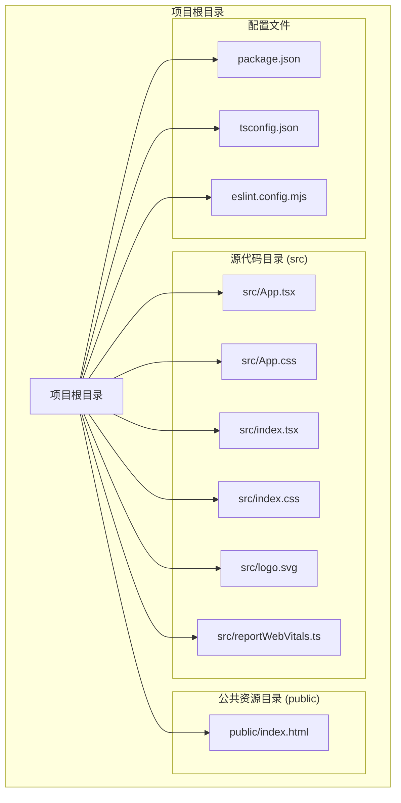
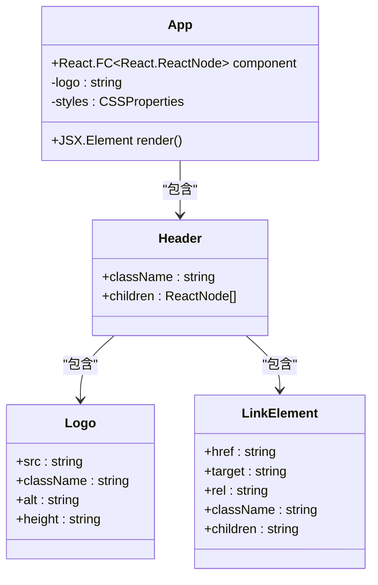
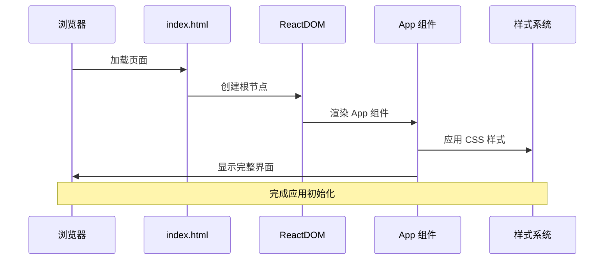
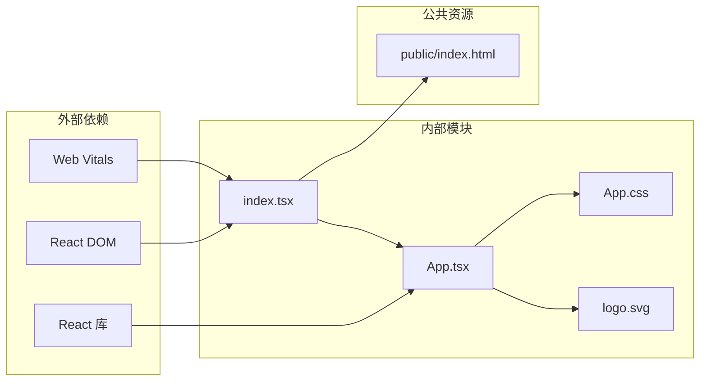
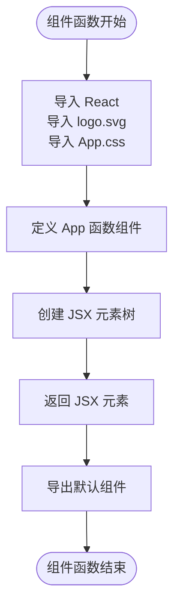
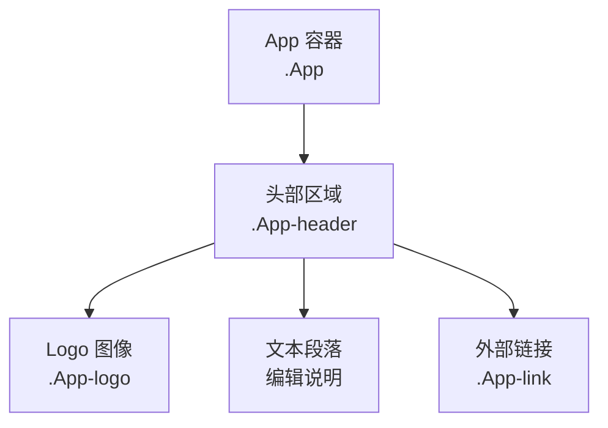
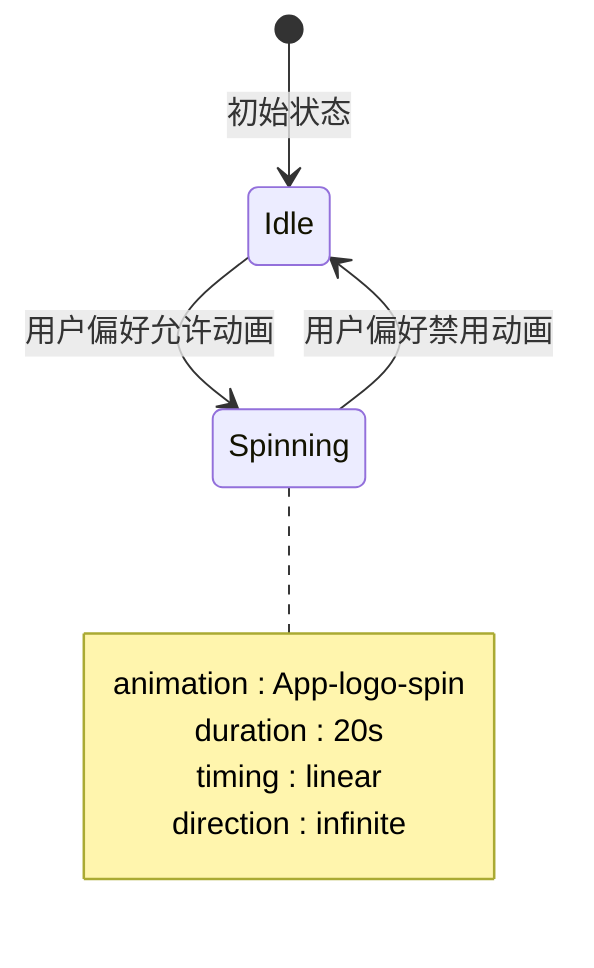
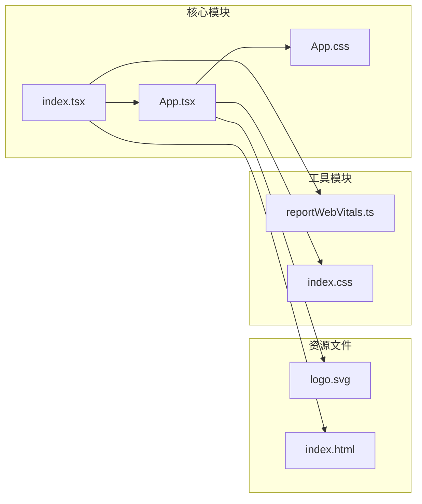

# App 组件

<cite>
**本文档引用的文件**
- [src/App.tsx](file://src/App.tsx)
- [src/App.css](file://src/App.css)
- [src/index.tsx](file://src/index.tsx)
- [public/index.html](file://public/index.html)
- [src/index.css](file://src/index.css)
- [src/reportWebVitals.ts](file://src/reportWebVitals.ts)
- [package.json](file://package.json)
- [README.md](file://README.md)
</cite>

## 目录
1. [简介](#简介)
2. [项目结构](#项目结构)
3. [核心组件](#核心组件)
4. [架构概览](#架构概览)
5. [详细组件分析](#详细组件分析)
6. [依赖关系分析](#依赖关系分析)
7. [性能考虑](#性能考虑)
8. [故障排除指南](#故障排除指南)
9. [结论](#结论)
10. [附录](#附录)

## 简介

App 组件是基于 Create React App 模板构建的 React 应用程序的核心入口点组件。该组件展示了 React 的基本概念，包括 JSX 语法、组件结构、样式集成和用户交互元素。作为整个应用程序的根组件，App.tsx 负责渲染应用程序的主要界面布局，包含头部区域、Logo 动画效果和外部链接等关键元素。

本组件采用函数式组件模式，使用现代 React 特性如 hooks（虽然当前版本中未使用），并集成了 CSS 样式系统和动画效果。它为开发者提供了一个清晰的起点，展示如何在 React 应用中组织代码结构和样式管理。

## 项目结构

React Next 项目遵循标准的 Create React App 项目结构，具有清晰的模块化组织：



**图表来源**
- [src/App.tsx:1-27](file://src/App.tsx#L1-L27)
- [src/index.tsx:1-20](file://src/index.tsx#L1-L20)
- [public/index.html:1-44](file://public/index.html#L1-L44)

**章节来源**
- [package.json:1-55](file://package.json#L1-L55)
- [README.md:1-15](file://README.md#L1-L15)

## 核心组件

### 组件结构概述

App 组件是一个纯函数式组件，采用简洁的 JSX 结构设计：



**图表来源**
- [src/App.tsx:5-26](file://src/App.tsx#L5-L26)

### JSX 结构分析

组件的 JSX 结构体现了层次化的 DOM 元素组织：

1. **外层容器**: `<div className="App">` 提供全局应用容器
2. **头部区域**: `<header className="App-header">` 包含所有可见内容
3. **Logo 图像**: ``
4. **文本内容**: `<p>Edit src/App.tsx and save to reload.</p>`
5. **外部链接**: `<a className="App-link" href="https://reactjs.org" target="_blank" rel="noopener noreferrer">Learn React</a>`

**章节来源**
- [src/App.tsx:6-23](file://src/App.tsx#L6-L23)

## 架构概览

### 应用启动流程



**图表来源**
- [src/index.tsx:7-14](file://src/index.tsx#L7-L14)
- [public/index.html:31](file://public/index.html#L31)

### 组件依赖关系



**图表来源**
- [src/App.tsx:1-3](file://src/App.tsx#L1-L3)
- [src/index.tsx:1-5](file://src/index.tsx#L1-L5)

**章节来源**
- [src/index.tsx:1-20](file://src/index.tsx#L1-L20)
- [package.json:5-18](file://package.json#L5-L18)

## 详细组件分析

### App.tsx 组件实现

#### 导入模块分析

组件通过 ES6 模块系统导入必要的依赖：

- **React 核心**: 提供组件功能和生命周期管理
- **Logo 资源**: 通过相对路径导入 SVG 图标资源
- **样式文件**: 集成 CSS 样式表以控制视觉外观

#### 组件函数结构



**图表来源**
- [src/App.tsx:1-26](file://src/App.tsx#L1-L26)

#### JSX 元素树结构

组件的 JSX 结构体现了清晰的层次关系：



**图表来源**
- [src/App.tsx:7-21](file://src/App.tsx#L7-L21)

**章节来源**
- [src/App.tsx:1-27](file://src/App.tsx#L1-L27)

### App.css 样式系统

#### 样式分类与作用

样式系统采用模块化设计，包含以下关键样式类：

| 样式类 | 作用域 | 主要属性 |
|--------|--------|----------|
| `.App` | 全局应用容器 | 文本居中对齐 |
| `.App-header` | 头部区域 | 背景颜色、Flex 布局、高度设置 |
| `.App-logo` | Logo 图像 | 尺寸、动画、事件处理 |
| `.App-link` | 外部链接 | 颜色、视觉样式 |

#### 动画系统实现

组件实现了响应式动画效果：



**图表来源**
- [src/App.css:10-14](file://src/App.css#L10-L14)
- [src/App.css:31-38](file://src/App.css#L31-L38)

**章节来源**
- [src/App.css:1-39](file://src/App.css#L1-L39)

### 用户界面设计

#### 视觉层次结构

组件的 UI 设计遵循清晰的视觉层次：

1. **背景层**: 深色背景 (`#282c34`) 提供对比度
2. **内容层**: 居中对齐的 Flex 布局
3. **强调层**: 蓝色链接 (`#61dafb`) 提供视觉引导

#### 响应式设计

样式系统支持多种设备和屏幕尺寸：

- **视口单位**: 使用 `vmin` 单位确保缩放一致性
- **媒体查询**: 基于用户偏好设置的动画控制
- **弹性布局**: Flexbox 实现自适应排列

**章节来源**
- [src/App.css:16-25](file://src/App.css#L16-L25)

## 依赖关系分析

### 外部依赖管理

项目使用现代前端开发工具链：

```mermaid
graph TB
subgraph "运行时依赖"
ReactRuntime[react ^19.2.6]
ReactDOMRuntime[react-dom ^19.2.6]
TypesReact[@types/react ^19.2.14]
TypesReactDom[@types/react-dom ^19.2.3]
end
subgraph "开发时依赖"
ReactScripts[react-scripts 5.0.1]
TypeScript[typescript ^4.9.5]
ESLint[eslint ^10.4.0]
WebVitals[web-vitals ^2.1.4]
end
subgraph "测试依赖"
TestingLib[Testing Library]
Jest[Jest 框架]
end
ReactRuntime --> AppTSX
ReactDOMRuntime --> IndexTSX
ReactScripts --> BuildProcess
TypeScript --> TypeChecking
```

**图表来源**
- [package.json:5-18](file://package.json#L5-L18)
- [package.json:45-53](file://package.json#L45-L53)

### 内部模块依赖



**图表来源**
- [src/App.tsx:2-3](file://src/App.tsx#L2-L3)
- [src/index.tsx:4](file://src/index.tsx#L4)

**章节来源**
- [package.json:1-55](file://package.json#L1-L55)

## 性能考虑

### 渲染优化策略

1. **最小化重渲染**: 函数组件避免不必要的状态更新
2. **样式缓存**: CSS 类名复用减少样式计算开销
3. **资源优化**: SVG 格式提供高质量缩放能力

### 性能监控

项目集成了 Web Vitals 性能监控：

- **CLS**: 累积布局偏移测量
- **FID**: 首次输入延迟评估  
- **FCP**: 首次内容绘制时间
- **LCP**: 最大内容绘制时间
- **TTFB**: 首字节到达时间

**章节来源**
- [src/reportWebVitals.ts:1-16](file://src/reportWebVitals.ts#L1-L16)

## 故障排除指南

### 常见问题诊断

#### Logo 显示问题

**症状**: Logo 不显示或显示为占位符
**可能原因**:
- SVG 文件路径错误
- 构建配置问题
- 缓存问题

**解决方案**:
1. 验证 SVG 文件存在性
2. 检查相对路径正确性
3. 清除浏览器缓存
4. 重新构建项目

#### 样式不生效

**症状**: 样式未按预期显示
**可能原因**:
- CSS 文件导入失败
- 类名拼写错误
- 样式优先级冲突

**解决方案**:
1. 确认 CSS 文件正确导入
2. 验证类名匹配
3. 检查样式加载顺序
4. 使用浏览器开发者工具调试

#### 动画效果异常

**症状**: Logo 动画停止或行为异常
**可能原因**:
- 用户偏好设置禁用动画
- CSS 动画规则冲突
- 浏览器兼容性问题

**解决方案**:
1. 检查系统动画偏好设置
2. 验证 @keyframes 规则
3. 测试不同浏览器兼容性
4. 调整动画持续时间参数

**章节来源**
- [src/App.css:10-14](file://src/App.css#L10-L14)

## 结论

App 组件作为 React 应用的核心入口点，成功地展示了现代前端开发的最佳实践。该组件通过简洁的 JSX 结构、模块化的样式管理和响应式设计原则，为开发者提供了一个清晰的学习模板。

组件的关键优势包括：
- **清晰的架构**: 层次分明的 JSX 结构便于理解和维护
- **现代化特性**: 集成 CSS 动画和响应式设计
- **性能优化**: 最小化依赖和高效的渲染策略
- **可扩展性**: 模块化设计支持功能扩展和定制

对于初学者而言，App 组件提供了理解 React 组件开发的绝佳起点，涵盖了从基础 JSX 语法到高级样式集成的完整学习路径。

## 附录

### 使用示例

#### 基础使用

```typescript
// 在 index.tsx 中使用
import App from './App';

root.render(
  <React.StrictMode>
    <App />
  </React.StrictMode>
);
```

#### 自定义选项

1. **修改 Logo**: 替换 `src/logo.svg` 文件
2. **调整样式**: 修改 `src/App.css` 中的样式规则
3. **添加内容**: 在 `src/App.tsx` 中添加新的 JSX 元素
4. **更改动画**: 调整 CSS 动画参数

### 开发环境配置

#### 必需工具

- **Node.js**: 版本 16.18.126 或更高
- **包管理器**: npm 10.9.0 或 pnpm 10.20.0
- **IDE**: 支持 TypeScript 的编辑器

#### 常用命令

- `npm start`: 启动开发服务器
- `npm run build`: 构建生产版本
- `npm test`: 运行测试套件
- `npm run lint`: 运行 ESLint 代码检查

**章节来源**
- [README.md:1-15](file://README.md#L1-L15)
- [package.json:20-26](file://package.json#L20-L26)