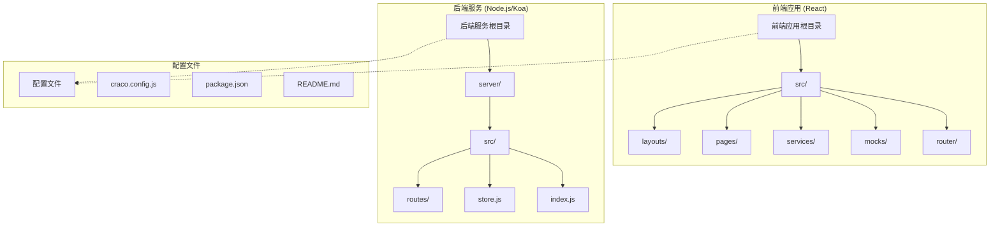
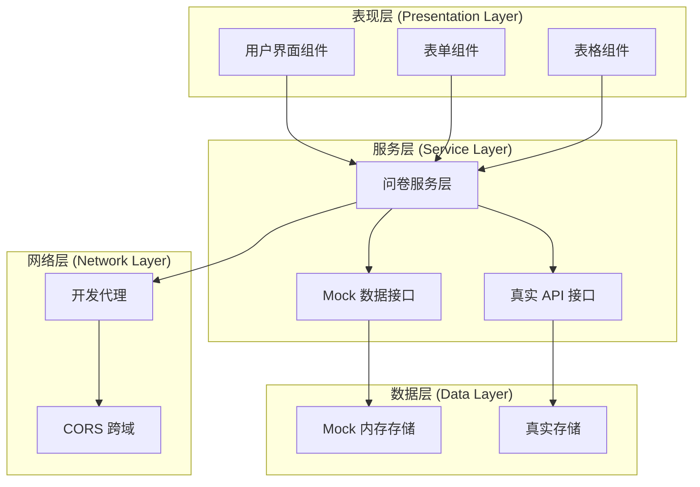
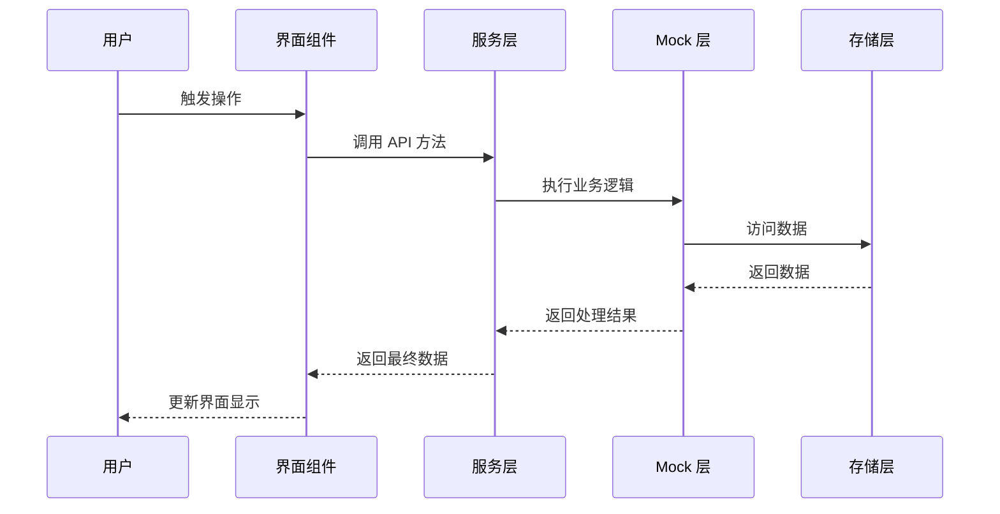
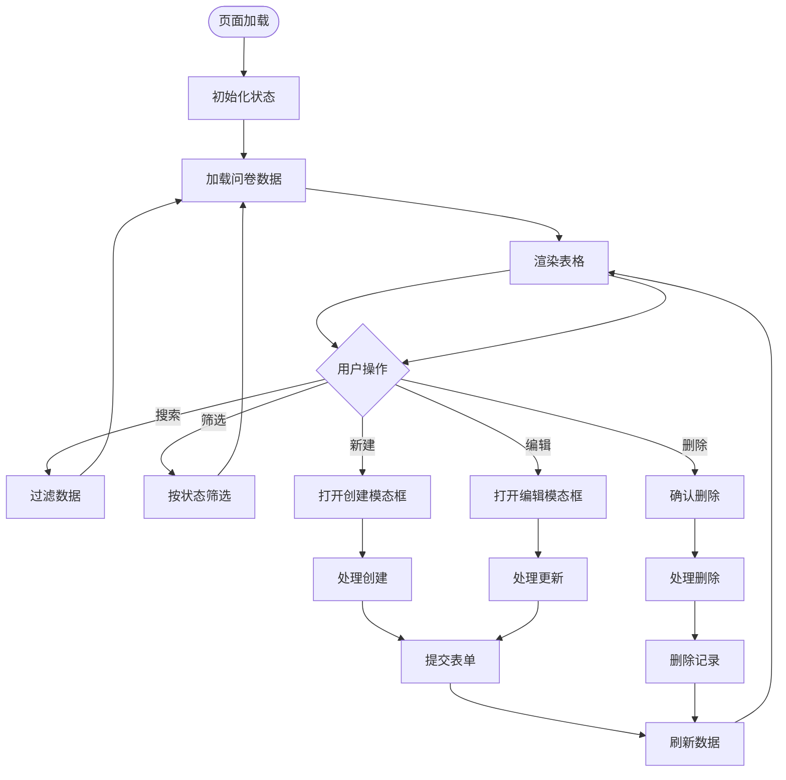
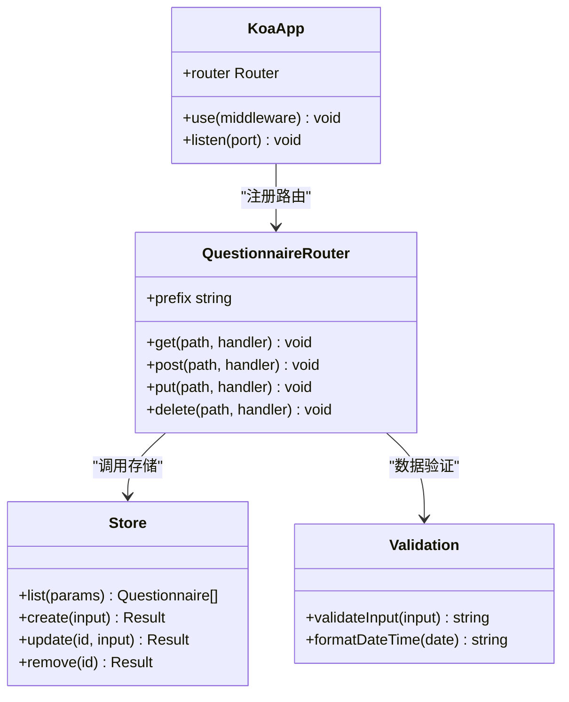

# Mock 数据系统

<cite>
**本文档引用的文件**
- [README.md](file://README.md)
- [package.json](file://package.json)
- [craco.config.js](file://craco.config.js)
- [src/mocks/questionnaire.ts](file://src/mocks/questionnaire.ts)
- [src/services/questionnaire.ts](file://src/services/questionnaire.ts)
- [src/pages/Questionnaire/index.tsx](file://src/pages/Questionnaire/index.tsx)
- [src/router/index.tsx](file://src/router/index.tsx)
- [src/layouts/BasicLayout/index.tsx](file://src/layouts/BasicLayout/index.tsx)
- [src/App.tsx](file://src/App.tsx)
- [server/src/index.js](file://server/src/index.js)
- [server/src/routes/questionnaire.js](file://server/src/routes/questionnaire.js)
- [server/src/store.js](file://server/src/store.js)
</cite>

## 目录
1. [简介](#简介)
2. [项目结构](#项目结构)
3. [核心组件](#核心组件)
4. [架构概览](#架构概览)
5. [详细组件分析](#详细组件分析)
6. [依赖关系分析](#依赖关系分析)
7. [性能考虑](#性能考虑)
8. [故障排除指南](#故障排除指南)
9. [结论](#结论)

## 简介

这是一个基于 React 和 Node.js 的问卷管理系统，采用了 Mock 数据技术来实现前后端分离开发。系统通过 mockjs 生成模拟数据，结合环境变量控制来切换 Mock 模式和真实 API 模式，为开发者提供了灵活的开发和测试环境。

该系统的主要特点包括：
- 前后端完全分离的架构设计
- 支持 Mock 数据和真实 API 双模式运行
- 基于 TypeScript 的类型安全实现
- 完整的问卷 CRUD 操作功能
- 开发环境下的智能代理配置

## 项目结构

项目采用前后端分离的目录结构，主要分为前端应用和后端服务两大部分：



**图表来源**
- [src/App.tsx:1-10](file://src/App.tsx#L1-L10)
- [src/router/index.tsx:1-27](file://src/router/index.tsx#L1-L27)
- [server/src/index.js:1-64](file://server/src/index.js#L1-L64)

**章节来源**
- [README.md:1-29](file://README.md#L1-L29)
- [package.json:1-85](file://package.json#L1-L85)

## 核心组件

### Mock 数据模块

Mock 数据模块是整个系统的核心组件之一，负责生成和管理模拟数据。它基于 mockjs 库实现，提供完整的 CRUD 操作能力。

```mermaid
classDiagram
class Questionnaire {
+string id
+string title
+string description
+number questionCount
+QuestionnaireStatus status
+string createdAt
}
class QueryParams {
+string keyword
+QuestionnaireStatus status
}
class QuestionnaireInput {
+string title
+string description
+number questionCount
+QuestionnaireStatus status
}
class MockApi {
+list(params) Promise~Questionnaire[]~
+create(input) Promise~Questionnaire~
+update(id, input) Promise~Questionnaire~
+remove(id) Promise~{success : true}~
}
MockApi --> Questionnaire : "返回"
MockApi --> QuestionnaireInput : "接收"
MockApi --> QueryParams : "查询参数"
```

**图表来源**
- [src/mocks/questionnaire.ts:11-25](file://src/mocks/questionnaire.ts#L11-L25)
- [src/mocks/questionnaire.ts:63-107](file://src/mocks/questionnaire.ts#L63-L107)

### 服务层抽象

服务层作为前端与后端的桥梁，实现了 Mock 模式和真实 API 模式的无缝切换。

```mermaid
classDiagram
class QuestionnaireService {
-boolean useMock
-string apiBase
+fetchQuestionnaires(params) Promise~Questionnaire[]~
+createQuestionnaire(input) Promise~Questionnaire~
+updateQuestionnaire(id, input) Promise~Questionnaire~
+removeQuestionnaire(id) Promise~{success : true}~
}
class MockApi {
+list(params) Promise~Questionnaire[]~
+create(input) Promise~Questionnaire~
+update(id, input) Promise~Questionnaire~
+remove(id) Promise~{success : true}~
}
class RealApi {
+list(params) Promise~Questionnaire[]~
+create(input) Promise~Questionnaire~
+update(id, input) Promise~Questionnaire~
+remove(id) Promise~{success : true}~
}
QuestionnaireService --> MockApi : "使用"
QuestionnaireService --> RealApi : "或使用"
```

**图表来源**
- [src/services/questionnaire.ts:11-17](file://src/services/questionnaire.ts#L11-L17)
- [src/services/questionnaire.ts:66-83](file://src/services/questionnaire.ts#L66-L83)

**章节来源**
- [src/mocks/questionnaire.ts:1-108](file://src/mocks/questionnaire.ts#L1-L108)
- [src/services/questionnaire.ts:1-101](file://src/services/questionnaire.ts#L1-L101)

## 架构概览

系统采用分层架构设计，实现了清晰的职责分离和良好的可扩展性：



**图表来源**
- [src/pages/Questionnaire/index.tsx:17-27](file://src/pages/Questionnaire/index.tsx#L17-L27)
- [src/services/questionnaire.ts:85](file://src/services/questionnaire.ts#L85)
- [craco.config.js:17-26](file://craco.config.js#L17-L26)

### 数据流处理

系统的数据流遵循标准的 MVC 模式，从用户交互到数据持久化的完整流程：



**图表来源**
- [src/pages/Questionnaire/index.tsx:47-57](file://src/pages/Questionnaire/index.tsx#L47-L57)
- [src/services/questionnaire.ts:87-98](file://src/services/questionnaire.ts#L87-L98)
- [src/mocks/questionnaire.ts:63-107](file://src/mocks/questionnaire.ts#L63-L107)

## 详细组件分析

### 问卷管理页面

问卷管理页面是系统的核心功能模块，提供了完整的问卷 CRUD 操作界面：



**图表来源**
- [src/pages/Questionnaire/index.tsx:35-276](file://src/pages/Questionnaire/index.tsx#L35-L276)

#### 表单验证机制

页面集成了完整的表单验证逻辑，确保数据的完整性和正确性：

| 字段 | 验证规则 | 错误信息 |
|------|----------|----------|
| 标题 | 必填，最大50字符 | 请输入问卷标题，标题最多50个字符 |
| 描述 | 可选，最大200字符 | 描述最多200个字符 |
| 题目数量 | 必填，1-100整数 | 请输入题目数量 |
| 状态 | 必选，枚举值 | 请选择状态 |

**章节来源**
- [src/pages/Questionnaire/index.tsx:235-269](file://src/pages/Questionnaire/index.tsx#L235-L269)

### 后端服务架构

后端服务采用 Koa 框架构建，提供了 RESTful API 接口：



**图表来源**
- [server/src/index.js:12-64](file://server/src/index.js#L12-L64)
- [server/src/routes/questionnaire.js:6-58](file://server/src/routes/questionnaire.js#L6-L58)
- [server/src/store.js:64-114](file://server/src/store.js#L64-L114)

**章节来源**
- [server/src/index.js:1-64](file://server/src/index.js#L1-L64)
- [server/src/routes/questionnaire.js:1-58](file://server/src/routes/questionnaire.js#L1-L58)
- [server/src/store.js:1-114](file://server/src/store.js#L1-L114)

## 依赖关系分析

系统各组件之间的依赖关系清晰明确，遵循了单一职责原则：

```mermaid
graph LR
subgraph "前端依赖"
REACT[React 核心]
ANTD[Ant Design UI]
MOCKJS[MockJS]
TYPESCRIPT[TypeScript]
end
subgraph "后端依赖"
KOA[Koa 框架]
CORS[@koa/cors]
BODY_PARSER[koa-bodyparser]
ROUTER[@koa/router]
end
subgraph "开发工具"
CRACO[CRACO]
ESLINT[ESLint]
PRETTIER[Prettier]
HUSKY[Husky]
end
REACT --> ANTD
REACT --> MOCKJS
REACT --> TYPESCRIPT
KOA --> CORS
KOA --> BODY_PARSER
KOA --> ROUTER
CRACO --> REACT
ESLINT --> REACT
PRETTIER --> REACT
HUSKY --> ESLINT
```

**图表来源**
- [package.json:5-25](file://package.json#L5-L25)
- [package.json:55-75](file://package.json#L55-L75)

### 环境配置管理

系统通过环境变量实现了灵活的配置管理：

| 环境变量 | 默认值 | 用途 | 示例值 |
|----------|--------|------|--------|
| REACT_APP_USE_MOCK | undefined | 控制是否启用 Mock 模式 | 'true' 或 'false' |
| REACT_APP_API_BASE_URL | '' | 设置 API 基础 URL | 'http://localhost:3001' |
| PROXY_TARGET | 'http://localhost:3001' | 开发代理目标地址 | 'http://localhost:3001' |
| NODE_ENV | 'development' | Node.js 环境模式 | 'development' |

**章节来源**
- [src/services/questionnaire.ts:19-20](file://src/services/questionnaire.ts#L19-L20)
- [craco.config.js:20-25](file://craco.config.js#L20-L25)

## 性能考虑

### Mock 数据性能优化

系统在 Mock 数据层面采用了多项性能优化策略：

1. **延迟模拟**：通过 `delay` 函数模拟网络延迟，提升用户体验
2. **内存存储**：使用内存数组存储数据，避免磁盘 I/O 开销
3. **批量生成**：一次性生成大量测试数据，减少运行时计算
4. **防抖机制**：搜索功能实现 300ms 防抖，减少不必要的请求

### 前端性能优化

前端层面的性能优化包括：

- **组件懒加载**：路由级别的代码分割
- **状态管理**：合理的状态划分和更新策略
- **渲染优化**：表格组件的虚拟滚动支持
- **缓存策略**：合理的数据缓存和失效机制

## 故障排除指南

### 常见问题及解决方案

#### Mock 模式无法正常工作

**问题症状**：页面显示空白或出现网络错误

**可能原因**：
1. 环境变量配置错误
2. Mock 数据生成异常
3. 开发代理配置问题

**解决步骤**：
1. 检查 `.env.development` 文件中的 `REACT_APP_USE_MOCK` 设置
2. 验证 Mock 数据生成逻辑
3. 确认开发代理配置正确

#### API 请求失败

**问题症状**：CRUD 操作无法正常执行

**可能原因**：
1. 后端服务未启动
2. 网络连接问题
3. CORS 配置错误

**解决步骤**：
1. 启动后端服务：`cd server && npm run dev`
2. 检查网络连接状态
3. 验证 CORS 配置

#### 数据同步问题

**问题症状**：Mock 数据与真实数据不一致

**解决步骤**：
1. 清除浏览器缓存
2. 重启开发服务器
3. 检查数据模型定义

**章节来源**
- [src/services/questionnaire.ts:23-29](file://src/services/questionnaire.ts#L23-L29)
- [server/src/index.js:58-63](file://server/src/index.js#L58-L63)

## 结论

这个 Mock 数据系统展现了现代前端开发的最佳实践，通过以下关键特性实现了高效的开发体验：

### 技术优势

1. **灵活的模式切换**：通过环境变量轻松在 Mock 模式和真实 API 模式间切换
2. **完整的 CRUD 功能**：覆盖了问卷管理的所有核心业务场景
3. **类型安全保证**：基于 TypeScript 实现，提供编译时类型检查
4. **优雅的错误处理**：完善的异常捕获和用户友好的错误提示
5. **开发体验优化**：智能代理、热重载等现代化开发工具集成

### 架构亮点

- **分层清晰**：表现层、服务层、数据层职责分明
- **可扩展性强**：易于添加新功能和新模块
- **测试友好**：Mock 数据便于单元测试和集成测试
- **部署灵活**：支持多种部署方式和环境配置

### 发展建议

1. **引入数据库**：将内存存储替换为持久化数据库
2. **增加缓存层**：实现更高效的数据缓存机制
3. **完善监控**：添加性能监控和错误追踪
4. **增强安全性**：实现用户认证和授权机制

该系统为团队协作开发提供了坚实的技术基础，既满足了快速迭代的需求，又保证了代码质量和可维护性。