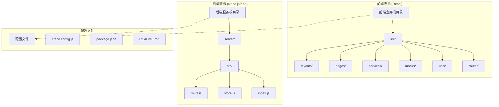
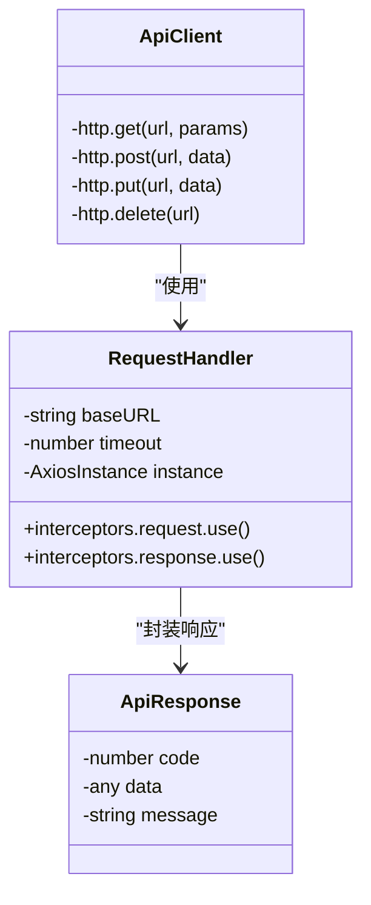
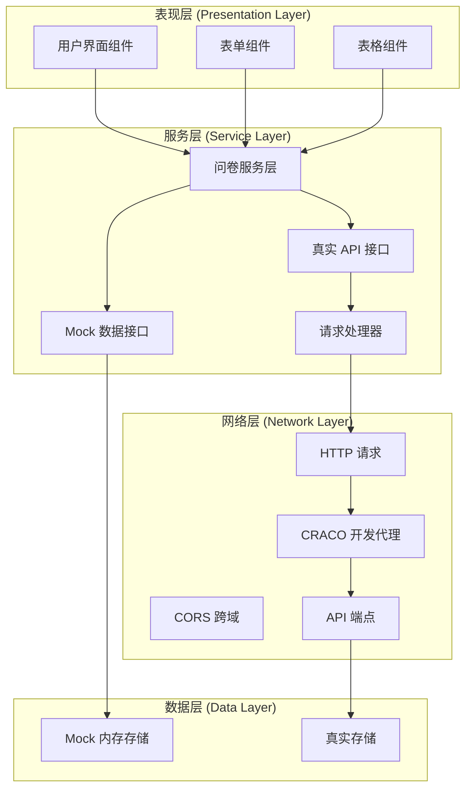
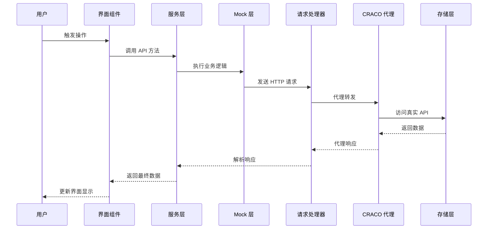
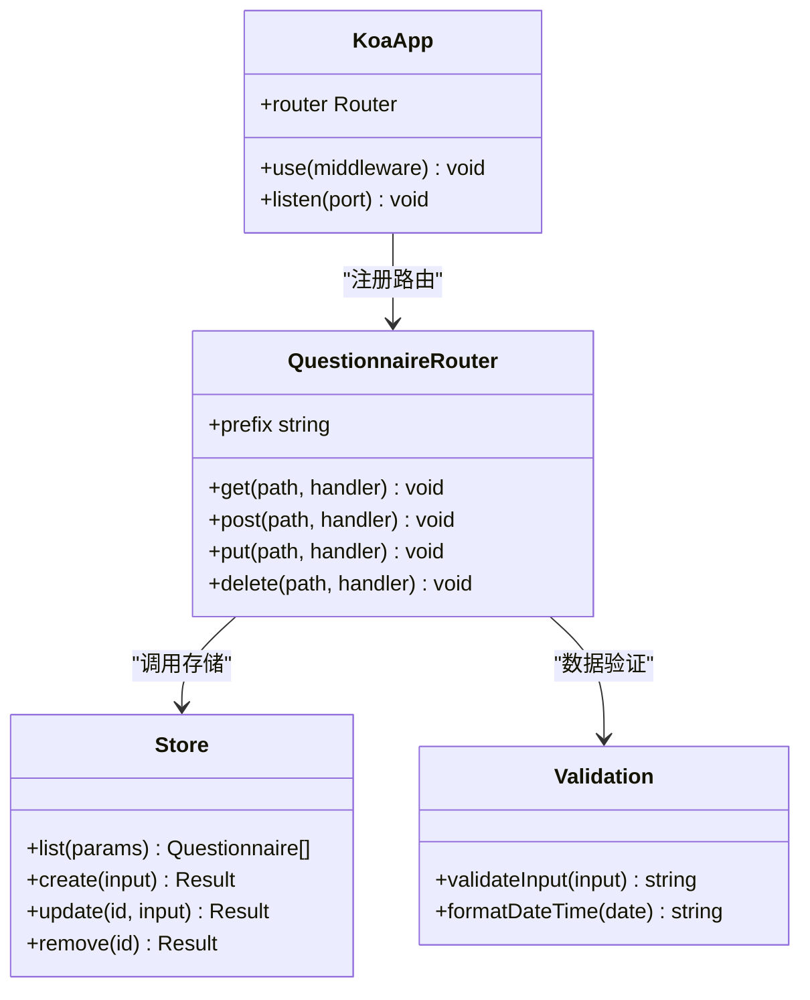

# Mock 数据系统

<cite>
**本文档引用的文件**
- [README.md](file://README.md)
- [client/package.json](file://client/package.json)
- [client/craco.config.js](file://client/craco.config.js)
- [client/src/mocks/questionnaire.ts](file://client/src/mocks/questionnaire.ts)
- [client/src/services/questionnaire.ts](file://client/src/services/questionnaire.ts)
- [client/src/utils/request.ts](file://client/src/utils/request.ts)
- [client/src/pages/Questionnaire/index.tsx](file://client/src/pages/Questionnaire/index.tsx)
- [client/src/router/index.tsx](file://client/src/router/index.tsx)
- [client/src/layouts/BasicLayout/index.tsx](file://client/src/layouts/BasicLayout/index.tsx)
- [client/src/App.tsx](file://client/src/App.tsx)
- [server/src/index.js](file://server/src/index.js)
- [server/src/routes/questionnaire.js](file://server/src/routes/questionnaire.js)
- [server/src/store.js](file://server/src/store.js)
</cite>

## 更新摘要
**变更内容**
- 更新了 Mock API 实现的详细分析，包含增强的 mockjs 配置
- 新增了统一请求处理机制的说明
- 完善了 CRACO 代理配置的文档
- 增强了环境变量控制策略的说明
- 更新了服务层架构图以反映新的请求处理流程

## 目录
1. [简介](#简介)
2. [项目结构](#项目结构)
3. [核心组件](#核心组件)
4. [架构概览](#架构概览)
5. [详细组件分析](#详细组件分析)
6. [依赖关系分析](#依赖关系分析)
7. [性能考虑](#性能考虑)
8. [故障排除指南](#故障排除指南)
9. [结论](#结论)

## 简介

这是一个基于 React 和 Node.js 的问卷管理系统，采用了 Mock 数据技术来实现前后端分离开发。系统通过 mockjs 生成模拟数据，结合环境变量控制来切换 Mock 模式和真实 API 模式，为开发者提供了灵活的开发和测试环境。

**更新** 系统现已集成 CRACO 代理支持和统一的请求处理机制，提供了更加完善的开发体验。

该系统的主要特点包括：
- 前后端完全分离的架构设计
- 支持 Mock 数据和真实 API 双模式运行
- 基于 TypeScript 的类型安全实现
- 完整的问卷 CRUD 操作功能
- 开发环境下的智能代理配置
- 统一的请求拦截器和错误处理机制

## 项目结构

项目采用前后端分离的目录结构，主要分为前端应用和后端服务两大部分：



**图表来源**
- [client/src/App.tsx:1-10](file://client/src/App.tsx#L1-L10)
- [client/src/router/index.tsx:1-27](file://client/src/router/index.tsx#L1-L27)
- [server/src/index.js:1-64](file://server/src/index.js#L1-L64)

**章节来源**
- [README.md:1-29](file://README.md#L1-L29)
- [client/package.json:1-81](file://client/package.json#L1-L81)

## 核心组件

### Mock 数据模块

Mock 数据模块是整个系统的核心组件之一，负责生成和管理模拟数据。它基于 mockjs 库实现，提供完整的 CRUD 操作能力。

```mermaid
classDiagram
class Questionnaire {
+string id
+string title
+string description
+number questionCount
+QuestionnaireStatus status
+string createdAt
}
class QueryParams {
+string keyword
+QuestionnaireStatus status
}
class QuestionnaireInput {
+string title
+string description
+number questionCount
+QuestionnaireStatus status
}
class MockApi {
+list(params) Promise~Questionnaire[]~
+create(input) Promise~Questionnaire~
+update(id, input) Promise~Questionnaire~
+remove(id) Promise~{success : true}~
}
MockApi --> Questionnaire : "返回"
MockApi --> QuestionnaireInput : "接收"
MockApi --> QueryParams : "查询参数"
```

**图表来源**
- [client/src/mocks/questionnaire.ts:11-25](file://client/src/mocks/questionnaire.ts#L11-L25)
- [client/src/mocks/questionnaire.ts:63-107](file://client/src/mocks/questionnaire.ts#L63-L107)

### 统一请求处理

**更新** 新增了统一的请求处理机制，通过 axios 实例和拦截器提供一致的 API 访问体验。



**图表来源**
- [client/src/utils/request.ts:12-17](file://client/src/utils/request.ts#L12-L17)
- [client/src/utils/request.ts:20-28](file://client/src/utils/request.ts#L20-L28)
- [client/src/utils/request.ts:31-94](file://client/src/utils/request.ts#L31-L94)

### 服务层抽象

服务层作为前端与后端的桥梁，实现了 Mock 模式和真实 API 模式的无缝切换。

```mermaid
classDiagram
class QuestionnaireService {
-boolean useMock
-string apiBase
+fetchQuestionnaires(params) Promise~Questionnaire[]~
+createQuestionnaire(input) Promise~Questionnaire~
+updateQuestionnaire(id, input) Promise~Questionnaire~
+removeQuestionnaire(id) Promise~{success : true}~
}
class MockApi {
+list(params) Promise~Questionnaire[]~
+create(input) Promise~Questionnaire~
+update(id, input) Promise~Questionnaire~
+remove(id) Promise~{success : true}~
}
class RealApi {
+list(params) Promise~Questionnaire[]~
+create(input) Promise~Questionnaire~
+update(id, input) Promise~Questionnaire~
+remove(id) Promise~{success : true}~
}
class RequestHandler {
-http.get(url, params)
-http.post(url, data)
-http.put(url, data)
-http.delete(url)
}
QuestionnaireService --> MockApi : "使用"
QuestionnaireService --> RealApi : "或使用"
RealApi --> RequestHandler : "基于"
```

**图表来源**
- [client/src/services/questionnaire.ts:11-17](file://client/src/services/questionnaire.ts#L11-L17)
- [client/src/services/questionnaire.ts:32-53](file://client/src/services/questionnaire.ts#L32-L53)
- [client/src/utils/request.ts:8-97](file://client/src/utils/request.ts#L8-L97)

**章节来源**
- [client/src/mocks/questionnaire.ts:1-108](file://client/src/mocks/questionnaire.ts#L1-L108)
- [client/src/services/questionnaire.ts:1-71](file://client/src/services/questionnaire.ts#L1-L71)
- [client/src/utils/request.ts:1-97](file://client/src/utils/request.ts#L1-L97)

## 架构概览

系统采用分层架构设计，实现了清晰的职责分离和良好的可扩展性：



**图表来源**
- [client/src/pages/Questionnaire/index.tsx:17-27](file://client/src/pages/Questionnaire/index.tsx#L17-L27)
- [client/src/services/questionnaire.ts:55](file://client/src/services/questionnaire.ts#L55)
- [client/craco.config.js:17-26](file://client/craco.config.js#L17-L26)

### 数据流处理

**更新** 数据流现在包含了统一的请求处理和 CRACO 代理支持：



**图表来源**
- [client/src/pages/Questionnaire/index.tsx:47-57](file://client/src/pages/Questionnaire/index.tsx#L47-L57)
- [client/src/services/questionnaire.ts:57-68](file://client/src/services/questionnaire.ts#L57-L68)
- [client/src/mocks/questionnaire.ts:63-107](file://client/src/mocks/questionnaire.ts#L63-L107)

## 详细组件分析

### 问卷管理页面

问卷管理页面是系统的核心功能模块，提供了完整的问卷 CRUD 操作界面：


**图表来源**
- [client/src/pages/Questionnaire/index.tsx:35-276](file://client/src/pages/Questionnaire/index.tsx#L35-L276)

#### 表单验证机制

页面集成了完整的表单验证逻辑，确保数据的完整性和正确性：

| 字段 | 验证规则 | 错误信息 |
|------|----------|----------|
| 标题 | 必填，最大50字符 | 请输入问卷标题，标题最多50个字符 |
| 描述 | 可选，最大200字符 | 描述最多200个字符 |
| 题目数量 | 必填，1-100整数 | 请输入题目数量 |
| 状态 | 必选，枚举值 | 请选择状态 |

**章节来源**
- [client/src/pages/Questionnaire/index.tsx:235-269](file://client/src/pages/Questionnaire/index.tsx#L235-L269)

### 后端服务架构

后端服务采用 Koa 框架构建，提供了 RESTful API 接口：



**图表来源**
- [server/src/index.js:12-64](file://server/src/index.js#L12-L64)
- [server/src/routes/questionnaire.js:6-58](file://server/src/routes/questionnaire.js#L6-L58)
- [server/src/store.js:64-114](file://server/src/store.js#L64-L114)

**章节来源**
- [server/src/index.js:1-64](file://server/src/index.js#L1-L64)
- [server/src/routes/questionnaire.js:1-58](file://server/src/routes/questionnaire.js#L1-L58)
- [server/src/store.js:1-114](file://server/src/store.js#L1-L114)

## 依赖关系分析

系统各组件之间的依赖关系清晰明确，遵循了单一职责原则：

```mermaid
graph LR
subgraph "前端依赖"
REACT[React 核心]
ANTD[Ant Design UI]
MOCKJS[MockJS]
AXIOS[Axios]
TYPESCRIPT[TypeScript]
CRACO[CRACO]
END
subgraph "后端依赖"
KOA[Koa 框架]
CORS[@koa/cors]
BODY_PARSER[koa-bodyparser]
ROUTER[@koa/router]
END
subgraph "开发工具"
ESLINT[ESLint]
PRETTIER[Prettier]
HUSKY[Husky]
END
REACT --> ANTD
REACT --> MOCKJS
REACT --> AXIOS
REACT --> TYPESCRIPT
KOA --> CORS
KOA --> BODY_PARSER
KOA --> ROUTER
CRACO --> REACT
ESLINT --> REACT
PRETTIER --> REACT
HUSKY --> ESLINT
```

**图表来源**
- [client/package.json:5-25](file://client/package.json#L5-L25)
- [client/package.json:54-71](file://client/package.json#L54-L71)

### 环境配置管理

**更新** 环境变量控制策略更加严格和灵活：

| 环境变量 | 默认值 | 用途 | 示例值 | 说明 |
|----------|--------|------|--------|------|
| REACT_APP_USE_MOCK | undefined | 控制是否启用 Mock 模式 | 'true' 或 'false' | **仅当显式设置为 'true' 时才启用** |
| REACT_APP_API_BASE_URL | '' | 设置 API 基础 URL | 'http://localhost:3001' | 空值时使用相对路径 |
| PROXY_TARGET | 'http://localhost:3001' | CRACO 代理目标地址 | 'http://localhost:3001' | 开发代理配置 |
| NODE_ENV | 'development' | Node.js 环境模式 | 'development' | 环境检测 |

**章节来源**
- [client/src/services/questionnaire.ts:21-30](file://client/src/services/questionnaire.ts#L21-L30)
- [client/craco.config.js:20-25](file://client/craco.config.js#L20-L25)

## 性能考虑

### Mock 数据性能优化

系统在 Mock 数据层面采用了多项性能优化策略：

1. **延迟模拟**：通过 `delay` 函数模拟网络延迟，提升用户体验
2. **内存存储**：使用内存数组存储数据，避免磁盘 I/O 开销
3. **批量生成**：一次性生成大量测试数据，减少运行时计算
4. **防抖机制**：搜索功能实现 300ms 防抖，减少不必要的请求

### 前端性能优化

**更新** 前端层面新增了统一的请求处理优化：

- **组件懒加载**：路由级别的代码分割
- **状态管理**：合理的状态划分和更新策略
- **渲染优化**：表格组件的虚拟滚动支持
- **缓存策略**：合理的数据缓存和失效机制
- **请求复用**：统一的 axios 实例减少重复配置

### CRACO 代理性能

**新增** CRACO 代理提供了高效的开发体验：

- **零配置代理**：自动将 /api 请求转发到后端
- **跨域处理**：内置 CORS 支持
- **热重载集成**：与开发服务器无缝集成

## 故障排除指南

### 常见问题及解决方案

#### Mock 模式无法正常工作

**问题症状**：页面显示空白或出现网络错误

**可能原因**：
1. 环境变量配置错误（REACT_APP_USE_MOCK 未显式设置为 'true'）
2. Mock 数据生成异常
3. CRACO 代理配置问题

**解决步骤**：
1. 检查 `.env.development` 文件中的 `REACT_APP_USE_MOCK` 设置
2. 验证 Mock 数据生成逻辑
3. 确认 CRACO 代理配置正确

#### API 请求失败

**问题症状**：CRUD 操作无法正常执行

**可能原因**：
1. 后端服务未启动
2. 网络连接问题
3. CORS 配置错误
4. **CRACO 代理未正确转发请求**

**解决步骤**：
1. 启动后端服务：`cd server && npm run dev`
2. 检查网络连接状态
3. 验证 CORS 配置
4. **确认 CRACO 代理正在监听端口 3000**

#### 数据同步问题

**问题症状**：Mock 数据与真实数据不一致

**解决步骤**：
1. 清除浏览器缓存
2. 重启开发服务器
3. 检查数据模型定义
4. **验证环境变量配置**

#### CRACO 代理问题

**新增** CRACO 代理特有的问题排查：

**问题症状**：开发时 API 请求 404 或代理失败

**可能原因**：
1. CRACO 代理未启动
2. PROXY_TARGET 环境变量配置错误
3. 后端服务端口冲突

**解决步骤**：
1. 确认 CRACO 正在监听端口 3000
2. 检查 `PROXY_TARGET` 环境变量设置
3. 验证后端服务监听端口（默认 3001）

**章节来源**
- [client/src/services/questionnaire.ts:23-29](file://client/src/services/questionnaire.ts#L23-L29)
- [server/src/index.js:58-63](file://server/src/index.js#L58-L63)

## 结论

这个 Mock 数据系统展现了现代前端开发的最佳实践，通过以下关键特性实现了高效的开发体验：

### 技术优势

1. **灵活的模式切换**：通过环境变量轻松在 Mock 模式和真实 API 模式间切换
2. **完整的 CRUD 功能**：覆盖了问卷管理的所有核心业务场景
3. **类型安全保证**：基于 TypeScript 实现，提供编译时类型检查
4. **优雅的错误处理**：完善的异常捕获和用户友好的错误提示
5. **开发体验优化**：智能代理、热重载等现代化开发工具集成
6. **统一的请求处理**：基于 axios 的统一配置和拦截器机制

### 架构亮点

- **分层清晰**：表现层、服务层、数据层职责分明
- **可扩展性强**：易于添加新功能和新模块
- **测试友好**：Mock 数据便于单元测试和集成测试
- **部署灵活**：支持多种部署方式和环境配置
- **开发效率高**：CRACO 代理提供无缝的开发体验

### 发展建议

1. **引入数据库**：将内存存储替换为持久化数据库
2. **增加缓存层**：实现更高效的数据缓存机制
3. **完善监控**：添加性能监控和错误追踪
4. **增强安全性**：实现用户认证和授权机制
5. **优化代理配置**：支持更多自定义代理规则

该系统为团队协作开发提供了坚实的技术基础，既满足了快速迭代的需求，又保证了代码质量和可维护性。通过 CRACO 代理和统一请求处理的集成，开发者可以获得更加流畅的开发体验。