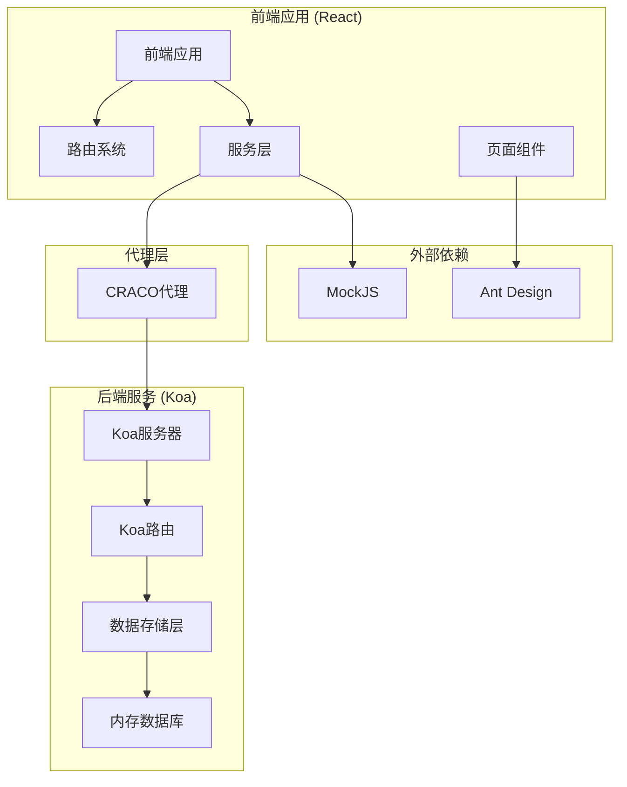
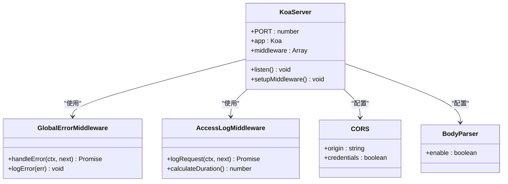
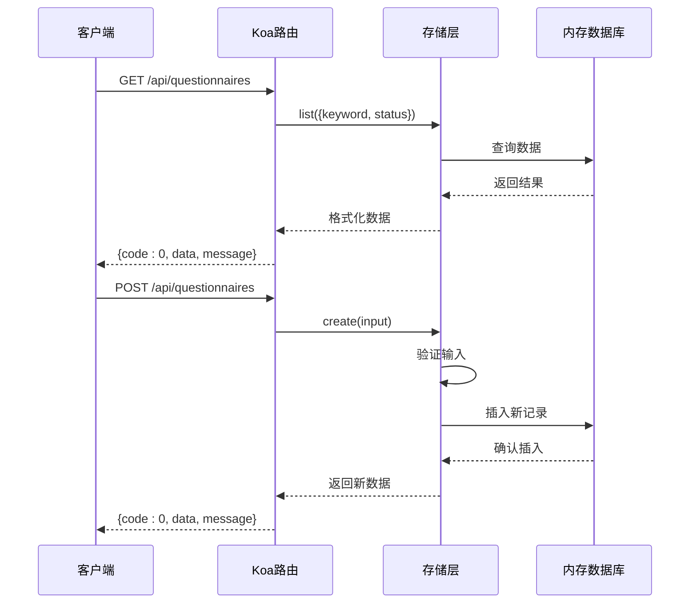
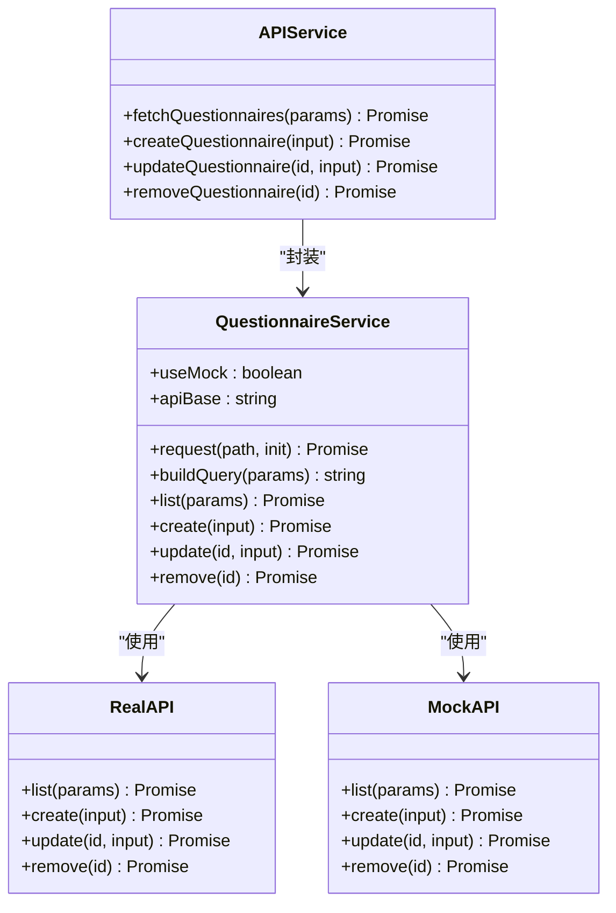
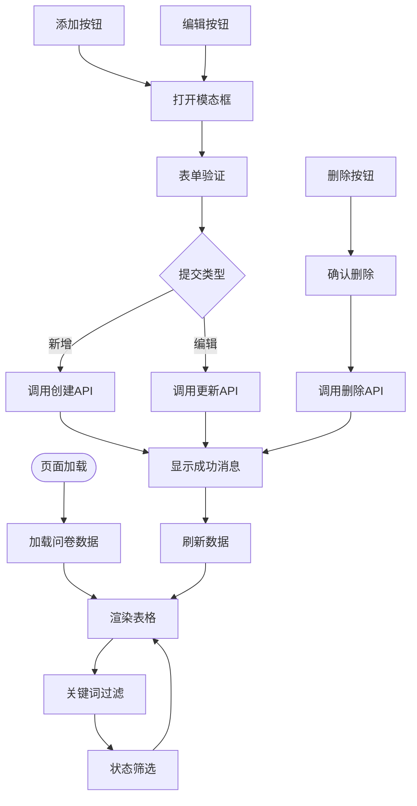
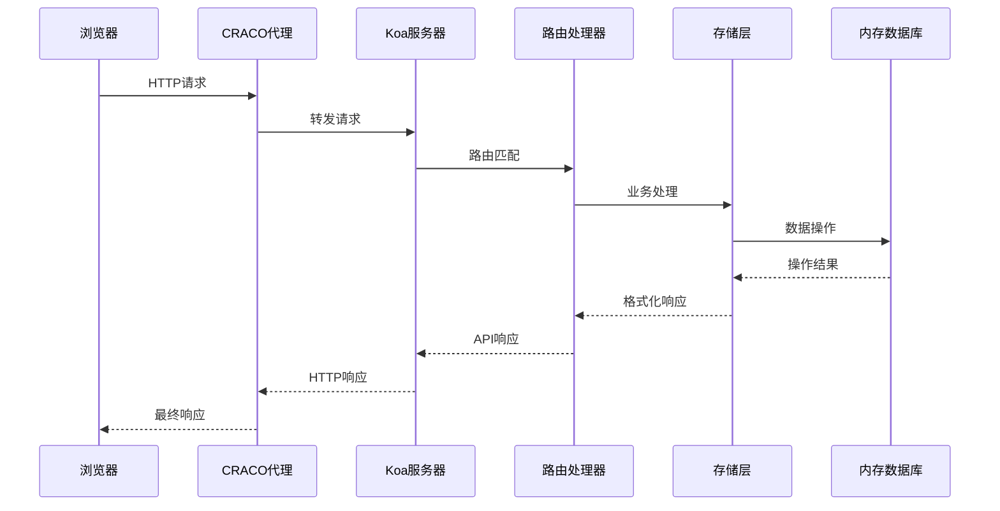
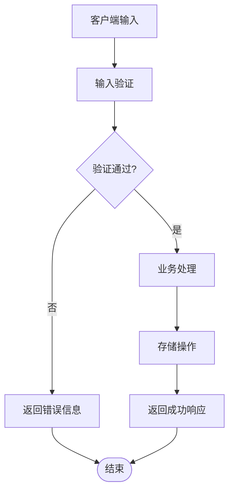
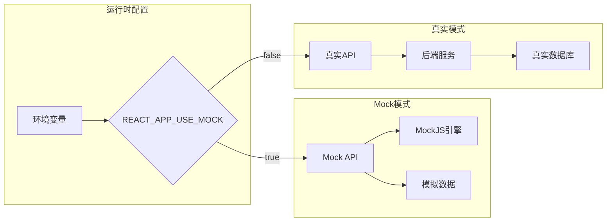
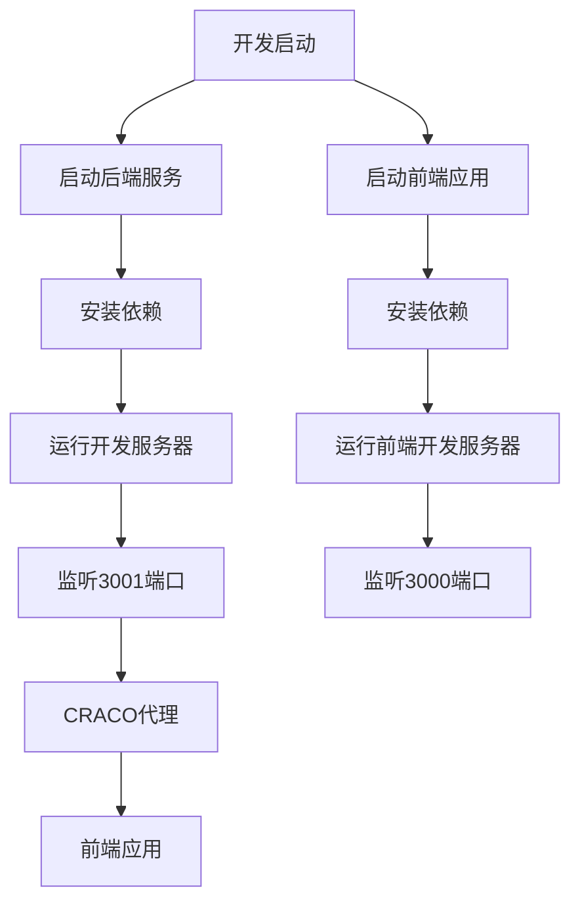
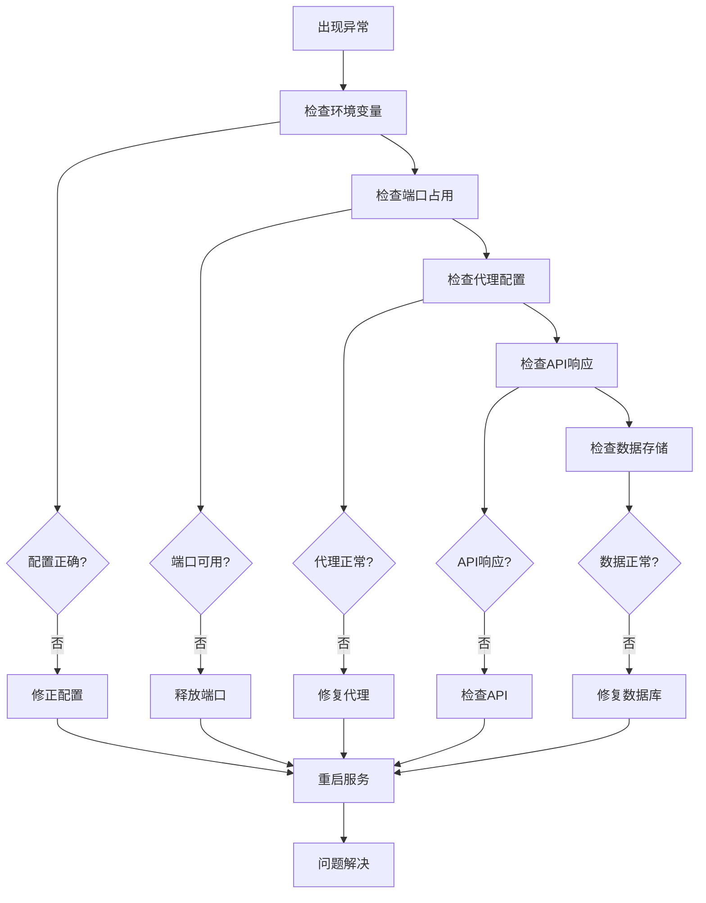

# 后端服务架构

<cite>
**本文档引用的文件**
- [server/src/index.js](file://server/src/index.js)
- [server/package.json](file://server/package.json)
- [server/src/routes/questionnaire.js](file://server/src/routes/questionnaire.js)
- [server/src/store.js](file://server/src/store.js)
- [src/services/questionnaire.ts](file://src/services/questionnaire.ts)
- [src/mocks/questionnaire.ts](file://src/mocks/questionnaire.ts)
- [craco.config.js](file://craco.config.js)
- [src/router/index.tsx](file://src/router/index.tsx)
- [src/pages/Questionnaire/index.tsx](file://src/pages/Questionnaire/index.tsx)
- [README.md](file://README.md)
</cite>

## 目录
1. [项目概述](#项目概述)
2. [整体架构](#整体架构)
3. [后端服务核心组件](#后端服务核心组件)
4. [前端服务架构](#前端服务架构)
5. [数据流分析](#数据流分析)
6. [Mock机制设计](#mock机制设计)
7. [部署与运行](#部署与运行)
8. [性能考虑](#性能考虑)
9. [故障排除指南](#故障排除指南)
10. [总结](#总结)

## 项目概述

这是一个基于React和Koa的全栈问卷管理系统，采用前后端分离架构设计。项目包含独立的前端应用和后端API服务，通过RESTful API进行通信。系统支持问卷的增删改查、状态管理和数据验证等功能。

## 整体架构

**图表来源**
- [server/src/index.js:12-64](file://server/src/index.js#L12-L64)
- [craco.config.js:19-26](file://craco.config.js#L19-L26)
- [src/services/questionnaire.ts:11-85](file://src/services/questionnaire.ts#L11-L85)

## 后端服务核心组件

### Koa服务器架构

后端服务基于Koa框架构建，提供RESTful API接口。服务器采用中间件模式，具备全局错误处理、CORS支持和请求体解析功能。

**图表来源**
- [server/src/index.js:23-44](file://server/src/index.js#L23-L44)
- [server/src/index.js:46-47](file://server/src/index.js#L46-L47)

### 问卷管理API设计

系统提供完整的问卷管理API，包括列表查询、创建、更新和删除功能。

**图表来源**
- [server/src/routes/questionnaire.js:14-31](file://server/src/routes/questionnaire.js#L14-L31)
- [server/src/store.js:64-87](file://server/src/store.js#L64-L87)

**章节来源**
- [server/src/index.js:12-64](file://server/src/index.js#L12-L64)
- [server/src/routes/questionnaire.js:1-58](file://server/src/routes/questionnaire.js#L1-L58)
- [server/src/store.js:1-114](file://server/src/store.js#L1-L114)

## 前端服务架构

### 服务层设计

前端采用服务层抽象，统一管理API调用逻辑，支持Mock模式和真实API模式切换。

**图表来源**
- [src/services/questionnaire.ts:38-85](file://src/services/questionnaire.ts#L38-L85)
- [src/mocks/questionnaire.ts:63-107](file://src/mocks/questionnaire.ts#L63-L107)

### 页面组件架构

问卷管理页面采用响应式设计，集成了完整的CRUD操作功能。

**图表来源**
- [src/pages/Questionnaire/index.tsx:47-114](file://src/pages/Questionnaire/index.tsx#L47-L114)
- [src/pages/Questionnaire/index.tsx:116-178](file://src/pages/Questionnaire/index.tsx#L116-L178)

**章节来源**
- [src/services/questionnaire.ts:1-101](file://src/services/questionnaire.ts#L1-L101)
- [src/pages/Questionnaire/index.tsx:1-276](file://src/pages/Questionnaire/index.tsx#L1-L276)

## 数据流分析

### 请求处理流程

系统采用分层架构，从HTTP请求到数据持久化的完整流程如下：

**图表来源**
- [craco.config.js:19-26](file://craco.config.js#L19-L26)
- [server/src/index.js:56-56](file://server/src/index.js#L56-L56)
- [server/src/routes/questionnaire.js:14-55](file://server/src/routes/questionnaire.js#L14-L55)

### 数据验证机制

系统在多个层面实施数据验证，确保数据完整性：

**图表来源**
- [server/src/store.js:44-62](file://server/src/store.js#L44-L62)
- [server/src/store.js:74-87](file://server/src/store.js#L74-L87)

**章节来源**
- [server/src/store.js:44-62](file://server/src/store.js#L44-L62)
- [server/src/store.js:64-111](file://server/src/store.js#L64-L111)

## Mock机制设计

### Mock模式架构

系统支持Mock模式和真实API模式的无缝切换，便于开发和测试。

**图表来源**
- [src/services/questionnaire.ts:19-29](file://src/services/questionnaire.ts#L19-L29)
- [src/services/questionnaire.ts:85-85](file://src/services/questionnaire.ts#L85-L85)

### Mock数据生成策略

Mock系统使用MockJS生成高质量的模拟数据，支持随机化和延迟模拟。

**章节来源**
- [src/mocks/questionnaire.ts:1-108](file://src/mocks/questionnaire.ts#L1-L108)
- [src/services/questionnaire.ts:1-30](file://src/services/questionnaire.ts#L1-L30)

## 部署与运行

### 开发环境配置

系统采用双进程架构，前端和后端分别独立运行：

**图表来源**
- [README.md:22-29](file://README.md#L22-L29)
- [server/src/index.js:19-19](file://server/src/index.js#L19-L19)

### 代理配置

CRACO配置实现了智能代理，将API请求转发到后端服务。

**章节来源**
- [craco.config.js:19-26](file://craco.config.js#L19-L26)
- [README.md:22-29](file://README.md#L22-L29)

## 性能考虑

### 内存存储优化

当前系统使用内存存储，具有以下特点：
- **优势**：读写速度快，无需数据库连接
- **限制**：进程重启后数据丢失，不适合生产环境
- **建议**：生产环境应替换为持久化存储

### 并发处理

系统采用异步处理模式，支持并发请求处理：
- 使用Promise和async/await模式
- 中间件按顺序执行，保证请求链路清晰
- 错误处理集中在全局中间件

## 故障排除指南

### 常见问题诊断

### 错误处理机制

系统实现了多层次的错误处理：
- **全局错误捕获**：统一处理未捕获的异常
- **API错误响应**：标准化的错误响应格式
- **前端错误提示**：友好的用户错误反馈

**章节来源**
- [server/src/index.js:23-36](file://server/src/index.js#L23-L36)
- [src/services/questionnaire.ts:51-54](file://src/services/questionnaire.ts#L51-L54)

## 总结

本项目展现了现代全栈应用的最佳实践：

### 架构优势
- **清晰的分层设计**：前后端分离，职责明确
- **灵活的Mock机制**：支持开发和测试的快速迭代
- **标准化的数据格式**：统一的API响应结构
- **完善的错误处理**：多层级的异常处理机制

### 技术特色
- **Koa轻量框架**：简洁高效的Node.js服务器
- **React现代化UI**：基于Ant Design的组件化设计
- **CRACO增强配置**：无需Eject的webpack扩展
- **TypeScript类型安全**：编译时错误检测

### 改进建议
- **持久化存储**：替换内存存储为数据库
- **API版本控制**：实现API版本管理
- **缓存机制**：添加Redis等缓存层
- **监控告警**：集成APM监控系统

该架构为问卷管理系统的开发提供了坚实的基础，既满足了当前的功能需求，又为未来的扩展预留了充足的空间。