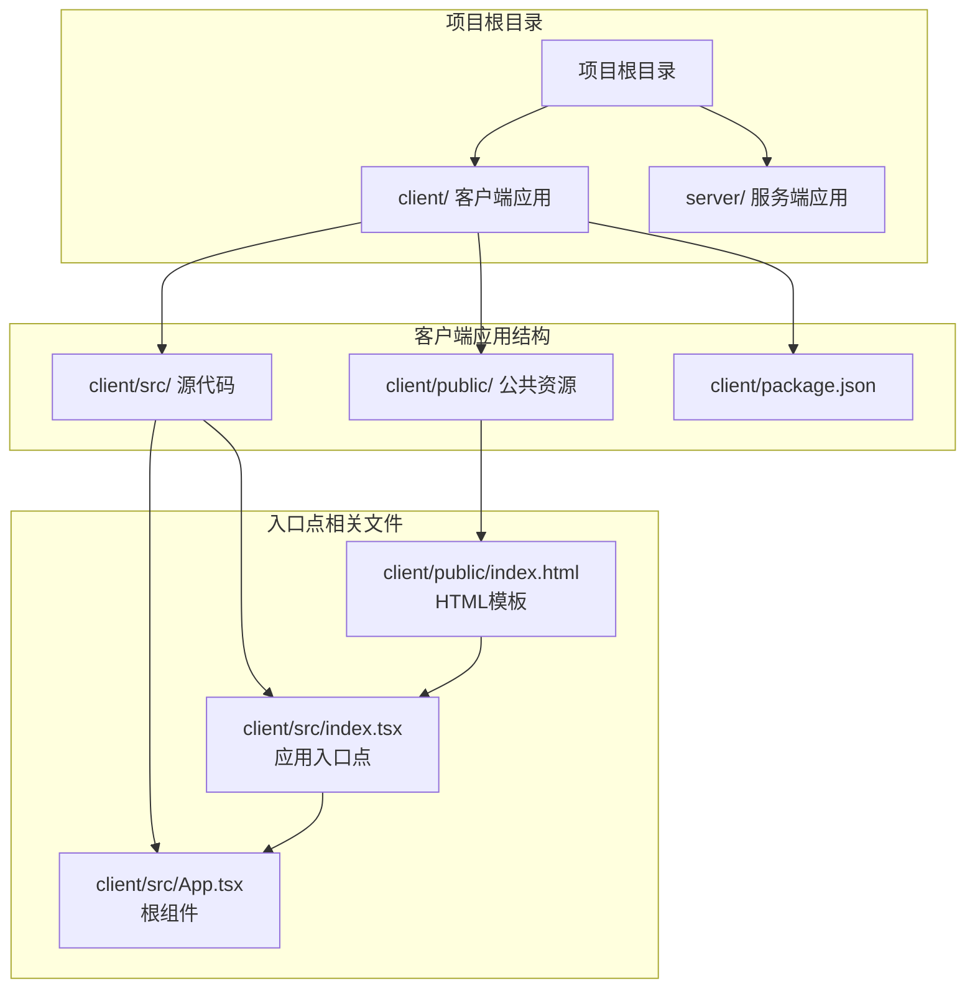
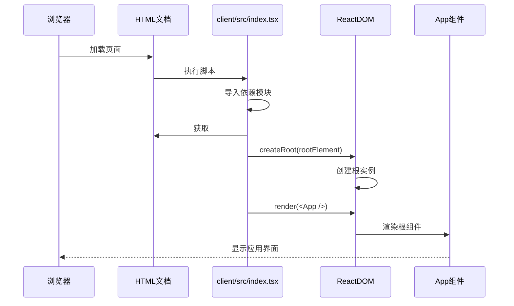
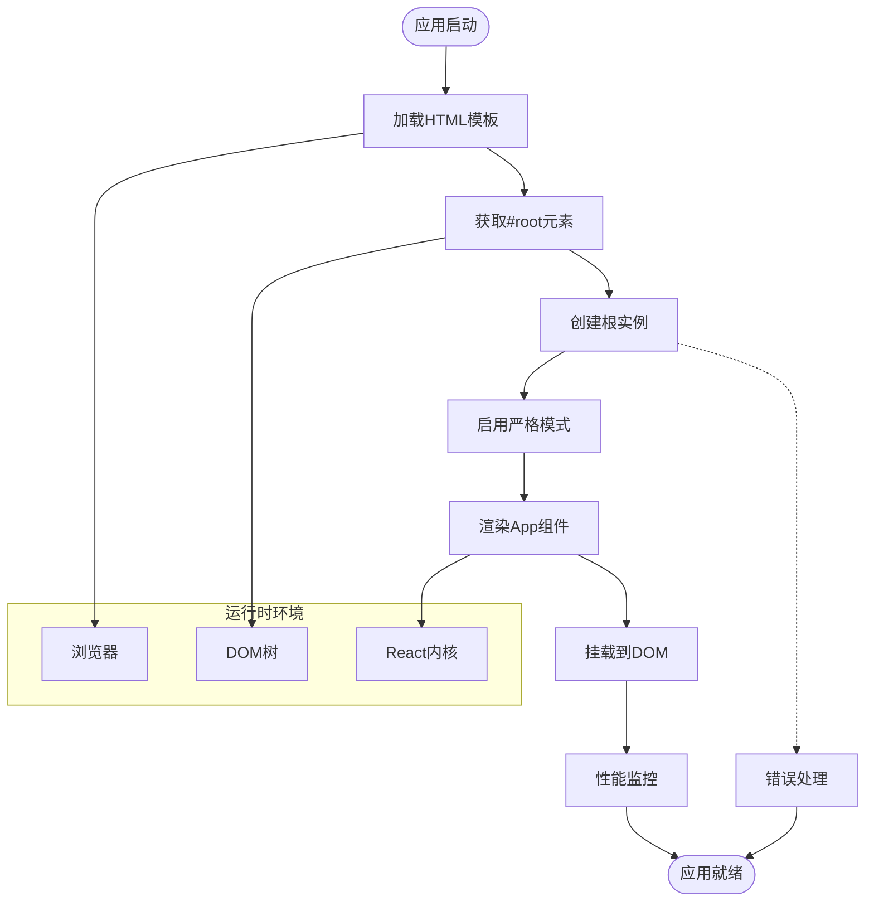
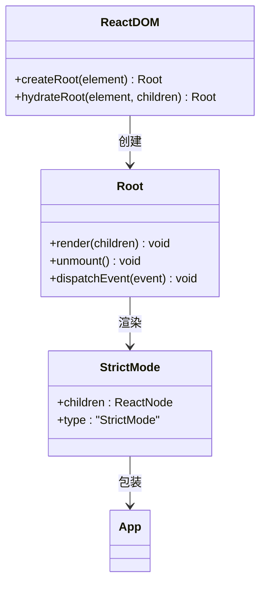
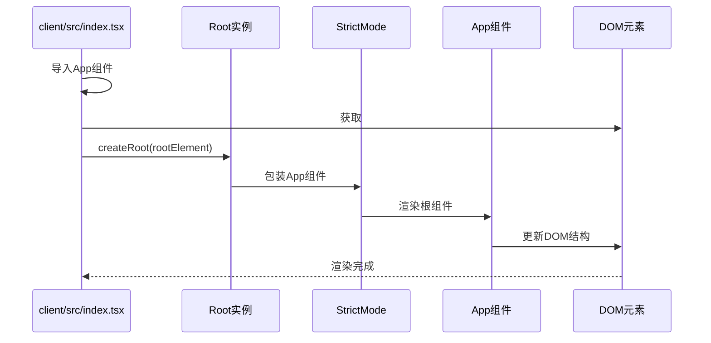
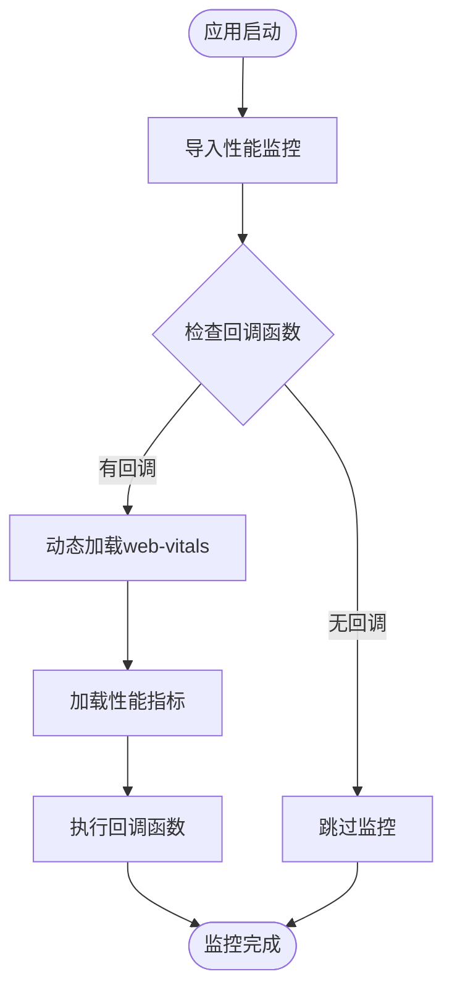
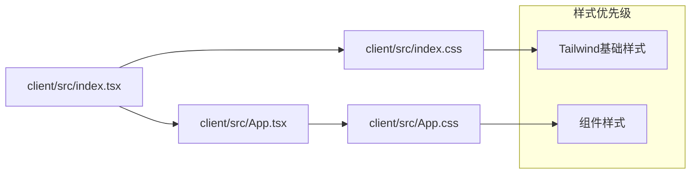
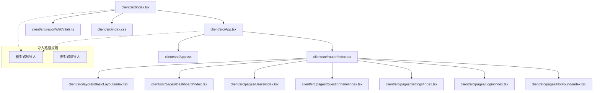

# 应用入口点

<cite>
**本文档引用的文件**
- [client/src/index.tsx](file://client/src/index.tsx)
- [client/src/App.tsx](file://client/src/App.tsx)
- [client/public/index.html](file://client/public/index.html)
- [client/src/reportWebVitals.ts](file://client/src/reportWebVitals.ts)
- [client/src/index.css](file://client/src/index.css)
- [client/package.json](file://client/package.json)
- [client/tsconfig.json](file://client/tsconfig.json)
- [client/src/router/index.tsx](file://client/src/router/index.tsx)
- [client/src/App.css](file://client/src/App.css)
</cite>

## 更新摘要
**变更内容**
- 更新入口点位置从 `src/index.tsx` 到 `client/src/index.tsx`
- 更新项目结构图以反映新的目录组织
- 更新所有相关文件路径引用
- 更新依赖关系分析以匹配新的项目配置
- 更新架构概览以反映新的客户端架构

## 目录
1. [简介](#简介)
2. [项目结构](#项目结构)
3. [核心组件](#核心组件)
4. [架构概览](#架构概览)
5. [详细组件分析](#详细组件分析)
6. [依赖关系分析](#依赖关系分析)
7. [性能考虑](#性能考虑)
8. [故障排除指南](#故障排除指南)
9. [结论](#结论)

## 简介

本文件详细解析了 React 应用的入口点配置，重点分析 `client/src/index.tsx` 作为应用根组件的作用和职责。该文件是整个 React 应用的启动入口，负责将应用挂载到 DOM 中，并建立完整的渲染流程。通过深入分析入口点的实现细节、数据流向和最佳实践，帮助开发者理解 React 应用的启动机制。

**更新** 项目已重构为多包架构，入口点位于 `client/src/index.tsx`，这是客户端应用启动的唯一入口文件。

## 项目结构

React 应用采用现代化的多包架构，入口点位于 `client/src/index.tsx`，这是客户端应用启动的唯一入口文件。项目结构经过重构，将客户端代码组织在 `client/` 目录下。



**图表来源**
- [client/src/index.tsx:1-18](file://client/src/index.tsx#L1-L18)
- [client/src/App.tsx:1-10](file://client/src/App.tsx#L1-L10)
- [client/public/index.html:1-45](file://client/public/index.html#L1-L45)

**章节来源**
- [client/src/index.tsx:1-18](file://client/src/index.tsx#L1-L18)
- [client/public/index.html:1-45](file://client/public/index.html#L1-L45)

## 核心组件

### 入口点文件分析

`client/src/index.tsx` 是应用的核心启动文件，承担以下关键职责：

#### 导入模块
- React 核心库导入
- ReactDOM 客户端渲染库
- 样式文件导入
- 应用根组件导入
- 性能监控工具导入

#### 渲染流程
1. **DOM 元素获取**：通过 `document.getElementById('root')` 获取挂载容器
2. **根节点创建**：使用 `ReactDOM.createRoot()` 创建根实例
3. **组件渲染**：将 `App` 组件渲染到根节点中
4. **严格模式包装**：使用 `React.StrictMode` 包装应用组件

#### 关键实现细节



**图表来源**
- [client/src/index.tsx:7-12](file://client/src/index.tsx#L7-L12)
- [client/public/index.html:32](file://client/public/index.html#L32)

**章节来源**
- [client/src/index.tsx:1-18](file://client/src/index.tsx#L1-L18)

## 架构概览

应用启动架构展示了从入口点到最终渲染的完整流程：



**图表来源**
- [client/src/index.tsx:7-17](file://client/src/index.tsx#L7-L17)
- [client/public/index.html:32](file://client/public/index.html#L32)

## 详细组件分析

### ReactDOM.createRoot() 方法详解

#### 方法作用
`ReactDOM.createRoot()` 是 React 18 新引入的客户端渲染 API，用于创建应用的根实例：



**图表来源**
- [client/src/index.tsx:7-7](file://client/src/index.tsx#L7)

#### 参数说明
- **element**: 必需参数，通常是 `document.getElementById('root')` 返回的 DOM 元素
- **options**: 可选配置对象（在当前实现中未使用）

#### 返回值
返回一个 Root 实例，该实例具有以下方法：
- `render()`: 渲染子组件
- `unmount()`: 卸载组件
- `dispatchEvent()`: 分发事件

**章节来源**
- [client/src/index.tsx:7](file://client/src/index.tsx#L7)

### App 组件挂载机制

#### 挂载过程分析



**图表来源**
- [client/src/index.tsx:8-12](file://client/src/index.tsx#L8-L12)
- [client/src/App.tsx:5-7](file://client/src/App.tsx#L5-L7)

#### 挂载点分析
- **挂载元素**: `#root` div 元素
- **挂载时机**: 页面加载完成后立即执行
- **挂载范围**: 整个应用的根组件

**章节来源**
- [client/public/index.html:32](file://client/public/index.html#L32)
- [client/src/index.tsx:7-12](file://client/src/index.tsx#L7-L12)

### 性能监控集成

#### reportWebVitals() 函数
入口点集成了 Web Vitals 性能监控工具：



**图表来源**
- [client/src/index.tsx:17-17](file://client/src/index.tsx#L17)
- [client/src/reportWebVitals.ts:3-13](file://client/src/reportWebVitals.ts#L3-L13)

**章节来源**
- [client/src/reportWebVitals.ts:1-16](file://client/src/reportWebVitals.ts#L1-L16)

### 样式系统集成

#### CSS 导入链路
入口点通过模块导入建立了完整的样式系统：



**图表来源**
- [client/src/index.tsx:3](file://client/src/index.tsx#L3)
- [client/src/index.css:1-21](file://client/src/index.css#L1-L21)

**章节来源**
- [client/src/index.css:1-21](file://client/src/index.css#L1-L21)

## 依赖关系分析

### 外部依赖关系

```mermaid
graph TB
subgraph "客户端应用层"
IndexTSX[client/src/index.tsx]
AppTSX[client/src/App.tsx]
end
subgraph "React生态"
React[react ^19.2.6]
ReactDOM[react-dom ^19.2.6]
WebVitals[web-vitals ^2.1.4]
ReactRouter[react-router-dom ^6.30.0]
Antd[antd ^5.21.6]
Axios[axios ^1.7.9]
end
subgraph "构建工具"
Craco[@craco/craco ^7.1.0]
ReactScripts[react-scripts 5.0.1]
TypeScript[typescript ^4.9.5]
Tailwind[tailwindcss ^3.4.14]
end
subgraph "开发工具"
ESLint[eslint ^8.57.1]
TestingLib[Testing Library]
end
IndexTSX --> React
IndexTSX --> ReactDOM
IndexTSX --> WebVitals
AppTSX --> React
AppTSX --> ReactRouter
AppTSX --> Antd
AppTSX --> Axios
Craco --> IndexTSX
Craco --> AppTSX
TypeScript --> IndexTSX
TypeScript --> AppTSX
ESLint --> IndexTSX
TestingLib --> IndexTSX
```

**图表来源**
- [client/package.json:5-26](file://client/package.json#L5-L26)
- [client/src/index.tsx:1-5](file://client/src/index.tsx#L1-L5)

### 内部模块依赖



**图表来源**
- [client/src/index.tsx:1-5](file://client/src/index.tsx#L1-L5)
- [client/src/App.tsx:1-3](file://client/src/App.tsx#L1-L3)

**章节来源**
- [client/package.json:1-81](file://client/package.json#L1-L81)

## 性能考虑

### 启动性能优化

#### 模块加载策略
- **按需加载**: 性能监控工具采用动态导入
- **并行加载**: 样式文件与组件文件独立加载
- **缓存利用**: 浏览器自动缓存静态资源

#### 渲染性能优化
- **严格模式**: 帮助发现潜在问题，提高代码质量
- **最小化重渲染**: React 的虚拟 DOM 机制
- **内存管理**: 自动垃圾回收机制

### 监控指标

#### Web Vitals 指标
- **CLS (Cumulative Layout Shift)**: 累积布局偏移
- **FID (First Input Delay)**: 首次输入延迟
- **FCP (First Contentful Paint)**: 首次内容绘制
- **LCP (Largest Contentful Paint)**: 最大内容绘制
- **TTFB (Time to First Byte)**: 首字节时间

**章节来源**
- [client/src/reportWebVitals.ts:5-11](file://client/src/reportWebVitals.ts#L5-L11)

## 故障排除指南

### 常见启动问题

#### DOM 元素不存在
**问题症状**: 控制台出现 `null` 或 `undefined` 错误
**解决方案**: 确保 HTML 模板中存在 `#root` 元素

#### 模块导入失败
**问题症状**: 编译或运行时模块解析错误
**解决方案**: 检查文件路径和扩展名

#### 类型定义问题
**问题症状**: TypeScript 编译错误
**解决方案**: 检查 tsconfig.json 配置和类型声明

### 调试技巧

#### 开发环境调试
1. **浏览器开发者工具**: 使用 Elements 和 Console 面板
2. **React DevTools**: 检查组件树和状态
3. **网络面板**: 监控资源加载情况

#### 性能分析
1. **Performance 面板**: 分析渲染性能
2. **Memory 面板**: 检查内存泄漏
3. **Lighthouse**: 运行 Web Vitals 分析

### 最佳实践

#### 入口点配置
- **保持简洁**: 仅包含必要的启动逻辑
- **错误处理**: 添加适当的错误边界
- **性能监控**: 集成性能指标收集

#### 组件组织
- **单一职责**: 每个组件专注于特定功能
- **可复用性**: 设计可复用的组件结构
- **类型安全**: 使用 TypeScript 提供类型保障

**章节来源**
- [client/src/index.tsx:17](file://client/src/index.tsx#L17)

## 结论

React 应用入口点 `client/src/index.tsx` 作为应用启动的核心文件，通过简洁而高效的实现建立了完整的应用生命周期。其设计体现了现代 React 开发的最佳实践：

1. **清晰的职责分离**: 入口点专注于启动和挂载，业务逻辑集中在组件中
2. **现代化的 API 使用**: 采用 React 18 的并发特性
3. **完善的性能监控**: 集成 Web Vitals 工具
4. **良好的开发体验**: 支持热重载和错误边界

**更新** 项目已重构为多包架构，入口点位于 `client/src/index.tsx`，这种结构提供了更好的项目组织和维护性。通过深入理解入口点的工作原理，开发者可以更好地掌控应用的启动流程，优化性能表现，并建立可靠的调试和监控体系。这为构建高质量的 React 应用奠定了坚实的基础。