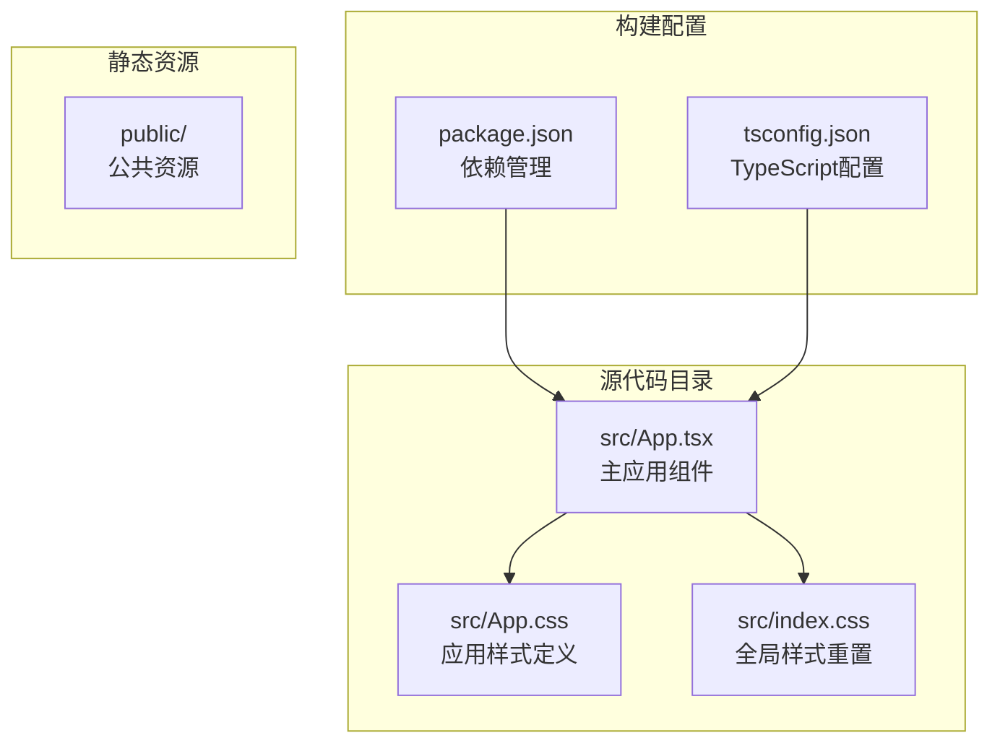
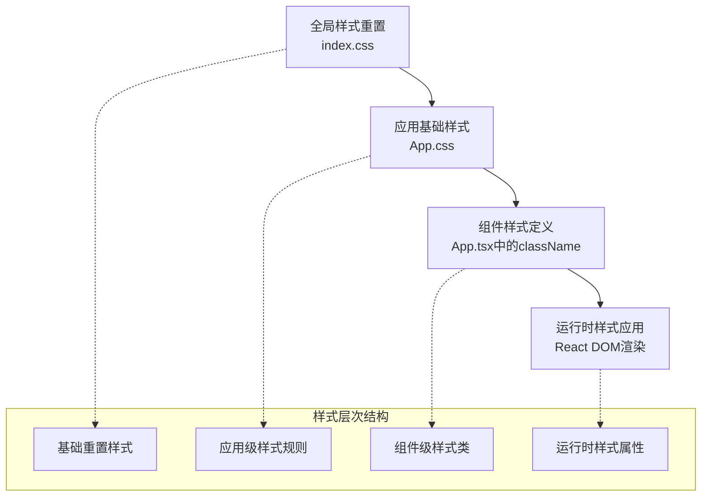
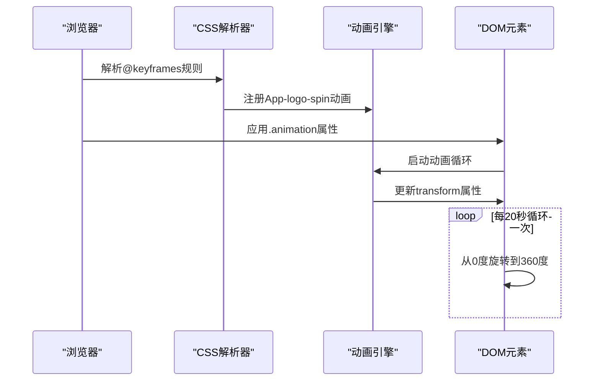
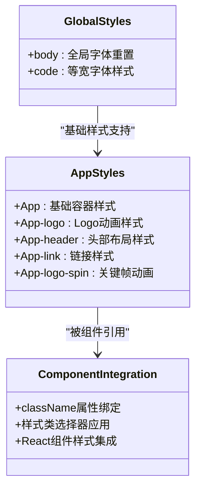
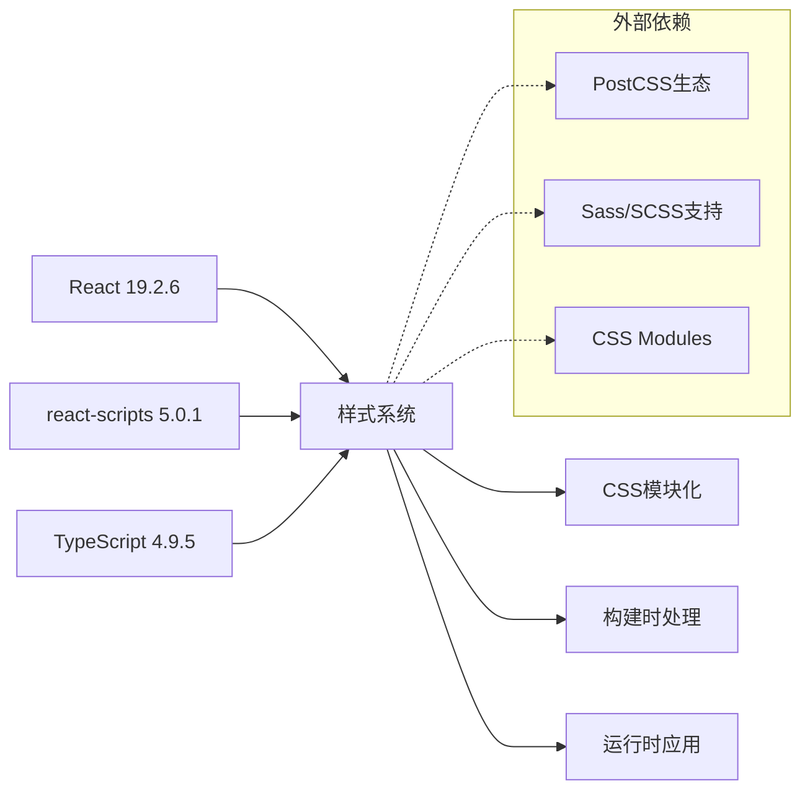

# 样式系统

<cite>
**本文档引用的文件**
- [src/App.css](file://src/App.css)
- [src/index.css](file://src/index.css)
- [src/App.tsx](file://src/App.tsx)
- [package.json](file://package.json)
- [tsconfig.json](file://tsconfig.json)
- [README.md](file://README.md)
</cite>

## 目录
1. [简介](#简介)
2. [项目结构](#项目结构)
3. [核心样式组件](#核心样式组件)
4. [架构概览](#架构概览)
5. [详细组件分析](#详细组件分析)
6. [依赖关系分析](#依赖关系分析)
7. [性能考虑](#性能考虑)
8. [故障排除指南](#故障排除指南)
9. [结论](#结论)
10. [附录](#附录)

## 简介

本项目采用传统的 CSS 样式系统，结合 React 组件化开发模式，实现了简洁而高效的样式管理方案。项目使用 Create React App 构建工具链，默认支持 CSS 模块化和现代化 CSS 特性。

该样式系统主要特点：
- 使用原生 CSS 类选择器进行样式定义
- 实现关键帧动画和媒体查询响应式设计
- 支持减少动画偏好设置的无障碍访问
- 提供基础的字体和排版样式重置

## 项目结构

项目采用标准的 Create React App 结构，样式文件位于 `src` 目录下：



**图表来源**
- [src/App.tsx:1-27](file://src/App.tsx#L1-L27)
- [src/App.css:1-39](file://src/App.css#L1-L39)
- [src/index.css:1-14](file://src/index.css#L1-L14)

**章节来源**
- [src/App.tsx:1-27](file://src/App.tsx#L1-L27)
- [package.json:1-55](file://package.json#L1-L55)

## 核心样式组件

### 应用容器样式

应用的主要容器元素 `.App` 提供了基础的文本对齐功能，确保页面内容居中显示。

### Logo 动画系统

Logo 组件 `.App-logo` 实现了复杂的动画效果：
- 使用视口单位 (`vmin`) 实现响应式尺寸
- 禁用指针事件以避免干扰用户交互
- 条件动画：仅在用户未启用减少动画偏好时运行

### 头部导航样式

`.App-header` 定义了应用头部区域的完整样式系统：
- 深色背景主题 (`#282c34`)
- 全屏高度布局 (`100vh`)
- Flexbox 布局系统实现垂直居中
- 动态字体大小计算 (`calc(10px + 2vmin)`)
- 白色文字颜色

### 链接样式

`.App-link` 提供了蓝色链接颜色，符合 React 官方文档的视觉设计规范。

**章节来源**
- [src/App.css:1-39](file://src/App.css#L1-L39)

## 架构概览

样式系统采用分层架构设计，从基础样式到组件样式层层递进：



**图表来源**
- [src/index.css:1-14](file://src/index.css#L1-L14)
- [src/App.css:1-39](file://src/App.css#L1-L39)
- [src/App.tsx:1-27](file://src/App.tsx#L1-L27)

## 详细组件分析

### 关键帧动画实现

项目实现了完整的旋转动画系统，展示了现代 CSS 动画的最佳实践：



**图表来源**
- [src/App.css:31-38](file://src/App.css#L31-L38)
- [src/App.css:10-14](file://src/App.css#L10-L14)

#### 动画特性分析

动画系统的关键特性：
- **条件执行**：通过媒体查询 `@media (prefers-reduced-motion: no-preference)` 控制动画行为
- **性能优化**：使用硬件加速的 `transform` 属性而非改变布局属性
- **无限循环**：`infinite` 关键字确保持续动画效果
- **线性插值**：`linear` 时间函数提供均匀的旋转速度

### 响应式设计策略

项目采用了多层次的响应式设计策略：

```mermaid
flowchart TD
A[响应式设计策略] --> B[视口单位系统]
A --> C[媒体查询系统]
A --> D[动态字体计算]
B --> B1[vmin单位<br/>基于视口最小尺寸]
B --> B2[40vmin<br/>Logo尺寸适配]
C --> C1[减少动画偏好检测<br/>prefers-reduced-motion]
C --> C2[设备尺寸适配<br/>未来扩展点]
D --> D1[calc(10px + 2vmin)<br/>动态字体大小]
```

**图表来源**
- [src/App.css:5-8](file://src/App.css#L5-L8)
- [src/App.css:10-14](file://src/App.css#L10-L14)
- [src/App.css:23](file://src/App.css#L23)

#### 媒体查询实现

当前媒体查询主要用于无障碍访问：
- **减少动画偏好**：检测用户是否启用了减少动画设置
- **条件样式应用**：仅在用户允许动画时应用旋转效果
- **无障碍兼容性**：遵循 WCAG 2.1 的无障碍设计原则

### 样式模块化与组件组织

项目采用简单的模块化样式组织方式：



**图表来源**
- [src/App.css:1-39](file://src/App.css#L1-L39)
- [src/index.css:1-14](file://src/index.css#L1-L14)
- [src/App.tsx:1-27](file://src/App.tsx#L1-L27)

**章节来源**
- [src/App.tsx:3](file://src/App.tsx#L3)
- [src/App.css:1-39](file://src/App.css#L1-L39)

## 依赖关系分析

样式系统的依赖关系相对简单，主要依赖于 React 和构建工具链：



**图表来源**
- [package.json:5-18](file://package.json#L5-L18)

**章节来源**
- [package.json:1-55](file://package.json#L1-L55)

## 性能考虑

### 动画性能优化

项目在动画性能方面采用了多项优化措施：
- **硬件加速**：使用 `transform` 属性而非改变布局属性
- **条件执行**：根据用户偏好动态控制动画
- **线性插值**：使用 `linear` 时间函数确保性能稳定

### 样式加载策略

- **单文件样式**：所有样式集中在单一 CSS 文件中
- **按需加载**：通过 React 组件按需引入样式
- **缓存友好**：构建后生成的 CSS 文件具有良好的缓存特性

## 故障排除指南

### 常见样式问题

1. **样式不生效**
   - 检查组件是否正确导入 CSS 文件
   - 确认类名拼写是否正确
   - 验证 CSS 选择器优先级

2. **动画异常**
   - 检查 `prefers-reduced-motion` 用户偏好设置
   - 确认 `@keyframes` 规则是否正确定义
   - 验证 `animation` 属性语法

3. **响应式问题**
   - 测试不同设备和屏幕尺寸
   - 检查视口单位的兼容性
   - 验证媒体查询语法

### 调试技巧

1. **浏览器开发者工具**
   - 使用 Elements 面板检查样式应用
   - 利用 Computed 样式查看最终效果
   - 通过 Styles 面板调试选择器优先级

2. **样式验证**
   - 使用 CSS 验证器检查语法错误
   - 检查颜色对比度是否符合无障碍标准
   - 验证字体加载和回退机制

**章节来源**
- [src/App.css:10-14](file://src/App.css#L10-L14)
- [src/App.css:31-38](file://src/App.css#L31-L38)

## 结论

本项目的样式系统展现了现代前端开发的最佳实践：
- **简洁高效**：采用最小必要的样式代码实现完整功能
- **无障碍友好**：充分考虑用户偏好和可访问性需求
- **性能优化**：通过硬件加速和条件执行提升用户体验
- **易于维护**：清晰的样式组织和命名约定便于长期维护

该系统为初学者提供了良好的学习基础，同时为更复杂的应用场景预留了扩展空间。

## 附录

### 样式定制最佳实践

1. **命名约定**
   - 使用语义化类名描述功能而非外观
   - 采用 BEM 或类似方法组织样式类
   - 保持命名一致性

2. **主题化策略**
   - 使用 CSS 变量实现主题切换
   - 创建主题配置文件统一管理颜色
   - 实现明暗主题自动切换

3. **现代样式解决方案**

   **CSS-in-JS 选项**：
   - Styled Components：类型安全的样式组件
   - Emotion：高性能的 CSS-in-JS 库
   - Framer Motion：动画和手势库

   **预处理器选择**：
   - Sass/SCSS：增强的 CSS 功能
   - Less：灵活的 CSS 扩展
   - PostCSS：现代 CSS 处理工具链

4. **CSS 基础入门**

   **选择器类型**：
   - 元素选择器：`div`, `p`, `h1`
   - 类选择器：`.class-name`
   - ID 选择器：`#id-name`
   - 属性选择器：`[href]`, `[title="example"]`

   **盒模型**：
   - `margin`：外边距
   - `border`：边框
   - `padding`：内边距
   - `width/height`：内容尺寸

   **定位系统**：
   - `position: static/relative/absolute/fixed/sticky`
   - `display: block/inline/inline-block/flex/grid/table`
   - `float` 和 `clear`

5. **React 样式集成**

   **内联样式**：
   ```javascript
   const styles = {
     backgroundColor: '#282c34',
     color: 'white'
   };
   ```

   **CSS Modules**：
   ```css
   /* styles.module.css */
   .container {
     padding: 2rem;
   }
   ```

   **Styled Components**：
   ```javascript
   import styled from 'styled-components';
   
   const StyledHeader = styled.header`
     background-color: #282c34;
   `;
   ```

**章节来源**
- [src/App.css:1-39](file://src/App.css#L1-L39)
- [src/index.css:1-14](file://src/index.css#L1-L14)
- [README.md:1-15](file://README.md#L1-L15)