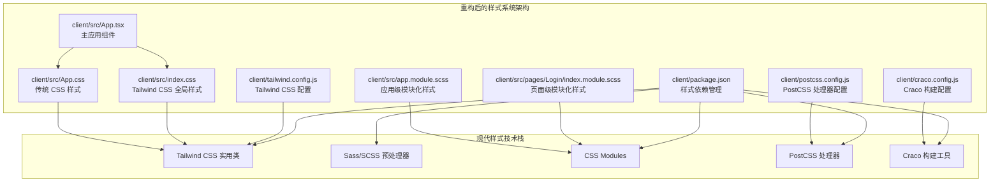
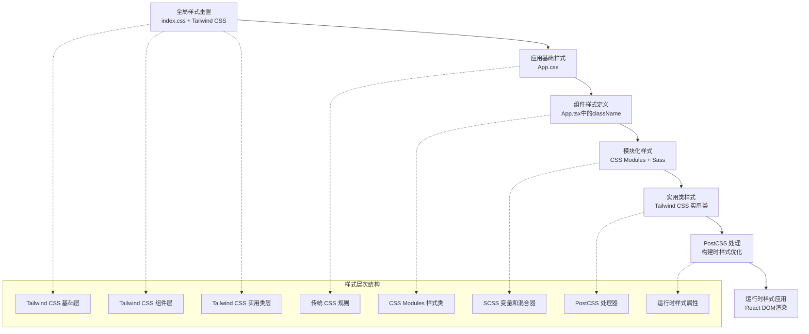
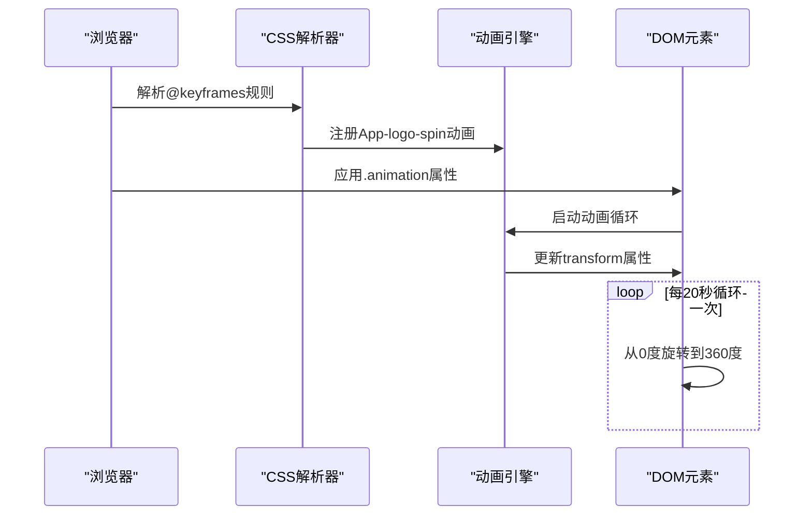
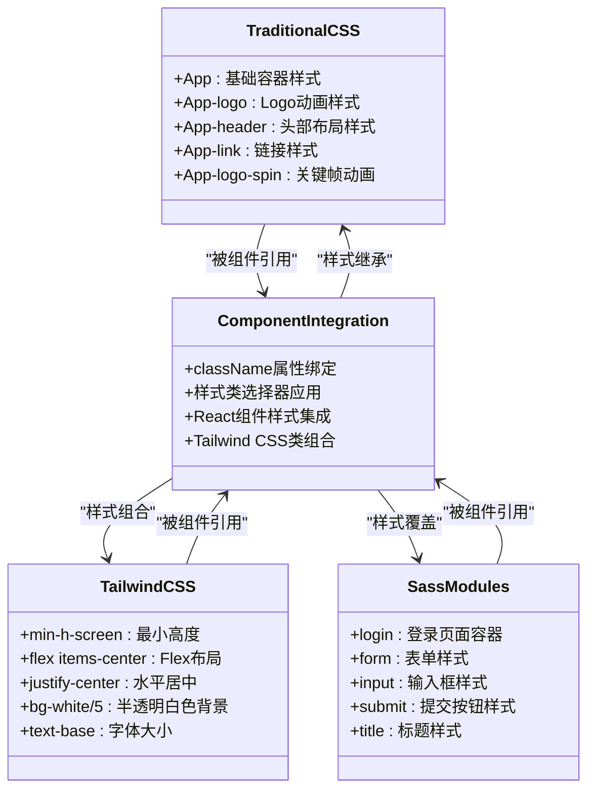
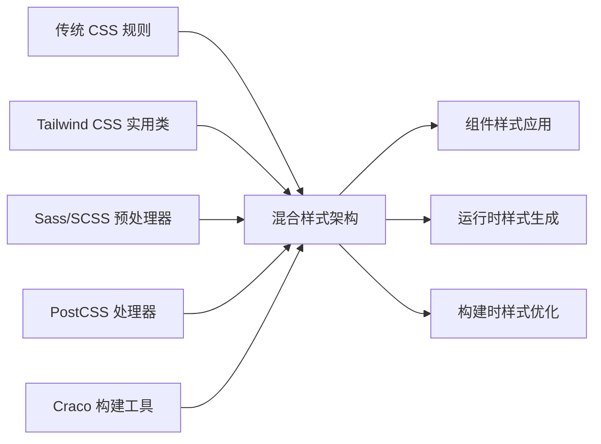
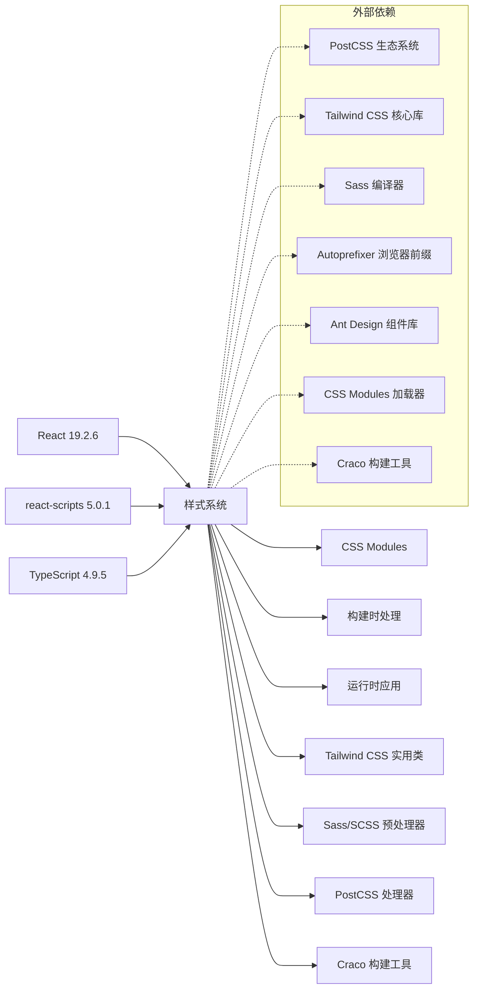

# 样式系统

<cite>
**本文档引用的文件**
- [client/src/App.css](file://client/src/App.css)
- [client/src/index.css](file://client/src/index.css)
- [client/src/app.module.scss](file://client/src/app.module.scss)
- [client/src/pages/Login/index.module.scss](file://client/src/pages/Login/index.module.scss)
- [client/src/pages/Login/index.tsx](file://client/src/pages/Login/index.tsx)
- [client/src/layouts/BasicLayout/index.tsx](file://client/src/layouts/BasicLayout/index.tsx)
- [client/src/App.tsx](file://client/src/App.tsx)
- [client/tailwind.config.js](file://client/tailwind.config.js)
- [client/postcss.config.js](file://client/postcss.config.js)
- [client/craco.config.js](file://client/craco.config.js)
- [client/package.json](file://client/package.json)
- [client/tsconfig.json](file://client/tsconfig.json)
- [client/README.md](file://client/README.md)
</cite>

## 更新摘要
**变更内容**
- 样式系统重构：从根目录迁移到 client/ 目录结构
- 新增 Tailwind CSS 集成配置和使用说明
- 新增 PostCSS 配置和构建流程优化
- 扩展 Craco 配置以支持现代样式工具链
- 新增 Sass/SCSS 支持和模块化样式系统
- 更新样式系统架构图和组件分析
- 增强响应式设计和主题化策略

## 目录
1. [简介](#简介)
2. [项目结构](#项目结构)
3. [核心样式组件](#核心样式组件)
4. [架构概览](#架构概览)
5. [详细组件分析](#详细组件分析)
6. [现代样式系统](#现代样式系统)
7. [依赖关系分析](#依赖关系分析)
8. [性能考虑](#性能考虑)
9. [故障排除指南](#故障排除指南)
10. [结论](#结论)
11. [附录](#附录)

## 简介

本项目采用现代化的混合样式系统，结合传统 CSS、Tailwind CSS 实用类和 Sass 预处理器，实现了灵活而强大的样式管理方案。项目使用 Create React App 构建工具链，默认支持 CSS 模块化、关键帧动画、媒体查询响应式设计和现代化 CSS 特性。

**重要更新**：样式系统已从根目录重构到 client/ 目录结构，集成了完整的现代样式工具链，包括 Tailwind CSS、PostCSS、Craco 配置和 Sass 支持。

该样式系统的主要特点：
- **多层样式架构**：传统 CSS、Tailwind CSS 实用类、Sass 预处理器三层体系
- **响应式设计**：基于视口单位和媒体查询的自适应布局
- **动画系统**：关键帧动画和过渡效果的完整实现
- **无障碍访问**：减少动画偏好的无障碍设计支持
- **主题化能力**：通过 CSS 变量和 Tailwind 主题扩展实现主题切换
- **现代化工具链**：集成 Craco、PostCSS、Tailwind CSS 等现代工具

## 项目结构

项目采用重构后的 client/ 目录结构，样式文件位于 `client/src` 目录下，并集成了多种现代样式技术：



**图表来源**
- [client/src/App.tsx:1-10](file://client/src/App.tsx#L1-L10)
- [client/src/App.css:1-39](file://client/src/App.css#L1-L39)
- [client/src/index.css:1-21](file://client/src/index.css#L1-L21)
- [client/src/app.module.scss:1-4](file://client/src/app.module.scss#L1-L4)
- [client/src/pages/Login/index.module.scss:1-55](file://client/src/pages/Login/index.module.scss#L1-L55)
- [client/tailwind.config.js:1-20](file://client/tailwind.config.js#L1-L20)
- [client/postcss.config.js:1-7](file://client/postcss.config.js#L1-L7)
- [client/craco.config.js:1-37](file://client/craco.config.js#L1-L37)
- [client/package.json:1-81](file://client/package.json#L1-L81)

**章节来源**
- [client/src/App.tsx:1-10](file://client/src/App.tsx#L1-L10)
- [client/package.json:1-81](file://client/package.json#L1-L81)

## 核心样式组件

### 传统 CSS 基础样式

应用的主要容器元素 `.App` 提供了基础的文本对齐功能，确保页面内容居中显示。

### Logo 动画系统

Logo 组件 `.App-logo` 实现了复杂的动画效果：
- 使用视口单位 (`vmin`) 实现响应式尺寸
- 禁用指针事件以避免干扰用户交互
- 条件动画：仅在用户未启用减少动画偏好时运行

### 头部导航样式

`.App-header` 定义了应用头部区域的完整样式系统：
- 深色背景主题 (`#282c34`)
- 全屏高度布局 (`100vh`)
- Flexbox 布局系统实现垂直居中
- 动态字体大小计算 (`calc(10px + 2vmin)`)
- 白色文字颜色

### 链接样式

`.App-link` 提供了蓝色链接颜色，符合 React 官方文档的视觉设计规范。

### Tailwind CSS 实用类系统

项目通过 `client/src/index.css` 集成了 Tailwind CSS 的三个核心层：
- `@tailwind base`：基础样式重置
- `@tailwind components`：组件样式
- `@tailwind utilities`：实用类样式

这些实用类在组件中广泛使用，如 `min-h-screen`、`flex items-center`、`justify-center` 等。

### Sass 模块化样式

项目实现了完整的 Sass 模块化样式系统：
- 页面级样式：`client/src/pages/Login/index.module.scss`
- 应用级样式：`client/src/app.module.scss`
- 支持嵌套、变量、混合器等 Sass 特性
- 通过 CSS Modules 实现样式隔离

**章节来源**
- [client/src/App.css:1-39](file://client/src/App.css#L1-L39)
- [client/src/index.css:1-21](file://client/src/index.css#L1-L21)
- [client/src/app.module.scss:1-4](file://client/src/app.module.scss#L1-L4)
- [client/src/pages/Login/index.module.scss:1-55](file://client/src/pages/Login/index.module.scss#L1-L55)

## 架构概览

样式系统采用分层架构设计，从基础样式到组件样式层层递进，并集成了现代样式技术：



**图表来源**
- [client/src/index.css:1-21](file://client/src/index.css#L1-L21)
- [client/src/App.css:1-39](file://client/src/App.css#L1-L39)
- [client/src/App.tsx:1-10](file://client/src/App.tsx#L1-L10)
- [client/src/pages/Login/index.module.scss:1-55](file://client/src/pages/Login/index.module.scss#L1-L55)

## 详细组件分析

### 关键帧动画实现

项目实现了完整的旋转动画系统，展示了现代 CSS 动画的最佳实践：



**图表来源**
- [client/src/App.css:31-38](file://client/src/App.css#L31-L38)
- [client/src/App.css:10-14](file://client/src/App.css#L10-L14)

#### 动画特性分析

动画系统的关键特性：
- **条件执行**：通过媒体查询 `@media (prefers-reduced-motion: no-preference)` 控制动画行为
- **性能优化**：使用硬件加速的 `transform` 属性而非改变布局属性
- **无限循环**：`infinite` 关键字确保持续动画效果
- **线性插值**：`linear` 时间函数提供均匀的旋转速度

### 响应式设计策略

项目采用了多层次的响应式设计策略：

```mermaid
flowchart TD
A[响应式设计策略] --> B[视口单位系统]
A --> C[媒体查询系统]
A --> D[动态字体计算]
A --> E[Tailwind CSS 断点系统]
B --> B1[vmin单位<br/>基于视口最小尺寸]
B --> B2[40vmin<br/>Logo尺寸适配]
C --> C1[减少动画偏好检测<br/>prefers-reduced-motion]
C --> C2[设备尺寸适配<br/>未来扩展点]
D --> D1[calc(10px + 2vmin)<br/>动态字体大小]
E --> E1[min-h-screen<br/>最小高度断点]
E --> E2[flex items-center<br/>Flex布局断点]
E --> E3[justify-center<br/>水平居中断点]
```

**图表来源**
- [client/src/App.css:5-8](file://client/src/App.css#L5-L8)
- [client/src/App.css:10-14](file://client/src/App.css#L10-L14)
- [client/src/App.css:23](file://client/src/App.css#L23)
- [client/src/layouts/BasicLayout/index.tsx:52-96](file://client/src/layouts/BasicLayout/index.tsx#L52-L96)

#### 媒体查询实现

当前媒体查询主要用于无障碍访问：
- **减少动画偏好**：检测用户是否启用了减少动画设置
- **条件样式应用**：仅在用户允许动画时应用旋转效果
- **无障碍兼容性**：遵循 WCAG 2.1 的无障碍设计原则

### 样式模块化与组件组织

项目采用多层次的模块化样式组织方式：



**图表来源**
- [client/src/App.css:1-39](file://client/src/App.css#L1-L39)
- [client/src/index.css:1-21](file://client/src/index.css#L1-L21)
- [client/src/pages/Login/index.module.scss:1-55](file://client/src/pages/Login/index.module.scss#L1-L55)
- [client/src/layouts/BasicLayout/index.tsx:1-100](file://client/src/layouts/BasicLayout/index.tsx#L1-L100)

**章节来源**
- [client/src/App.tsx:3](file://client/src/App.tsx#L3)
- [client/src/App.css:1-39](file://client/src/App.css#L1-L39)
- [client/src/pages/Login/index.tsx:1-38](file://client/src/pages/Login/index.tsx#L1-L38)

## 现代样式系统

### Tailwind CSS 集成

项目成功集成了 Tailwind CSS 实用类框架，提供了快速的样式开发体验：

#### 配置系统

Tailwind CSS 配置文件 `client/tailwind.config.js` 包含以下关键设置：
- **内容扫描**：监控 HTML 和 TypeScript 文件以生成最小化 CSS
- **核心插件禁用**：禁用 `preflight` 以避免与 Ant Design 的全局样式冲突
- **主题扩展**：添加了自定义颜色变量 `primary: '#1677ff'`

#### 实用类使用

在组件中广泛使用 Tailwind CSS 实用类：
- **布局系统**：`min-h-screen`、`flex`、`items-center`、`justify-center`
- **间距系统**：`m-4`、`p-6`、`gap-2`
- **颜色系统**：`bg-white/5`、`text-white`、`hover:text-primary`
- **响应式系统**：`sm:`、`md:`、`lg:` 前缀的断点

#### 在组件中的应用

```typescript
// BasicLayout 组件中的 Tailwind CSS 使用
<div className={`flex items-center justify-center h-14 font-semibold text-white bg-white/5 ${collapsed ? 'text-sm' : 'text-base'}`}>
```

### PostCSS 配置

项目集成了完整的 PostCSS 处理器配置，提供了现代化的 CSS 处理能力：

#### 配置系统

PostCSS 配置文件 `client/postcss.config.js` 包含以下插件：
- **Tailwind CSS 插件**：处理 Tailwind CSS 实用类
- **Autoprefixer 插件**：自动添加浏览器前缀

#### 处理流程

PostCSS 处理器按照以下顺序处理样式：
1. 解析 CSS 文件
2. 应用 Tailwind CSS 插件
3. 自动添加浏览器前缀
4. 生成最终的 CSS 文件

### Craco 构建配置

项目使用 Craco (Create React App Configuration Override) 工具来扩展 CRA 的构建配置：

#### Webpack 别名配置

```javascript
webpack: {
  alias: {
    '@': path.resolve(__dirname, 'src'),
  },
}
```

#### 开发服务器配置

```javascript
devServer: {
  proxy: {
    '/api': {
      target: process.env.PROXY_TARGET || 'http://localhost:3001',
      changeOrigin: true,
    },
  },
}
```

#### Jest 配置同步

```javascript
jest: {
  configure: {
    moduleNameMapper: {
      '^@/(.*)$': '<rootDir>/src/$1',
    },
  },
}
```

### Sass/SCSS 支持

项目集成了 Sass 预处理器，提供了更强大的样式开发能力：

#### 配置和依赖

在 `client/package.json` 中添加了以下依赖：
- `sass`: ^1.89.0
- `tailwindcss`: ^3.4.14
- `postcss`: ^8.4.47
- `autoprefixer`: ^10.4.20

#### 模块化样式系统

项目实现了完整的 CSS Modules + Sass 模块化系统：
- **页面级样式**：每个页面拥有独立的样式模块
- **应用级样式**：全局共享的样式模块
- **样式隔离**：通过 CSS Modules 避免样式冲突

#### Login 页面样式示例

```scss
.login {
  width: 100%;
  height: 100vh;
  display: flex;
  align-items: center;
  justify-content: center;
  background: linear-gradient(135deg, #1677ff 0%, #001529 100%);
}

.form {
  width: 360px;
  padding: 32px 28px;
  background-color: #fff;
  border-radius: 8px;
  box-shadow: 0 8px 24px rgba(0, 0, 0, 0.12);
  display: flex;
  flex-direction: column;
}
```

#### 样式模块导入

```typescript
import styles from './index.module.scss';

function Login() {
  return (
    <div className={styles.login}>
      <form className={styles.form}>
        <h2 className={styles.title}>后台管理登录</h2>
        <input className={styles.input} />
        <button className={styles.submit} type="submit">
          登录
        </button>
      </form>
    </div>
  );
}
```

### 混合样式架构

项目实现了传统 CSS、Tailwind CSS 实用类和 Sass 预处理器的完美融合：



**图表来源**
- [client/src/App.css:1-39](file://client/src/App.css#L1-L39)
- [client/src/index.css:1-21](file://client/src/index.css#L1-L21)
- [client/src/pages/Login/index.module.scss:1-55](file://client/src/pages/Login/index.module.scss#L1-L55)
- [client/postcss.config.js:1-7](file://client/postcss.config.js#L1-L7)
- [client/craco.config.js:1-37](file://client/craco.config.js#L1-L37)

**章节来源**
- [client/tailwind.config.js:1-20](file://client/tailwind.config.js#L1-L20)
- [client/postcss.config.js:1-7](file://client/postcss.config.js#L1-L7)
- [client/craco.config.js:1-37](file://client/craco.config.js#L1-L37)
- [client/package.json:22-73](file://client/package.json#L22-L73)
- [client/src/pages/Login/index.tsx:1-38](file://client/src/pages/Login/index.tsx#L1-L38)

## 依赖关系分析

样式系统的依赖关系更加复杂，集成了多种现代样式技术：



**图表来源**
- [client/package.json:1-81](file://client/package.json#L1-L81)

**章节来源**
- [client/package.json:1-81](file://client/package.json#L1-L81)

## 性能考虑

### 多层次性能优化

项目在多个层面采用了性能优化措施：

#### Tailwind CSS 优化
- **按需生成**：通过内容扫描只生成使用的样式类
- **核心插件禁用**：避免重复的基础样式重置
- **主题变量**：通过 CSS 变量实现主题切换的性能优化

#### Sass 性能
- **模块化编译**：每个组件独立编译，避免全局样式冲突
- **变量复用**：通过 Sass 变量减少重复代码
- **混合器优化**：使用混合器避免重复的样式声明

#### PostCSS 优化
- **插件链优化**：合理排列 PostCSS 插件以提高处理效率
- **缓存机制**：利用构建缓存减少重复处理时间
- **源码映射**：保持开发时的源码映射以便调试

#### 动画性能优化
- **硬件加速**：使用 `transform` 属性而非改变布局属性
- **条件执行**：根据用户偏好动态控制动画
- **线性插值**：使用 `linear` 时间函数确保性能稳定

### 样式加载策略

- **分层加载**：基础样式、实用类、模块化样式分层加载
- **按需加载**：通过 React 组件按需引入样式
- **缓存友好**：构建后生成的 CSS 文件具有良好的缓存特性
- **Tree Shaking**：移除未使用的样式类

## 故障排除指南

### 现代样式系统常见问题

#### Tailwind CSS 相关问题
1. **样式不生效**
   - 检查 `content` 配置是否包含正确的文件路径
   - 确认 Tailwind CSS 导入语句是否正确
   - 验证 PostCSS 配置是否正确

2. **实用类冲突**
   - 检查是否禁用了 `preflight` 核心插件
   - 确认与第三方组件库的样式冲突
   - 验证样式优先级设置

#### PostCSS 相关问题
1. **构建失败**
   - 检查 PostCSS 插件配置是否正确
   - 确认插件版本兼容性
   - 验证 CSS 语法正确性

2. **样式转换异常**
   - 检查插件执行顺序
   - 确认源码映射配置
   - 验证输出文件格式

#### Craco 配置问题
1. **构建配置无效**
   - 检查 Craco 配置文件语法
   - 确认配置项拼写正确
   - 验证路径别名配置

2. **代理配置失败**
   - 检查开发服务器配置
   - 确认代理目标地址可达
   - 验证 CORS 设置

#### Sass/SCSS 相关问题
1. **样式模块导入失败**
   - 检查文件路径是否正确
   - 确认文件扩展名是否匹配
   - 验证 CSS Modules 配置

2. **变量和混合器不生效**
   - 检查 Sass 依赖是否正确安装
   - 确认导入语句的语法正确性
   - 验证编译器配置

#### 动画和响应式问题
1. **动画异常**
   - 检查 `prefers-reduced-motion` 用户偏好设置
   - 确认 `@keyframes` 规则是否正确定义
   - 验证 `animation` 属性语法

2. **响应式问题**
   - 测试不同设备和屏幕尺寸
   - 检查视口单位的兼容性
   - 验证媒体查询语法

### 调试技巧

1. **浏览器开发者工具**
   - 使用 Elements 面板检查样式应用
   - 利用 Computed 样式查看最终效果
   - 通过 Styles 面板调试选择器优先级

2. **样式验证**
   - 使用 CSS 验证器检查语法错误
   - 检查颜色对比度是否符合无障碍标准
   - 验证字体加载和回退机制

3. **现代工具调试**
   - 使用 Tailwind CSS 插件检查未使用的样式类
   - 通过 PostCSS 插件调试样式转换过程
   - 利用 Sass 开发者工具检查变量和混合器

**章节来源**
- [client/src/App.css:10-14](file://client/src/App.css#L10-L14)
- [client/src/App.css:31-38](file://client/src/App.css#L31-L38)
- [client/tailwind.config.js:7-10](file://client/tailwind.config.js#L7-L10)
- [client/src/pages/Login/index.module.scss:1-55](file://client/src/pages/Login/index.module.scss#L1-L55)

## 结论

本项目的样式系统展现了现代前端开发的最佳实践：
- **多层次架构**：传统 CSS、Tailwind CSS 实用类、Sass 预处理器的完美融合
- **现代化工具链**：PostCSS、Autoprefixer、Craco 等现代工具的集成
- **组件化开发**：CSS Modules 和 Sass 模块化实现样式隔离
- **性能优化**：按需生成、Tree Shaking、硬件加速等多重优化
- **无障碍友好**：充分考虑用户偏好和可访问性需求
- **主题化能力**：通过 CSS 变量和 Tailwind 主题扩展实现主题切换
- **工程化实践**：完整的构建配置和开发工具链

**重要更新**：样式系统已成功重构到 client/ 目录结构，集成了完整的现代样式工具链，为初学者提供了良好的学习基础，同时为更复杂的应用场景预留了扩展空间。通过集成多种现代样式技术，项目实现了灵活性、性能和可维护性的最佳平衡。

## 附录

### 样式定制最佳实践

#### 命名约定
- **语义化类名**：使用描述功能而非外观的类名
- **BEM 方法**：采用 Block__Element--Modifier 命名约定
- **CSS Modules**：使用驼峰命名避免冲突
- **Tailwind CSS**：遵循实用类的语义化组合

#### 主题化策略
- **CSS 变量**：使用 `:root` 和 `var()` 实现主题切换
- **Tailwind 主题**：通过 `tailwind.config.js` 扩展主题配置
- **Sass 变量**：使用 `$` 前缀定义主题变量
- **暗色模式**：通过媒体查询和 CSS 变量实现自动切换

#### 现代样式解决方案

**CSS-in-JS 选项**：
- **Styled Components**：类型安全的样式组件
- **Emotion**：高性能的 CSS-in-JS 库
- **Framer Motion**：动画和手势库

**预处理器选择**：
- **Sass/SCSS**：增强的 CSS 功能，变量、混合器、嵌套
- **Less**：灵活的 CSS 扩展
- **PostCSS**：现代 CSS 处理工具链

#### CSS 基础入门

**选择器类型**：
- **元素选择器**：`div`, `p`, `h1`
- **类选择器**：`.class-name`
- **ID 选择器**：`#id-name`
- **属性选择器**：`[href]`, `[title="example"]`

**盒模型**：
- `margin`：外边距
- `border`：边框
- `padding`：内边距
- `width/height`：内容尺寸

**定位系统**：
- `position: static/relative/absolute/fixed/sticky`
- `display: block/inline/inline-block/flex/grid/table`
- `float` 和 `clear`

#### React 样式集成

**内联样式**：
```javascript
const styles = {
  backgroundColor: '#282c34',
  color: 'white'
};
```

**CSS Modules**：
```css
/* styles.module.css */
.container {
  padding: 2rem;
}
```

**Styled Components**：
```javascript
import styled from 'styled-components';

const StyledHeader = styled.header`
  background-color: #282c34;
`;
```

**Tailwind CSS 实用类**：
```html
<div className="flex items-center justify-center min-h-screen">
  <div className="bg-white/5 rounded-lg p-6">
    <h1 className="text-xl font-semibold text-white">内容</h1>
  </div>
</div>
```

**Sass 模块化**：
```scss
// styles.scss
$primary-color: #1677ff;

.button {
  background-color: $primary-color;
  
  &:hover {
    background-color: darken($primary-color, 10%);
  }
}
```

**章节来源**
- [client/src/App.css:1-39](file://client/src/App.css#L1-L39)
- [client/src/index.css:1-21](file://client/src/index.css#L1-L21)
- [client/src/app.module.scss:1-4](file://client/src/app.module.scss#L1-L4)
- [client/src/pages/Login/index.module.scss:1-55](file://client/src/pages/Login/index.module.scss#L1-L55)
- [client/tailwind.config.js:1-20](file://client/tailwind.config.js#L1-L20)
- [client/README.md:1-15](file://client/README.md#L1-L15)