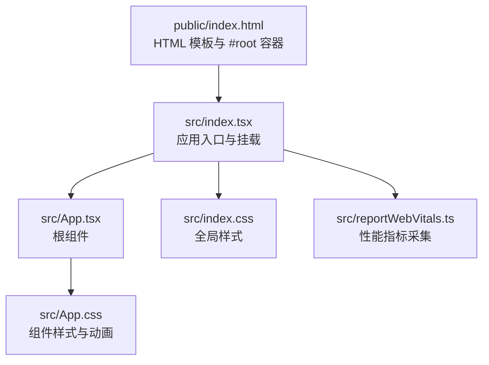
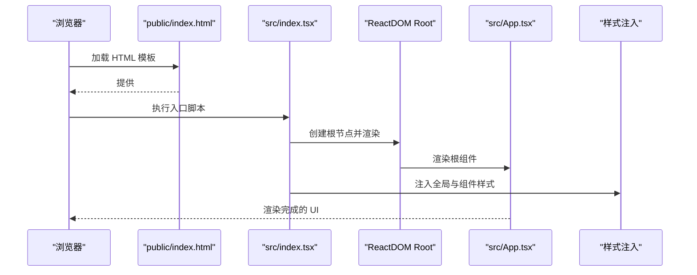
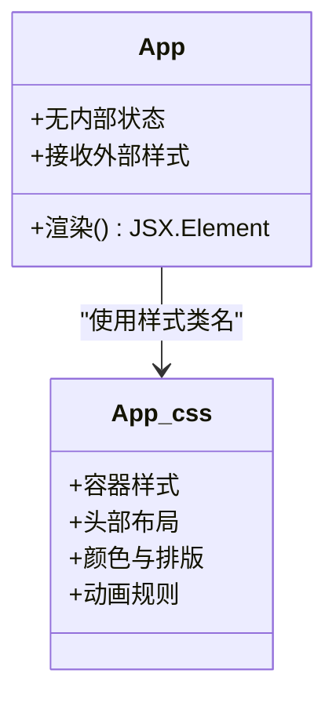
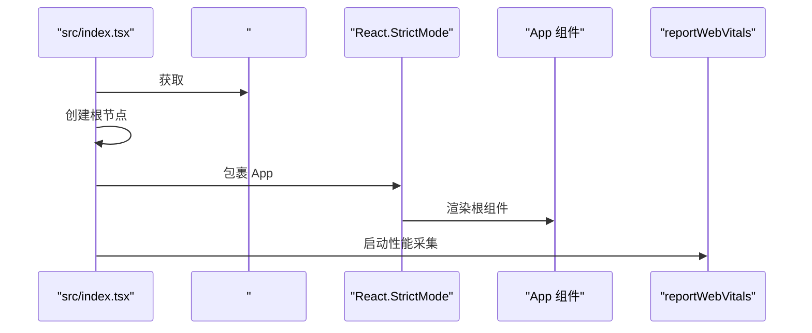
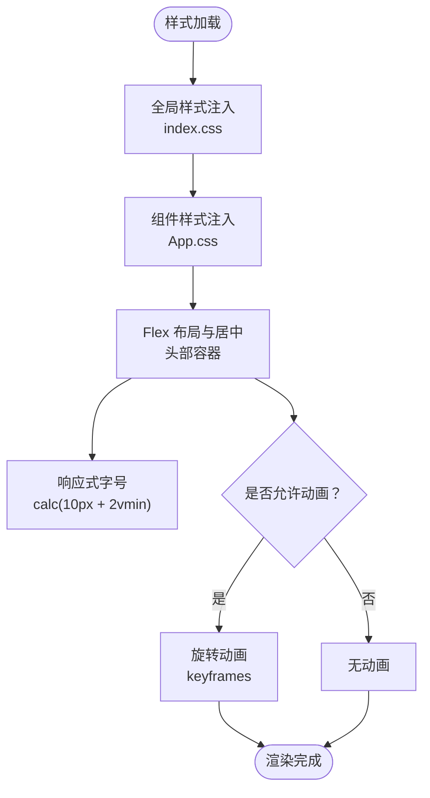
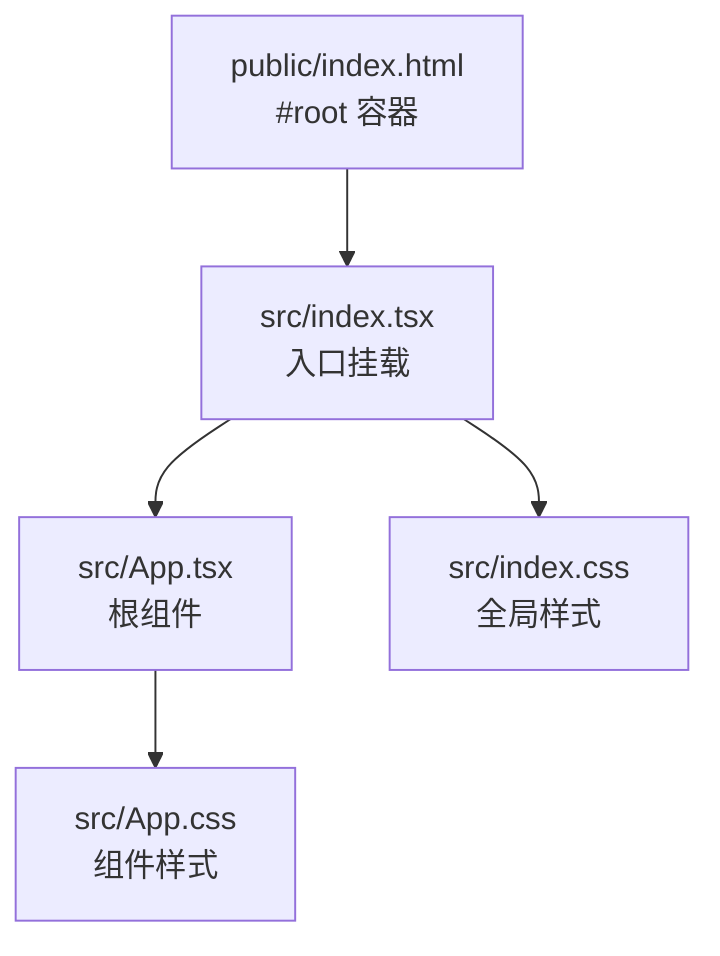
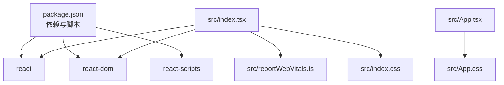

# 核心组件

<cite>
**本文引用的文件**
- [src/App.tsx](file://src/App.tsx)
- [src/index.tsx](file://src/index.tsx)
- [src/App.css](file://src/App.css)
- [src/index.css](file://src/index.css)
- [src/reportWebVitals.ts](file://src/reportWebVitals.ts)
- [public/index.html](file://public/index.html)
- [package.json](file://package.json)
- [README.md](file://README.md)
</cite>

## 目录
1. [简介](#简介)
2. [项目结构](#项目结构)
3. [核心组件](#核心组件)
4. [架构总览](#架构总览)
5. [详细组件分析](#详细组件分析)
6. [依赖关系分析](#依赖关系分析)
7. [性能考虑](#性能考虑)
8. [故障排除指南](#故障排除指南)
9. [结论](#结论)
10. [附录](#附录)

## 简介
本文件聚焦于 React Next 项目的“核心组件”，围绕以下三个关键文件展开：应用入口 index.tsx、根组件 App.tsx 以及样式文件 App.css、index.css。我们将从系统架构、组件层次结构、数据流与状态管理、组件间通信模式、样式与动画、响应式设计、性能与可扩展性等维度进行深入解析，并提供面向初学者的概念入门与面向高级开发者的架构洞察。

## 项目结构
该项目采用 Create React App（CRA）脚手架生成的基础结构，核心入口与根组件如下：
- 入口文件：src/index.tsx 负责挂载 React 应用到 DOM 的 #root 容器
- 根组件：src/App.tsx 是应用的顶层 UI 组件
- 样式文件：src/App.css 和 src/index.css 提供全局样式与组件样式
- 性能指标：src/reportWebVitals.ts 提供 Web Vitals 指标采集
- HTML 模板：public/index.html 提供应用的 HTML 模板与基础元信息

图表来源
- [public/index.html:1-44](file://public/index.html#L1-L44)
- [src/index.tsx:1-20](file://src/index.tsx#L1-L20)
- [src/App.tsx:1-27](file://src/App.tsx#L1-L27)
- [src/App.css:1-39](file://src/App.css#L1-L39)
- [src/index.css:1-14](file://src/index.css#L1-L14)
- [src/reportWebVitals.ts:1-16](file://src/reportWebVitals.ts#L1-L16)

章节来源
- [public/index.html:1-44](file://public/index.html#L1-L44)
- [src/index.tsx:1-20](file://src/index.tsx#L1-L20)
- [src/App.tsx:1-27](file://src/App.tsx#L1-L27)
- [src/App.css:1-39](file://src/App.css#L1-L39)
- [src/index.css:1-14](file://src/index.css#L1-L14)
- [src/reportWebVitals.ts:1-16](file://src/reportWebVitals.ts#L1-L16)

## 核心组件
本节聚焦于 App.tsx 与 index.tsx 的职责、实现细节与交互关系。

- App.tsx
  - 角色：应用的根组件，负责渲染页面结构与内容
  - 结构：返回一个包含头部区域的容器，内部包含品牌图标、提示文本与外部链接
  - 依赖：引入本地样式文件与本地图标资源；未使用外部状态或副作用
  - 状态管理：当前实现为无状态函数组件，不维护内部状态
  - 用户界面逻辑：以静态 JSX 渲染为主，强调可编辑提示与学习链接

- index.tsx
  - 角色：应用入口点，负责将根组件渲染到 DOM
  - 渲染流程：通过 ReactDOM.createRoot 创建根节点，使用 React.StrictMode 包裹，渲染 <App /> 并调用性能指标采集函数
  - 依赖：导入全局样式、根组件与性能指标模块

章节来源
- [src/App.tsx:1-27](file://src/App.tsx#L1-L27)
- [src/index.tsx:1-20](file://src/index.tsx#L1-L20)

## 架构总览
下图展示了从浏览器加载到组件渲染的端到端流程，包括 HTML 模板、入口挂载、根组件渲染与样式注入。

图表来源
- [public/index.html:1-44](file://public/index.html#L1-L44)
- [src/index.tsx:1-20](file://src/index.tsx#L1-L20)
- [src/App.tsx:1-27](file://src/App.tsx#L1-L27)
- [src/index.css:1-14](file://src/index.css#L1-L14)
- [src/App.css:1-39](file://src/App.css#L1-L39)

## 详细组件分析

### App.tsx 组件分析
- 组件类型：函数组件
- 结构与职责：
  - 外层容器：用于承载整个页面布局
  - 头部容器：居中布局，包含品牌图标、提示文本与学习链接
  - 图标资源：通过本地导入方式引用
- 状态管理：
  - 当前实现为纯函数组件，不维护内部状态
  - 如需状态管理，可在组件内引入 useState/useReducer 或通过 props 接收状态
- 用户界面逻辑：
  - 文本提示引导用户编辑源码并保存以触发重载
  - 外部链接指向 React 官方学习资源
- 可扩展性建议：
  - 引入 props 以支持多语言文案与主题切换
  - 使用 Context 或 Redux 等状态管理库实现跨组件共享状态
  - 将 UI 拆分为更细粒度的子组件（如 Header、Logo、Content、Link）

图表来源
- [src/App.tsx:1-27](file://src/App.tsx#L1-L27)
- [src/App.css:1-39](file://src/App.css#L1-L39)

章节来源
- [src/App.tsx:1-27](file://src/App.tsx#L1-L27)
- [src/App.css:1-39](file://src/App.css#L1-L39)

### index.tsx 入口点分析
- 职责：
  - 将 React 应用挂载到 DOM 的 #root 容器
  - 在严格模式下渲染根组件，确保潜在问题尽早暴露
  - 初始化性能指标采集
- 渲染流程：
  - 获取 #root 元素并创建根节点
  - 渲染 <React.StrictMode><App /></React.StrictMode>
  - 调用 reportWebVitals 进行性能监控
- 可扩展性：
  - 可在入口处添加错误边界、国际化初始化、主题切换等逻辑
  - 可根据环境变量决定是否启用严格模式或性能监控

图表来源
- [src/index.tsx:1-20](file://src/index.tsx#L1-L20)
- [src/reportWebVitals.ts:1-16](file://src/reportWebVitals.ts#L1-L16)

章节来源
- [src/index.tsx:1-20](file://src/index.tsx#L1-L20)
- [src/reportWebVitals.ts:1-16](file://src/reportWebVitals.ts#L1-L16)

### 样式系统与响应式设计
- 全局样式（index.css）
  - 字体族与抗锯齿设置，保证跨平台一致的字体渲染
  - 代码块字体使用等宽字体，便于展示代码片段
- 组件样式（App.css）
  - 容器居中对齐与文本对齐策略
  - 头部容器采用 Flex 布局，垂直与水平居中，背景色与文字色对比度高
  - 响应式字号：使用 calc(10px + 2vmin)，随视口尺寸变化
  - 动画：在媒体查询允许的情况下，为品牌图标添加旋转动画
  - 链接颜色：使用高亮色，提升可点击性
- 媒体查询与无障碍
  - 使用 prefers-reduced-motion 媒体查询控制动画播放，尊重用户的无障碍偏好

图表来源
- [src/index.css:1-14](file://src/index.css#L1-L14)
- [src/App.css:1-39](file://src/App.css#L1-L39)

章节来源
- [src/index.css:1-14](file://src/index.css#L1-L14)
- [src/App.css:1-39](file://src/App.css#L1-L39)

### 组件层次结构与数据流
- 层次结构
  - public/index.html 提供 #root 容器
  - src/index.tsx 负责挂载与渲染
  - src/App.tsx 作为根组件承载页面内容
- 数据流
  - 当前实现为单向数据流：入口将根组件渲染到 DOM，组件内部不维护状态
  - 若引入状态管理，可通过 props 自上而下传递，或通过 Context/Redux 实现跨层级共享

图表来源
- [public/index.html:1-44](file://public/index.html#L1-L44)
- [src/index.tsx:1-20](file://src/index.tsx#L1-L20)
- [src/App.tsx:1-27](file://src/App.tsx#L1-L27)
- [src/App.css:1-39](file://src/App.css#L1-L39)
- [src/index.css:1-14](file://src/index.css#L1-L14)

章节来源
- [public/index.html:1-44](file://public/index.html#L1-L44)
- [src/index.tsx:1-20](file://src/index.tsx#L1-L20)
- [src/App.tsx:1-27](file://src/App.tsx#L1-L27)
- [src/App.css:1-39](file://src/App.css#L1-L39)
- [src/index.css:1-14](file://src/index.css#L1-L14)

### 组件间通信模式
- 当前项目
  - 单向数据流：入口 -> 根组件
  - 无跨组件通信：根组件内部不维护状态，也未使用 Context 或事件总线
- 可选模式（建议）
  - Props 向下传递：将通用配置通过 props 传入根组件
  - Context 上层共享：使用 React Context 在多层级组件间共享主题、语言等状态
  - 事件总线：通过自定义事件或第三方库（如 mitt）实现松耦合通信

章节来源
- [src/App.tsx:1-27](file://src/App.tsx#L1-L27)
- [src/index.tsx:1-20](file://src/index.tsx#L1-L20)

### 使用模式与最佳实践
- 初学者入门
  - 修改 src/App.tsx 中的提示文本，观察热更新效果
  - 添加新的样式类名并在 App.css 中定义，验证样式生效
  - 在 public/index.html 中调整 meta 标签，观察构建产物
- 高级开发者
  - 引入状态管理：在根组件中使用 useState/useContext，或集成 Redux Toolkit
  - 组件拆分：将头部、内容区、页脚拆分为独立组件并通过 props 组合
  - 性能优化：使用 React.memo、useMemo、useCallback 降低重渲染
  - 测试：基于 @testing-library/react 编写组件测试

章节来源
- [src/App.tsx:1-27](file://src/App.tsx#L1-L27)
- [src/App.css:1-39](file://src/App.css#L1-L39)
- [src/index.tsx:1-20](file://src/index.tsx#L1-L20)
- [src/App.test.tsx:1-10](file://src/App.test.tsx#L1-L10)

## 依赖关系分析
- 依赖清单（来自 package.json）
  - 运行时依赖：react、react-dom、react-scripts
  - 开发依赖：TypeScript、ESLint、@testing-library 等
- 入口与运行时
  - index.tsx 依赖 react、react-dom、reportWebVitals
  - App.tsx 依赖本地样式与本地图标资源
- 浏览器兼容与目标
  - browserslist 配置了生产与开发环境的目标浏览器范围

图表来源
- [package.json:1-55](file://package.json#L1-L55)
- [src/index.tsx:1-20](file://src/index.tsx#L1-L20)
- [src/App.tsx:1-27](file://src/App.tsx#L1-L27)
- [src/App.css:1-39](file://src/App.css#L1-L39)
- [src/index.css:1-14](file://src/index.css#L1-L14)
- [src/reportWebVitals.ts:1-16](file://src/reportWebVitals.ts#L1-L16)

章节来源
- [package.json:1-55](file://package.json#L1-L55)
- [src/index.tsx:1-20](file://src/index.tsx#L1-L20)
- [src/App.tsx:1-27](file://src/App.tsx#L1-L27)
- [src/App.css:1-39](file://src/App.css#L1-L39)
- [src/index.css:1-14](file://src/index.css#L1-L14)
- [src/reportWebVitals.ts:1-16](file://src/reportWebVitals.ts#L1-L16)

## 性能考虑
- 渲染性能
  - 使用 React.StrictMode 可帮助发现潜在问题，但不会影响生产性能
  - 当前根组件为纯函数组件，渲染开销极低
- 样式性能
  - App.css 中的动画仅在媒体查询允许时播放，避免不必要的动画消耗
  - 响应式字号 calc(10px + 2vmin) 与 Flex 布局在现代浏览器中性能良好
- 指标采集
  - reportWebVitals 提供 CLS、FID、FCP、LCP、TTFB 等指标，有助于持续优化用户体验

章节来源
- [src/index.tsx:1-20](file://src/index.tsx#L1-L20)
- [src/App.css:1-39](file://src/App.css#L1-L39)
- [src/reportWebVitals.ts:1-16](file://src/reportWebVitals.ts#L1-L16)

## 故障排除指南
- 页面空白或无法渲染
  - 检查 public/index.html 是否存在 #root 容器
  - 确认 src/index.tsx 中的挂载元素 ID 与 HTML 一致
- 样式未生效
  - 确认 App.css 与 index.css 已被正确导入
  - 检查类名拼写与选择器优先级
- 动画不播放
  - 检查浏览器是否启用了减少动画偏好设置
  - 确认媒体查询条件与设备设置匹配
- 性能指标未输出
  - 确认 reportWebVitals 已在入口处调用
  - 检查网络环境与浏览器支持情况

章节来源
- [public/index.html:1-44](file://public/index.html#L1-L44)
- [src/index.tsx:1-20](file://src/index.tsx#L1-L20)
- [src/App.css:1-39](file://src/App.css#L1-L39)
- [src/reportWebVitals.ts:1-16](file://src/reportWebVitals.ts#L1-L16)

## 结论
本项目以最小化结构展示了 React 应用的核心组成：入口挂载、根组件渲染与样式系统。App.tsx 作为根组件承担了页面内容的组织职责，index.tsx 则负责将应用挂载到 DOM 并启动性能监控。样式系统通过全局样式与组件样式协同工作，结合媒体查询与动画规则实现了良好的响应式体验。对于初学者，建议从修改根组件与样式入手；对于高级开发者，可在现有基础上引入状态管理、组件拆分与性能优化策略，进一步提升可维护性与扩展性。

## 附录
- 快速开始
  - 启动开发服务器：参考 README 中的命令
  - 构建生产包：使用构建脚本生成静态资源
  - 运行测试：基于 @testing-library/react 的单元测试
- 自定义建议
  - 主题系统：通过 CSS 变量或 Context 实现主题切换
  - 国际化：引入 i18n 库并配合 Context 管理语言状态
  - 路由：集成 React Router 实现多页面导航
  - 状态管理：引入 Redux Toolkit 或 Zustand 管理复杂业务状态

章节来源
- [README.md:1-15](file://README.md#L1-L15)
- [package.json:1-55](file://package.json#L1-L55)