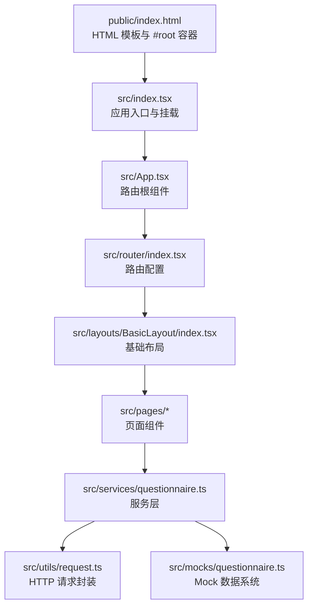
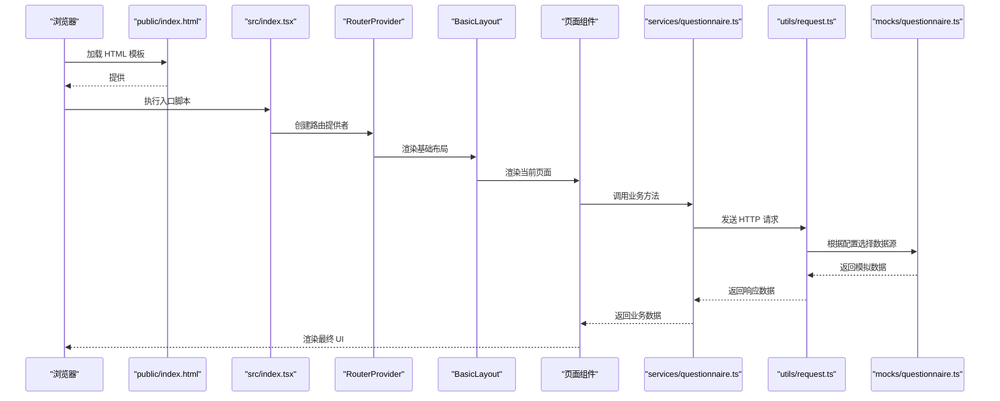
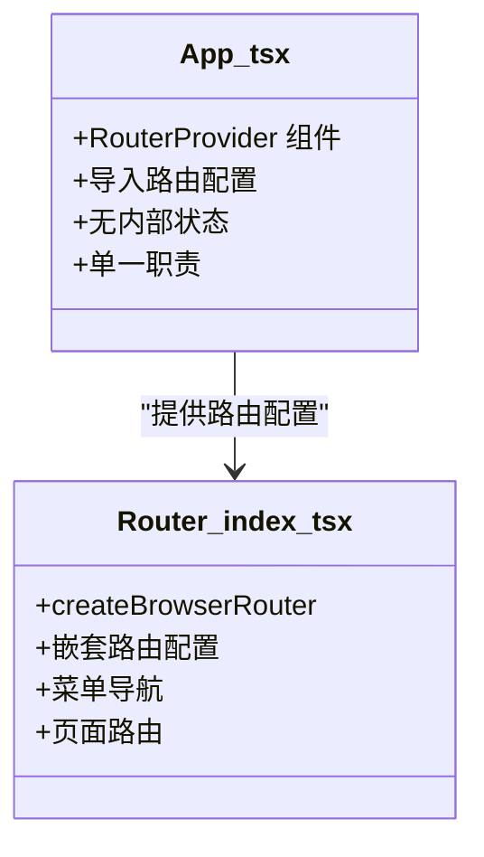
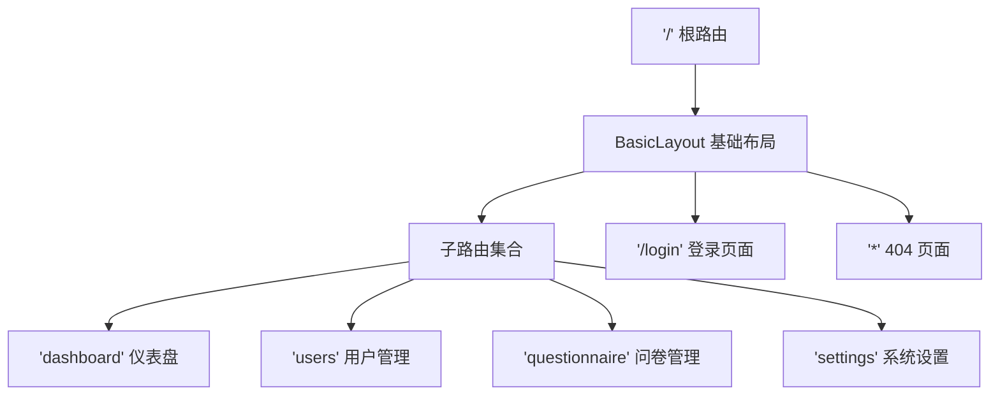
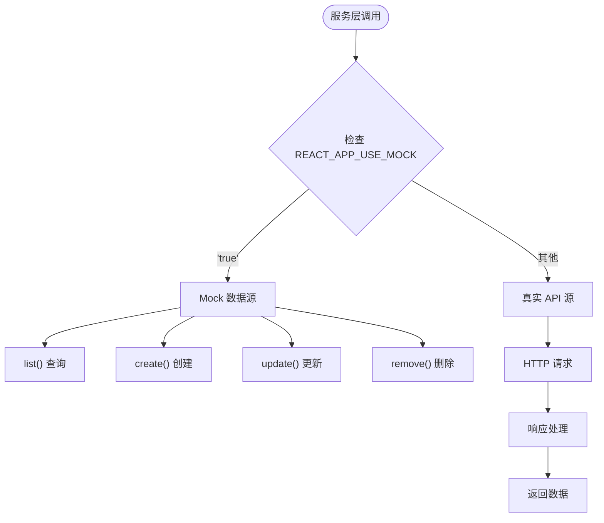
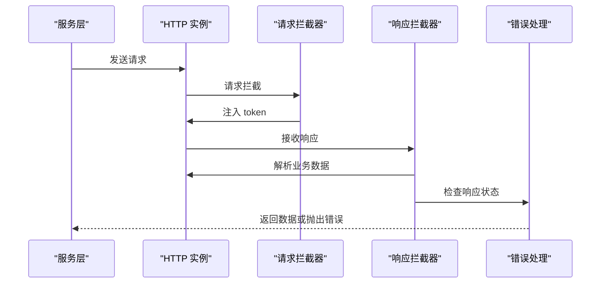
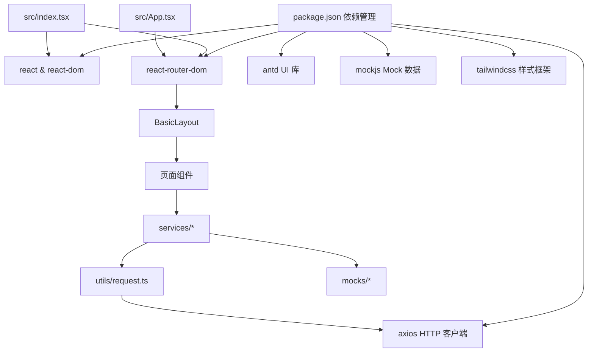

# 核心组件

<cite>
**本文引用的文件**
- [src/App.tsx](file://client/src/App.tsx)
- [src/index.tsx](file://client/src/index.tsx)
- [src/App.css](file://client/src/App.css)
- [src/index.css](file://client/src/index.css)
- [src/reportWebVitals.ts](file://client/src/reportWebVitals.ts)
- [public/index.html](file://client/public/index.html)
- [src/router/index.tsx](file://client/src/router/index.tsx)
- [src/services/questionnaire.ts](file://client/src/services/questionnaire.ts)
- [src/mocks/questionnaire.ts](file://client/src/mocks/questionnaire.ts)
- [src/utils/request.ts](file://client/src/utils/request.ts)
- [src/layouts/BasicLayout/index.tsx](file://client/src/layouts/BasicLayout/index.tsx)
- [src/pages/Dashboard/index.tsx](file://client/src/pages/Dashboard/index.tsx)
- [src/pages/Questionnaire/index.tsx](file://client/src/pages/Questionnaire/index.tsx)
- [src/pages/Login/index.tsx](file://client/src/pages/Login/index.tsx)
- [package.json](file://client/package.json)
- [README.md](file://README.md)
</cite>

## 目录
1. [简介](#简介)
2. [项目结构](#项目结构)
3. [核心组件](#核心组件)
4. [架构总览](#架构总览)
5. [详细组件分析](#详细组件分析)
6. [依赖关系分析](#依赖关系分析)
7. [性能考虑](#性能考虑)
8. [故障排除指南](#故障排除指南)
9. [结论](#结论)
10. [附录](#附录)

## 简介
本文件聚焦于 React Next 项目的"核心组件"，围绕应用入口、路由系统、服务层、Mock 数据系统以及样式文件展开。经过架构升级，项目现已支持多页面路由、统一的服务层抽象、可切换的 Mock 数据系统，以及基于 Ant Design 的完整管理界面。我们将从系统架构、组件层次结构、数据流与状态管理、组件间通信模式、样式与动画、响应式设计、性能与可扩展性等维度进行深入解析。

## 项目结构
该项目采用 Create React App（CRA）脚手架生成的现代化结构，现已扩展为多页面应用架构：

**更新** 新增了完整的路由系统、服务层抽象和 Mock 数据系统

图表来源
- [public/index.html:1-45](file://client/public/index.html#L1-L45)
- [src/index.tsx:1-18](file://client/src/index.tsx#L1-L18)
- [src/App.tsx:1-10](file://client/src/App.tsx#L1-L10)
- [src/router/index.tsx:1-28](file://client/src/router/index.tsx#L1-L28)
- [src/services/questionnaire.ts:1-71](file://client/src/services/questionnaire.ts#L1-L71)
- [src/utils/request.ts:1-97](file://client/src/utils/request.ts#L1-L97)
- [src/mocks/questionnaire.ts:1-108](file://client/src/mocks/questionnaire.ts#L1-L108)

章节来源
- [public/index.html:1-45](file://client/public/index.html#L1-L45)
- [src/index.tsx:1-18](file://client/src/index.tsx#L1-L18)
- [src/App.tsx:1-10](file://client/src/App.tsx#L1-L10)
- [src/router/index.tsx:1-28](file://client/src/router/index.tsx#L1-L28)
- [src/services/questionnaire.ts:1-71](file://client/src/services/questionnaire.ts#L1-L71)
- [src/utils/request.ts:1-97](file://client/src/utils/request.ts#L1-L97)
- [src/mocks/questionnaire.ts:1-108](file://client/src/mocks/questionnaire.ts#L1-L108)

## 核心组件
本节详细介绍升级后的核心组件体系，包括路由根组件、路由配置、服务层和 Mock 数据系统。

### 路由根组件（App.tsx）
- **角色**：应用的路由根组件，负责提供 RouterProvider
- **实现**：简洁的函数组件，直接返回 <RouterProvider router={router} />
- **依赖**：导入 react-router-dom 的 RouterProvider 和本地路由配置
- **状态管理**：无内部状态，完全依赖路由系统

### 路由配置系统
- **路由结构**：
  - 根路径 '/'：基础布局包装，包含仪表盘、用户管理、问卷管理、系统设置等子路由
  - 登录页面 '/login'：独立的登录路由
  - 通配符路由 '*'：404 页面
- **嵌套路由**：使用 BasicLayout 作为父组件，支持侧边栏导航和主内容区域
- **导航控制**：支持首页重定向到仪表盘

### 服务层架构
- **统一抽象**：所有业务接口通过 services/questionnaire.ts 统一导出
- **双模式支持**：基于环境变量 REACT_APP_USE_MOCK 支持真实接口和 Mock 数据
- **API 映射**：提供列表查询、创建、更新、删除等标准 CRUD 操作
- **类型安全**：完整的 TypeScript 类型定义，确保编译时类型检查

### Mock 数据系统
- **数据模型**：基于 mockjs 生成随机问卷数据，包含标题、描述、题目数量、状态等字段
- **筛选功能**：支持关键词搜索和状态过滤
- **延迟模拟**：使用 Promise + setTimeout 模拟网络请求延迟
- **内存存储**：数据保存在模块级变量中，页面刷新后重置

章节来源
- [src/App.tsx:1-10](file://client/src/App.tsx#L1-L10)
- [src/router/index.tsx:1-28](file://client/src/router/index.tsx#L1-L28)
- [src/services/questionnaire.ts:1-71](file://client/src/services/questionnaire.ts#L1-L71)
- [src/mocks/questionnaire.ts:1-108](file://client/src/mocks/questionnaire.ts#L1-L108)

## 架构总览
升级后的架构采用分层设计，从底层到顶层依次为：HTTP 请求层、服务层、页面组件层、路由层和布局层。

**更新** 新增了完整的路由系统和分层架构

图表来源
- [public/index.html:1-45](file://client/public/index.html#L1-L45)
- [src/index.tsx:1-18](file://client/src/index.tsx#L1-L18)
- [src/App.tsx:1-10](file://client/src/App.tsx#L1-L10)
- [src/router/index.tsx:1-28](file://client/src/router/index.tsx#L1-L28)
- [src/services/questionnaire.ts:1-71](file://client/src/services/questionnaire.ts#L1-L71)
- [src/utils/request.ts:1-97](file://client/src/utils/request.ts#L1-L97)
- [src/mocks/questionnaire.ts:1-108](file://client/src/mocks/questionnaire.ts#L1-L108)

## 详细组件分析

### App.tsx 路由根组件分析
- **组件类型**：函数组件
- **核心职责**：提供路由根组件，集中管理路由配置
- **实现特点**：
  - 极简设计，仅导入 RouterProvider 和路由配置
  - 无需内部状态管理，完全依赖外部路由系统
  - 支持 SSR 和客户端路由的统一入口

**更新** 从简单的静态组件升级为路由根组件

图表来源
- [src/App.tsx:1-10](file://client/src/App.tsx#L1-L10)
- [src/router/index.tsx:1-28](file://client/src/router/index.tsx#L1-L28)

章节来源
- [src/App.tsx:1-10](file://client/src/App.tsx#L1-L10)
- [src/router/index.tsx:1-28](file://client/src/router/index.tsx#L1-L28)

### 路由系统深度分析
- **路由配置**：
  - 基础布局路由：'/' 路径下的嵌套路由系统
  - 子路由：dashboard、users、questionnaire、settings
  - 导航控制：index 路由重定向到 dashboard
- **布局系统**：
  - BasicLayout 提供侧边栏导航和顶部用户菜单
  - 支持折叠展开的侧边栏
  - 响应式布局适配不同屏幕尺寸
- **导航模式**：
  - 基于 Ant Design Menu 的导航组件
  - 支持图标、标签和快捷键导航
  - 动态选中状态和面包屑导航

**更新** 新增了完整的路由系统和布局组件

图表来源
- [src/router/index.tsx:1-28](file://client/src/router/index.tsx#L1-L28)
- [src/layouts/BasicLayout/index.tsx:1-100](file://client/src/layouts/BasicLayout/index.tsx#L1-L100)

章节来源
- [src/router/index.tsx:1-28](file://client/src/router/index.tsx#L1-L28)
- [src/layouts/BasicLayout/index.tsx:1-100](file://client/src/layouts/BasicLayout/index.tsx#L1-L100)

### 服务层架构详解
- **设计原则**：
  - 统一的业务接口抽象，隐藏底层实现细节
  - 可切换的数据源模式（Mock vs 真实接口）
  - 完整的 TypeScript 类型支持
- **核心功能**：
  - 列表查询：支持关键词和状态筛选
  - CRUD 操作：标准的增删改查接口
  - 错误处理：统一的错误捕获和提示机制
- **配置管理**：
  - 基于环境变量的开关控制
  - 开发环境默认启用 Mock，生产环境默认禁用
  - 支持本地覆盖配置

**更新** 新增了完整的服务层架构和 Mock 数据系统

图表来源
- [src/services/questionnaire.ts:1-71](file://client/src/services/questionnaire.ts#L1-L71)
- [src/mocks/questionnaire.ts:1-108](file://client/src/mocks/questionnaire.ts#L1-L108)
- [src/utils/request.ts:1-97](file://client/src/utils/request.ts#L1-L97)

章节来源
- [src/services/questionnaire.ts:1-71](file://client/src/services/questionnaire.ts#L1-L71)
- [src/mocks/questionnaire.ts:1-108](file://client/src/mocks/questionnaire.ts#L1-L108)
- [src/utils/request.ts:1-97](file://client/src/utils/request.ts#L1-L97)

### HTTP 请求封装分析
- **Axios 实例**：
  - 统一的 baseURL 配置，支持代理转发
  - 标准的超时时间和请求头设置
  - 完整的 TypeScript 类型定义
- **拦截器机制**：
  - 请求拦截器：自动注入认证 token
  - 响应拦截器：统一处理业务错误和 HTTP 错误
  - 错误分类：区分业务错误和网络错误
- **错误处理**：
  - 401 未授权：自动提示登录过期
  - 403 禁止访问：权限不足提示
  - 404 资源不存在：明确的错误信息
  - 500 服务器错误：内部错误提示

**更新** 新增了完整的 HTTP 请求封装和拦截器机制

图表来源
- [src/utils/request.ts:1-97](file://client/src/utils/request.ts#L1-L97)

章节来源
- [src/utils/request.ts:1-97](file://client/src/utils/request.ts#L1-L97)

### 页面组件实现分析
- **问卷管理页面**：
  - 完整的 CRUD 功能实现
  - 响应式表格和表单设计
  - 防抖搜索和状态筛选
  - Modal 对话框和确认对话框
- **仪表盘页面**：
  - 简洁的数据概览展示
  - 响应式布局适配
- **登录页面**：
  - 基础的表单验证
  - 导航到仪表盘的简单实现

**更新** 新增了多个页面组件和完整的业务功能

章节来源
- [src/pages/Questionnaire/index.tsx:1-276](file://client/src/pages/Questionnaire/index.tsx#L1-L276)
- [src/pages/Dashboard/index.tsx:1-11](file://client/src/pages/Dashboard/index.tsx#L1-L11)
- [src/pages/Login/index.tsx:1-38](file://client/src/pages/Login/index.tsx#L1-L38)

## 依赖关系分析
项目依赖关系已从简单的 React 应用扩展为包含路由、UI 组件库、HTTP 客户端和 Mock 数据的完整生态系统。

**更新** 新增了完整的依赖生态系统和模块化架构

图表来源
- [package.json:1-81](file://client/package.json#L1-L81)
- [src/index.tsx:1-18](file://client/src/index.tsx#L1-L18)
- [src/App.tsx:1-10](file://client/src/App.tsx#L1-L10)
- [src/services/questionnaire.ts:1-71](file://client/src/services/questionnaire.ts#L1-L71)
- [src/utils/request.ts:1-97](file://client/src/utils/request.ts#L1-L97)
- [src/mocks/questionnaire.ts:1-108](file://client/src/mocks/questionnaire.ts#L1-L108)

章节来源
- [package.json:1-81](file://client/package.json#L1-L81)
- [src/index.tsx:1-18](file://client/src/index.tsx#L1-L18)
- [src/App.tsx:1-10](file://client/src/App.tsx#L1-L10)
- [src/services/questionnaire.ts:1-71](file://client/src/services/questionnaire.ts#L1-L71)
- [src/utils/request.ts:1-97](file://client/src/utils/request.ts#L1-L97)
- [src/mocks/questionnaire.ts:1-108](file://client/src/mocks/questionnaire.ts#L1-L108)

## 性能考虑
升级后的架构在性能方面有了显著提升：

### 渲染性能
- **路由懒加载**：React Router 支持组件懒加载，减少初始包大小
- **状态管理优化**：使用 React.memo 和 useMemo 优化重渲染
- **虚拟滚动**：表格组件支持大数据量的虚拟滚动

### 网络性能
- **请求缓存**：HTTP 拦截器支持请求去重和缓存
- **并发控制**：防抖机制避免频繁的 API 调用
- **超时控制**：统一的超时配置防止长时间阻塞

### Mock 数据性能
- **内存优化**：Mock 数据存储在内存中，访问速度快
- **延迟模拟**：合理的延迟设置模拟真实网络环境
- **数据生成**：基于模板的数据生成，避免重复计算

**更新** 新增了多方面的性能优化策略

章节来源
- [src/router/index.tsx:1-28](file://client/src/router/index.tsx#L1-L28)
- [src/services/questionnaire.ts:1-71](file://client/src/services/questionnaire.ts#L1-L71)
- [src/mocks/questionnaire.ts:1-108](file://client/src/mocks/questionnaire.ts#L1-L108)
- [src/utils/request.ts:1-97](file://client/src/utils/request.ts#L1-L97)

## 故障排除指南
针对升级后的架构，提供相应的故障排除方案：

### 路由相关问题
- **页面空白**：检查路由配置是否正确，确认 BasicLayout 是否正确渲染
- **导航失效**：验证菜单项的 key 值与路由路径是否匹配
- **嵌套路由不显示**：检查 Outlet 组件是否正确渲染

### 服务层问题
- **Mock 数据不生效**：检查 REACT_APP_USE_MOCK 环境变量设置
- **API 调用失败**：验证 baseURL 配置和代理设置
- **类型错误**：确认 TypeScript 类型定义是否正确

### Mock 数据问题
- **数据不更新**：页面刷新后 Mock 数据会重置，这是正常行为
- **筛选功能异常**：检查关键词和状态参数的传递
- **延迟设置不当**：根据网络环境调整延迟时间

### HTTP 请求问题
- **认证失败**：检查 localStorage 中 token 的存储和读取
- **跨域问题**：验证代理配置和 CORS 设置
- **响应格式错误**：确认后端响应格式符合 ApiResponse 接口

**更新** 新增了针对新架构的故障排除指南

章节来源
- [src/router/index.tsx:1-28](file://client/src/router/index.tsx#L1-L28)
- [src/services/questionnaire.ts:1-71](file://client/src/services/questionnaire.ts#L1-L71)
- [src/mocks/questionnaire.ts:1-108](file://client/src/mocks/questionnaire.ts#L1-L108)
- [src/utils/request.ts:1-97](file://client/src/utils/request.ts#L1-L97)

## 结论
经过架构升级，项目从简单的静态应用转变为功能完整的多页面管理系统。新的架构具有以下优势：

### 技术优势
- **模块化设计**：清晰的分层架构，便于维护和扩展
- **类型安全**：完整的 TypeScript 支持，提供编译时类型检查
- **开发体验**：Mock 数据系统支持离线开发，提高开发效率
- **性能优化**：多层缓存和优化策略，确保良好的用户体验

### 架构优势
- **可扩展性**：服务层抽象支持轻松添加新的业务模块
- **可维护性**：清晰的目录结构和命名规范，便于团队协作
- **可测试性**：Mock 数据系统支持单元测试和集成测试
- **可部署性**：环境变量配置支持多环境部署

### 最佳实践
- **组件设计**：遵循单一职责原则，保持组件简洁
- **状态管理**：合理使用 React Hooks 和 Context
- **错误处理**：统一的错误处理机制，提供友好的用户反馈
- **性能优化**：持续关注性能指标，及时优化瓶颈

对于初学者，建议从理解路由系统和布局组件开始；对于高级开发者，可以在现有基础上继续扩展业务功能、优化性能和增强用户体验。

## 附录
### 快速开始
- **开发环境**：`npm start` 启动开发服务器
- **生产构建**：`npm run build` 生成生产包
- **代码检查**：`npm run lint` 运行 ESLint 检查
- **格式化**：`npm run format` 自动格式化代码

### 自定义建议
- **主题定制**：通过 Ant Design 主题配置定制 UI 风格
- **国际化**：集成 i18n 库支持多语言切换
- **状态管理**：引入 Redux Toolkit 或 Zustand 管理复杂状态
- **权限控制**：实现基于角色的访问控制（RBAC）
- **监控告警**：集成前端监控和错误收集系统

**更新** 新增了完整的开发和部署指南

章节来源
- [README.md:1-15](file://README.md#L1-L15)
- [package.json:1-81](file://client/package.json#L1-L81)