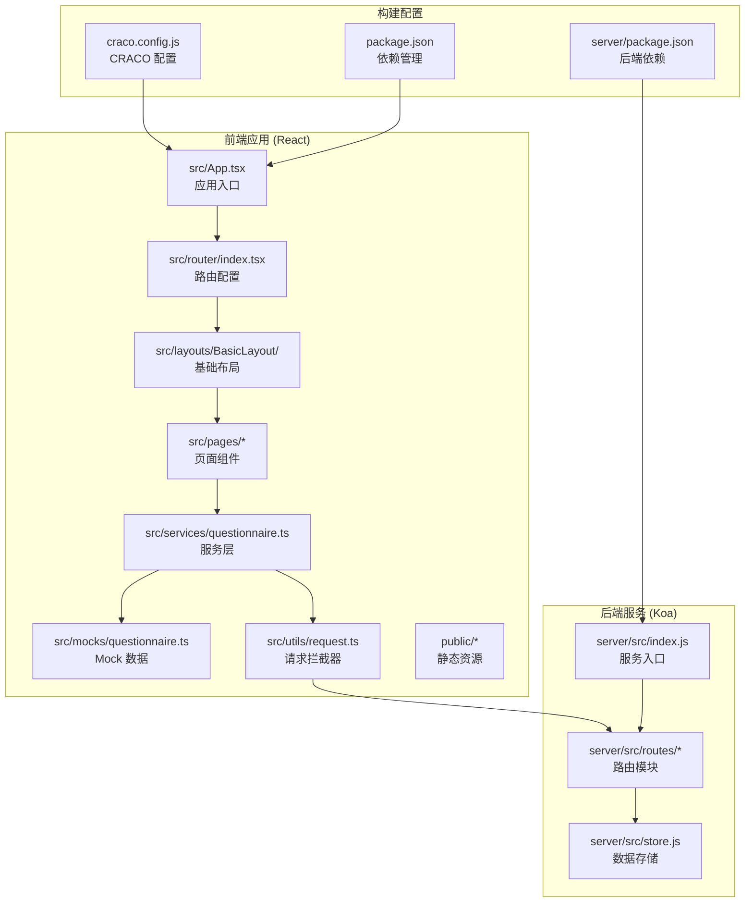
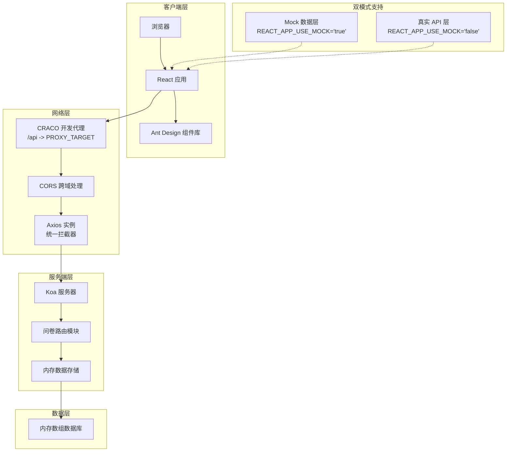
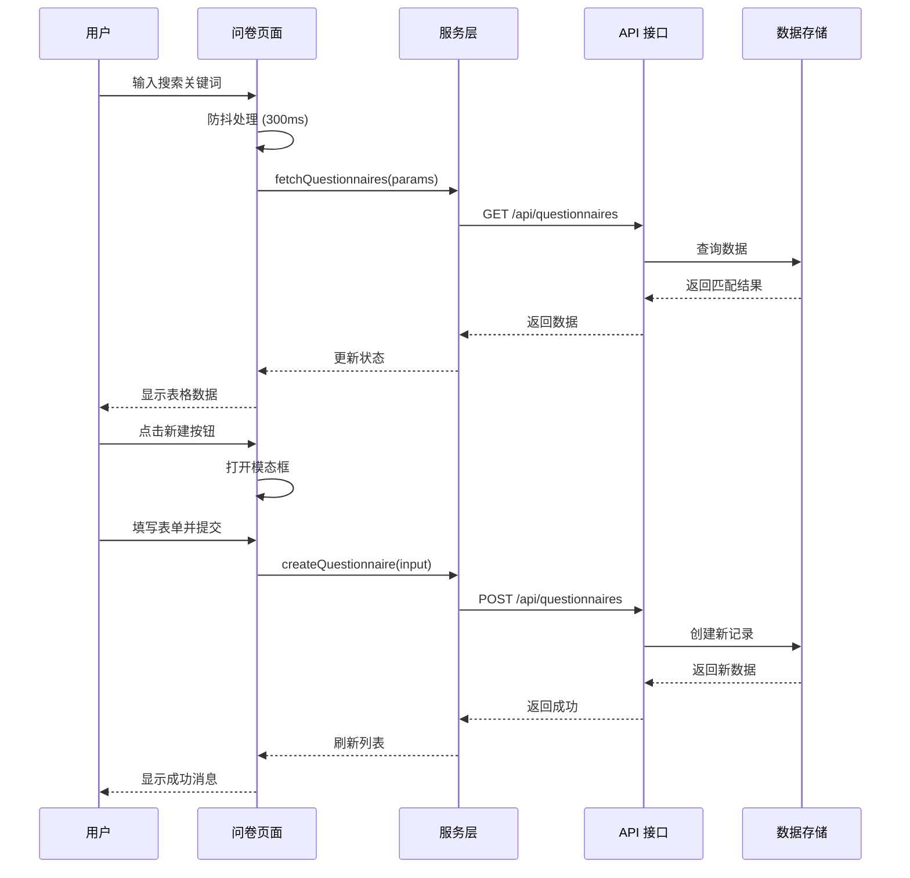
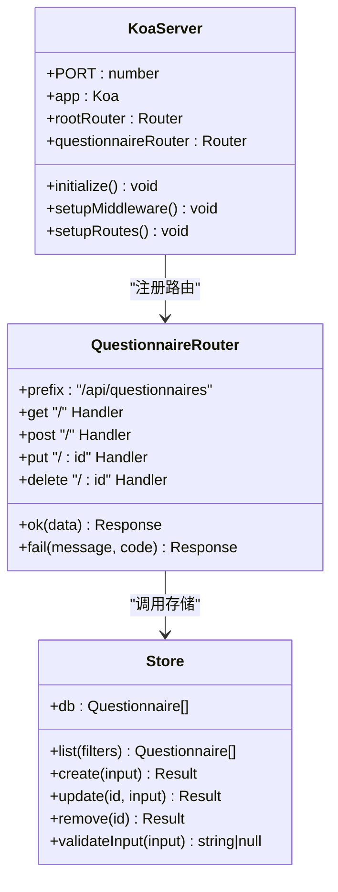
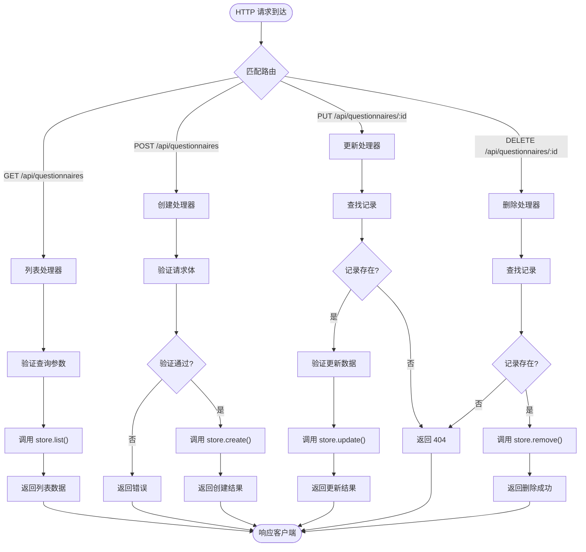
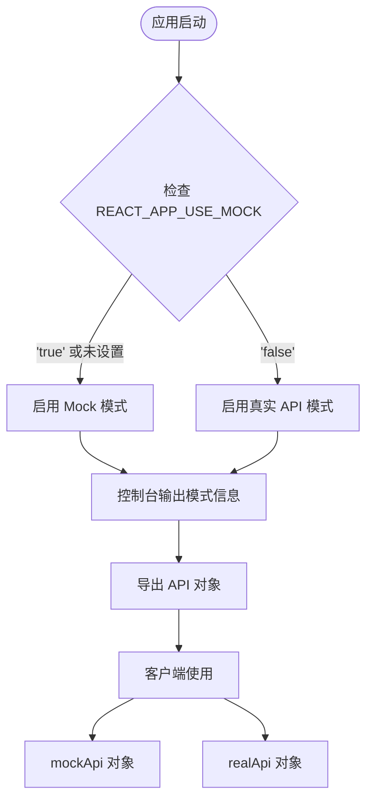
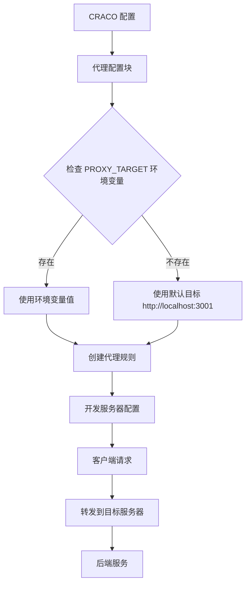
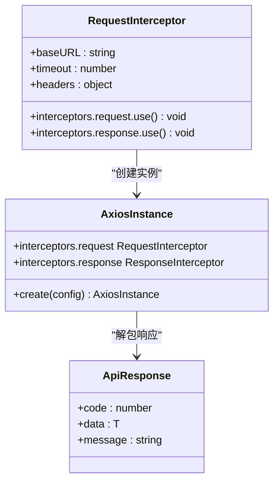
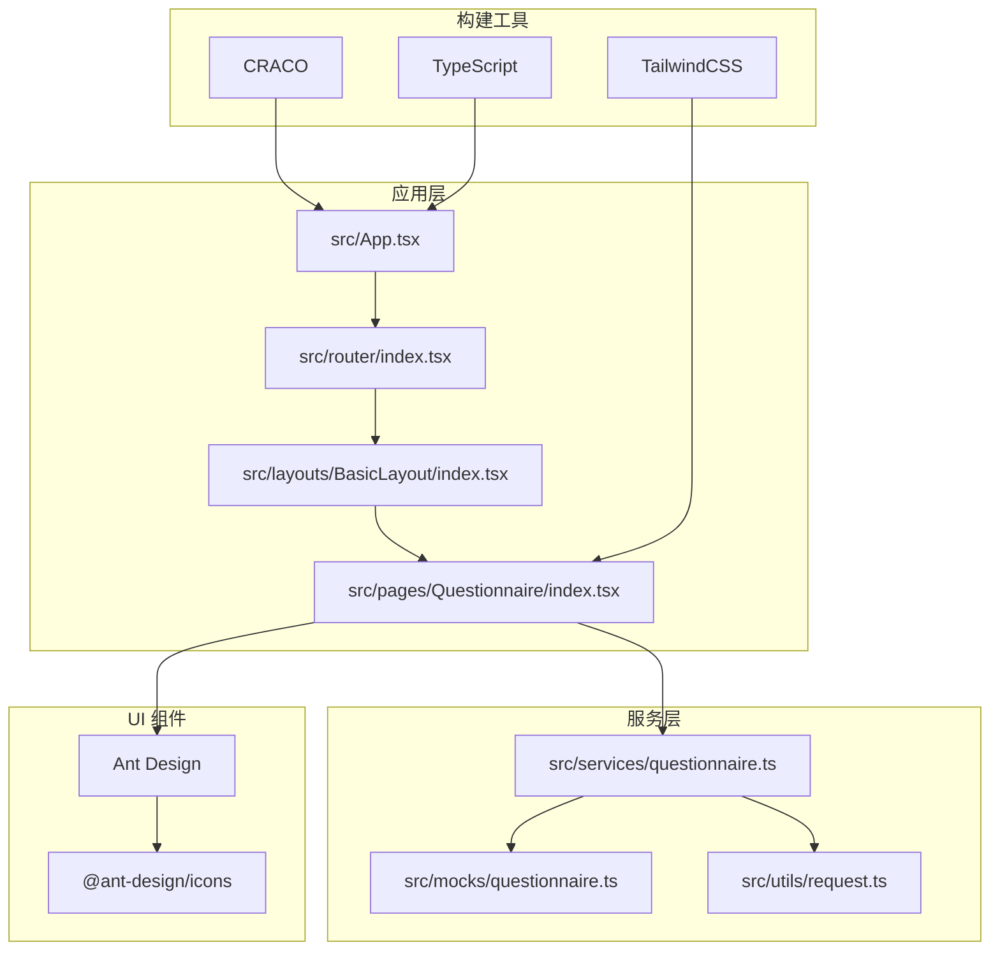
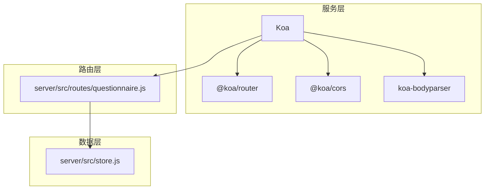

# 问卷管理系统

<cite>
**本文档引用的文件**
- [README.md](file://README.md)
- [package.json](file://client/package.json)
- [server/package.json](file://server/package.json)
- [src/App.tsx](file://client/src/App.tsx)
- [server/src/index.js](file://server/src/index.js)
- [server/src/routes/questionnaire.js](file://server/src/routes/questionnaire.js)
- [server/src/store.js](file://server/src/store.js)
- [src/services/questionnaire.ts](file://client/src/services/questionnaire.ts)
- [src/mocks/questionnaire.ts](file://client/src/mocks/questionnaire.ts)
- [src/utils/request.ts](file://client/src/utils/request.ts)
- [src/router/index.tsx](file://client/src/router/index.tsx)
- [src/pages/Questionnaire/index.tsx](file://client/src/pages/Questionnaire/index.tsx)
- [src/layouts/BasicLayout/index.tsx](file://client/src/layouts/BasicLayout/index.tsx)
- [src/pages/Dashboard/index.tsx](file://client/src/pages/Dashboard/index.tsx)
- [src/pages/Login/index.tsx](file://client/src/pages/Login/index.tsx)
- [craco.config.js](file://client/craco.config.js)
</cite>

## 更新摘要
**所做更改**
- 更新了 CRACO 代理配置章节，反映新的 PROXY_TARGET 环境变量支持
- 增强了服务层双模式支持说明，详细解释了 Mock 和真实 API 的切换机制
- 完善了 Mock 数据系统的架构分析，包括改进的延迟模拟和数据生成策略
- 更新了请求拦截器的文档，反映了新的 axios 实例配置和统一错误处理

## 目录
1. [项目概述](#项目概述)
2. [项目结构](#项目结构)
3. [核心组件](#核心组件)
4. [架构总览](#架构总览)
5. [详细组件分析](#详细组件分析)
6. [依赖关系分析](#依赖关系分析)
7. [性能考虑](#性能考虑)
8. [故障排除指南](#故障排除指南)
9. [结论](#结论)

## 项目概述
本项目是一个基于 React + TypeScript + Ant Design 的问卷管理系统，采用前后端分离架构。前端使用 Create React App（通过 CRACO 扩展）构建，后端基于 Koa 提供 REST API。系统支持问卷的增删改查、状态管理、搜索过滤等功能，并内置 Mock 数据模式用于开发阶段。

**更新** 新增了增强的 CRACO 代理配置和改进的服务层双模式支持，提供了更灵活的开发环境配置选项。

主要技术栈：
- 前端：React 19、TypeScript、Ant Design、CRACO
- 后端：Koa 2、@koa/router、@koa/cors、koa-bodyparser
- 构建工具：pnpm、ESLint、Prettier、Husky
- 样式：TailwindCSS、Sass Modules

## 项目结构
项目采用前后端分离的目录结构，前端位于 client 子目录，后端位于 server 子目录。



**图表来源**
- [client/src/App.tsx:1-10](file://client/src/App.tsx#L1-L10)
- [server/src/index.js:1-64](file://server/src/index.js#L1-L64)
- [client/craco.config.js:1-37](file://client/craco.config.js#L1-L37)

**章节来源**
- [README.md:1-29](file://README.md#L1-L29)
- [client/package.json:1-81](file://client/package.json#L1-L81)
- [server/package.json:1-18](file://server/package.json#L1-L18)

## 核心组件
系统包含以下核心组件：

### 前端核心组件
1. **应用入口** - 负责初始化路由系统
2. **基础布局** - 提供侧边栏导航和内容区域
3. **问卷管理页面** - 主要业务页面，提供 CRUD 操作
4. **路由系统** - 定义页面路由和嵌套路由
5. **服务层** - 统一封装 API 请求逻辑，支持 Mock 和真实 API 双模式
6. **Mock 层** - 提供开发阶段的数据模拟
7. **请求拦截器** - 统一处理 HTTP 请求和响应

### 后端核心组件
1. **服务入口** - Koa 应用初始化和中间件配置
2. **问卷路由** - 处理问卷相关的 HTTP 请求
3. **数据存储** - 内存数据库实现数据持久化

**章节来源**
- [client/src/App.tsx:1-10](file://client/src/App.tsx#L1-L10)
- [client/src/layouts/BasicLayout/index.tsx:1-100](file://client/src/layouts/BasicLayout/index.tsx#L1-L100)
- [client/src/pages/Questionnaire/index.tsx:1-276](file://client/src/pages/Questionnaire/index.tsx#L1-L276)
- [server/src/index.js:1-64](file://server/src/index.js#L1-L64)

## 架构总览
系统采用典型的前后端分离架构，前端通过 HTTP 协议与后端通信。



**图表来源**
- [client/craco.config.js:17-26](file://client/craco.config.js#L17-L26)
- [client/src/services/questionnaire.ts:21-30](file://client/src/services/questionnaire.ts#L21-L30)
- [client/src/utils/request.ts:20-28](file://client/src/utils/request.ts#L20-L28)

## 详细组件分析

### 问卷管理页面组件
问卷管理页面是系统的核心业务组件，实现了完整的 CRUD 功能。

```mermaid
classDiagram
class QuestionnairePage {
+dataSource : Questionnaire[]
+loading : boolean
+submitting : boolean
+keyword : string
+statusFilter : QuestionnaireStatus
+modalOpen : boolean
+editing : Questionnaire
+form : FormInstance
+loadData() void
+openCreateModal() void
+openEditModal(record) void
+handleDelete(id) void
+handleSubmit() void
+renderColumns() ColumnsType
}
class QuestionnaireService {
+list(params) Promise~Questionnaire[]~
+create(input) Promise~Questionnaire~
+update(id, input) Promise~Questionnaire~
+remove(id) Promise~{success : true}~
+request(path, init) Promise~T~
+buildQuery(params) string
}
class MockAPI {
+list(params) Promise~Questionnaire[]~
+create(input) Promise~Questionnaire~
+update(id, input) Promise~Questionnaire~
+remove(id) Promise~{success : true}~
+delay(data, ms) Promise~T~
}
class RealAPI {
+list(params) Promise~Questionnaire[]~
+create(input) Promise~Questionnaire~
+update(id, input) Promise~Questionnaire~
+remove(id) Promise~{success : true}~
}
QuestionnairePage --> QuestionnaireService : "使用"
QuestionnaireService --> MockAPI : "开发模式"
QuestionnaireService --> RealAPI : "生产模式"
```

**图表来源**
- [client/src/pages/Questionnaire/index.tsx:35-276](file://client/src/pages/Questionnaire/index.tsx#L35-L276)
- [client/src/services/questionnaire.ts:55-71](file://client/src/services/questionnaire.ts#L55-L71)
- [client/src/mocks/questionnaire.ts:63-108](file://client/src/mocks/questionnaire.ts#L63-L108)

#### 数据流处理流程


**图表来源**
- [client/src/pages/Questionnaire/index.tsx:47-114](file://client/src/pages/Questionnaire/index.tsx#L47-L114)
- [client/src/services/questionnaire.ts:57-68](file://client/src/services/questionnaire.ts#L57-L68)
- [server/src/routes/questionnaire.js:14-31](file://server/src/routes/questionnaire.js#L14-L31)

**章节来源**
- [client/src/pages/Questionnaire/index.tsx:1-276](file://client/src/pages/Questionnaire/index.tsx#L1-L276)
- [client/src/services/questionnaire.ts:1-71](file://client/src/services/questionnaire.ts#L1-L71)

### 后端服务组件
后端采用 Koa 框架实现 RESTful API，提供统一的响应格式。



**图表来源**
- [server/src/index.js:12-64](file://server/src/index.js#L12-L64)
- [server/src/routes/questionnaire.js:9-58](file://server/src/routes/questionnaire.js#L9-L58)
- [server/src/store.js:64-114](file://server/src/store.js#L64-L114)

#### API 请求处理流程


**图表来源**
- [server/src/routes/questionnaire.js:14-55](file://server/src/routes/questionnaire.js#L14-L55)
- [server/src/store.js:64-111](file://server/src/store.js#L64-L111)

**章节来源**
- [server/src/index.js:1-64](file://server/src/index.js#L1-L64)
- [server/src/routes/questionnaire.js:1-58](file://server/src/routes/questionnaire.js#L1-L58)
- [server/src/store.js:1-114](file://server/src/store.js#L1-L114)

### Mock 数据系统
系统提供了完整的 Mock 数据解决方案，支持开发阶段的快速迭代。

**更新** Mock 数据系统经过重大改进，采用了更智能的数据生成策略和延迟模拟机制。

```mermaid
classDiagram
class MockSystem {
+generated : MockItem[]
+db : Questionnaire[]
+delay(ms) Promise~T~
+generateInitialData() void
+filterByKeyword(items, keyword) Questionnaire[]
+filterByStatus(items, status) Questionnaire[]
}
class MockAPI {
+list(params) Promise~Questionnaire[]~
+create(input) Promise~Questionnaire~
+update(id, input) Promise~Questionnaire~
+remove(id) Promise~{success : true}~
}
class QuestionnaireModel {
+id : string
+title : string
+description : string
+questionCount : number
+status : QuestionnaireStatus
+createdAt : string
}
MockSystem --> MockAPI : "实现接口"
MockAPI --> QuestionnaireModel : "返回模型"
```

**图表来源**
- [client/src/mocks/questionnaire.ts:27-108](file://client/src/mocks/questionnaire.ts#L27-L108)
- [client/src/mocks/questionnaire.ts:63-108](file://client/src/mocks/questionnaire.ts#L63-L108)

**章节来源**
- [client/src/mocks/questionnaire.ts:1-108](file://client/src/mocks/questionnaire.ts#L1-L108)

### 服务层双模式支持
**新增** 服务层现在支持智能的双模式切换，根据环境变量动态选择 Mock 或真实 API。



**图表来源**
- [client/src/services/questionnaire.ts:21-30](file://client/src/services/questionnaire.ts#L21-L30)
- [client/src/services/questionnaire.ts:55](file://client/src/services/questionnaire.ts#L55)

**章节来源**
- [client/src/services/questionnaire.ts:1-71](file://client/src/services/questionnaire.ts#L1-L71)

### CRACO 代理配置
**更新** CRACO 代理配置现在支持可配置的目标服务器，通过 PROXY_TARGET 环境变量实现灵活的代理设置。



**图表来源**
- [client/craco.config.js:17-26](file://client/craco.config.js#L17-L26)

**章节来源**
- [client/craco.config.js:1-37](file://client/craco.config.js#L1-L37)

### 请求拦截器
**更新** 请求拦截器现在使用统一的 axios 实例，支持相对路径和绝对路径两种模式。



**图表来源**
- [client/src/utils/request.ts:12-28](file://client/src/utils/request.ts#L12-L28)
- [client/src/utils/request.ts:46-94](file://client/src/utils/request.ts#L46-L94)

**章节来源**
- [client/src/utils/request.ts:1-97](file://client/src/utils/request.ts#L1-L97)

## 依赖关系分析

### 前端依赖关系


**图表来源**
- [client/src/App.tsx:1-10](file://client/src/App.tsx#L1-L10)
- [client/src/router/index.tsx:1-28](file://client/src/router/index.tsx#L1-L28)
- [client/src/services/questionnaire.ts:11-13](file://client/src/services/questionnaire.ts#L11-L13)

### 后端依赖关系


**图表来源**
- [server/src/index.js:12-17](file://server/src/index.js#L12-L17)
- [server/src/routes/questionnaire.js:6-7](file://server/src/routes/questionnaire.js#L6-L7)

**章节来源**
- [client/package.json:5-26](file://client/package.json#L5-L26)
- [server/package.json:11-16](file://server/package.json#L11-L16)

## 性能考虑
系统在多个层面考虑了性能优化：

### 前端性能优化
1. **防抖机制** - 搜索关键词输入延迟 300ms 触发请求
2. **分页加载** - 表格每页显示 8 条记录，减少一次性渲染压力
3. **虚拟滚动** - 表格支持横向滚动，提升大数据量显示性能
4. **条件渲染** - 模态框销毁时清理内存
5. **智能缓存** - 服务层根据环境变量缓存 API 模式选择

### 后端性能优化
1. **内存存储** - 使用内存数组存储数据，读写速度快
2. **统一响应格式** - 减少前端解析复杂度
3. **中间件链** - 采用 Koa 中间件模式，便于扩展和维护

### 开发体验优化
1. **热重载** - 支持代码热更新
2. **灵活代理** - 通过环境变量配置代理目标
3. **双模式支持** - 开发时自动切换 Mock 或真实 API
4. **统一错误处理** - 请求拦截器提供一致的错误处理体验

## 故障排除指南

### 常见问题及解决方案

#### 1. API 请求失败
**症状**：页面无法加载数据或出现网络错误
**排查步骤**：
1. 检查后端服务是否正常运行
2. 验证前端 API 基础地址配置
3. 查看浏览器开发者工具 Network 面板
4. 检查 PROXY_TARGET 环境变量设置

**解决方案**：
- 确认后端监听端口 3001 正常
- 检查 `REACT_APP_API_BASE_URL` 环境变量
- 验证 CORS 配置是否正确
- 确认 PROXY_TARGET 环境变量指向正确的后端地址

#### 2. Mock 模式切换问题
**症状**：开发环境无法切换 Mock 或真实 API
**排查步骤**：
1. 检查 `.env.development` 文件中的 `REACT_APP_USE_MOCK` 设置
2. 验证环境变量是否正确加载
3. 查看浏览器控制台的模式提示信息

**解决方案**：
- 确保环境变量值为 `'true'` 或 `'false'`
- 重启开发服务器使配置生效
- 检查控制台输出的 API 模式信息

#### 3. 代理配置问题
**症状**：前端请求无法转发到后端
**排查步骤**：
1. 检查 CRACO 配置中的代理规则
2. 验证 PROXY_TARGET 环境变量
3. 确认开发服务器端口 3000 正常运行

**解决方案**：
- 确保代理目标服务器正在监听
- 检查防火墙设置
- 验证网络连接

#### 4. 请求拦截器错误
**症状**：统一错误处理不生效或 token 注入失败
**排查步骤**：
1. 检查 axios 实例配置
2. 验证请求拦截器逻辑
3. 确认响应拦截器处理流程

**解决方案**：
- 检查 localStorage 中的 token 存储
- 验证后端响应格式符合预期
- 确认错误消息的正确显示

**章节来源**
- [client/src/services/questionnaire.ts:21-30](file://client/src/services/questionnaire.ts#L21-L30)
- [client/src/pages/Questionnaire/index.tsx:239-242](file://client/src/pages/Questionnaire/index.tsx#L239-L242)
- [client/src/utils/request.ts:31-94](file://client/src/utils/request.ts#L31-L94)

## 结论
本问卷管理系统采用现代化的技术栈构建，经过本次更新后具有以下增强特性：

### 技术优势
1. **架构清晰** - 前后端分离，职责明确
2. **开发友好** - 完善的 Mock 系统和开发工具链
3. **扩展性强** - 模块化设计，易于功能扩展
4. **用户体验佳** - 响应式界面，交互流畅
5. **配置灵活** - 支持多种代理和 API 模式配置

### 功能完整性
系统实现了问卷管理的核心功能：
- 问卷列表展示和搜索过滤
- 新建、编辑、删除问卷
- 状态管理和数据验证
- 用户友好的界面设计
- 智能的双模式 API 支持

### 新增特性
1. **CRACO 代理配置增强** - 支持可配置的目标服务器
2. **服务层双模式支持** - 智能的 Mock 和真实 API 切换
3. **改进的 Mock 数据系统** - 更智能的数据生成和延迟模拟
4. **统一请求拦截器** - 标准化的 HTTP 请求处理

### 发展建议
1. **数据库持久化** - 将内存存储替换为真实数据库
2. **用户认证** - 实现完整的用户登录和权限控制
3. **数据统计** - 添加问卷数据分析和可视化功能
4. **部署优化** - 配置生产环境的性能监控和日志系统
5. **测试覆盖** - 增加单元测试和集成测试覆盖率

该系统为后续的功能扩展奠定了良好的基础，适合在企业级环境中进一步开发和完善。