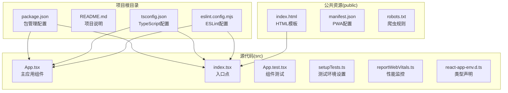
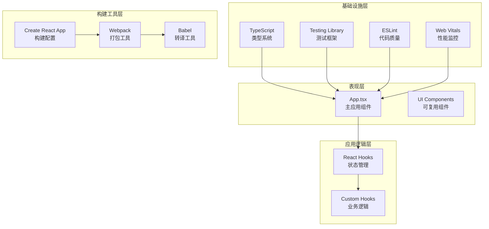
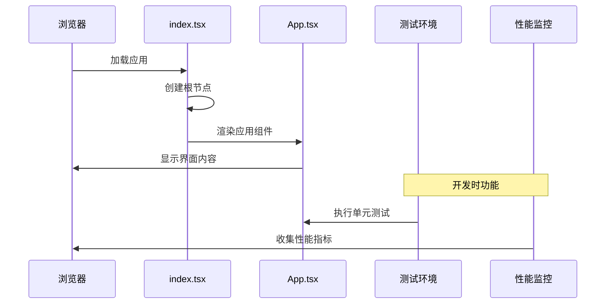
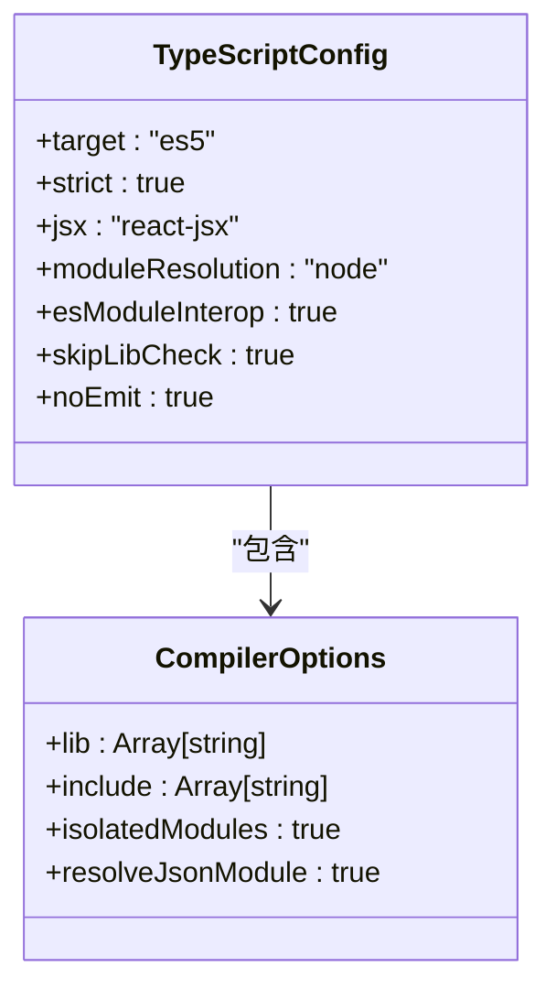
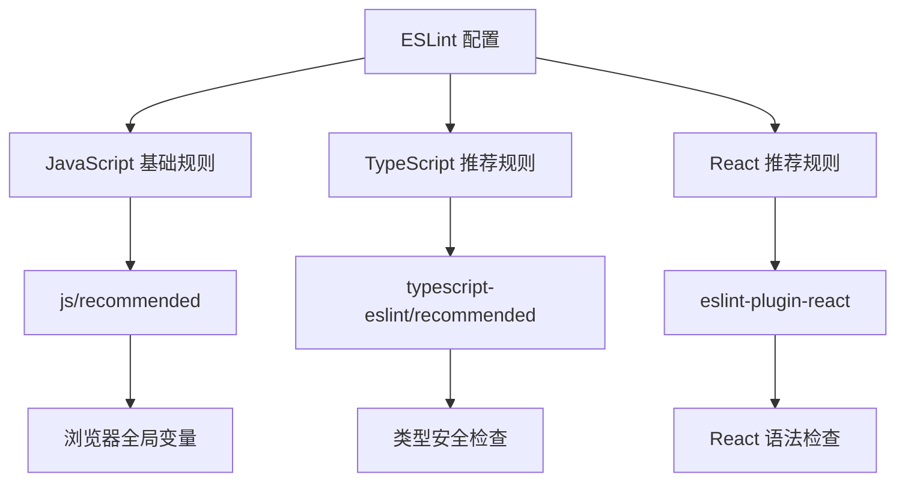
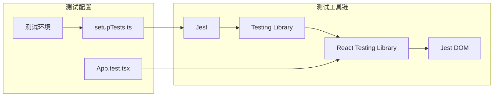
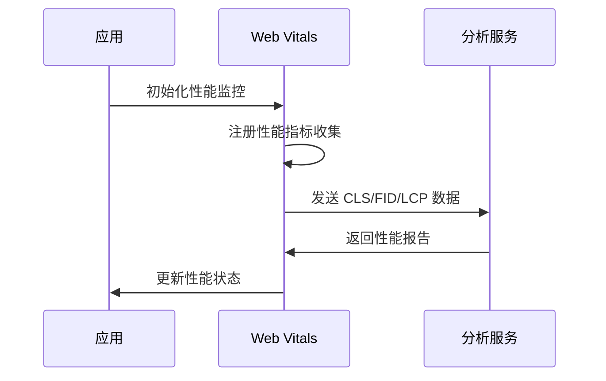
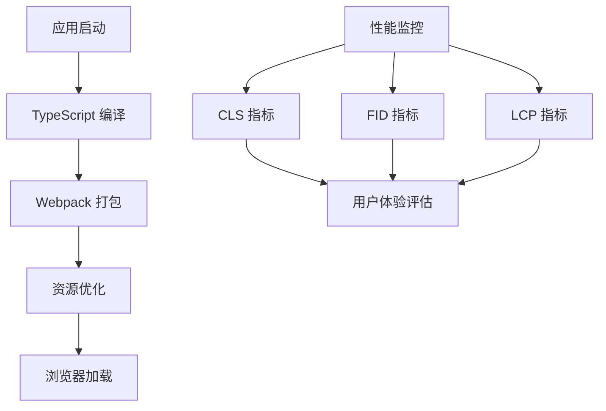

# 项目概述

<cite>
**本文档引用的文件**
- [package.json](file://package.json)
- [README.md](file://README.md)
- [tsconfig.json](file://tsconfig.json)
- [eslint.config.mjs](file://eslint.config.mjs)
- [src/App.tsx](file://src/App.tsx)
- [src/index.tsx](file://src/index.tsx)
- [src/App.test.tsx](file://src/App.test.tsx)
- [src/setupTests.ts](file://src/setupTests.ts)
- [src/reportWebVitals.ts](file://src/reportWebVitals.ts)
- [src/react-app-env.d.ts](file://src/react-app-env.d.ts)
- [public/index.html](file://public/index.html)
</cite>

## 目录
1. [简介](#简介)
2. [项目结构](#项目结构)
3. [核心组件](#核心组件)
4. [架构概览](#架构概览)
5. [详细组件分析](#详细组件分析)
6. [依赖分析](#依赖分析)
7. [性能考虑](#性能考虑)
8. [故障排除指南](#故障排除指南)
9. [结论](#结论)

## 简介

本项目是一个基于 Create React App 构建的现代化 React 应用模板，专为 React 开发者提供了一个功能完整、配置完善的开发环境。该项目的核心价值主张在于为开发者提供一个开箱即用的开发体验，集成了 TypeScript 类型安全、Jest 测试框架、ESLint 代码质量工具以及 Web Vitals 性能监控等现代化开发工具链。

### 技术栈选择说明

项目采用了经过验证的技术组合：
- **React 19.2.6**: 最新稳定版本的 React 框架，提供高性能的组件化开发体验
- **TypeScript 4.9.5**: 提供静态类型检查，增强代码可维护性和开发效率
- **Create React App 5.0.1**: 完整的构建工具链，无需手动配置 webpack 和 babel
- **Testing Library**: 现代化的测试工具，专注于用户行为测试
- **ESLint**: 强大的代码质量工具，支持 TypeScript 和 React 语法检查

### 适用场景

该模板适用于以下场景：
- 快速启动新的 React 单页应用开发
- 需要 TypeScript 类型安全的中大型项目
- 团队协作开发的标准项目脚手架
- 学习现代 React 开发最佳实践的示例项目
- 需要内置测试和代码质量保证的项目

## 项目结构

项目采用 Create React App 的标准目录结构，清晰地分离了源代码、公共资源和配置文件。



**图表来源**
- [package.json:1-55](file://package.json#L1-L55)
- [tsconfig.json:1-27](file://tsconfig.json#L1-L27)
- [eslint.config.mjs:1-17](file://eslint.config.mjs#L1-L17)

**章节来源**
- [package.json:1-55](file://package.json#L1-L55)
- [README.md:1-15](file://README.md#L1-L15)

## 核心组件

### 应用入口点

应用的启动流程从 `src/index.tsx` 开始，这是整个应用的入口点。该文件负责：
- 创建 React 根节点
- 渲染应用组件树
- 启动性能监控
- 处理严格模式包装

### 主应用组件

`src/App.tsx` 是应用的核心组件，采用函数式组件设计模式。该组件展示了：
- 基础的 React 组件结构
- JSX 语法的使用
- 内联样式和类名的应用
- 外部链接的处理

### 测试基础设施

项目内置了完整的测试环境：
- 使用 Testing Library 进行 DOM 测试
- 自动化的 Jest 配置
- 类型安全的测试代码
- 性能基准测试支持

**章节来源**
- [src/index.tsx:1-20](file://src/index.tsx#L1-L20)
- [src/App.tsx:1-27](file://src/App.tsx#L1-L27)
- [src/App.test.tsx:1-10](file://src/App.test.tsx#L1-L10)
- [src/setupTests.ts:1-6](file://src/setupTests.ts#L1-L6)

## 架构概览

项目采用分层架构设计，清晰分离了关注点并提供了良好的扩展性。



**图表来源**
- [src/App.tsx:1-27](file://src/App.tsx#L1-L27)
- [src/index.tsx:1-20](file://src/index.tsx#L1-L20)
- [package.json:5-19](file://package.json#L5-L19)

### 数据流架构



**图表来源**
- [src/index.tsx:7-14](file://src/index.tsx#L7-L14)
- [src/App.tsx:5-24](file://src/App.tsx#L5-L24)
- [src/reportWebVitals.ts:3-13](file://src/reportWebVitals.ts#L3-L13)

## 详细组件分析

### TypeScript 配置分析

项目使用严格的 TypeScript 配置来确保代码质量：



**图表来源**
- [tsconfig.json:2-22](file://tsconfig.json#L2-L22)

关键配置特性：
- **严格模式**: 启用所有严格类型检查选项
- **模块解析**: 使用 Node.js 模块解析策略
- **JSX 支持**: 针对 React 的 JSX 转换配置
- **无输出编译**: 开发环境中不生成编译产物

**章节来源**
- [tsconfig.json:1-27](file://tsconfig.json#L1-L27)

### ESLint 配置分析

项目采用现代化的 ESLint 配置方案：



**图表来源**
- [eslint.config.mjs:7-16](file://eslint.config.mjs#L7-L16)

配置特点：
- **多语言支持**: 同时支持 JavaScript 和 TypeScript
- **插件化架构**: 模块化的规则配置
- **推荐规则**: 基于社区最佳实践的规则集

**章节来源**
- [eslint.config.mjs:1-17](file://eslint.config.mjs#L1-L17)

### 测试框架集成

项目集成了完整的测试生态系统：



**图表来源**
- [src/setupTests.ts:1-6](file://src/setupTests.ts#L1-L6)
- [src/App.test.tsx:1-10](file://src/App.test.tsx#L1-L10)

测试特性：
- **DOM 断言**: 使用 Jest DOM 扩展进行 DOM 元素断言
- **用户行为测试**: 模拟真实用户交互
- **类型安全测试**: TypeScript 支持的测试代码

**章节来源**
- [src/setupTests.ts:1-6](file://src/setupTests.ts#L1-L6)
- [src/App.test.tsx:1-10](file://src/App.test.tsx#L1-L10)

### 性能监控集成

项目内置了 Web Vitals 性能监控：



**图表来源**
- [src/reportWebVitals.ts:3-13](file://src/reportWebVitals.ts#L3-L13)

性能指标包括：
- **CLS (Cumulative Layout Shift)**: 累积布局偏移
- **FID (First Input Delay)**: 首次输入延迟
- **LCP (Largest Contentful Paint)**: 最大内容绘制

**章节来源**
- [src/reportWebVitals.ts:1-16](file://src/reportWebVitals.ts#L1-L16)

## 依赖分析

项目依赖关系展现了清晰的层次结构：

```mermaid
graph TB
subgraph "运行时依赖"
A[react@^19.2.6]
B[react-dom@^19.2.6]
C[react-scripts@5.0.1]
D[web-vitals@^2.1.4]
end
subgraph "开发依赖"
E[typescript@^4.9.5]
F[@types/react@^19.2.14]
G[@types/react-dom@^19.2.3]
H[eslint@^10.4.0]
I[testing-library/react@^16.3.2]
end
subgraph "测试依赖"
J[@testing-library/jest-dom@^6.9.1]
K[@testing-library/user-event@^13.5.0]
L[jest@^27.5.2]
end
A --> C
B --> C
C --> H
E --> H
F --> A
G --> B
I --> J
I --> K
```

**图表来源**
- [package.json:5-19](file://package.json#L5-L19)
- [package.json:45-53](file://package.json#L45-L53)

### 关键依赖说明

**React 生态系统**:
- React 核心库提供组件化 UI 构建
- React DOM 处理浏览器 DOM 操作
- React Scripts 提供完整的构建工具链

**TypeScript 支持**:
- 类型定义文件确保开发时的类型安全
- 编译器配置优化开发体验

**开发工具链**:
- ESLint 提供代码质量保证
- Testing Library 提供现代化测试体验
- Web Vitals 确保性能监控

**章节来源**
- [package.json:1-55](file://package.json#L1-L55)

## 性能考虑

### 构建优化

项目利用 Create React App 的优化特性：
- **代码分割**: 自动进行代码分割以提高加载性能
- **缓存策略**: 利用浏览器缓存机制
- **压缩优化**: 生产环境自动压缩资源文件

### 运行时性能



**图表来源**
- [src/reportWebVitals.ts:3-13](file://src/reportWebVitals.ts#L3-L13)

性能优化建议：
- 使用 React.lazy 进行组件懒加载
- 实现虚拟滚动处理大数据列表
- 优化图片资源和字体加载

## 故障排除指南

### 常见问题解决

**TypeScript 类型错误**:
- 检查类型定义文件是否正确导入
- 验证 tsconfig.json 配置的完整性
- 确认类型声明文件的存在

**测试失败排查**:
- 使用 `npm test -- --watchAll=false` 运行完整测试
- 检查测试环境配置是否正确
- 验证测试断言的准确性

**构建问题**:
- 清理 node_modules 和重新安装依赖
- 检查 package.json 中的版本兼容性
- 验证 ESLint 配置的正确性

**性能问题诊断**:
- 使用 Chrome DevTools 分析性能瓶颈
- 监控 Web Vitals 指标变化
- 实施适当的性能优化策略

**章节来源**
- [src/react-app-env.d.ts:1-2](file://src/react-app-env.d.ts#L1-L2)
- [README.md:12-15](file://README.md#L12-L15)

## 结论

本 React Next.js 项目模板代表了现代前端开发的最佳实践集合。通过集成 TypeScript、Jest 测试框架、ESLint 代码质量工具和 Web Vitals 性能监控，为开发者提供了一个功能完整、易于使用的开发环境。

### 主要优势

1. **开箱即用**: 完整的开发工具链配置，无需额外设置
2. **类型安全**: TypeScript 提供强大的静态类型检查
3. **测试友好**: 内置 Testing Library，支持现代化测试实践
4. **性能监控**: Web Vitals 集成确保应用性能可观测
5. **代码质量**: ESLint 配置保证代码风格一致性

### 适用性评估

该模板特别适合：
- 需要快速启动的 React 项目
- 注重代码质量的团队开发
- 学习现代 React 开发模式的开发者
- 需要内置测试和监控功能的项目

通过遵循本项目的配置和最佳实践，开发者可以建立一个高质量、可维护的 React 应用基础架构，为后续的功能开发奠定坚实的基础。