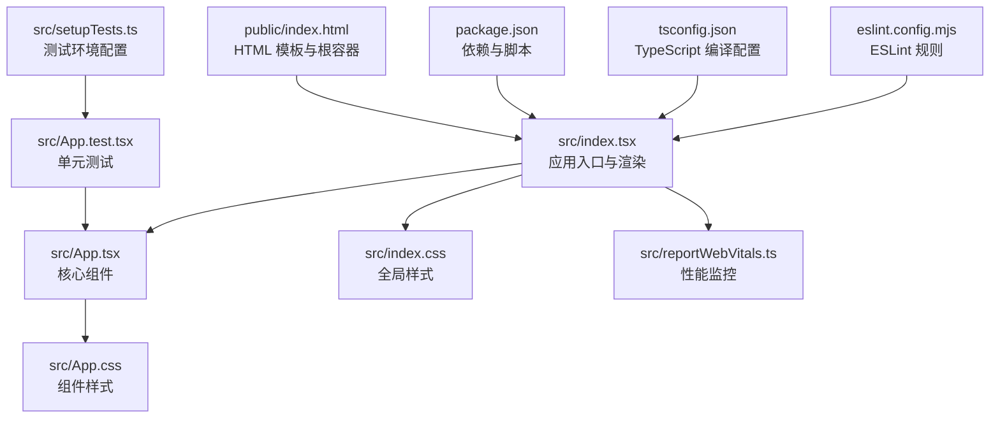
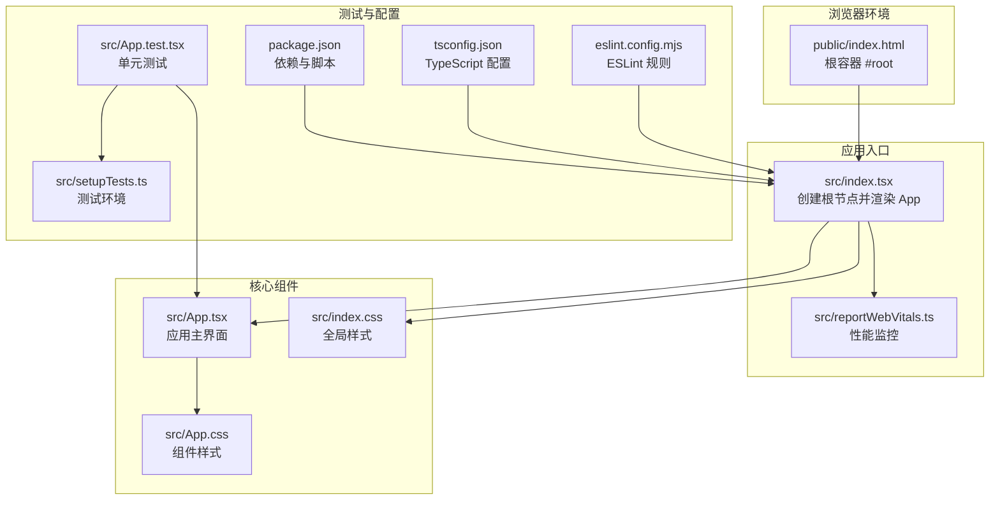
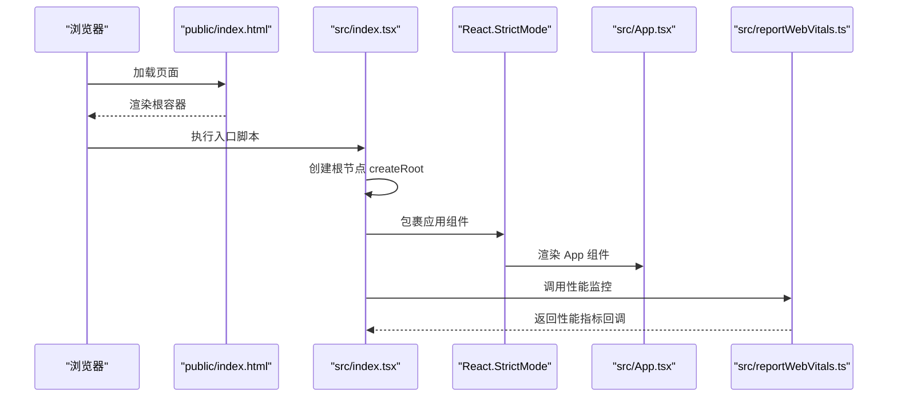
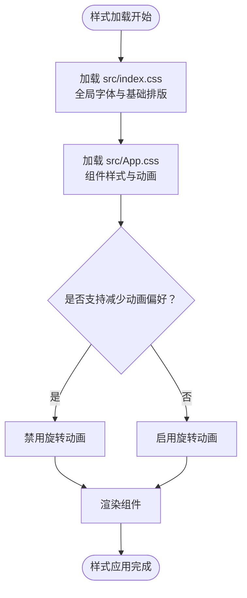
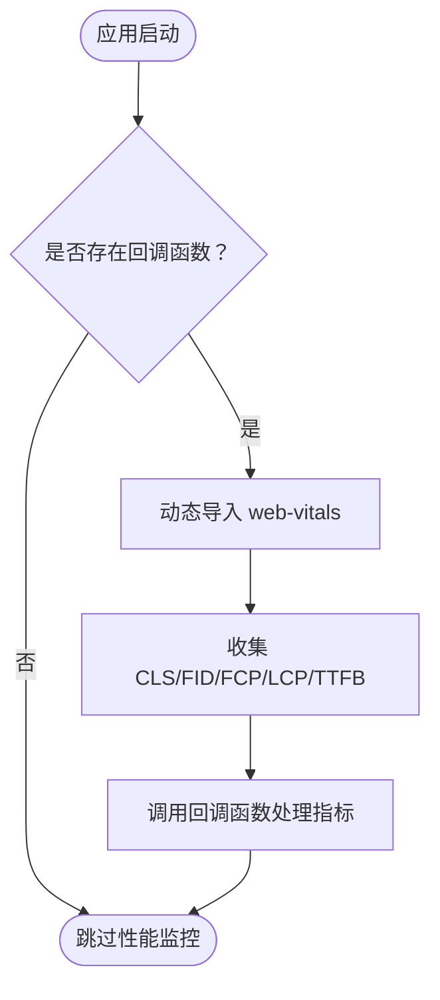
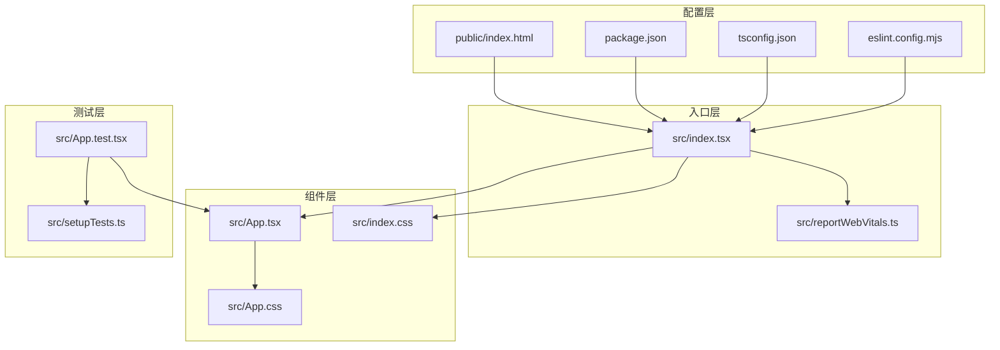

# 源代码文件职责

<cite>
**本文档引用的文件**
- [src/index.tsx](file://src/index.tsx)
- [src/App.tsx](file://src/App.tsx)
- [src/App.css](file://src/App.css)
- [src/index.css](file://src/index.css)
- [src/App.test.tsx](file://src/App.test.tsx)
- [src/reportWebVitals.ts](file://src/reportWebVitals.ts)
- [src/setupTests.ts](file://src/setupTests.ts)
- [public/index.html](file://public/index.html)
- [package.json](file://package.json)
- [tsconfig.json](file://tsconfig.json)
- [eslint.config.mjs](file://eslint.config.mjs)
</cite>

## 目录
1. [简介](#简介)
2. [项目结构](#项目结构)
3. [核心组件](#核心组件)
4. [架构总览](#架构总览)
5. [详细组件分析](#详细组件分析)
6. [依赖关系分析](#依赖关系分析)
7. [性能考虑](#性能考虑)
8. [故障排除指南](#故障排除指南)
9. [结论](#结论)

## 简介
本项目是一个基于 Create React App 的 React 应用，采用 TypeScript 和现代前端工具链构建。该文档详细说明了每个源代码文件的具体职责、实现细节以及它们之间的交互关系。重点包括：
- 入口文件 index.tsx 的渲染流程与性能监控集成
- 核心组件 App.tsx 的架构设计与组件层次结构
- 样式文件的组织原则与 CSS-in-JS 方案
- 测试文件的配置与测试策略
- 性能监控文件的集成与指标收集
- 文件间依赖关系图与数据流向说明

## 项目结构
该项目遵循 Create React App 的标准目录结构，主要源代码位于 src 目录，公共资源位于 public 目录。关键文件职责如下：
- 入口文件：负责初始化 React 应用、挂载根节点、引入全局样式与性能监控
- 核心组件：定义应用的主要 UI 结构与样式
- 样式文件：提供全局样式与组件级样式
- 测试相关：包含单元测试配置与测试工具
- 配置文件：管理依赖、脚本、TypeScript 编译选项与 ESLint 规则

**图表来源**
- [public/index.html:1-44](file://public/index.html#L1-L44)
- [src/index.tsx:1-20](file://src/index.tsx#L1-L20)
- [src/App.tsx:1-27](file://src/App.tsx#L1-L27)
- [src/App.css:1-39](file://src/App.css#L1-L39)
- [src/index.css:1-14](file://src/index.css#L1-L14)
- [src/reportWebVitals.ts:1-16](file://src/reportWebVitals.ts#L1-L16)
- [src/App.test.tsx:1-10](file://src/App.test.tsx#L1-L10)
- [src/setupTests.ts:1-6](file://src/setupTests.ts#L1-L6)
- [package.json:1-55](file://package.json#L1-L55)
- [tsconfig.json:1-27](file://tsconfig.json#L1-L27)
- [eslint.config.mjs:1-23](file://eslint.config.mjs#L1-L23)

**章节来源**
- [public/index.html:1-44](file://public/index.html#L1-L44)
- [src/index.tsx:1-20](file://src/index.tsx#L1-L20)
- [package.json:1-55](file://package.json#L1-L55)

## 核心组件
本节深入分析核心源代码文件的功能与实现细节，帮助读者理解每个文件在整体架构中的作用。

### 入口文件：src/index.tsx
- 职责概述
  - 初始化 React 应用并挂载到 HTML 中的根容器
  - 引入全局样式与性能监控模块
  - 在严格模式下渲染应用根组件
- 关键实现点
  - 使用 ReactDOM 的 createRoot API 创建根节点
  - 将 App 组件包裹在 React.StrictMode 下以启用额外的开发时检查
  - 调用性能监控函数以收集 Web Vitals 指标
- 依赖关系
  - 依赖 src/App.tsx 作为根组件
  - 依赖 src/index.css 提供全局样式
  - 依赖 src/reportWebVitals.ts 进行性能指标上报

**章节来源**
- [src/index.tsx:1-20](file://src/index.tsx#L1-L20)

### 核心组件：src/App.tsx
- 职责概述
  - 定义应用的主要 UI 结构，包含头部、Logo 图像与链接元素
  - 通过导入 CSS 文件为组件提供样式支持
- 组件层次结构
  - 外层容器 div（类名 App）
  - 头部区域 header（类名 App-header）
  - Logo 图像 img（类名 App-logo）
  - 文本段落 p
  - 外部链接 a（类名 App-link）
- 样式关联
  - 通过 App.css 定义的类名与动画效果
  - 与 index.css 中的全局字体设置协同工作

**章节来源**
- [src/App.tsx:1-27](file://src/App.tsx#L1-L27)
- [src/App.css:1-39](file://src/App.css#L1-L39)
- [src/index.css:1-14](file://src/index.css#L1-L14)

### 样式文件：src/App.css 与 src/index.css
- 组织原则
  - 分离全局样式与组件级样式，避免样式冲突
  - 使用语义化类名，便于维护与扩展
- CSS-in-JS 方案
  - 本项目未使用 CSS-in-JS 方案，而是采用传统 CSS 文件方式
  - 通过类名绑定与媒体查询实现响应式设计
- 样式特性
  - App.css 包含动画定义与媒体查询，支持减少动画偏好
  - index.css 提供全局字体族与基础排版设置

**章节来源**
- [src/App.css:1-39](file://src/App.css#L1-L39)
- [src/index.css:1-14](file://src/index.css#L1-L14)

### 测试文件：src/App.test.tsx 与 src/setupTests.ts
- 测试策略
  - 使用 @testing-library/react 进行组件渲染与断言
  - 通过测试环境配置文件引入 jest-dom 扩展匹配器
  - 单元测试验证组件渲染的关键文本内容
- 测试配置
  - setupTests.ts 在测试运行前加载 DOM 断言扩展
  - App.test.tsx 针对 App 组件进行基础渲染测试

**章节来源**
- [src/App.test.tsx:1-10](file://src/App.test.tsx#L1-L10)
- [src/setupTests.ts:1-6](file://src/setupTests.ts#L1-L6)

### 性能监控：src/reportWebVitals.ts
- 集成方式
  - 采用按需动态导入 web-vitals 库，仅在需要时加载
  - 支持传入回调函数接收性能指标数据
- 指标收集
  - 收集 CLS、FID、FCP、LCP、TTFB 等关键 Web Vitals 指标
  - 通过回调函数将指标传递给分析系统或日志服务
- 性能影响
  - 动态导入避免了对首屏加载时间的影响
  - 只在开发或需要时启用，生产环境可选择性关闭

**章节来源**
- [src/reportWebVitals.ts:1-16](file://src/reportWebVitals.ts#L1-L16)

### 配置文件：package.json、tsconfig.json、eslint.config.mjs
- 依赖管理
  - package.json 定义了 React 生态系统的依赖与构建脚本
  - 包含 react、react-dom、react-scripts、web-vitals 等核心依赖
- TypeScript 配置
  - tsconfig.json 设置编译目标、模块解析与 JSX 处理方式
  - 启用严格模式与类型检查，确保代码质量
- ESLint 规则
  - eslint.config.mjs 配置了推荐规则与 React 版本自动检测
  - 提供浏览器环境下的全局变量配置

**章节来源**
- [package.json:1-55](file://package.json#L1-L55)
- [tsconfig.json:1-27](file://tsconfig.json#L1-L27)
- [eslint.config.mjs:1-23](file://eslint.config.mjs#L1-L23)

## 架构总览
本节通过可视化方式展示应用的整体架构与数据流，帮助读者理解各文件间的协作关系。

**图表来源**
- [public/index.html:1-44](file://public/index.html#L1-L44)
- [src/index.tsx:1-20](file://src/index.tsx#L1-L20)
- [src/App.tsx:1-27](file://src/App.tsx#L1-L27)
- [src/App.css:1-39](file://src/App.css#L1-L39)
- [src/index.css:1-14](file://src/index.css#L1-L14)
- [src/reportWebVitals.ts:1-16](file://src/reportWebVitals.ts#L1-L16)
- [src/App.test.tsx:1-10](file://src/App.test.tsx#L1-L10)
- [src/setupTests.ts:1-6](file://src/setupTests.ts#L1-L6)
- [package.json:1-55](file://package.json#L1-L55)
- [tsconfig.json:1-27](file://tsconfig.json#L1-L27)
- [eslint.config.mjs:1-23](file://eslint.config.mjs#L1-L23)

## 详细组件分析

### 渲染流程分析（index.tsx）
该流程展示了从 HTML 根容器到 React 组件树的完整渲染过程。

**图表来源**
- [public/index.html:1-44](file://public/index.html#L1-L44)
- [src/index.tsx:1-20](file://src/index.tsx#L1-L20)
- [src/App.tsx:1-27](file://src/App.tsx#L1-L27)
- [src/reportWebVitals.ts:1-16](file://src/reportWebVitals.ts#L1-L16)

**章节来源**
- [src/index.tsx:1-20](file://src/index.tsx#L1-L20)

### 样式组织与响应式设计
该流程展示了样式文件如何协同工作，实现响应式布局与动画效果。

**图表来源**
- [src/index.css:1-14](file://src/index.css#L1-L14)
- [src/App.css:1-39](file://src/App.css#L1-L39)

**章节来源**
- [src/index.css:1-14](file://src/index.css#L1-L14)
- [src/App.css:1-39](file://src/App.css#L1-L39)

### 性能监控集成
该流程展示了性能监控模块的按需加载与指标收集机制。

**图表来源**
- [src/reportWebVitals.ts:1-16](file://src/reportWebVitals.ts#L1-L16)

**章节来源**
- [src/reportWebVitals.ts:1-16](file://src/reportWebVitals.ts#L1-L16)

## 依赖关系分析
本节通过依赖图展示项目中各文件之间的耦合关系与依赖方向。

**图表来源**
- [src/index.tsx:1-20](file://src/index.tsx#L1-L20)
- [src/App.tsx:1-27](file://src/App.tsx#L1-L27)
- [src/App.css:1-39](file://src/App.css#L1-L39)
- [src/index.css:1-14](file://src/index.css#L1-L14)
- [src/reportWebVitals.ts:1-16](file://src/reportWebVitals.ts#L1-L16)
- [src/App.test.tsx:1-10](file://src/App.test.tsx#L1-L10)
- [src/setupTests.ts:1-6](file://src/setupTests.ts#L1-L6)
- [package.json:1-55](file://package.json#L1-L55)
- [tsconfig.json:1-27](file://tsconfig.json#L1-L27)
- [eslint.config.mjs:1-23](file://eslint.config.mjs#L1-L23)
- [public/index.html:1-44](file://public/index.html#L1-L44)

**章节来源**
- [src/index.tsx:1-20](file://src/index.tsx#L1-L20)
- [src/App.tsx:1-27](file://src/App.tsx#L1-L27)
- [src/App.test.tsx:1-10](file://src/App.test.tsx#L1-L10)
- [package.json:1-55](file://package.json#L1-L55)

## 性能考虑
- 按需加载：性能监控模块采用动态导入，避免阻塞首屏渲染
- 严格模式：在开发环境中启用 React.StrictMode，帮助发现潜在问题
- 响应式设计：通过媒体查询与动画控制，平衡视觉效果与性能
- 类名复用：使用语义化类名减少重复样式定义，提升维护效率

## 故障排除指南
- 样式不生效
  - 检查类名拼写与大小写一致性
  - 确认 CSS 文件正确导入到组件中
  - 验证全局样式与组件样式的优先级关系
- 测试失败
  - 确保测试环境已正确加载 jest-dom 扩展
  - 检查测试断言中的文本内容与实际渲染结果
  - 验证测试依赖是否正确安装
- 性能监控无输出
  - 确认回调函数参数正确传递
  - 检查浏览器环境是否支持 web-vitals 指标
  - 验证动态导入路径与网络连接状态

**章节来源**
- [src/App.test.tsx:1-10](file://src/App.test.tsx#L1-L10)
- [src/setupTests.ts:1-6](file://src/setupTests.ts#L1-L6)
- [src/reportWebVitals.ts:1-16](file://src/reportWebVitals.ts#L1-L16)

## 结论
本项目通过清晰的文件职责划分与简洁的架构设计，实现了从入口渲染到组件展示、从样式组织到性能监控的完整流程。各文件职责明确、依赖关系清晰，既保证了开发体验，也为后续扩展提供了良好的基础。建议在保持现有结构的基础上，逐步引入更复杂的组件拆分与状态管理方案，以适应业务需求的增长。