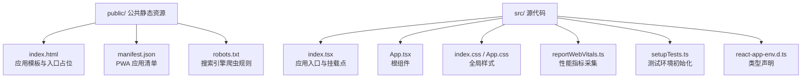
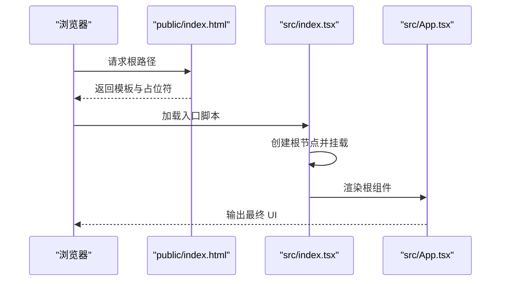
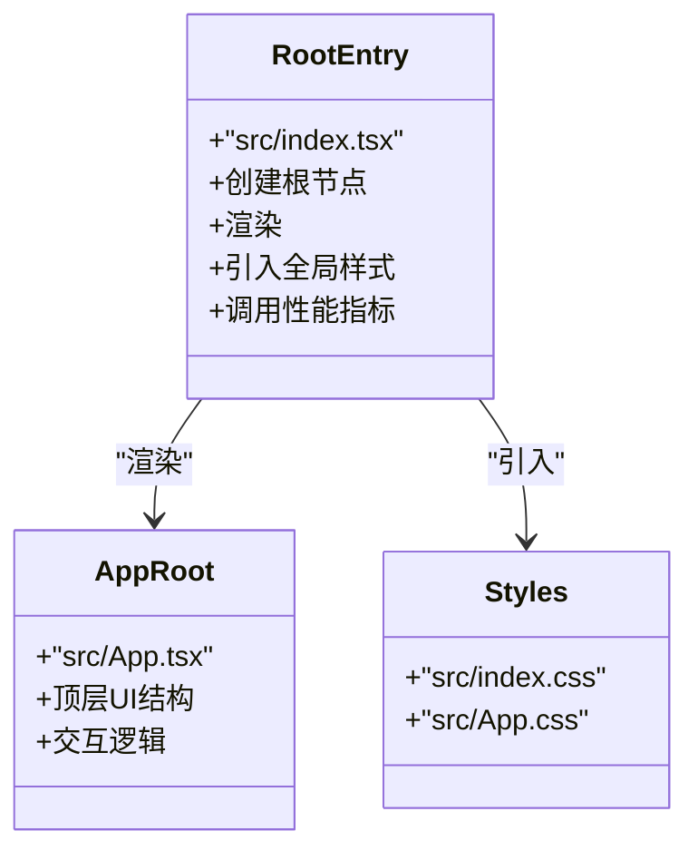

# 目录结构说明

<cite>
**本文引用的文件**
- [public/index.html](file://public/index.html)
- [public/manifest.json](file://public/manifest.json)
- [public/robots.txt](file://public/robots.txt)
- [src/index.tsx](file://src/index.tsx)
- [src/App.tsx](file://src/App.tsx)
- [src/index.css](file://src/index.css)
- [src/App.css](file://src/App.css)
- [src/reportWebVitals.ts](file://src/reportWebVitals.ts)
- [src/setupTests.ts](file://src/setupTests.ts)
- [src/react-app-env.d.ts](file://src/react-app-env.d.ts)
- [package.json](file://package.json)
- [tsconfig.json](file://tsconfig.json)
- [eslint.config.mjs](file://eslint.config.mjs)
- [.gitignore](file://.gitignore)
- [README.md](file://README.md)
</cite>

## 目录索引
1. [简介](#简介)
2. [项目结构](#项目结构)
3. [核心组件](#核心组件)
4. [架构总览](#架构总览)
5. [详细组件分析](#详细组件分析)
6. [依赖分析](#依赖分析)
7. [性能考虑](#性能考虑)
8. [故障排查指南](#故障排查指南)
9. [结论](#结论)
10. [附录](#附录)

## 简介
本文件系统性说明该 React 项目的目录结构与职责分工，重点覆盖以下方面：
- public/ 目录的静态资源管理与作用（HTML 模板、应用清单、爬虫协议等）
- src/ 目录的组织原则与文件职责（入口、应用根组件、样式、测试与工具）
- “约定优于配置”的设计理念在目录结构中的体现
- 最佳实践与扩展建议
- 初学者到进阶开发者的分层学习路径

## 项目结构
该项目采用 Create React App 的默认目录布局，遵循“约定优于配置”原则，通过标准化的文件命名与位置约定，减少配置成本并提升协作效率。

图表来源
- [public/index.html:1-44](file://public/index.html#L1-L44)
- [public/manifest.json:1-26](file://public/manifest.json#L1-L26)
- [public/robots.txt:1-4](file://public/robots.txt#L1-L4)
- [src/index.tsx:1-20](file://src/index.tsx#L1-L20)
- [src/App.tsx:1-27](file://src/App.tsx#L1-L27)
- [src/index.css:1-14](file://src/index.css#L1-L14)
- [src/App.css:1-39](file://src/App.css#L1-L39)
- [src/reportWebVitals.ts:1-16](file://src/reportWebVitals.ts#L1-L16)
- [src/setupTests.ts:1-6](file://src/setupTests.ts#L1-L6)
- [src/react-app-env.d.ts:1-2](file://src/react-app-env.d.ts#L1-L2)

章节来源
- [public/index.html:1-44](file://public/index.html#L1-L44)
- [public/manifest.json:1-26](file://public/manifest.json#L1-L26)
- [public/robots.txt:1-4](file://public/robots.txt#L1-L4)
- [src/index.tsx:1-20](file://src/index.tsx#L1-L20)
- [src/App.tsx:1-27](file://src/App.tsx#L1-L27)
- [src/index.css:1-14](file://src/index.css#L1-L14)
- [src/App.css:1-39](file://src/App.css#L1-L39)
- [src/reportWebVitals.ts:1-16](file://src/reportWebVitals.ts#L1-L16)
- [src/setupTests.ts:1-6](file://src/setupTests.ts#L1-L6)
- [src/react-app-env.d.ts:1-2](file://src/react-app-env.d.ts#L1-L2)

## 核心组件
- public/index.html：应用的 HTML 模板，定义语言、主题色、描述、图标与 PWA 清单链接；页面中预留挂载点用于渲染 React 应用。
- public/manifest.json：PWA 应用清单，声明短名、图标集、启动路径、展示模式与颜色，供浏览器安装为独立应用时使用。
- public/robots.txt：搜索引擎爬虫协议，默认允许所有爬取，可按需调整以控制站点收录策略。
- src/index.tsx：应用入口，负责创建根节点并渲染根组件，同时引入全局样式与性能指标采集。
- src/App.tsx：应用根组件，承载顶层 UI 结构与交互逻辑。
- src/index.css / src/App.css：全局样式文件，分别控制基础排版与根组件样式。
- src/reportWebVitals.ts：性能指标采集工具，按需上报 CLS、FID、FCP、LCP、TTFB 等指标。
- src/setupTests.ts：测试环境初始化，注入 DOM 断言库等能力。
- src/react-app-env.d.ts：类型声明文件，为脚手架类型提供编译期支持。

章节来源
- [public/index.html:1-44](file://public/index.html#L1-L44)
- [public/manifest.json:1-26](file://public/manifest.json#L1-L26)
- [public/robots.txt:1-4](file://public/robots.txt#L1-L4)
- [src/index.tsx:1-20](file://src/index.tsx#L1-L20)
- [src/App.tsx:1-27](file://src/App.tsx#L1-L27)
- [src/index.css:1-14](file://src/index.css#L1-L14)
- [src/App.css:1-39](file://src/App.css#L1-L39)
- [src/reportWebVitals.ts:1-16](file://src/reportWebVitals.ts#L1-L16)
- [src/setupTests.ts:1-6](file://src/setupTests.ts#L1-L6)
- [src/react-app-env.d.ts:1-2](file://src/react-app-env.d.ts#L1-L2)

## 架构总览
下图展示了从浏览器加载到 React 应用渲染的关键流程，体现 public 与 src 的职责边界与协作关系。

图表来源
- [public/index.html:1-44](file://public/index.html#L1-L44)
- [src/index.tsx:1-20](file://src/index.tsx#L1-L20)
- [src/App.tsx:1-27](file://src/App.tsx#L1-L27)

## 详细组件分析

### public/ 目录与静态资源管理
- index.html
  - 作用：作为应用模板，设置语言、视口、主题色、描述、图标与 PWA 清单链接；保留挂载点以供 React 渲染。
  - 关键点：使用公共路径占位符确保在不同部署路径下仍能正确解析静态资源。
- manifest.json
  - 作用：定义 PWA 行为，如图标集、启动路径、显示模式、主题色与背景色。
  - 影响：决定浏览器安装体验与离线行为。
- robots.txt
  - 作用：控制搜索引擎爬虫访问范围；当前默认允许所有抓取。
  - 建议：生产环境可根据需要限制或指定 sitemap。

章节来源
- [public/index.html:1-44](file://public/index.html#L1-L44)
- [public/manifest.json:1-26](file://public/manifest.json#L1-L26)
- [public/robots.txt:1-4](file://public/robots.txt#L1-L4)

### src/ 目录组织与职责分工
- index.tsx
  - 职责：创建根节点并渲染根组件；引入全局样式与性能指标采集。
  - 关联：与 public/index.html 中的挂载点形成绑定。
- App.tsx
  - 职责：应用根组件，承载顶层 UI 结构与交互。
- 样式文件
  - index.css：全局基础样式（字体、排版等）。
  - App.css：根组件相关样式与动画。
- reportWebVitals.ts
  - 职责：按需导入性能指标模块并上报，便于性能监控。
- setupTests.ts
  - 职责：初始化测试环境，注入常用断言库。
- react-app-env.d.ts
  - 职责：为脚手架类型提供编译期支持。

章节来源
- [src/index.tsx:1-20](file://src/index.tsx#L1-L20)
- [src/App.tsx:1-27](file://src/App.tsx#L1-L27)
- [src/index.css:1-14](file://src/index.css#L1-L14)
- [src/App.css:1-39](file://src/App.css#L1-L39)
- [src/reportWebVitals.ts:1-16](file://src/reportWebVitals.ts#L1-L16)
- [src/setupTests.ts:1-6](file://src/setupTests.ts#L1-L6)
- [src/react-app-env.d.ts:1-2](file://src/react-app-env.d.ts#L1-L2)

### 类与组件关系（代码级）

图表来源
- [src/index.tsx:1-20](file://src/index.tsx#L1-L20)
- [src/App.tsx:1-27](file://src/App.tsx#L1-L27)
- [src/index.css:1-14](file://src/index.css#L1-L14)
- [src/App.css:1-39](file://src/App.css#L1-L39)

## 依赖分析
- 构建与运行
  - 通过脚本命令启动开发服务器、构建产物与运行测试，体现“约定优于配置”的执行约定。
- 类型与语法
  - TypeScript 编译配置限定源码范围与 JSX 处理方式，确保类型安全与现代化语法支持。
- Lint 规则
  - ESLint 平面化配置启用推荐规则与 React 插件，自动检测版本并统一团队规范。

章节来源
- [package.json:1-55](file://package.json#L1-L55)
- [tsconfig.json:1-27](file://tsconfig.json#L1-L27)
- [eslint.config.mjs:1-23](file://eslint.config.mjs#L1-L23)

## 性能考虑
- 性能指标采集
  - 在入口处集成性能指标上报，便于持续监控关键指标。
- 样式与资源
  - 将全局样式集中管理，避免重复引入；静态资源置于 public 目录，确保构建期直接复制，减少打包负担。
- 开发与生产差异
  - 浏览器列表区分开发与生产目标，有助于生成更高效的产物。

章节来源
- [src/reportWebVitals.ts:1-16](file://src/reportWebVitals.ts#L1-L16)
- [src/index.css:1-14](file://src/index.css#L1-L14)
- [src/App.css:1-39](file://src/App.css#L1-L39)
- [package.json:33-44](file://package.json#L33-L44)

## 故障排查指南
- 构建产物未更新
  - 检查构建输出目录是否被忽略（例如构建产物目录），确认 .gitignore 是否排除了构建产物。
- 资源 404 或路径错误
  - 确认 public 下静态资源引用使用公共路径占位符，避免硬编码绝对路径。
- 测试环境异常
  - 确认测试环境初始化文件已正确引入，DOM 断言库可用。
- 类型错误
  - 确认类型声明文件存在且未被排除在编译范围之外。

章节来源
- [.gitignore:1-24](file://.gitignore#L1-L24)
- [public/index.html:1-44](file://public/index.html#L1-L44)
- [src/setupTests.ts:1-6](file://src/setupTests.ts#L1-L6)
- [src/react-app-env.d.ts:1-2](file://src/react-app-env.d.ts#L1-L2)
- [tsconfig.json:23-26](file://tsconfig.json#L23-L26)

## 结论
该目录结构通过“约定优于配置”的设计，将静态资源与源代码清晰分离，入口与根组件职责明确，配合类型、Lint 与构建脚本，形成高效、可维护的前端工程基座。对于初学者，建议先理解 public 与 src 的边界与职责，再逐步深入组件与样式体系；对于有经验的开发者，可在保持约定不变的前提下，按需扩展测试、性能与部署流水线。

## 附录

### 学习路径建议
- 初学者
  - 第一步：理解 public/index.html 与 src/index.tsx 的关系，观察挂载点与渲染流程。
  - 第二步：修改 src/App.tsx 与样式文件，熟悉组件与样式的联动。
  - 第三步：阅读 README 与 package.json 脚本，尝试启动、构建与测试。
- 进阶者
  - 第四步：接入性能指标与测试工具，完善可观测性与质量保障。
  - 第五步：根据业务扩展目录结构（如按功能域拆分组件），并在不破坏约定的前提下引入路由与状态管理。

### 最佳实践与扩展建议
- 保持约定
  - 维持现有入口与模板约定，避免随意更改关键文件位置与命名。
- 分层管理
  - 将第三方静态资源放入 public，业务样式与逻辑放入 src，确保构建期可预测。
- 可观测性
  - 在入口处保留性能指标采集，结合测试与 Lint 规则，保证交付质量。
- 扩展建议
  - 如需路由与页面：在 src 内按功能域新增页面与组件，保持与现有入口一致的组织方式。
  - 如需国际化或多主题：在样式与资源层面进行模块化管理，避免破坏现有全局样式结构。