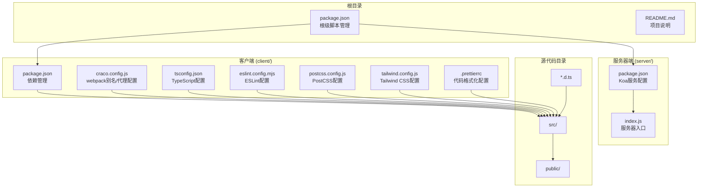
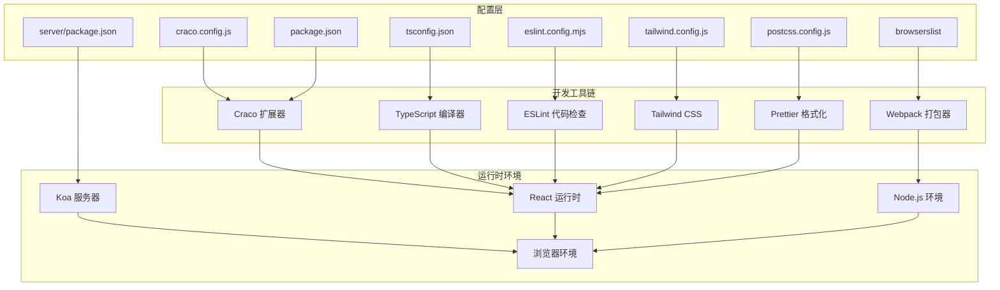
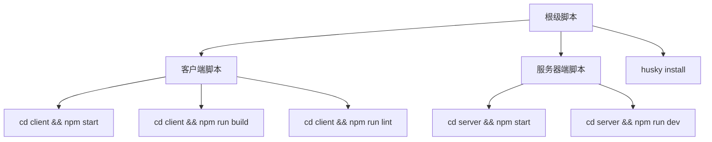
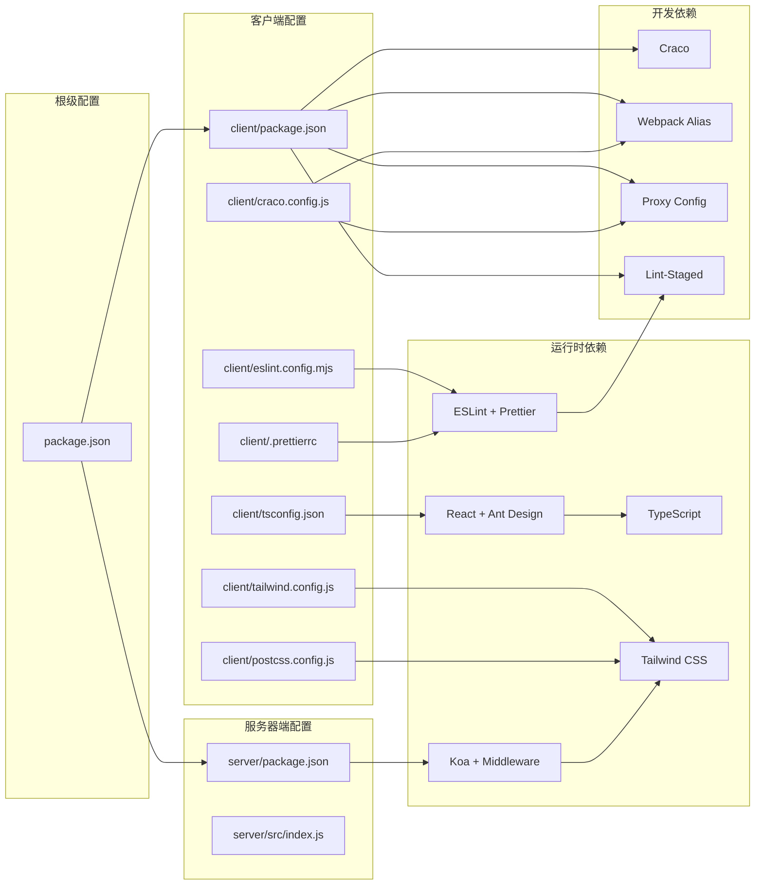

# 配置文件详解

<cite>
**本文档引用的文件**
- [package.json](file://package.json)
- [client/package.json](file://client/package.json)
- [client/craco.config.js](file://client/craco.config.js)
- [client/tsconfig.json](file://client/tsconfig.json)
- [client/eslint.config.mjs](file://client/eslint.config.mjs)
- [client/postcss.config.js](file://client/postcss.config.js)
- [client/tailwind.config.js](file://client/tailwind.config.js)
- [client/.prettierrc](file://client/.prettierrc)
- [server/package.json](file://server/package.json)
- [server/src/index.js](file://server/src/index.js)
- [README.md](file://README.md)
</cite>

## 目录
1. [简介](#简介)
2. [项目结构](#项目结构)
3. [核心组件](#核心组件)
4. [架构概览](#架构概览)
5. [详细组件分析](#详细组件分析)
6. [依赖关系分析](#依赖关系分析)
7. [性能考虑](#性能考虑)
8. [故障排除指南](#故障排除指南)
9. [结论](#结论)
10. [附录](#附录)

## 简介

本项目是一个基于 Create React App 的 React 应用，使用 TypeScript 进行类型安全开发，并配备了现代化的代码质量工具链。项目现已采用 Monorepo 结构，包含客户端（React CRA + Craco）和服务器端（Koa）两个独立的配置体系。本文档深入解析三个关键配置文件：package.json（依赖管理、脚本命令、浏览器兼容性）、tsconfig.json（TypeScript 编译配置）和 eslint.config.mjs（ESLint 代码质量配置），为开发者提供完整的配置理解和最佳实践指导。

**更新** 新增对 Craco 配置、Tailwind CSS 集成、Prettier 格式化等现代前端工具链的支持。

## 项目结构

该项目采用 Monorepo 结构，主要配置文件分布如下：



**图表来源**
- [package.json:1-24](file://package.json#L1-L24)
- [client/package.json:1-81](file://client/package.json#L1-L81)
- [client/craco.config.js:1-37](file://client/craco.config.js#L1-L37)
- [server/package.json:1-18](file://server/package.json#L1-L18)

**章节来源**
- [package.json:1-24](file://package.json#L1-L24)
- [client/package.json:1-81](file://client/package.json#L1-L81)
- [client/craco.config.js:1-37](file://client/craco.config.js#L1-L37)
- [server/package.json:1-18](file://server/package.json#L1-L18)

## 核心组件

### 依赖管理系统

项目使用 npm 作为包管理器，通过 package.json 统一管理所有依赖关系。客户端和服务器端采用分层依赖管理模式：

**根级依赖**（Monorepo 管理）
- Husky：Git 钩子管理
- Commitlint：提交信息规范检查

**客户端依赖**（运行时必需）
- React 生态系统：react、react-dom、react-scripts
- Ant Design：企业级 UI 组件库
- Axios：HTTP 请求库
- TypeScript：类型系统支持

**客户端开发依赖**（开发时必需）
- Craco：Create React App 扩展工具
- Tailwind CSS：原子化 CSS 框架
- ESLint 及其插件生态
- Prettier：代码格式化工具

**服务器端依赖**（运行时必需）
- Koa：轻量级 Web 框架
- Koa Router：路由中间件
- Koa BodyParser：请求体解析
- Koa CORS：跨域处理

### 脚本命令体系

项目提供了完整的开发工作流脚本：

**根级脚本**（Monorepo 管理）
- `start:client`：启动客户端开发服务器
- `start:server`：启动服务器开发服务器
- `dev:client`：客户端开发模式
- `dev:server`：服务器开发模式
- `build`：构建生产版本
- `test`：运行测试套件
- `lint`：执行代码质量检查

**客户端脚本**（Craco 替代 react-scripts）
- `start`：启动开发服务器（使用 Craco）
- `build`：构建生产版本（使用 Craco）
- `test`：运行测试套件（使用 Craco）
- `lint`：执行 ESLint 检查
- `lint:fix`：自动修复 ESLint 问题
- `format`：使用 Prettier 格式化代码

### 浏览器兼容性策略

通过 browserslist 配置实现智能的目标浏览器支持，针对生产环境和开发环境分别设置不同的兼容性要求。

**章节来源**
- [package.json:6-22](file://package.json#L6-L22)
- [client/package.json:27-35](file://client/package.json#L27-L35)
- [client/package.json:42-53](file://client/package.json#L42-L53)
- [server/package.json:7-16](file://server/package.json#L7-L16)

## 架构概览



**图表来源**
- [client/craco.config.js:9-36](file://client/craco.config.js#L9-L36)
- [client/tsconfig.json:2-26](file://client/tsconfig.json#L2-L26)
- [client/eslint.config.mjs:6-32](file://client/eslint.config.mjs#L6-L32)
- [client/tailwind.config.js:1-20](file://client/tailwind.config.js#L1-L20)
- [client/postcss.config.js:1-7](file://client/postcss.config.js#L1-L7)
- [client/package.json:42-53](file://client/package.json#L42-L53)
- [server/package.json:11-16](file://server/package.json#L11-L16)

## 详细组件分析

### package.json 配置详解

#### 依赖管理分析

**根级依赖**（Monorepo 管理）
- **Husky**：提供 Git 钩子功能，用于自动化代码检查和提交前验证
- **Commitlint**：确保提交信息符合 Conventional Commits 规范

**脚本命令设计**



**图表来源**
- [package.json:6-16](file://package.json#L6-L16)

#### 浏览器兼容性配置

browserslist 配置体现了现代 Web 开发的最佳实践：

**生产环境目标**
- 超过 0.2% 市场份额的浏览器
- 排除已停止维护的浏览器
- 排除 Opera Mini（不支持现代特性）

**开发环境目标**
- 最新 Chrome 版本
- 最新 Firefox 版本  
- 最新 Safari 版本

这种配置确保了：
- 生产环境的广泛兼容性
- 开发环境的最新特性支持
- 合理的构建优化策略

**章节来源**
- [package.json:1-24](file://package.json#L1-L24)

### client/package.json 配置详解

#### 依赖管理分析

**客户端生产依赖**（运行时必需）
- **Ant Design**：企业级 UI 组件库，提供丰富的 React 组件
- **Axios**：HTTP 请求库，支持 Promise API
- **React 生态系统**：react、react-dom、react-router-dom
- **其他工具库**：classnames、mockjs 等

**客户端开发依赖**（开发时必需）
- **Craco**：Create React App 扩展工具，支持 webpack 自定义配置
- **Tailwind CSS**：原子化 CSS 框架，提供实用优先的样式解决方案
- **ESLint 生态**：完整的代码质量保证体系
- **Prettier**：代码格式化工具

#### 脚本命令设计

**Craco 替代方案**
- `start`：使用 Craco 启动开发服务器，支持 webpack 别名和代理
- `build`：使用 Craco 构建生产版本
- `test`：使用 Craco 运行测试套件
- `lint`：执行 ESLint 检查
- `lint:fix`：自动修复 ESLint 问题
- `format`：使用 Prettier 格式化代码

**章节来源**
- [client/package.json:5-26](file://client/package.json#L5-L26)
- [client/package.json:27-35](file://client/package.json#L27-L35)
- [client/package.json:54-71](file://client/package.json#L54-L71)

### client/craco.config.js 配置详解

#### Webpack 别名配置

**路径别名映射**
- `@` 别名指向 `src` 目录，简化模块导入路径
- 支持相对路径导入，如 `import x from '@/components/...'`

**开发服务器代理配置**
- `/api` 路径代理到 Koa 服务器，默认目标为 `http://localhost:3001`
- `changeOrigin: true` 确保代理请求的 Origin 正确设置
- 支持通过 `PROXY_TARGET` 环境变量自定义代理目标

**Jest 路径别名同步**
- 同步 webpack 别名配置到 Jest 测试环境
- 确保测试文件中的模块导入路径正确解析

**章节来源**
- [client/craco.config.js:9-36](file://client/craco.config.js#L9-L36)

### client/tsconfig.json 配置深度解析

#### 编译选项详解

**目标平台配置**
- `target`: es5 - 确保向后兼容性
- `lib`: 包含 DOM、DOM Iterables 和 ESNext API
- `module`: esnext - 利用现代模块系统

**严格类型检查**
- `strict`: 启用所有严格类型检查选项
- `forceConsistentCasingInFileNames`: 防止大小写不一致
- `noFallthroughCasesInSwitch`: 检测 switch 语句遗漏的 break

**模块解析策略**
- `moduleResolution`: node - 使用 Node.js 模块解析算法
- `resolveJsonModule`: true - 支持 JSON 模块导入
- `isolatedModules`: true - 确保每个文件可独立编译
- `noEmit`: true - 开发环境中避免不必要的输出

**路径映射配置**
- `baseUrl`: "src" - 设置基础路径为 src 目录
- `paths`: `"@/*": ["*"]` - 配置 @ 别名映射

**JSX 处理**
- `jsx`: react-jsx - 使用 React 17+ 的 JSX 转换

#### 包含路径配置

`include: ["src"]` 确保仅对源代码进行类型检查，提高构建效率。

**章节来源**
- [client/tsconfig.json:2-30](file://client/tsconfig.json#L2-L30)

### client/eslint.config.mjs 配置深度分析

#### 配置架构设计

ESLint 配置采用了现代化的 flat config 格式，支持多配置段落：

```mermaid
classDiagram
class ESLintConfig {
+files : string[]
+languageOptions : object
+plugins : object
+rules : object
+settings : object
}
class BaseConfig {
+files : "**/*.{ts,tsx,js,jsx}"
+languageOptions : globals.browser
+plugins : prettier
+rules : prettier/prettier
+settings : react.detect
}
class TypeScriptConfig {
+extends : typescript-eslint.recommended
}
class ReactConfig {
+extends : eslint-plugin-react.flat.recommended
}
ESLintConfig --> BaseConfig : "基础配置"
ESLintConfig --> TypeScriptConfig : "TS推荐规则"
ESLintConfig --> ReactConfig : "React推荐规则"
```

**图表来源**
- [client/eslint.config.mjs:6-32](file://client/eslint.config.mjs#L6-L32)

#### 核心配置要素

**文件匹配规则**
- 支持多种文件扩展名：ts、tsx、js、jsx
- 确保全项目范围的代码质量检查

**插件生态系统**
- `globals.browser`: 提供浏览器全局变量定义
- `typescript-eslint`: TypeScript 专用规则集
- `eslint-plugin-react`: React 相关规则
- `eslint-plugin-prettier`: Prettier 集成规则

**Prettier 集成**
- 通过 `prettier/prettier` 规则强制代码格式化
- 与 ESLint 形成完整的代码质量保证体系

**React 版本自动检测**
通过 `settings.react.version: "detect"` 实现智能的 React 版本识别。

**章节来源**
- [client/eslint.config.mjs:1-33](file://client/eslint.config.mjs#L1-L33)

### client/postcss.config.js 配置详解

#### PostCSS 插件配置

**Tailwind CSS 集成**
- `tailwindcss: {}` - 启用 Tailwind CSS 处理器
- 自动扫描 HTML 和 JavaScript 文件中的样式类

**Autoprefixer 配置**
- `autoprefixer: {}` - 自动添加浏览器前缀
- 确保 CSS 属性的浏览器兼容性

**章节来源**
- [client/postcss.config.js:1-7](file://client/postcss.config.js#L1-L7)

### client/tailwind.config.js 配置详解

#### Tailwind CSS 配置

**内容扫描配置**
- `content`: 配置扫描范围，包括 HTML 和 TypeScript 文件
- 确保动态生成的样式类被正确处理

**核心插件禁用**
- `preflight: false` - 禁用 Tailwind 的默认样式重置
- 避免与 Ant Design 的全局样式重置产生冲突

**主题定制**
- `colors.primary: '#1677ff'` - 定义主色调
- 支持进一步的主题扩展

**章节来源**
- [client/tailwind.config.js:1-20](file://client/tailwind.config.js#L1-L20)

### client/.prettierrc 配置详解

#### 代码格式化规则

**基本格式化设置**
- `semi: true` - 使用分号结尾
- `singleQuote: true` - 使用单引号
- `tabWidth: 2` - Tab 宽度为 2 个空格

**代码风格配置**
- `printWidth: 100` - 行宽限制为 100 字符
- `trailingComma: "es5"` - 对象和数组使用尾随逗号
- `jsxSingleQuote: true` - JSX 属性使用单引号

**章节来源**
- [client/.prettierrc:1-9](file://client/.prettierrc#L1-L9)

### server/package.json 配置详解

#### 服务器端依赖管理

**核心依赖**
- **Koa**: 轻量级 Web 框架，提供简洁的中间件栈
- **Koa Router**: 路由中间件，支持 RESTful API 设计
- **Koa BodyParser**: 请求体解析中间件，支持多种数据格式
- **Koa CORS**: 跨域处理中间件，支持灵活的 CORS 配置

#### 服务器端脚本命令

**开发脚本**
- `start`: 普通启动方式，适合生产环境
- `dev`: 开发模式，支持文件变更自动重启

**章节来源**
- [server/package.json:1-18](file://server/package.json#L1-L18)

### server/src/index.js 配置详解

#### 服务器架构设计

**中间件栈配置**
- **全局错误处理**: 统一的错误捕获和响应格式
- **访问日志**: 记录请求方法、URL、状态码和响应时间
- **CORS 配置**: 允许所有域名访问，支持凭据传递
- **BodyParser**: 解析 JSON 和表单数据

**路由配置**
- **健康检查**: `/health` 端点返回服务器状态
- **问卷调查路由**: 集成问卷调查相关 API

**端口配置**
- 默认监听 3001 端口，避免与 React 开发服务器 3000 端口冲突
- 支持通过环境变量自定义端口号

**章节来源**
- [server/src/index.js:1-64](file://server/src/index.js#L1-L64)

## 依赖关系分析



**图表来源**
- [client/package.json:5-26](file://client/package.json#L5-L26)
- [client/package.json:54-71](file://client/package.json#L54-L71)
- [client/craco.config.js:9-36](file://client/craco.config.js#L9-L36)
- [server/package.json:11-16](file://server/package.json#L11-L16)

**章节来源**
- [client/package.json:5-71](file://client/package.json#L5-L71)
- [server/package.json:11-16](file://server/package.json#L11-L16)

## 性能考虑

### 构建性能优化

1. **Craco 优化**
   - `isolatedModules: true` 确保快速增量编译
   - webpack 别名避免深层路径解析开销

2. **TypeScript 编译优化**
   - `noEmit: true` 在开发环境中避免不必要的输出
   - `skipLibCheck: true` 跳过库文件类型检查

3. **Tailwind CSS 优化**
   - 精确的内容扫描范围避免不必要的样式生成
   - 禁用 preflight 减少样式重置开销

4. **ESLint 性能**
   - 使用 flat config 减少配置解析开销
   - 合理的文件匹配模式避免不必要的检查

### 内存使用优化

- 分离生产环境和开发环境的配置
- 避免重复的类型检查和转换
- 合理的缓存策略和代理配置

## 故障排除指南

### 常见配置问题及解决方案

#### Craco 配置问题

**问题症状**：webpack 别名无法解析或代理配置无效
**解决方法**：
1. 检查 `client/craco.config.js` 中的路径配置
2. 确认 `PROXY_TARGET` 环境变量设置正确
3. 验证 `baseUrl` 和 `paths` 配置是否匹配

#### Tailwind CSS 冲突

**问题症状**：样式冲突或覆盖问题
**解决方法**：
1. 检查 `tailwind.config.js` 中的 `preflight: false` 设置
2. 确认内容扫描路径配置正确
3. 验证 CSS 加载顺序

#### ESLint 规则冲突

**问题症状**：ESLint 报告规则冲突或未识别的规则
**解决方法**：
1. 检查 `client/eslint.config.mjs` 的 flat config 格式
2. 确认插件版本兼容性
3. 验证规则继承顺序

#### 浏览器兼容性问题

**问题症状**：某些浏览器功能不可用
**解决方法**：
1. 调整 browserslist 配置
2. 检查目标浏览器列表
3. 验证 Babel 转译配置

#### 依赖版本冲突

**问题症状**：npm/yarn 安装失败或运行时错误
**解决方法**：
1. 清理 node_modules 和锁定文件
2. 更新到兼容的依赖版本
3. 检查 peer dependencies

### 调试技巧

1. **启用详细日志**
   ```bash
   npm run build --verbose
   ```

2. **检查配置文件语法**
   ```bash
   npm run lint --debug
   ```

3. **验证类型检查**
   ```bash
   npx tsc --noEmit
   ```

4. **清理缓存**
   ```bash
   rm -rf node_modules/.cache
   ```

5. **Monorepo 环境检查**
   ```bash
   cd client && npm run build
   cd ../server && npm run dev
   ```

**章节来源**
- [README.md:12-14](file://README.md#L12-L14)

## 结论

本项目的配置文件展现了现代前端开发的最佳实践：

1. **Monorepo 架构**：通过根级 package.json 统一管理客户端和服务器端
2. **Craco 扩展**：在不 eject CRA 的前提下实现 webpack 自定义配置
3. **Tailwind CSS 集成**：提供现代化的样式解决方案
4. **严格的类型检查**：TypeScript 的严格模式确保代码质量
5. **智能化的代码质量**：ESLint 的 flat config 提供灵活的规则配置
6. **合理的兼容性策略**：精确的目标浏览器配置平衡兼容性和性能

这些配置为开发者提供了稳定、高效的开发环境，同时确保了最终产品的质量和兼容性。

## 附录

### 配置定制化指南

#### Craco 配置定制
- 根据项目需求调整 webpack 别名映射
- 配置代理规则以适配不同的后端服务
- 添加自定义 webpack 插件和 loader

#### TypeScript 配置定制
- 根据项目需求调整 `target` 和 `lib` 设置
- 在严格模式下逐步放宽特定规则
- 配置路径映射以改善导入体验

#### ESLint 配置定制
- 添加项目特定的规则
- 配置插件以支持特殊文件类型
- 调整规则严重级别以适应团队规范

#### Tailwind CSS 配置定制
- 根据设计系统调整主题配置
- 配置内容扫描路径以优化构建性能
- 自定义核心插件以满足特定需求

#### 浏览器兼容性定制
- 根据目标用户群体调整兼容性要求
- 在性能和兼容性之间找到平衡点
- 定期更新目标浏览器列表

### 最佳实践建议

1. **版本管理**：定期更新依赖以获得最新的安全补丁和性能改进
2. **配置分离**：为不同环境维护独立的配置文件
3. **团队协作**：制定统一的代码风格和配置标准
4. **持续集成**：在 CI/CD 流程中包含配置验证步骤
5. **Monorepo 管理**：使用根级脚本统一管理多个项目的开发流程
6. **开发体验**：合理配置代理和热重载以提升开发效率