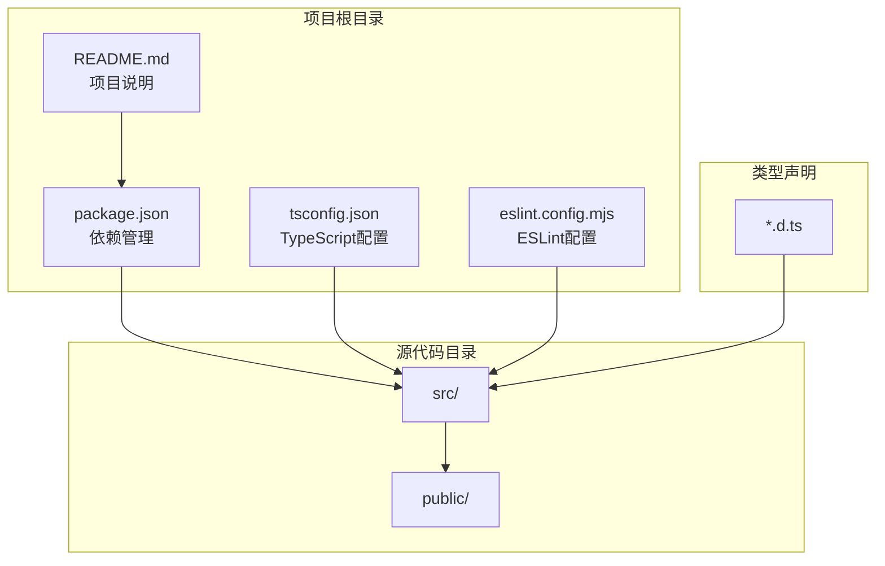
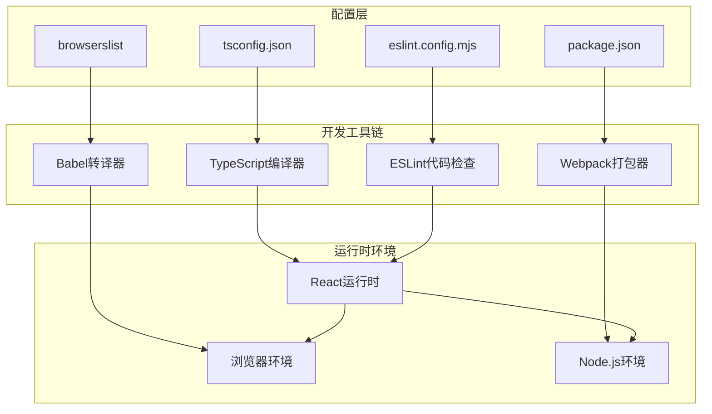
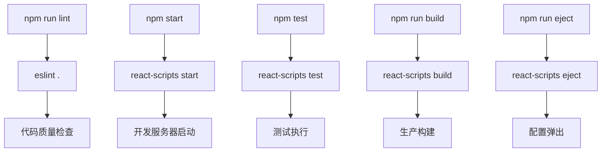
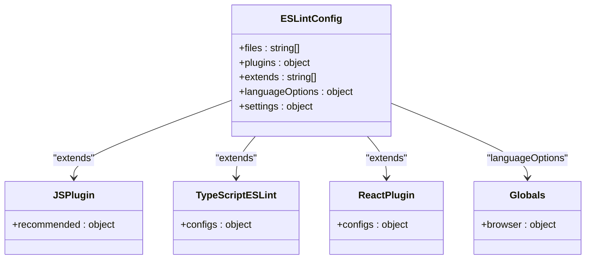
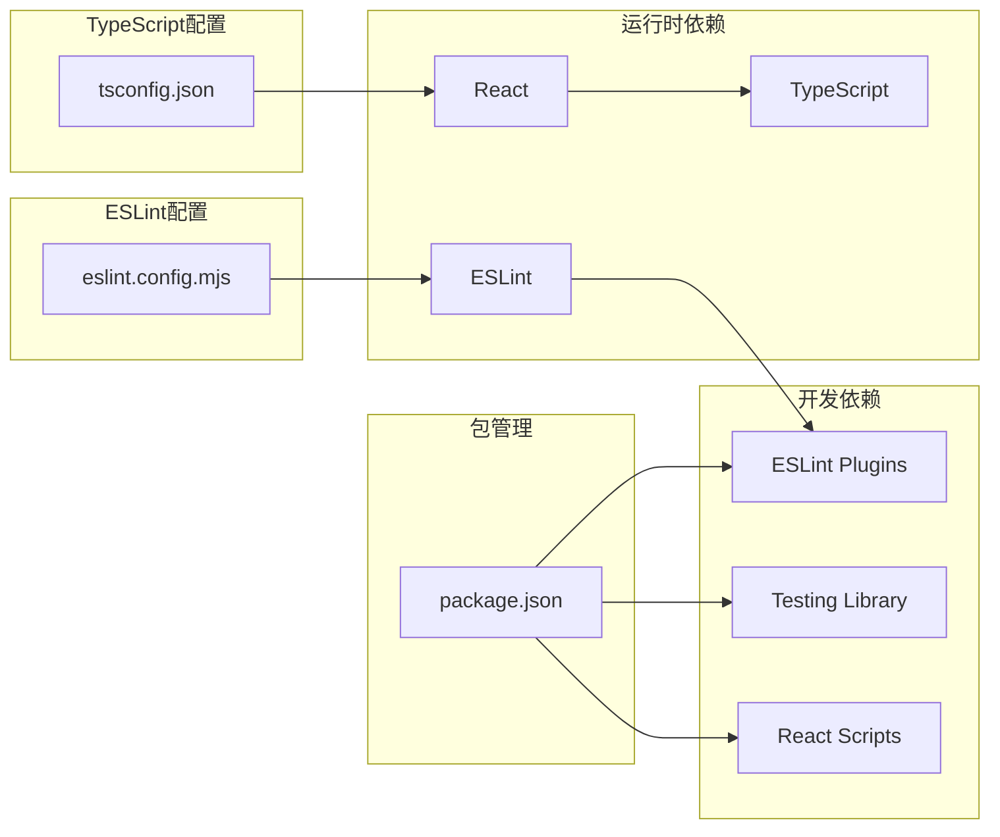

# 配置文件详解

<cite>
**本文档引用的文件**
- [package.json](file://package.json)
- [tsconfig.json](file://tsconfig.json)
- [eslint.config.mjs](file://eslint.config.mjs)
- [README.md](file://README.md)
- [public/index.html](file://public/index.html)
- [src/App.tsx](file://src/App.tsx)
</cite>

## 目录
1. [简介](#简介)
2. [项目结构](#项目结构)
3. [核心组件](#核心组件)
4. [架构概览](#架构概览)
5. [详细组件分析](#详细组件分析)
6. [依赖关系分析](#依赖关系分析)
7. [性能考虑](#性能考虑)
8. [故障排除指南](#故障排除指南)
9. [结论](#结论)
10. [附录](#附录)

## 简介

本项目是一个基于 Create React App 的 React 应用，使用 TypeScript 进行类型安全开发，并配备了现代化的代码质量工具链。本文档深入解析三个关键配置文件：package.json（依赖管理、脚本命令、浏览器兼容性）、tsconfig.json（TypeScript 编译配置）和 eslint.config.mjs（ESLint 代码质量配置），为开发者提供完整的配置理解和最佳实践指导。

## 项目结构

该项目采用标准的 Create React App 结构，主要配置文件分布如下：



**图表来源**
- [package.json:1-55](file://package.json#L1-L55)
- [tsconfig.json:1-27](file://tsconfig.json#L1-L27)
- [eslint.config.mjs:1-23](file://eslint.config.mjs#L1-L23)

**章节来源**
- [package.json:1-55](file://package.json#L1-L55)
- [tsconfig.json:1-27](file://tsconfig.json#L1-L27)
- [eslint.config.mjs:1-23](file://eslint.config.mjs#L1-L23)

## 核心组件

### 依赖管理系统

项目使用 npm 作为包管理器，通过 package.json 统一管理所有依赖关系。核心依赖包括：

- **React 生态系统**：react、react-dom、react-scripts
- **TypeScript 支持**：typescript、@types/* 类型定义
- **测试框架**：@testing-library/* 测试工具
- **开发工具**：ESLint 及其插件生态

### 脚本命令体系

项目提供了完整的开发工作流脚本：

- `start`：启动开发服务器
- `build`：构建生产版本
- `test`：运行测试套件
- `eject`：弹出配置
- `lint`：执行代码质量检查

### 浏览器兼容性策略

通过 browserslist 配置实现智能的目标浏览器支持，针对生产环境和开发环境分别设置不同的兼容性要求。

**章节来源**
- [package.json:5-19](file://package.json#L5-L19)
- [package.json:20-26](file://package.json#L20-L26)
- [package.json:33-44](file://package.json#L33-L44)

## 架构概览



**图表来源**
- [tsconfig.json:2-22](file://tsconfig.json#L2-L22)
- [eslint.config.mjs:1-23](file://eslint.config.mjs#L1-L23)
- [package.json:33-44](file://package.json#L33-L44)

## 详细组件分析

### package.json 配置详解

#### 依赖管理分析

项目采用分层依赖管理模式：

**生产依赖**（运行时必需）
- React 核心库：提供组件模型和虚拟 DOM
- React DOM：浏览器端渲染支持
- React Scripts：Create React App 核心构建工具
- TypeScript：类型系统支持
- Web Vitals：性能监控

**开发依赖**（开发时必需）
- ESLint 生态：代码质量保证
- TypeScript ESLint：TypeScript 语法检查
- Testing Library：测试工具链

#### 脚本命令设计



**图表来源**
- [package.json:20-26](file://package.json#L20-L26)

#### 浏览器兼容性配置

browserslist 配置体现了现代 Web 开发的最佳实践：

**生产环境目标**
- 超过 0.2% 市场份额的浏览器
- 排除已停止维护的浏览器
- 排除 Opera Mini（不支持现代特性）

**开发环境目标**
- 最新 Chrome 版本
- 最新 Firefox 版本  
- 最新 Safari 版本

这种配置确保了：
- 生产环境的广泛兼容性
- 开发环境的最新特性支持
- 合理的构建优化策略

**章节来源**
- [package.json:5-53](file://package.json#L5-L53)

### tsconfig.json 配置深度解析

#### 编译选项详解

TypeScript 配置体现了严格类型检查和现代开发需求：

**目标平台配置**
- `target`: es5 - 确保向后兼容性
- `lib`: 包含 DOM、DOM Iterables 和 ESNext API
- `module`: esnext - 利用现代模块系统

**严格类型检查**
- `strict`: 启用所有严格类型检查选项
- `forceConsistentCasingInFileNames`: 防止大小写不一致
- `noFallthroughCasesInSwitch`: 检测 switch 语句遗漏的 break

**模块解析策略**
- `moduleResolution`: node - 使用 Node.js 模块解析算法
- `resolveJsonModule`: true - 支持 JSON 模块导入
- `isolatedModules`: true - 确保每个文件可独立编译

**JSX 处理**
- `jsx`: react-jsx - 使用 React 17+ 的 JSX 转换

#### 包含路径配置

`include: ["src"]` 确保仅对源代码进行类型检查，提高构建效率。

**章节来源**
- [tsconfig.json:2-26](file://tsconfig.json#L2-L26)

### eslint.config.mjs 配置深度分析

#### 配置架构设计

ESLint 配置采用了现代化的 flat config 格式：



**图表来源**
- [eslint.config.mjs:7-22](file://eslint.config.mjs#L7-L22)

#### 核心配置要素

**文件匹配规则**
- 支持多种文件扩展名：js、mjs、cjs、ts、mts、cts、jsx、tsx
- 确保全项目范围的代码质量检查

**插件生态系统**
- `@eslint/js`: 核心 JavaScript 规则集
- `typescript-eslint`: TypeScript 专用规则
- `eslint-plugin-react`: React 相关规则
- `globals`: 浏览器全局变量定义

**React 版本自动检测**
通过 `settings.react.version: "detect"` 实现智能的 React 版本识别，避免手动配置的繁琐。

**章节来源**
- [eslint.config.mjs:1-23](file://eslint.config.mjs#L1-L23)

## 依赖关系分析



**图表来源**
- [package.json:5-53](file://package.json#L5-L53)
- [tsconfig.json:2-22](file://tsconfig.json#L2-L22)
- [eslint.config.mjs:1-23](file://eslint.config.mjs#L1-L23)

**章节来源**
- [package.json:5-53](file://package.json#L5-L53)

## 性能考虑

### 构建性能优化

1. **TypeScript 编译优化**
   - `isolatedModules: true` 确保快速增量编译
   - `noEmit: true` 在开发环境中避免不必要的输出

2. **ESLint 性能**
   - 使用 flat config 减少配置解析开销
   - 合理的文件匹配模式避免不必要的检查

3. **浏览器兼容性**
   - 精确的目标浏览器列表减少 polyfill 数量
   - 开发环境使用最新浏览器特性

### 内存使用优化

- 分离生产环境和开发环境的配置
- 避免重复的类型检查和转换
- 合理的缓存策略

## 故障排除指南

### 常见配置问题及解决方案

#### TypeScript 类型错误

**问题症状**：编译时报类型相关错误
**解决方法**：
1. 检查 tsconfig.json 中的 strict 设置
2. 确认类型定义文件的完整性
3. 验证模块解析配置是否正确

#### ESLint 规则冲突

**问题症状**：ESLint 报告规则冲突或未识别的规则
**解决方法**：
1. 检查 eslint.config.mjs 的 flat config 格式
2. 确认插件版本兼容性
3. 验证规则继承顺序

#### 浏览器兼容性问题

**问题症状**：某些浏览器功能不可用
**解决方法**：
1. 调整 browserslist 配置
2. 检查目标浏览器列表
3. 验证 Babel 转译配置

#### 依赖版本冲突

**问题症状**：npm/yarn 安装失败或运行时错误
**解决方法**：
1. 清理 node_modules 和锁定文件
2. 更新到兼容的依赖版本
3. 检查 peer dependencies

### 调试技巧

1. **启用详细日志**
   ```bash
   npm run build --verbose
   ```

2. **检查配置文件语法**
   ```bash
   npm run lint --debug
   ```

3. **验证类型检查**
   ```bash
   npx tsc --noEmit
   ```

4. **清理缓存**
   ```bash
   rm -rf node_modules/.cache
   ```

**章节来源**
- [README.md:12-14](file://README.md#L12-L14)

## 结论

本项目的配置文件展现了现代前端开发的最佳实践：

1. **统一的配置管理**：通过 package.json 集中管理所有工具链配置
2. **严格的类型检查**：TypeScript 的严格模式确保代码质量
3. **智能化的代码质量**：ESLint 的 flat config 提供灵活的规则配置
4. **合理的兼容性策略**：精确的目标浏览器配置平衡兼容性和性能

这些配置为开发者提供了稳定、高效的开发环境，同时确保了最终产品的质量和兼容性。

## 附录

### 配置定制化指南

#### TypeScript 配置定制
- 根据项目需求调整 `target` 和 `lib` 设置
- 在严格模式下逐步放宽特定规则
- 配置路径映射以改善导入体验

#### ESLint 配置定制
- 添加项目特定的规则
- 配置插件以支持特殊文件类型
- 调整规则严重级别以适应团队规范

#### 浏览器兼容性定制
- 根据目标用户群体调整兼容性要求
- 在性能和兼容性之间找到平衡点
- 定期更新目标浏览器列表

### 最佳实践建议

1. **版本管理**：定期更新依赖以获得最新的安全补丁和性能改进
2. **配置分离**：为不同环境维护独立的配置文件
3. **团队协作**：制定统一的代码风格和配置标准
4. **持续集成**：在 CI/CD 流程中包含配置验证步骤