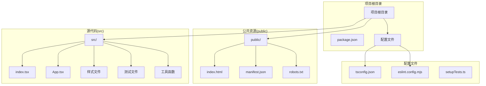
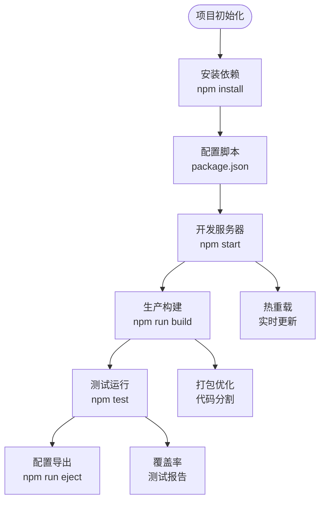
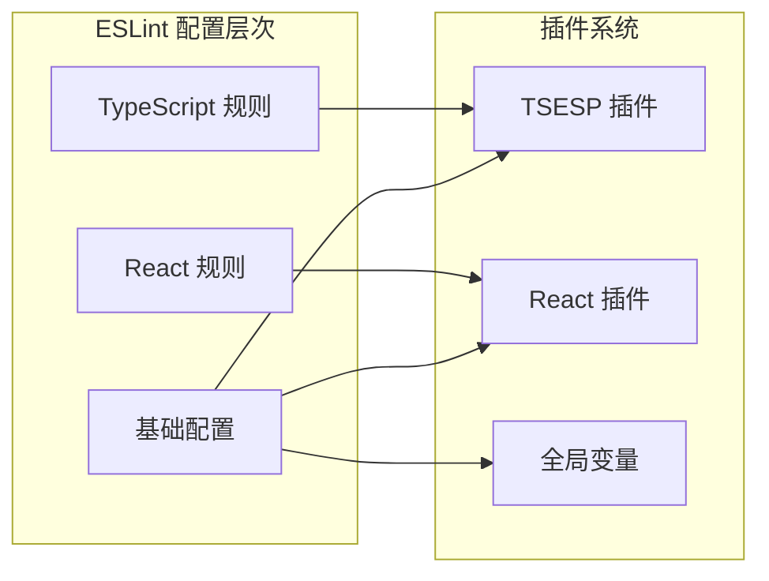
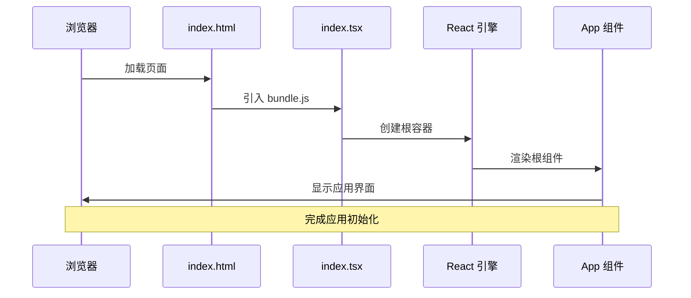
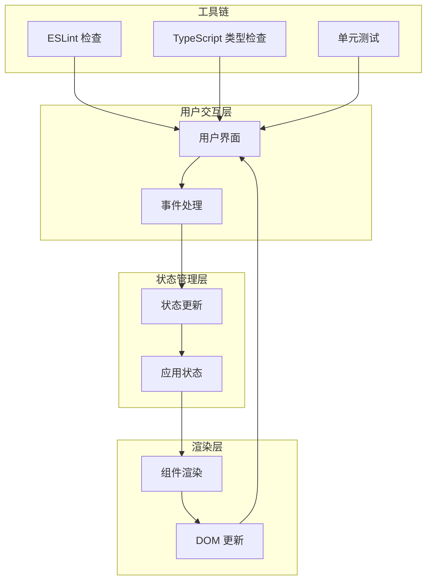
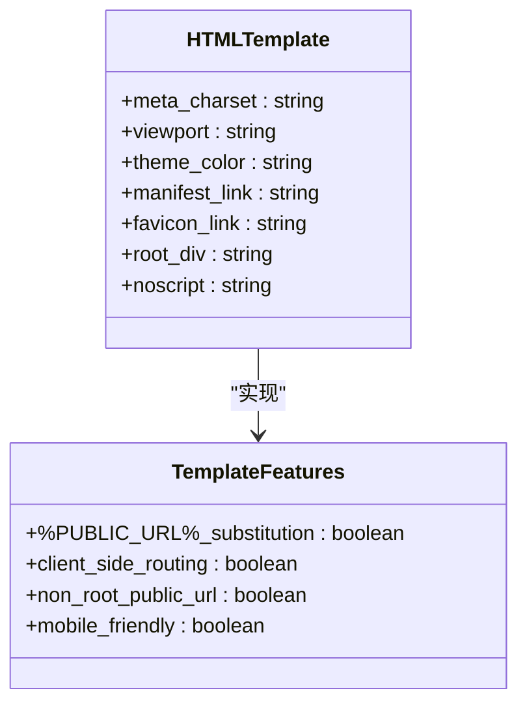
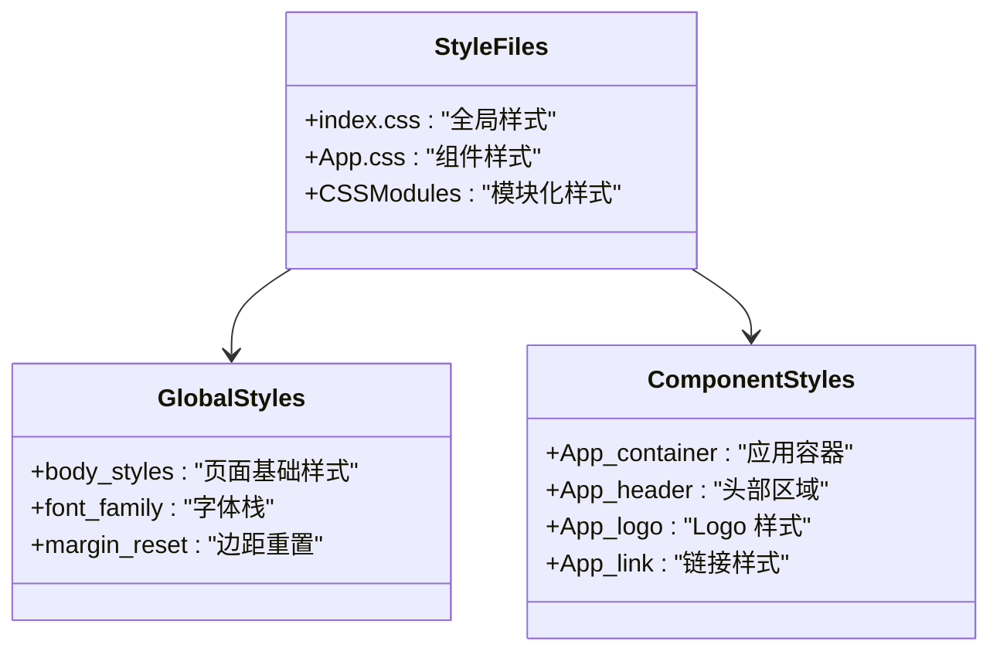
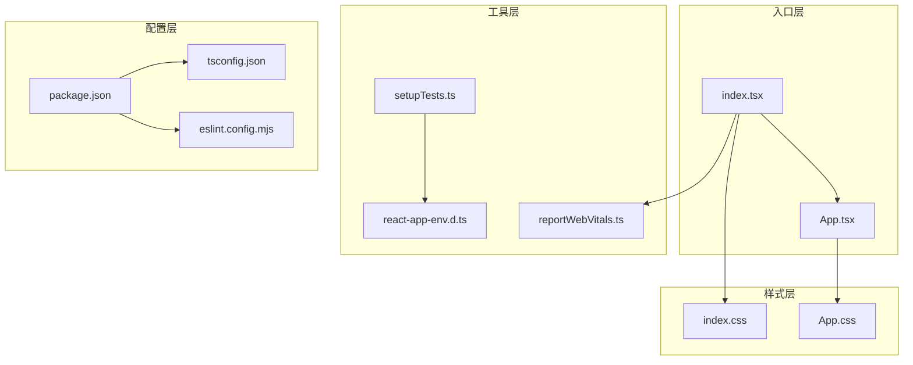

# 项目结构

<cite>
**本文档引用的文件**
- [package.json](file://package.json)
- [tsconfig.json](file://tsconfig.json)
- [eslint.config.mjs](file://eslint.config.mjs)
- [README.md](file://README.md)
- [public/index.html](file://public/index.html)
- [public/manifest.json](file://public/manifest.json)
- [public/robots.txt](file://public/robots.txt)
- [src/index.tsx](file://src/index.tsx)
- [src/App.tsx](file://src/App.tsx)
- [src/App.css](file://src/App.css)
- [src/index.css](file://src/index.css)
- [src/reportWebVitals.ts](file://src/reportWebVitals.ts)
- [src/setupTests.ts](file://src/setupTests.ts)
- [src/react-app-env.d.ts](file://src/react-app-env.d.ts)
</cite>

## 目录

1. [简介](#简介)
2. [项目结构概览](#项目结构概览)
3. [核心组件](#核心组件)
4. [架构总览](#架构总览)
5. [详细组件分析](#详细组件分析)
6. [依赖关系分析](#依赖关系分析)
7. [性能考虑](#性能考虑)
8. [故障排除指南](#故障排除指南)
9. [结论](#结论)

## 简介

这是一个基于 Create React App 的 React 应用项目，采用 TypeScript 和现代前端开发最佳实践。项目遵循"约定优于配置"的设计理念，通过标准化的目录结构和配置文件来简化开发流程，同时为初学者提供清晰的学习路径，为有经验的开发者提供深入的技术细节。

## 项目结构概览

该项目采用了标准的 Create React App 项目布局，具有清晰的分层架构和明确的职责分离：



**图表来源**
- [package.json:1-55](file://package.json#L1-L55)
- [tsconfig.json:1-27](file://tsconfig.json#L1-L27)
- [eslint.config.mjs:1-17](file://eslint.config.mjs#L1-L17)

### 目录组织原则

**约定优于配置**体现在以下方面：

1. **标准化命名**: 所有文件名遵循约定，如 `index.tsx`、`App.tsx` 等
2. **功能分组**: 源代码按功能模块组织，避免交叉污染
3. **环境分离**: 开发、测试、生产环境配置分离
4. **类型安全**: 通过 TypeScript 提供编译时类型检查
5. **代码质量**: 通过 ESLint 和 Prettier 确保代码一致性

**章节来源**
- [package.json:1-55](file://package.json#L1-L55)
- [README.md:1-15](file://README.md#L1-L15)

## 核心组件

### 包管理与构建系统

项目使用 `react-scripts` 作为构建工具，提供了开箱即用的开发体验：



**图表来源**
- [package.json:20-26](file://package.json#L20-L26)

### TypeScript 配置详解

TypeScript 配置文件定义了编译选项和项目设置：

| 配置项 | 值 | 作用 |
|--------|-----|------|
| `target` | `es5` | 编译目标 ECMAScript 版本 |
| `strict` | `true` | 启用严格模式检查 |
| `moduleResolution` | `node` | 模块解析策略 |
| `jsx` | `react-jsx` | JSX 编译选项 |
| `skipLibCheck` | `true` | 跳过库文件类型检查 |

**章节来源**
- [tsconfig.json:1-27](file://tsconfig.json#L1-L27)

### ESLint 配置体系

项目采用现代化的 ESLint 配置，支持多语言和插件扩展：



**图表来源**
- [eslint.config.mjs:1-17](file://eslint.config.mjs#L1-L17)

**章节来源**
- [eslint.config.mjs:1-17](file://eslint.config.mjs#L1-L17)

## 架构总览

### 应用启动流程



**图表来源**
- [public/index.html:29-31](file://public/index.html#L29-L31)
- [src/index.tsx:7-14](file://src/index.tsx#L7-L14)

### 数据流架构



**图表来源**
- [src/App.tsx:5-24](file://src/App.tsx#L5-L24)
- [src/index.tsx:10-13](file://src/index.tsx#L10-L13)

## 详细组件分析

### public/ 目录结构

public 目录包含静态资源文件，这些文件在构建过程中不会被 Webpack 处理，直接复制到输出目录：

#### index.html - 应用基础模板



**图表来源**
- [public/index.html:1-44](file://public/index.html#L1-L44)

**关键特性**：
- `%PUBLIC_URL%` 占位符替换机制
- 支持客户端路由
- 移动端友好的 viewport 设置
- PWA 清单文件链接

**章节来源**
- [public/index.html:1-44](file://public/index.html#L1-L44)

#### manifest.json - PWA 清单

| 字段 | 值 | 说明 |
|------|-----|------|
| `short_name` | `"React App"` | 应用简称 |
| `name` | `"Create React App Sample"` | 应用全名 |
| `start_url` | `"."` | 启动 URL |
| `display` | `"standalone"` | 显示模式 |
| `theme_color` | `"#000000"` | 主题颜色 |
| `background_color` | `"#ffffff"` | 背景颜色 |

**章节来源**
- [public/manifest.json:1-26](file://public/manifest.json#L1-L26)

#### robots.txt - 搜索引擎爬虫规则

默认配置允许所有搜索引擎爬取网站内容，适合开发阶段使用。

**章节来源**
- [public/robots.txt:1-4](file://public/robots.txt#L1-L4)

### src/ 目录结构

src 目录包含所有源代码文件，遵循模块化设计原则：

#### 入口文件分析

```mermaid
graph TB
subgraph "入口文件"
IndexTSX[index.tsx]
AppTSX[App.tsx]
CSSFiles[样式文件]
end
subgraph "工具文件"
ReportVitals[reportWebVitals.ts]
SetupTests[setupTests.ts]
EnvTypes[react-app-env.d.ts]
end
subgraph "类型声明"
ReactScripts[@types/react-scripts]
ReactDOM[@types/react-dom]
Jest[@types/jest]
end
IndexTSX --> AppTSX
IndexTSX --> CSSFiles
IndexTSX --> ReportVitals
SetupTests --> Jest
EnvTypes --> ReactScripts
```

**图表来源**
- [src/index.tsx:1-20](file://src/index.tsx#L1-L20)
- [src/App.tsx:1-27](file://src/App.tsx#L1-L27)

#### index.tsx - 应用入口点

应用的启动文件负责：
1. 创建 React 根容器
2. 渲染根组件
3. 初始化性能监控
4. 配置开发工具

**章节来源**
- [src/index.tsx:1-20](file://src/index.tsx#L1-L20)

#### App.tsx - 根组件

根组件是应用的核心展示组件，包含：
1. Logo 图片展示
2. 导航链接
3. 响应式布局
4. 动画效果

**章节来源**
- [src/App.tsx:1-27](file://src/App.tsx#L1-L27)

#### 样式文件体系



**图表来源**
- [src/index.css:1-14](file://src/index.css#L1-L14)
- [src/App.css:1-39](file://src/App.css#L1-L39)

**章节来源**
- [src/index.css:1-14](file://src/index.css#L1-L14)
- [src/App.css:1-39](file://src/App.css#L1-L39)

#### 工具文件

```mermaid
graph LR
subgraph "测试配置"
SetupTests[setupTests.ts]
JestDOM[jest-dom]
end
subgraph "性能监控"
ReportVitals[reportWebVitals.ts]
WebVitals[web-vitals]
end
subgraph "类型声明"
EnvTypes[react-app-env.d.ts]
ReactScripts[@types/react-scripts]
end
SetupTests --> JestDOM
ReportVitals --> WebVitals
EnvTypes --> ReactScripts
```

**图表来源**
- [src/setupTests.ts:1-6](file://src/setupTests.ts#L1-L6)
- [src/reportWebVitals.ts:1-16](file://src/reportWebVitals.ts#L1-L16)
- [src/react-app-env.d.ts:1-2](file://src/react-app-env.d.ts#L1-L2)

**章节来源**
- [src/setupTests.ts:1-6](file://src/setupTests.ts#L1-L6)
- [src/reportWebVitals.ts:1-16](file://src/reportWebVitals.ts#L1-L16)
- [src/react-app-env.d.ts:1-2](file://src/react-app-env.d.ts#L1-L2)

## 依赖关系分析

### 依赖树结构

```mermaid
graph TB
subgraph "运行时依赖"
React[react: ^19.2.6]
ReactDOM[react-dom: ^19.2.6]
WebVitals[web-vitals: ^2.1.4]
end
subgraph "开发依赖"
ReactScripts[react-scripts: 5.0.1]
TypeScript[typescript: ^4.9.5]
ESLint[eslint: ^10.4.0]
TSPlugin[@typescript-eslint/plugin]
TSParser[@typescript-eslint/parser]
ReactPlugin[eslint-plugin-react]
end
subgraph "测试依赖"
TestingLibrary[Testing Library]
JestDOM[jest-dom]
UserEvent[user-event]
end
React --> ReactDOM
ReactScripts --> React
ReactScripts --> ReactDOM
ReactScripts --> WebVitals
ESLint --> TSPlugin
ESLint --> TSParser
ESLint --> ReactPlugin
TestingLibrary --> JestDOM
```

**图表来源**
- [package.json:5-19](file://package.json#L5-L19)
- [package.json:45-53](file://package.json#L45-L53)

### 文件间依赖关系



**图表来源**
- [src/index.tsx:1-5](file://src/index.tsx#L1-L5)
- [src/App.tsx:1-3](file://src/App.tsx#L1-L3)
- [package.json:20-26](file://package.json#L20-L26)

**章节来源**
- [package.json:1-55](file://package.json#L1-L55)

## 性能考虑

### 构建优化策略

1. **代码分割**: 自动进行代码分割以减少初始包大小
2. **Tree Shaking**: 移除未使用的代码
3. **压缩优化**: 生产环境自动压缩 JavaScript 和 CSS
4. **缓存策略**: 利用浏览器缓存机制

### 开发体验优化

1. **热重载**: 实时更新无需刷新页面
2. **错误边界**: 提供友好的错误提示
3. **类型检查**: 编译时发现潜在问题
4. **代码格式化**: 保持代码风格一致

## 故障排除指南

### 常见问题解决

#### TypeScript 类型错误

**症状**: 编译时报类型相关错误
**解决方案**: 
1. 检查类型声明文件
2. 验证配置文件中的 include/exclude 设置
3. 确认第三方库的类型定义

#### ESLint 规则冲突

**症状**: 代码检查报错或警告
**解决方案**:
1. 检查 eslint.config.mjs 中的规则配置
2. 验证插件版本兼容性
3. 使用 `eslint --fix` 自动修复可修复的问题

#### 构建失败

**症状**: `npm run build` 失败
**解决方案**:
1. 检查依赖版本兼容性
2. 清理 node_modules 和重新安装
3. 验证环境变量设置

**章节来源**
- [README.md:12-14](file://README.md#L12-L14)

## 结论

这个 React 项目展现了现代前端开发的最佳实践，通过标准化的项目结构、完善的配置体系和严格的代码质量控制，为开发者提供了一个高效、可维护的开发环境。

### 设计优势

1. **约定优于配置**: 标准化的目录结构减少了配置复杂度
2. **类型安全**: TypeScript 提供编译时类型检查
3. **代码质量**: ESLint 和测试框架确保代码质量
4. **开发效率**: 热重载和快速构建提升开发体验
5. **可扩展性**: 模块化设计便于功能扩展

### 学习路径建议

**初学者路径**:
1. 理解项目结构和约定
2. 掌握基本的 React 组件概念
3. 学习 TypeScript 基础语法
4. 熟悉 ESLint 和测试工具
5. 实践项目构建和部署流程

**进阶开发者**:
1. 深入理解构建工具链
2. 探索性能优化技术
3. 研究架构设计模式
4. 掌握测试驱动开发
5. 了解部署和运维最佳实践

这个项目为不同水平的开发者都提供了清晰的学习框架和技术参考，是学习现代 React 开发的优秀范例。