# 项目结构

<cite>
**本文档引用的文件**
- [package.json](file://package.json)
- [client/package.json](file://client/package.json)
- [server/package.json](file://server/package.json)
- [client/tsconfig.json](file://client/tsconfig.json)
- [client/craco.config.js](file://client/craco.config.js)
- [client/tailwind.config.js](file://client/tailwind.config.js)
- [client/postcss.config.js](file://client/postcss.config.js)
- [client/eslint.config.mjs](file://client/eslint.config.mjs)
- [client/public/index.html](file://client/public/index.html)
- [client/src/index.tsx](file://client/src/index.tsx)
- [client/src/App.tsx](file://client/src/App.tsx)
- [server/src/index.js](file://server/src/index.js)
- [server/src/routes/questionnaire.js](file://server/src/routes/questionnaire.js)
</cite>

## 更新摘要
**所做更改**
- 重构项目结构以支持 Monorepo 架构
- 新增客户端和服务器端分离的目录结构
- 更新包管理脚本以支持多包开发工作流
- 新增 Koa 服务器端配置和路由系统
- 更新前端构建配置以支持代理和路径别名

## 目录

1. [简介](#简介)
2. [Monorepo 架构概览](#monorepo-架构概览)
3. [客户端子项目](#客户端子项目)
4. [服务器端子项目](#服务器端子项目)
5. [跨项目开发工作流](#跨项目开发工作流)
6. [配置文件详解](#配置文件详解)
7. [目录结构对比分析](#目录结构对比分析)
8. [开发环境配置](#开发环境配置)
9. [构建和部署策略](#构建和部署策略)
10. [故障排除指南](#故障排除指南)
11. [结论](#结论)

## 简介

本项目已重构为完整的 Monorepo 架构，采用客户端/服务器分离的设计模式。项目由两个独立但相互关联的子项目组成：客户端（React CRA + Craco）和服务器端（Koa）。这种架构设计遵循"约定优于配置"的理念，通过标准化的目录结构和配置文件来简化开发流程，同时为初学者提供清晰的学习路径，为有经验的开发者提供深入的技术细节。

**更新** 项目从单包结构转变为完整的 Monorepo 架构，实现了前后端分离的现代化开发模式。

## Monorepo 架构概览

项目采用 Monorepo 架构，将客户端和服务器端代码分离管理，通过统一的根级配置文件协调开发工作流：

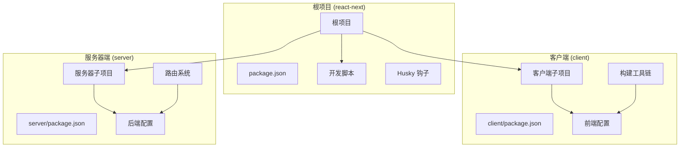

**图表来源**
- [package.json:1-24](file://package.json#L1-L24)
- [client/package.json:1-81](file://client/package.json#L1-L81)
- [server/package.json:1-18](file://server/package.json#L1-L18)

### 架构设计理念

1. **职责分离**: 客户端专注于用户界面和用户体验，服务器端专注于业务逻辑和数据处理
2. **独立演进**: 每个子项目可以独立升级和部署
3. **共享配置**: 根级配置文件统一管理开发工具和工作流
4. **环境隔离**: 开发、测试、生产环境配置完全分离

**章节来源**
- [package.json:5-16](file://package.json#L5-L16)

## 客户端子项目

### 项目结构概览

客户端子项目基于 Create React App 构建，使用 Craco 进行配置扩展，实现了现代化的前端开发环境：

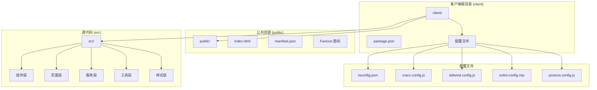

**图表来源**
- [client/package.json:1-81](file://client/package.json#L1-L81)
- [client/tsconfig.json:1-31](file://client/tsconfig.json#L1-L31)
- [client/craco.config.js:1-37](file://client/craco.config.js#L1-L37)

### 核心配置详解

#### TypeScript 配置

客户端使用增强的 TypeScript 配置，支持路径别名和现代化编译选项：

| 配置项 | 值 | 作用 |
|--------|-----|------|
| `baseUrl` | `src` | 设置基础路径为 src 目录 |
| `paths` | `{ "@/*": ["*"] }` | 配置 @ 路径别名 |
| `jsx` | `react-jsx` | JSX 编译选项 |
| `strict` | `true` | 启用严格模式检查 |
| `moduleResolution` | `node` | 模块解析策略 |

**章节来源**
- [client/tsconfig.json:23-25](file://client/tsconfig.json#L23-L25)

#### Craco 配置

Craco 扩展了 Create React App 的配置能力，提供了代理和路径别名支持：

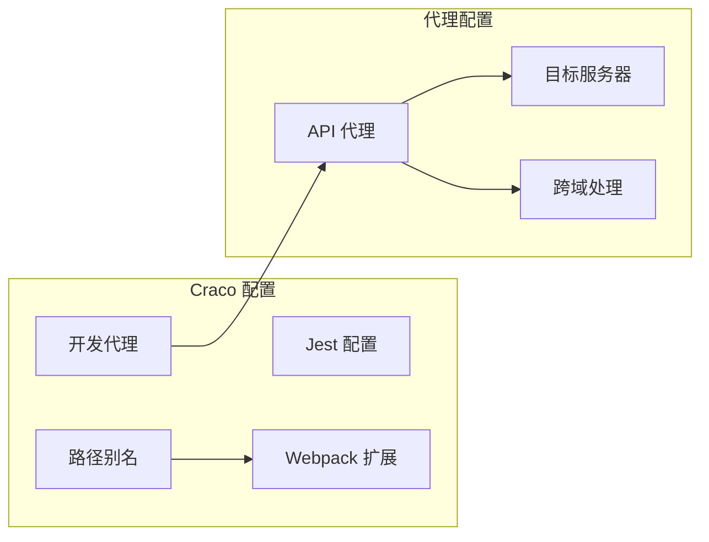

**图表来源**
- [client/craco.config.js:9-36](file://client/craco.config.js#L9-L36)

**章节来源**
- [client/craco.config.js:17-26](file://client/craco.config.js#L17-L26)

### 页面和组件架构

客户端采用模块化的页面和组件架构，支持复杂的业务场景：

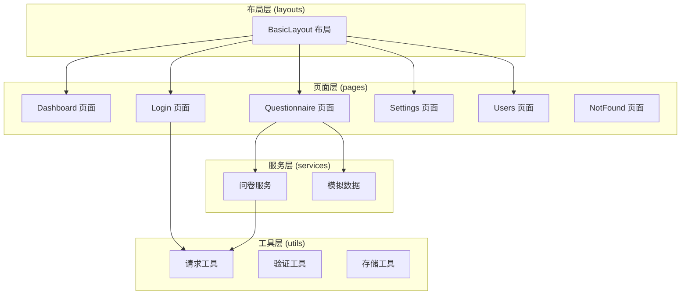

**图表来源**
- [client/src/pages/Dashboard/index.tsx](file://client/src/pages/Dashboard/index.tsx)
- [client/src/pages/Login/index.tsx](file://client/src/pages/Login/index.tsx)
- [client/src/pages/Questionnaire/index.tsx](file://client/src/pages/Questionnaire/index.tsx)
- [client/src/services/questionnaire.ts](file://client/src/services/questionnaire.ts)

**章节来源**
- [client/src/pages/](file://client/src/pages/)

## 服务器端子项目

### 项目结构概览

服务器端子项目基于 Koa 框架构建，提供了 RESTful API 服务，专门服务于问卷调查模块：

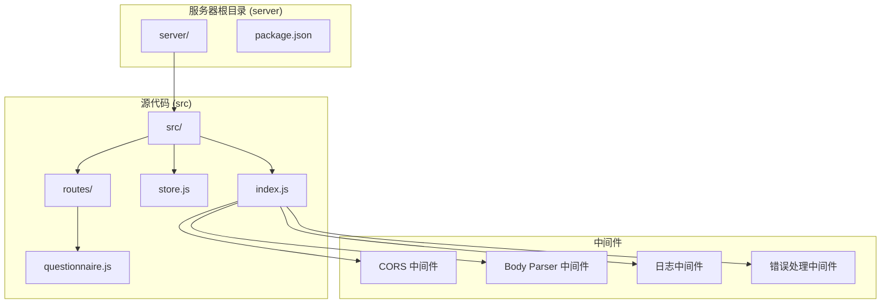

**图表来源**
- [server/package.json:1-18](file://server/package.json#L1-L18)
- [server/src/index.js:12-64](file://server/src/index.js#L12-L64)

### 核心服务架构

#### Koa 应用配置

服务器端使用 Koa 框架构建，实现了现代化的中间件架构：

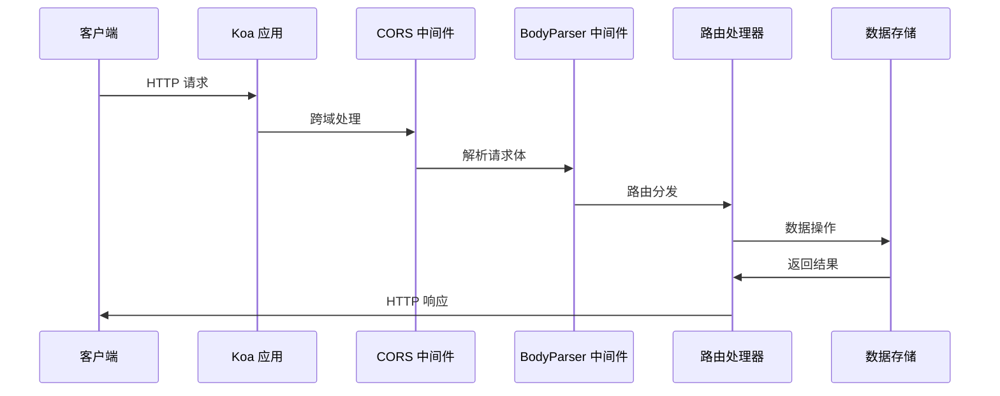

**图表来源**
- [server/src/index.js:12-56](file://server/src/index.js#L12-L56)

#### 问卷调查路由系统

服务器端实现了完整的 CRUD 操作，支持问卷调查的完整生命周期管理：

| HTTP 方法 | 路径 | 功能 | 状态码 |
|-----------|------|------|--------|
| GET | `/api/questionnaires` | 获取问卷列表 | 200 |
| POST | `/api/questionnaires` | 创建新问卷 | 201 |
| PUT | `/api/questionnaires/:id` | 更新问卷信息 | 200 |
| DELETE | `/api/questionnaires/:id` | 删除问卷 | 200 |
| GET | `/health` | 健康检查 | 200 |

**章节来源**
- [server/src/routes/questionnaire.js:14-55](file://server/src/routes/questionnaire.js#L14-L55)

### 数据存储层

服务器端使用内存存储模拟数据库操作，支持基本的数据增删改查功能：

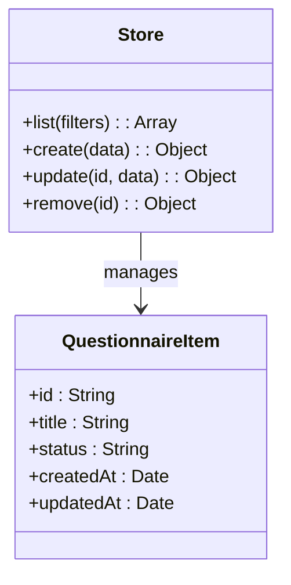

**图表来源**
- [server/src/store.js](file://server/src/store.js)

**章节来源**
- [server/src/store.js](file://server/src/store.js)

## 跨项目开发工作流

### 统一开发脚本

根级 package.json 提供了统一的开发脚本，支持并行开发多个子项目：

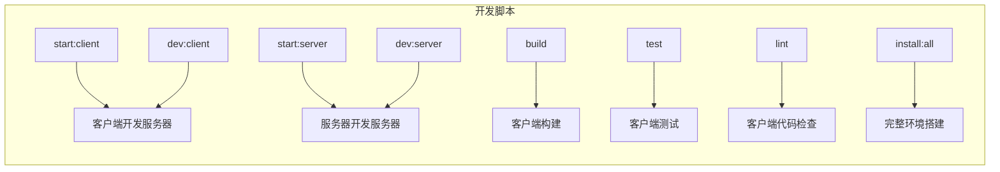

**图表来源**
- [package.json:6-16](file://package.json#L6-L16)

### 开发环境配置

客户端通过 Craco 配置实现了智能代理，简化了前后端联调过程：

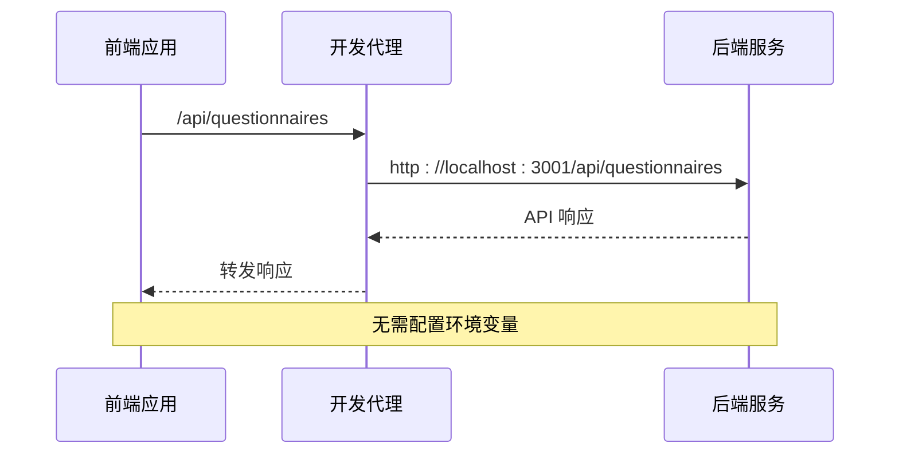

**图表来源**
- [client/craco.config.js:17-26](file://client/craco.config.js#L17-L26)

**章节来源**
- [client/craco.config.js:19-25](file://client/craco.config.js#L19-L25)

## 配置文件详解

### 根级配置文件

根级 package.json 集成了 Husky Git 钩子和统一的开发脚本：

| 脚本命令 | 功能描述 | 使用场景 |
|----------|----------|----------|
| `start:client` | 启动客户端开发服务器 | 前端开发 |
| `start:server` | 启动服务器开发服务器 | 后端开发 |
| `dev:client` | 并行启动前后端 | 联合开发 |
| `dev:server` | 启动服务器热重载 | API 开发 |
| `build` | 构建客户端应用 | 生产部署 |
| `install:all` | 安装所有依赖 | 环境初始化 |

**章节来源**
- [package.json:6-16](file://package.json#L6-L16)

### 客户端配置体系

客户端配置文件形成了完整的开发工具链：

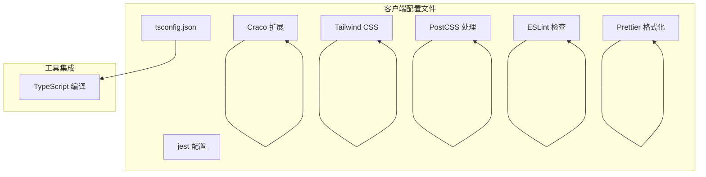

**图表来源**
- [client/tsconfig.json:1-31](file://client/tsconfig.json#L1-L31)
- [client/craco.config.js:1-37](file://client/craco.config.js#L1-L37)
- [client/tailwind.config.js:1-20](file://client/tailwind.config.js#L1-L20)

**章节来源**
- [client/eslint.config.mjs:1-33](file://client/eslint.config.mjs#L1-L33)

### 服务器端配置

服务器端配置简洁而功能完整，专注于 API 服务：

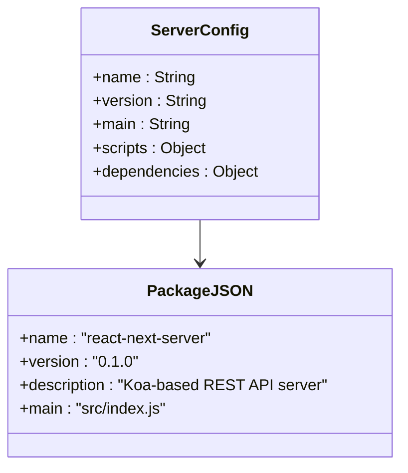

**图表来源**
- [server/package.json:1-18](file://server/package.json#L1-L18)

**章节来源**
- [server/package.json:7-16](file://server/package.json#L7-L16)

## 目录结构对比分析

### 重构前后的结构对比

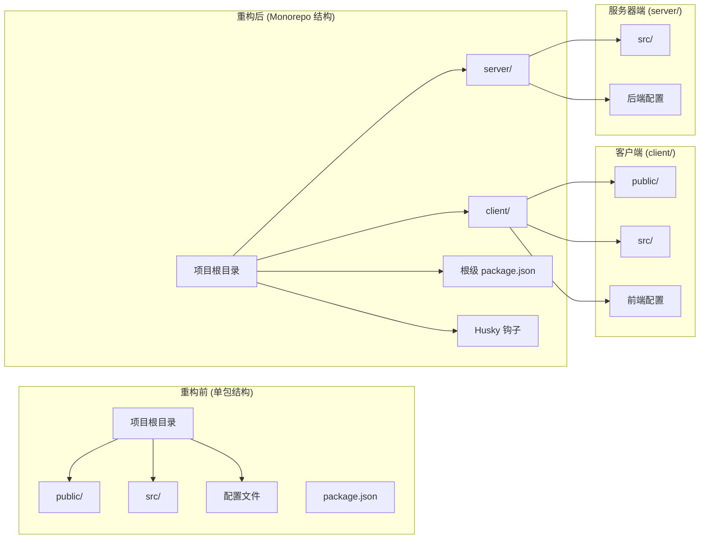

**图表来源**
- [package.json:1-24](file://package.json#L1-L24)
- [client/package.json:1-81](file://client/package.json#L1-L81)
- [server/package.json:1-18](file://server/package.json#L1-L18)

### 目录组织原则

**约定优于配置**在 Monorepo 架构中的体现：

1. **标准化命名**: 客户端使用 client/，服务器端使用 server/ 的明确区分
2. **功能分组**: 每个子项目独立管理自己的依赖和配置
3. **环境分离**: 开发、测试、生产环境配置完全分离
4. **类型安全**: 客户端使用 TypeScript，服务器端使用原生 JavaScript
5. **代码质量**: 双重 ESLint 配置确保代码质量

**章节来源**
- [client/package.json:5-26](file://client/package.json#L5-L26)
- [server/package.json:11-16](file://server/package.json#L11-L16)

## 开发环境配置

### 环境变量和代理配置

客户端通过 Craco 配置实现了智能的开发环境设置：

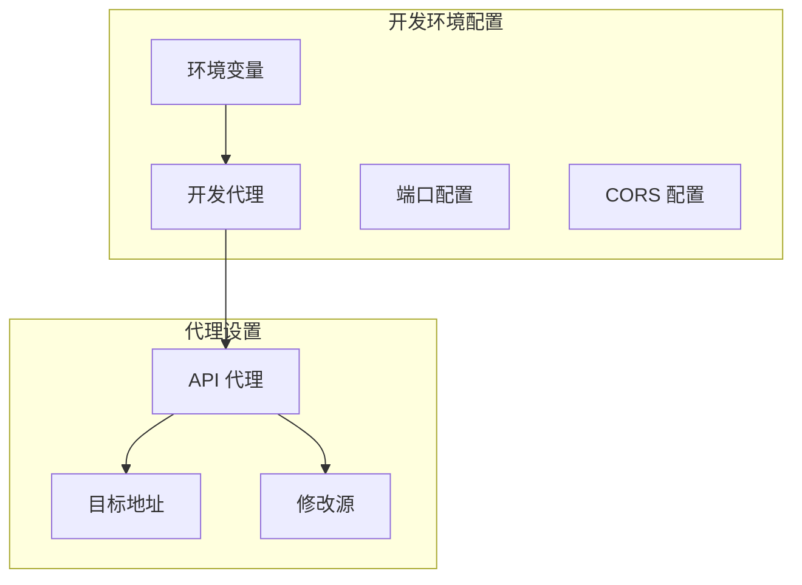

**图表来源**
- [client/craco.config.js:17-26](file://client/craco.config.js#L17-L26)

### 路径别名配置

TypeScript 和 Craco 都配置了路径别名，简化了导入语句：

```mermaid
graph LR
subgraph "路径别名"
AtSymbol[@]
SrcPath[src/]
Components[components/]
Pages[pages/]
Services[services/]
Utils[utils/]
end
AtSymbol --> SrcPath
Components --> SrcPath
Pages --> SrcPath
Services --> SrcPath
Utils --> SrcPath
```

**图表来源**
- [client/tsconfig.json:23-25](file://client/tsconfig.json#L23-L25)
- [client/craco.config.js:10-15](file://client/craco.config.js#L10-L15)

**章节来源**
- [client/tsconfig.json:22-25](file://client/tsconfig.json#L22-L25)

## 构建和部署策略

### 客户端构建流程

客户端使用 Craco 扩展 Create React App 的构建能力：

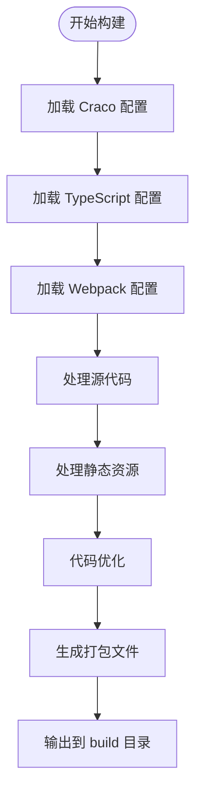

**图表来源**
- [client/package.json:27-35](file://client/package.json#L27-L35)

### 服务器端部署

服务器端使用 Node.js 直接部署，支持热重载开发：

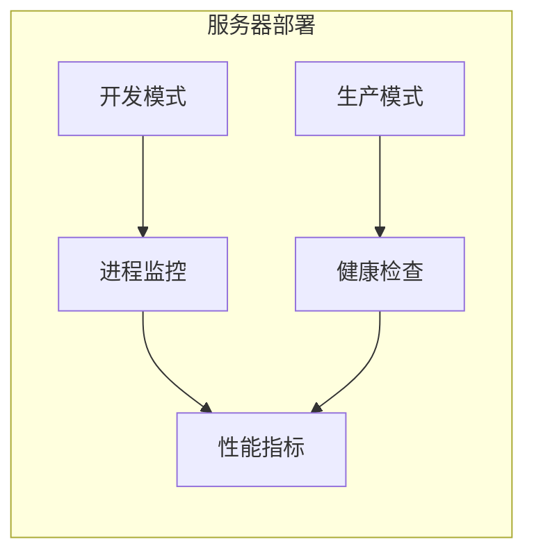

**图表来源**
- [server/package.json:7-10](file://server/package.json#L7-L10)

**章节来源**
- [server/src/index.js:58-63](file://server/src/index.js#L58-L63)

## 故障排除指南

### 常见开发问题

#### 端口冲突问题

**症状**: 开发服务器启动失败，提示端口已被占用
**解决方案**:
1. 检查客户端端口 3000 和服务器端口 3001 是否被占用
2. 修改服务器端口配置：`PORT=3002 npm run dev`
3. 使用 `lsof -i :3000` 查找占用进程

#### 代理配置问题

**症状**: 前端无法访问后端 API 接口
**解决方案**:
1. 检查 Craco 代理配置是否正确
2. 验证服务器端是否正常启动
3. 确认 API 前缀 `/api` 是否匹配

#### 路径别名问题

**症状**: TypeScript 或 Craco 报告模块解析错误
**解决方案**:
1. 检查 tsconfig.json 中的路径别名配置
2. 验证 Craco 配置中的 moduleNameMapper
3. 确认 @ 符号导入路径的正确性

**章节来源**
- [client/craco.config.js:19-25](file://client/craco.config.js#L19-L25)
- [client/tsconfig.json:22-25](file://client/tsconfig.json#L22-L25)

## 结论

这个重构后的 Monorepo 项目展现了现代全栈开发的最佳实践，通过标准化的项目结构、完善的配置体系和严格的代码质量控制，为开发者提供了一个高效、可维护的开发环境。

### 架构优势

1. **职责分离**: 客户端和服务器端职责明确，便于团队协作
2. **独立演进**: 每个子项目可以独立升级和部署
3. **统一管理**: 根级配置文件协调开发工作流
4. **类型安全**: 客户端使用 TypeScript 提供编译时类型检查
5. **开发效率**: 智能代理和热重载提升开发体验

### 学习路径建议

**初学者路径**:
1. 理解 Monorepo 架构概念和优势
2. 掌握客户端和服务器端的基本配置
3. 学习 Craco 和 Koa 的基本使用
4. 熟悉路径别名和代理配置
5. 实践完整的开发工作流

**进阶开发者**:
1. 深入理解前后端分离架构设计
2. 探索微服务和 API 设计模式
3. 研究容器化和自动化部署
4. 掌握性能优化和监控技术
5. 了解企业级开发规范和最佳实践

这个项目为不同水平的开发者都提供了清晰的学习框架和技术参考，是学习现代全栈开发的优秀范例。